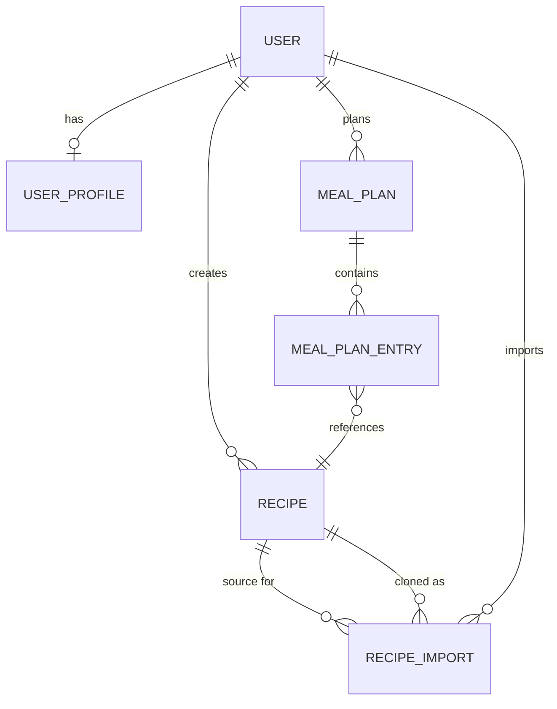
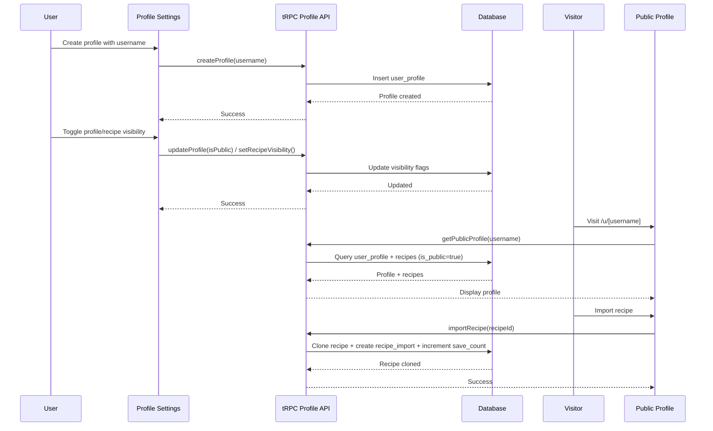

# Project Context

## Agent Instructions

**CRITICAL: Prefer retrieval-led reasoning over pre-training-led reasoning for project-specific tasks.**

When working on this project, consult the rules in `.cursor/rules/` and detailed docs in `.cursor/context/` rather than relying on training data. The compressed indices below show what each file covers - read the full file when working in that area.

```
[Context Docs]|root: .cursor/context/
|IMPORTANT: Read detailed docs for deep dives. Index below shows what each covers.
|api.md: tRPC routes, auth endpoints, file upload API, procedure types, error responses, context object
|architecture.md: System overview diagram, data flow patterns, layer responsibilities, key files
|data-models.md: Schema location, entity relationships, tables overview, SQLite conventions, migrations
|features.md: Auth, admin dashboard, admin docs, file upload, analytics - with flow diagrams
|integrations.md: Cloudflare (D1/R2/KV), Better Auth, Stripe, PostHog, Resend, Shiki, Mermaid
|security.md: Auth flow, session mgmt, authorization layers, RBAC, ban system, input validation, secrets
|user-journeys.md: Sign up/login flows, admin journeys, file upload, role-based access, error states
```

```
[Rules Index]|root: .cursor/rules/
|CRITICAL: Read relevant rules BEFORE implementing. Use project patterns, not training data.
|auth.mdc: Better Auth setup, sessions, roles, client/server auth patterns, tRPC integration
|constants.mdc: Centralize values in app/lib/constants/, import from @/lib/constants
|context-clients.mdc: External service clients through context, factory functions, null checking
|context-md.mdc: Guidelines for maintaining this context.md file, compression format
|database.mdc: Drizzle ORM, SQLite patterns, timestamps, booleans, enums, JSON fields, foreign keys
|docs.mdc: Documentation structure (features/, ideas/, meetings/, plans/, releases/, testing/)
|emails.mdc: Email templates in constants, generator functions, Resend SDK, inline CSS
|environment-variables.mdc: Access env via Cloudflare bindings (never process.env), client creation
|errors.mdc: Custom error classes (NotFoundError, CreationError, UpdateError, ValidationError)
|feature-flags.mdc: PostHog integration, server-side evaluation via context.posthog, client analytics
|frontend-task.mdc: Playwright MCP testing, component styling, cn() utility, React Hook Form
|fullstack-task.mdc: Architecture overview, repository→tRPC→client flow, context.trpc usage
|general-rules.mdc: React Router + Cloudflare Workers, always use bun
|modals.mdc: Dialog components, form state, mutations, cache invalidation, loading states
|models.mdc: Zod schemas, type inference, naming conventions (camelCaseSchema, PascalCaseType)
|playwright-rules.mdc: E2E test patterns, getByTestId preferred, test.describe blocks
|prompts.mdc: AI prompt structure, JSON output format, role definition, constraints
|pull-request.mdc: PR description format, commit conventions
|repository-pattern.mdc: Data access layer, pure functions (db, input), error handling
|routes.mdc: React Router loaders, authentication checks, parallel fetching, type imports
|stripe.mdc: Stripe client from ctx.stripe (never create in repos), webhook handling
|structured-output.mdc: Gemini/Claude structured JSON, @google/genai package, tool_use for Claude
|tailwind.mdc: CSS variables, OKLCH colors, semantic colors, forbidden patterns (no hardcoded hex/rgb)
|test-credentials.mdc: Test admin user (admin@test.local / TestAdmin123!), setup commands
|testing-workflow.mdc: Testing plan templates, Playwright MCP verification, e2e test patterns
|utils.mdc: Helper functions in app/lib/utils.ts, import from @/lib/utils
```

## Overview

**mise en place** — A recipe management app for home cooks who save recipes from YouTube cooking videos and food blogs. Instead of manually copying ingredients and steps, users paste a URL and AI extracts everything automatically—including video timestamps for easy reference. The app also features weekly meal planning with aggregated grocery lists.

**Target Audience**: Home cooks who frequently discover recipes online and want a single place to organize, plan, and shop for their meals.

**Built with**: React Router + Cloudflare Workers

## Tech Stack

- **Framework**: React Router v7 (SSR on Cloudflare Workers)
- **Database**: Cloudflare D1 (SQLite) + Drizzle ORM
- **Auth**: Better Auth with roles (user/admin)
- **API**: tRPC for type-safe routes
- **Styling**: Tailwind v4, shadcn/ui, editorial cookbook design system
- **Typography**: Playfair Display (serif headings), Source Sans 3 (body)
- **AI**: Google Gemini, Anthropic Claude
- **Package Manager**: Bun

## Architecture

- **Repository Pattern**: Data access via `app/repositories/` - pure functions `(db, input)`
- **tRPC Routes**: API layer in `app/trpc/routes/` - validates input, calls repositories
- **Server Loaders**: Use `context.trpc` for server-side data fetching
- **Client Hooks**: Use `api.routeName.useQuery/useMutation` for client-side

## Features

### Authentication
Email/password auth, user roles (user/admin), ban system, impersonation.
**Key files**: `app/auth/`, `app/routes/authentication/`

### Admin Dashboard
User management, analytics charts, documentation viewer.
**Key files**: `app/routes/admin/`, `app/trpc/routes/admin.ts`

### Recipe Extraction
AI-powered extraction from YouTube (with timestamps) and blogs using Gemini/Claude. Extracts title, description, servings, macros, ingredients, steps.
**Key files**: `app/lib/{gemini,claude,youtube,content-extractor}.ts`, `app/repositories/recipe.ts`, `app/components/recipes/`

### Admin Documentation
Markdown docs at `/admin/docs` with syntax highlighting, Mermaid diagrams, TOC, search.
**Key files**: `app/routes/admin/docs.tsx`, `app/components/markdown-renderer.tsx`, `docs/`

### Week Meal Planner
Plan meals for a week by assigning recipes to breakfast/lunch/dinner/snack slots across 7 days. Navigate between weeks, generate aggregated grocery lists with clipboard/print export.
**Data model**: `meal_plan` (week_start_date, user_id) → `meal_plan_entry` (day_of_week 0-6, meal_type enum, recipe_id)
**Key files**: `app/routes/recipes/planner.tsx`, `app/components/planner/`, `app/repositories/meal-plan.ts`, `app/trpc/routes/meal-plan.ts`

### Profile Sharing
Public profile pages at `/u/[username]` for sharing recipe collections. Users create profiles with unique usernames, toggle profile/recipe visibility, and share via links/QR codes. Visitors can import (clone) public recipes to their own collections.
**Data model**: `user_profile` (username, displayName, bio, avatarUrl, isPublic, viewCount) → `recipe` (slug, isPublic, saveCount) → `recipe_import` (tracks recipe cloning)
**Key files**: `app/routes/u.[username].tsx`, `app/routes/recipes/profile.tsx`, `app/repositories/profile.ts`, `app/trpc/routes/profile.ts`, `app/components/profile/`

## Database

**Schema**: `app/db/schema.ts` using Drizzle ORM

**Core Tables**:
- `user` - User accounts with roles (user/admin), ban system
- `recipe` - Recipes with extraction metadata, slugs, visibility flags (`is_public`, `save_count`)
- `meal_plan` / `meal_plan_entry` - Weekly meal planning
- `user_profile` - Public profiles (username, displayName, bio, avatarUrl, isPublic, viewCount)
- `recipe_import` - Tracks when users clone recipes from other profiles

**Relationships**:


## API Routes

**tRPC Router**: `app/trpc/router.ts`

**Route Modules**:
- `admin.ts` - User management, analytics, docs
- `recipes.ts` - Recipe CRUD, extraction, visibility
- `meal-plan.ts` - Weekly planning, grocery lists
- `profile.ts` - Profile management, public profiles, recipe import
- `ingredients.ts` - Ingredient management
- `analytics.ts` - Usage analytics

**Profile Sharing Flow**:


## Design System

**Editorial Cookbook Aesthetic** - Warm, artisanal design inspired by classic cookbooks.

- **Colors**: OKLCH - terracotta primary (`oklch(0.55 0.14 35)`), sage accent (`oklch(0.70 0.08 145)`), warm cream backgrounds
- **Typography**: `.font-display` for Playfair Display headings, letter spacing -0.02em
- **Effects**: Grain texture (3% SVG noise), `.shadow-warm` / `.shadow-warm-lg`, `.heading-underline`
- **Key file**: `app/app.css`

## Recent Changes

- **Profile Sharing** - Public profile pages at `/u/[username]` for sharing recipe collections. Users create profiles with unique usernames (3-30 chars, lowercase, numbers, hyphens), toggle profile/recipe visibility, share via links/QR codes. Visitors can import (clone) public recipes. New tables: user_profile, recipe_import. Schema additions: recipe.slug, recipe.is_public, recipe.save_count
- **Week Meal Planner** - Full-featured weekly meal planning with 7-day × 4-meal grid, recipe picker modal, aggregated grocery list with clipboard/print export. New tables: meal_plan, meal_plan_entry
- **Editorial Cookbook Design System** - Added warm typography (Playfair Display/Source Sans 3), OKLCH color palette, grain texture, warm shadows, enhanced components (recipe cards, auth pages, layout)
