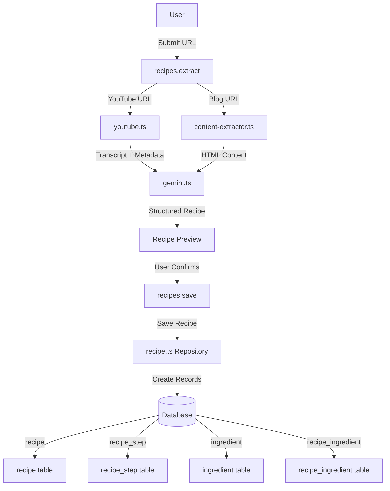

# Project Context

## Overview
A SaaS starter template built with React Router and Cloudflare Workers. Provides authentication, admin dashboard, recipe extraction from YouTube videos and blogs, and database setup out of the box.

## Tech Stack
- **Framework**: React Router v7 (SSR on Cloudflare Workers)
- **Runtime**: Cloudflare Workers
- **Database**: Cloudflare D1 (SQLite) with Drizzle ORM
- **Auth**: Better Auth
- **API**: tRPC for type-safe API routes
- **Styling**: Tailwind CSS v4, shadcn/ui components
- **Markdown**: react-markdown with remark-gfm for GitHub Flavored Markdown
- **Syntax Highlighting**: Shiki with github-light/dark themes
- **Diagrams**: Mermaid for rendering diagrams in markdown
- **Package Manager**: Bun

## Architecture
- **Repository Pattern**: Data access via `app/repositories/` - pure functions with `(db, input)` signature
- **tRPC Routes**: API layer in `app/trpc/routes/` - validates input, calls repositories
- **Server Loaders**: Use `context.trpc` for server-side data fetching
- **Client Hooks**: Use `api.routeName.useQuery/useMutation` for client-side

## Features

### Authentication
- Email/password auth via Better Auth
- User roles: `user`, `admin`
- Ban system with reason and expiration
- Session management with impersonation support
- **Key files**: `app/auth/`, `app/routes/authentication/`

### Admin Dashboard
- Protected admin routes at `/admin`
- User management table
- Interactive charts and analytics
- **Key files**: `app/routes/admin/`

### File Upload
- R2 bucket integration for file storage
- **Key files**: `app/components/file-upload.tsx`, `app/routes/api/upload-file.ts`

### Admin Documentation
- Markdown documentation viewer at `/admin/docs/:category?/:doc?`
- Documents organized by 5 categories: meetings, ideas, plans, features, releases
- Static markdown files stored in `docs/` folder (version controlled)
- Features:
  - **URL State Management**: Direct linking to specific documents via URL params
  - **Syntax Highlighting**: Code blocks with shiki (github-light/dark themes)
  - **Table of Contents**: Auto-extracted headings with scroll tracking
  - **Search/Filter**: Filter documents by title or content
  - **Rich Empty States**: Custom icons/messages per category
  - **Breadcrumbs**: Category > Document navigation
  - **Mermaid Diagrams**: Visualize architecture, flows, and relationships
  - Category-based navigation with tabs
  - Document list sidebar with auto-generated titles
- **Key files**: 
  - `app/routes/admin/docs.tsx` - Main documentation page
  - `app/components/markdown-renderer.tsx` - Markdown renderer with syntax highlighting
  - `docs/` - Static markdown files organized by category
  - `.cursor/rules/docs.mdc` - Documentation guidelines for agents

### Recipe Extraction
- AI-powered recipe extraction from YouTube videos and blog/recipe sites using Gemini AI
- **Source Types**:
  - **YouTube**: Extracts transcript, video metadata, and syncs steps with video timestamps
  - **Blog/Recipe Sites**: Extracts content using JSON-LD structured data and Readability parser
- **Extracted Data**:
  - Title, description, servings, prep/cook times
  - Macros per serving (calories, protein, carbs, fat, fiber)
  - Ingredients with quantities and units
  - Step-by-step instructions with optional video timestamps
- **Features**:
  - Recipe preview before saving
  - YouTube video player with timestamp navigation
  - Checkable ingredient list
  - Recipe collection with search and source type filters
  - Admin ingredient management with duplicate merging
- **Key files**:
  - `app/lib/gemini.ts` - Gemini AI client for recipe extraction
  - `app/lib/youtube.ts` - YouTube transcript and metadata fetching
  - `app/lib/content-extractor.ts` - Blog content extraction (JSON-LD + Readability)
  - `app/repositories/recipe.ts` - Recipe CRUD operations
  - `app/repositories/ingredient.ts` - Ingredient management
  - `app/components/recipes/` - Recipe UI components (cards, extractor, preview, player, steps, ingredients)

**Recipe Extraction Flow:**

## Routes

### User Routes
- `/recipes` - User's recipe collection with grid view, search, and source type filters
- `/recipes/new` - Extract new recipe from URL (YouTube or blog)
- `/recipes/:id` - Recipe detail page with YouTube player, checkable ingredients, timestamp-linked steps

### Admin Routes
- `/admin/recipes` - Admin view of all recipes
- `/admin/ingredients` - Ingredient index browser with merge duplicates capability

## API Routes
- `admin.getUsers` - List all users (admin only)
- **Recipe Endpoints**:
  - `recipes.extract` - Extract recipe from URL (returns preview)
  - `recipes.save` - Save extracted recipe
  - `recipes.list` - User's recipes (paginated)
  - `recipes.get` - Single recipe with relations
  - `recipes.delete` - Delete owned recipe
  - `recipes.adminList` - All recipes (admin)
  - `recipes.adminDelete` - Delete any recipe (admin)
- **Ingredient Endpoints**:
  - `ingredients.list` - All ingredients with usage count (admin)
  - `ingredients.merge` - Merge duplicate ingredients (admin)
- Auth endpoints via Better Auth at `/api/auth/*`
- tRPC endpoints at `/api/trpc/*`

## Database

### Auth Tables
- **user**: Core user table with roles, ban status
- **session**: Auth sessions with impersonation support
- **account**: OAuth/credential accounts
- **verification**: Email verification tokens

### Recipe Tables
- **recipe**: Stores extracted recipes with macros (calories, protein, carbs, fat, fiber per serving), source URL/type, YouTube video ID, thumbnail, servings, prep/cook times
- **recipe_step**: Individual cooking steps with step number, instruction, and optional video timestamps (timestampSeconds, durationSeconds)
- **ingredient**: Normalized ingredient database for future meal planning (name, category)
- **recipe_ingredient**: Junction table linking recipes to ingredients with quantities, units, and notes

## Recent Changes
- **Recipe Extraction Feature** - Added AI-powered recipe extraction from YouTube videos and blog sites using Gemini AI. Extracts title, description, servings, prep/cook times, macros per serving, ingredients, and step-by-step instructions. YouTube recipes include timestamps that sync with video playback. Includes user recipe collection (`/recipes`), recipe detail pages with YouTube player, admin recipe/ingredient management, and full CRUD operations via tRPC. New database tables: `recipe`, `recipe_step`, `ingredient`, `recipe_ingredient`.
- **Documentation UI Enhancement** - Enhanced `/admin/docs` with URL state management, syntax highlighting (shiki), table of contents, search/filter, rich empty states per category, and breadcrumbs. Added Releases category for changelogs. Created `.cursor/rules/docs.mdc` for documentation guidelines.
- **Admin Documentation Feature** - Added markdown documentation viewer at `/admin/docs` with category-based organization (meetings, ideas, plans, features, releases). Includes Mermaid diagram support for visualizing architecture and flows. Uses react-markdown, remark-gfm, shiki, and mermaid packages. Documents are stored as static markdown files in `docs/` folder.
