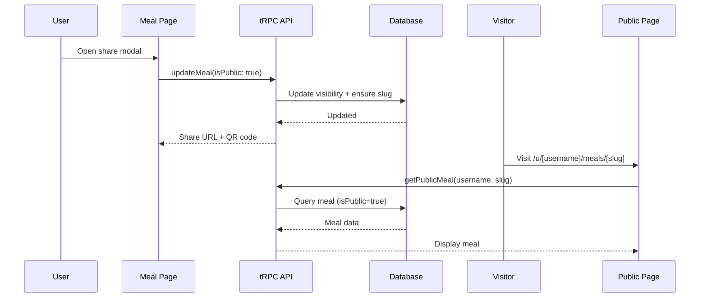

# Features

## Authentication

### Overview
Email/password authentication using Better Auth with role-based access control.

### Capabilities
- Email/password sign up and login
- User roles: `user`, `admin`
- Ban system with reason and optional expiration
- Admin impersonation for support/debugging
- Session management with device tracking

### Flow: User Registration

```
┌─────────────────┐
│   /sign-up      │
│   SignupForm    │
└────────┬────────┘
         │ onSubmit
         ▼
┌─────────────────┐     ┌─────────────────┐     ┌─────────────────┐
│ authClient.     │────▶│ POST            │────▶│ Create user,    │
│ signUp.email()  │     │ /api/auth/...   │     │ account, session│
└─────────────────┘     └─────────────────┘     └────────┬────────┘
                                                         │
                                                         ▼
                                                ┌─────────────────┐
                                                │ Redirect /admin │
                                                └─────────────────┘
```

### Key Files
- `app/auth/server.ts` - Better Auth server configuration
- `app/auth/client.ts` - Client-side auth hooks
- `app/routes/authentication/sign-up.tsx` - Sign up page
- `app/routes/authentication/login.tsx` - Login page
- `app/routes/authentication/components/` - Form components

---

## Admin Dashboard

### Overview
Protected admin area with user management and analytics.

### Capabilities
- User listing with search/filter
- Ban/unban users with reasons
- User impersonation
- Analytics charts
- Documentation viewer

### Flow: User Management

```
┌─────────────────┐
│  /admin/users   │
│  loader()       │──────▶ context.trpc.admin.getUsers()
└────────┬────────┘
         │
         ▼
┌─────────────────┐
│  UserDataTable  │
│  - View users   │
│  - Ban actions  │
│  - Impersonate  │
└─────────────────┘
```

### Key Files
- `app/routes/admin/_layout.tsx` - Admin layout with sidebar
- `app/routes/admin/users.tsx` - User management page
- `app/routes/admin/components/user-data-table.tsx` - User table
- `app/trpc/routes/admin.ts` - Admin tRPC routes

---

## Admin Documentation

### Overview
Markdown documentation viewer with category-based organization.

### Capabilities
- 5 categories: meetings, ideas, plans, features, releases
- Markdown rendering with GitHub Flavored Markdown
- Syntax highlighting (Shiki)
- Mermaid diagram support
- Table of contents with scroll tracking
- Search/filter documents
- URL-based state (direct linking)

### Flow: Document Viewing

```
┌─────────────────────────────┐
│  /admin/docs/:category/:doc │
│  loader()                   │──────▶ Read from docs/ folder
└────────────┬────────────────┘
             │
             ▼
┌─────────────────────────────┐
│  ┌───────┐ ┌─────────────┐  │
│  │ Tabs  │ │ Doc List    │  │
│  │(cats) │ │ (sidebar)   │  │
│  └───────┘ └─────────────┘  │
│  ┌─────────────────────────┐│
│  │ Markdown Content        ││
│  │ + Table of Contents     ││
│  └─────────────────────────┘│
└─────────────────────────────┘
```

### Key Files
- `app/routes/admin/docs.tsx` - Documentation page
- `app/components/markdown-renderer.tsx` - Markdown component
- `docs/` - Static markdown files

---

## File Upload

### Overview
File upload to Cloudflare R2 storage.

### Capabilities
- Direct upload to R2
- File type validation
- Size limits
- Returns public URL

### Flow: File Upload

```
┌─────────────────┐     ┌─────────────────┐     ┌─────────────────┐
│ FileUpload      │────▶│ POST            │────▶│ R2 Bucket       │
│ Component       │     │ /api/upload-file│     │ put()           │
└─────────────────┘     └─────────────────┘     └────────┬────────┘
                                                         │
                                                         ▼
                                                ┌─────────────────┐
                                                │ Return file URL │
                                                └─────────────────┘
```

### Key Files
- `app/components/file-upload.tsx` - Upload component
- `app/routes/api/upload-file.ts` - Upload API route
- `app/repositories/bucket.ts` - R2 operations

---

## Analytics Dashboard

### Overview
Interactive charts and metrics on the admin dashboard.

### Capabilities
- Area charts (time series)
- Stat cards with trends
- Interactive data visualization

### Key Files
- `app/routes/admin/_index.tsx` - Dashboard page
- `app/routes/admin/components/chart-area-interactive.tsx` - Charts
- `app/routes/admin/components/section-cards.tsx` - Stat cards
- `app/components/analytics/` - Reusable analytics components

---

## Recipe Extraction

### Overview
AI-powered recipe extraction from YouTube videos and blog/recipe sites.

### Capabilities
- Extract from YouTube (with video timestamps) or blog URLs
- Dual AI provider support: Gemini 3 Pro or Claude Sonnet 4.5
- Extracts: title, description, servings, prep/cook times, macros, ingredients, steps
- Recipe preview before saving
- YouTube player with timestamp navigation
- Checkable ingredient list
- Admin ingredient management with duplicate merging

### Flow: Recipe Extraction

```
┌─────────────┐     ┌─────────────┐     ┌─────────────────┐
│   User      │────▶│ /recipes/new│────▶│ Submit URL      │
└─────────────┘     └─────────────┘     └────────┬────────┘
                                                 │
                    ┌────────────────────────────┴────────────────────────────┐
                    ▼                                                         ▼
           ┌─────────────────┐                                       ┌─────────────────┐
           │ YouTube URL     │                                       │ Blog URL        │
           │ youtube.ts      │                                       │ content-extractor│
           └────────┬────────┘                                       └────────┬────────┘
                    │                                                         │
                    └────────────────────────┬────────────────────────────────┘
                                             ▼
                                    ┌─────────────────┐
                                    │ AI Provider     │
                                    │ (Gemini/Claude) │
                                    └────────┬────────┘
                                             │
                                             ▼
                                    ┌─────────────────┐
                                    │ Recipe Preview  │
                                    └────────┬────────┘
                                             │ User confirms
                                             ▼
                                    ┌─────────────────┐
                                    │ Save to DB      │
                                    │ recipe.ts repo  │
                                    └─────────────────┘
```

### Routes
- `/recipes` - User's recipe collection with search and filters
- `/recipes/new` - Extract new recipe from URL
- `/recipes/:id` - Recipe detail with YouTube player, checkable ingredients
- `/admin/recipes` - Admin view of all recipes
- `/admin/ingredients` - Ingredient management with merge capability

### Key Files
- `app/lib/gemini.ts` - Gemini AI client for extraction
- `app/lib/claude.ts` - Claude AI client (alternative)
- `app/lib/youtube.ts` - YouTube transcript and metadata
- `app/lib/content-extractor.ts` - Blog content extraction (JSON-LD + Readability)
- `app/repositories/recipe.ts` - Recipe CRUD operations
- `app/repositories/ingredient.ts` - Ingredient management
- `app/components/recipes/` - Recipe UI components
- `app/trpc/routes/recipes.ts` - Recipe tRPC routes
- `app/trpc/routes/ingredients.ts` - Ingredient tRPC routes

---

## Multi-Course Meal Planner

### Overview
Plan elegant multi-course dining experiences with AI assistance. Includes save/share functionality, print-optimized cookbook guides, and polished loading UX.

### Capabilities

**Core Planning:**
- Create meals with name, guest count, serving time, service style (plated/family/buffet)
- Add courses from recipe library with type categorization (appetizer, soup/salad, main, side, dessert, drink)
- AI menu suggestions for improving composition
- AI cooking timeline generation (works backward from serving time)
- Shopping lists aggregated and scaled to guest count

**Save & Share:**
- Meals persist to "My Meals" list with edit capability
- Public sharing at `/u/[username]/meals/[slug]`
- Toggle visibility (public/private)
- QR code generation for sharing

**Print Views:**
- Cookbook-style printable guides with editorial typography
- 4 format options: Full Guide, Timeline Only, Shopping List, Recipe Cards
- Print-optimized CSS for professional output

**Loading UX:**
- Dedicated loading page for AI timeline generation
- Progress bar with animated cooking tips
- Error recovery with retry functionality
- Auto-redirect on completion

### Flow: Meal Planning with AI

```mermaid
flowchart TD
    A[User] --> B[/recipes/meal]
    B --> C[Fill setup form]
    C --> D[Add courses]
    D --> E{Actions}
    E --> F[Get AI Suggestions]
    E --> G[Generate Timeline]
    G --> H[/meals/:id/generating]
    H --> I[Show progress + tips]
    I --> J{Complete?}
    J -->|Yes| K[/meals/:id]
    J -->|Error| L[Retry option]
    L --> H
    K --> M[Review/Edit/Share/Print]
```

### Flow: Meal Sharing



### Routes
- `/recipes/meal` - Create new multi-course meal (wizard flow)
- `/recipes/meals` - User's saved meals list ("My Meals")
- `/recipes/meals/:id` - View/edit saved meal with share/print modals
- `/recipes/meals/:id/generating` - AI generation loading page with progress
- `/u/:username/meals` - Public meals list for a user
- `/u/:username/meals/:slug` - Public meal detail page

### Data Model

**`multi_course_meal` table:**
- `id`, `userId`, `name`, `guestCount`, `servingTime`, `serviceStyle`
- `slug` - URL-safe identifier for public sharing
- `isPublic` - Visibility flag (default: false)
- `generationStatus` - pending/generating/complete/error
- `generationError` - Error message if generation failed
- `aiSuggestionsJson`, `timelineJson` - AI-generated content
- `createdAt`, `updatedAt`

**`meal_course` table:**
- `id`, `mealId`, `recipeId`, `courseType`, `courseOrder`, `servingsOverride`

### Key Files

**Routes:**
- `app/routes/recipes/meal.tsx` - Meal creation wizard
- `app/routes/recipes/meals.tsx` - My Meals list page
- `app/routes/recipes/meals.[id].tsx` - Meal detail with edit/share/print
- `app/routes/recipes/meals.$id.generating.tsx` - AI generation loading page
- `app/routes/u.[username].meals.tsx` - Public meals list
- `app/routes/u.[username].meals.[slug].tsx` - Public meal detail

**Components:**
- `app/components/multi-course-meal/` - Meal builder components
- `app/components/meals/meal-card.tsx` - Meal card for list views
- `app/components/loading/` - Loading page components (progress, tips)
- `app/components/sharing/share-meal-modal.tsx` - Share modal with QR code
- `app/components/print/print-meal-modal.tsx` - Print format selector

**Core:**
- `app/repositories/multi-course-meal.ts` - Data access (CRUD, sharing queries)
- `app/trpc/routes/multi-course-meal.ts` - API routes
- `app/lib/gemini.ts` - AI functions (generateMenuSuggestions, generateCookingTimeline)
- `app/lib/print/meal-guide.ts` - Print HTML generation (all 4 formats)

### Architecture Doc
- `docs/features/meal-planner-upgrade-architecture.md` - Full architecture for save/share/print/loading
