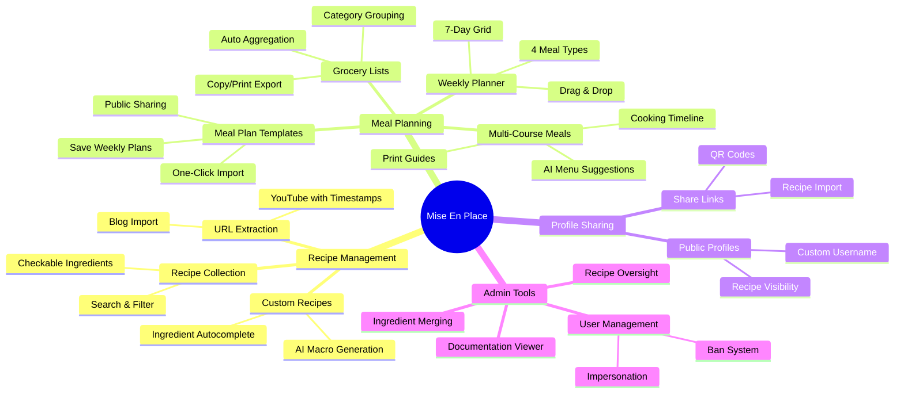
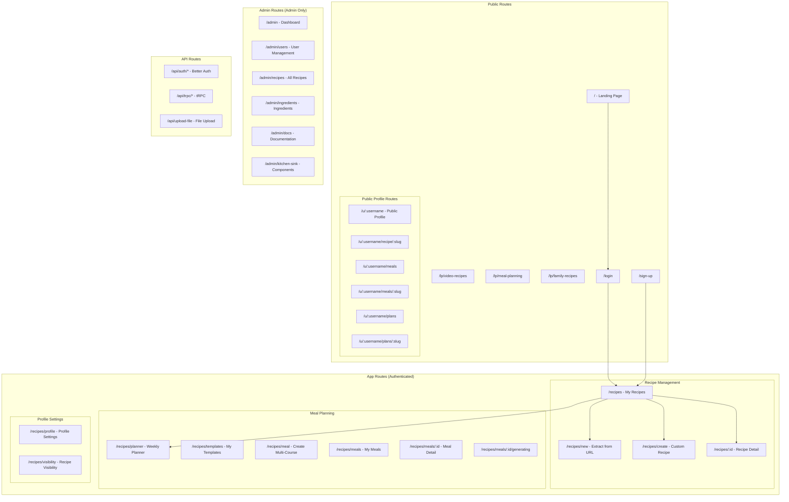
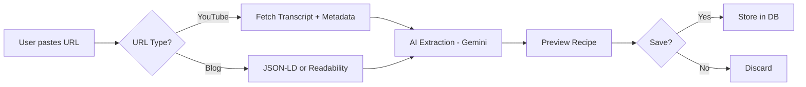
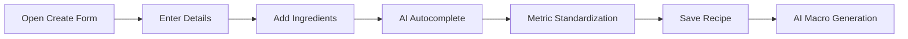
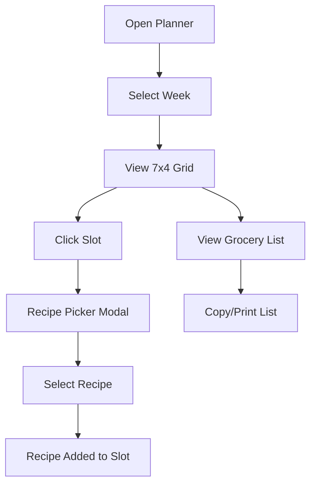
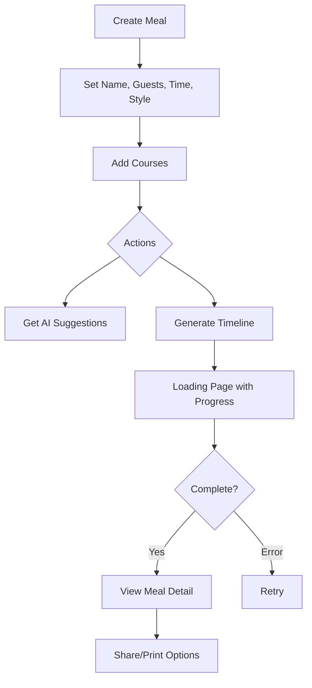
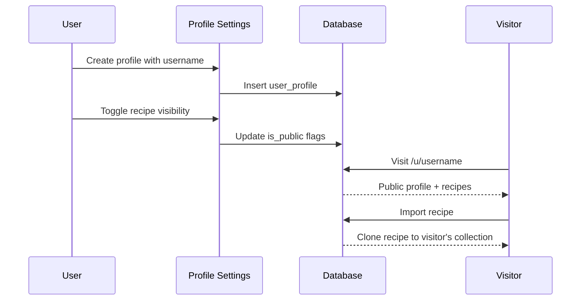
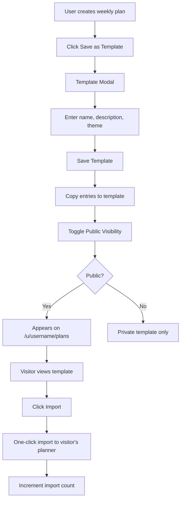
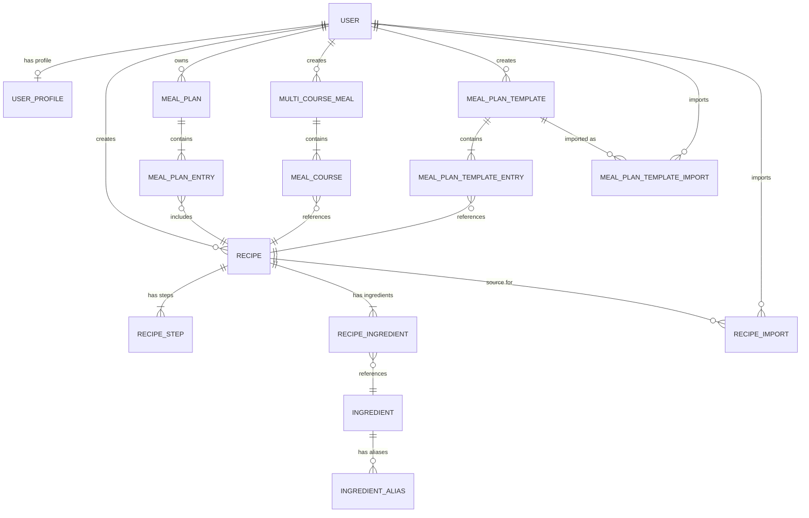
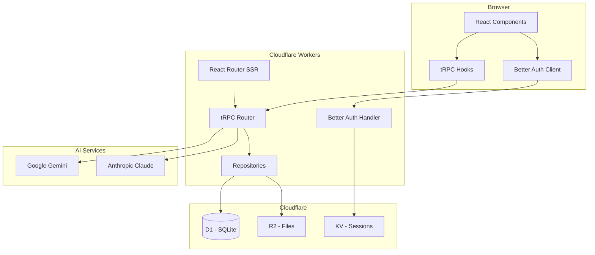

# High-Level Architecture

A living document showing the app's structure, feature flows, and recent changes at a glance.

---

## Product Overview

---

## Route Map

---

## Information Architecture

| Route | Purpose | Auth | Key Components |
|-------|---------|------|----------------|
| `/` | Landing page with hero and feature highlights | Public | Hero, FeatureCards, CTA |
| `/lp/video-recipes` | Landing page for YouTube recipe enthusiasts | Public | Hero, Benefits, CTA |
| `/lp/meal-planning` | Landing page for meal planners | Public | Hero, Benefits, CTA |
| `/lp/family-recipes` | Landing page for family recipe archivists | Public | Hero, Benefits, CTA |
| `/login` | User login form | Public | LoginForm |
| `/sign-up` | User registration form | Public | SignupForm |
| `/recipes` | Recipe collection with search/filter | User | RecipeGrid, SearchBar, FilterTabs |
| `/recipes/new` | Extract recipe from YouTube/blog URL | User | URLInput, RecipeExtractor, Preview |
| `/recipes/create` | Create custom recipe manually | User | CustomRecipeForm, IngredientInput |
| `/recipes/:id` | Recipe detail with player/ingredients | User | YouTubePlayer, RecipeSteps, IngredientsList |
| `/recipes/planner` | Weekly meal planner + grocery list | User | WeeklyGrid, RecipePicker, GroceryPanel |
| `/recipes/templates` | User's meal plan templates | User | TemplateGrid, SaveTemplateModal, ShareModal |
| `/recipes/meal` | Create multi-course meal wizard | User | MealSetupForm, CoursePicker |
| `/recipes/meals` | User's saved meals list | User | MealGrid, MealCard |
| `/recipes/meals/:id` | Meal detail with share/print | User | MealDetail, ShareModal, PrintModal |
| `/recipes/meals/:id/generating` | AI generation loading page | User | ProgressBar, AnimatedTips |
| `/recipes/profile` | Profile settings (username, bio) | User | ProfileForm, AvatarUpload |
| `/recipes/visibility` | Manage recipe public/private status | User | RecipeVisibilityList, ToggleSwitch |
| `/u/:username` | Public profile page | Public | PublicProfile, PublicRecipeGrid |
| `/u/:username/recipe/:slug` | Public recipe detail | Public | PublicRecipeDetail, ImportButton |
| `/u/:username/meals` | Public meals list | Public | PublicMealsList |
| `/u/:username/meals/:slug` | Public meal detail | Public | PublicMealDetail |
| `/u/:username/plans` | Public meal plan templates list | Public | PublicPlansList, TemplateCard |
| `/u/:username/plans/:slug` | Public meal plan template detail | Public | PublicPlanDetail, ImportButton |
| `/admin` | Analytics dashboard | Admin | StatCards, TimeSeriesChart, DistributionChart |
| `/admin/users` | User management table | Admin | UserDataTable, BanModal, ImpersonateButton |
| `/admin/recipes` | All recipes across users | Admin | RecipeDataTable |
| `/admin/ingredients` | Ingredient database with merge | Admin | IngredientTable, MergeModal |
| `/admin/docs` | Markdown documentation viewer | Admin | DocsSidebar, MarkdownRenderer |

---

## Feature Flows

### Recipe Extraction

### Custom Recipe Creation

### Weekly Meal Planning

### Multi-Course Meal Planning

### Profile Sharing

### Public Meal Plan Templates

---

## Data Relationships

### Core Tables

| Table | Purpose | Key Fields |
|-------|---------|------------|
| `user` | User accounts | id, email, role (user/admin), banned |
| `user_profile` | Public profile settings | username, displayName, bio, isPublic |
| `recipe` | User's recipes | title, sourceType (youtube/blog/original), slug, isPublic |
| `recipe_step` | Cooking instructions | stepNumber, instruction, timestampSeconds |
| `recipe_ingredient` | Recipe ingredients | quantity, unit, quantityMetric, unitMetric |
| `ingredient` | Master ingredient list | name, category |
| `ingredient_alias` | Ingredient name variations | ingredientId, alias |
| `meal_plan` | Weekly meal plans | userId, weekStartDate |
| `meal_plan_entry` | Plan slots | dayOfWeek (0-6), mealType (breakfast/lunch/dinner/snacks) |
| `multi_course_meal` | Multi-course meals | name, guestCount, servingTime, serviceStyle, slug, isPublic |
| `meal_course` | Courses in a meal | courseType, courseOrder, recipeId |
| `meal_plan_template` | Meal plan templates | name, slug, description, theme, coverImageUrl, isPublic, importCount, viewCount |
| `meal_plan_template_entry` | Template entries | templateId, recipeId, dayOfWeek, mealType |
| `meal_plan_template_import` | Template import tracking | templateId, importedById, importedAt |
| `recipe_import` | Tracks recipe cloning | sourceRecipeId, importedRecipeId |

---

## System Architecture

### Tech Stack

| Layer | Technology |
|-------|------------|
| Frontend | React 19, React Router v7, Tailwind v4, shadcn/ui |
| Backend | Cloudflare Workers (Edge Runtime) |
| API | tRPC with React Query |
| Auth | Better Auth (email/password + sessions) |
| Database | Cloudflare D1 (SQLite), Drizzle ORM |
| Storage | Cloudflare R2 |
| AI | Google Gemini, Anthropic Claude (fallback) |
| Analytics | PostHog |

---

## Changelog

### 2026-02-03 - Public Meal Plan Templates
- Added: `/recipes/templates` route for user's meal plan templates
- Added: `/u/:username/plans` public route for user's public templates list
- Added: `/u/:username/plans/:slug` public route for template detail
- Added: `meal_plan_template` table with metadata (name, slug, description, theme, coverImageUrl, isPublic, importCount, viewCount)
- Added: `meal_plan_template_entry` table linking templates to recipes with day/meal type
- Added: `meal_plan_template_import` table tracking template imports
- Added: `mealPlanTemplate` tRPC router with create, update, delete, getById, list, getPublicBySlug, listPublic, import, incrementViewCount routes
- Added: Save as Template flow from weekly planner
- Added: One-click template import functionality

### 2026-02-03 - Custom Recipes & Ingredient Enhancements
- Added: `/recipes/create` route for manual recipe creation
- Added: `ingredient_alias` table for name variations
- Added: `quantity_metric` and `unit_metric` fields to `recipe_ingredient`
- Added: AI macro generation for custom recipes
- Added: Ingredient autocomplete with similarity detection
- Changed: Recipes now support `source_type: "original"` for custom recipes

### 2026-02-02 - Multi-Course Meal Planner Upgrade
- Added: `/recipes/meals` list page for saved meals
- Added: `/recipes/meals/:id` detail page with share/print
- Added: `/recipes/meals/:id/generating` loading page with progress
- Added: `/u/:username/meals` and `/u/:username/meals/:slug` public routes
- Added: `slug`, `isPublic`, `generationStatus`, `generationError` to `multi_course_meal`
- Added: Print views in 4 formats (full guide, timeline, shopping list, recipe cards)
- Added: QR code generation for meal sharing

### 2026-02-01 - Multi-Course Meal Planner
- Added: `/recipes/meal` wizard for creating multi-course meals
- Added: `multi_course_meal` and `meal_course` tables
- Added: AI menu suggestions via Gemini
- Added: AI cooking timeline generation

### 2026-01-31 - Profile Sharing
- Added: `/u/:username` public profile routes
- Added: `/recipes/profile` and `/recipes/visibility` settings
- Added: `user_profile` and `recipe_import` tables
- Added: `slug` and `is_public` fields to `recipe`
- Added: Recipe import (cloning) functionality

### 2026-01-29 - Weekly Meal Planner
- Added: `/recipes/planner` route
- Added: `meal_plan` and `meal_plan_entry` tables
- Added: Grocery list aggregation with category grouping

### 2026-01-28 - Recipe Extraction
- Added: `/recipes/new` route for URL extraction
- Added: YouTube transcript extraction with timestamps
- Added: Blog content extraction (JSON-LD + Readability)
- Added: Dual AI provider support (Gemini primary, Claude fallback)
- Added: `recipe`, `recipe_step`, `recipe_ingredient`, `ingredient` tables

### 2026-01-24 - Foundation
- Added: Authentication system (Better Auth)
- Added: Admin dashboard with user management
- Added: Documentation viewer at `/admin/docs`
- Added: Editorial cookbook design system
