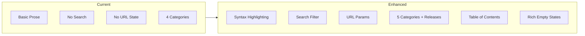

# Documentation Feature Enhancement

## Current State

The docs feature exists at `/admin/docs` with:

- Category tabs (Meetings, Ideas, Plans, Features)
- Two-pane layout with document list and content area
- Basic markdown rendering with Mermaid support
- Content in `docs/features/`, `docs/ideas/`, `docs/plans/`, `docs/meetings/`

**Adding:** New "Releases" category for changelog/completed work documentation

## Changes Overview



---

## Task 1: Add Syntax Highlighting

**Subagent:** `generalPurpose`

**Files:** `app/components/markdown-renderer.tsx`, `package.json`

Install and configure `shiki` for code syntax highlighting:

- Add shiki dependency
- Create highlight function for code blocks
- Style code blocks with proper theming (light/dark mode)

---

## Task 2: Add Table of Contents Component

**Subagent:** `generalPurpose`

**Files:** `app/routes/admin/docs.tsx`

Create a table of contents that:

- Extracts headings (h2, h3) from markdown
- Displays in a collapsible sidebar section
- Highlights current section on scroll
- Smooth scroll to heading on click

---

## Task 3: Implement URL State Management

**Subagent:** `generalPurpose`

**Files:** `app/routes/admin/docs.tsx`, `app/routes.ts`

Add URL-based navigation:

- Route pattern: `/admin/docs/:category?/:doc?`
- Parse category and doc from URL params
- Update URL when selecting documents
- Support direct linking/bookmarking

---

## Task 4: Add Search/Filter Functionality

**Subagent:** `generalPurpose`

**Files:** `app/routes/admin/docs.tsx`

Implement document search:

- Search input in document list header
- Filter documents by title match
- Optionally search within content
- Highlight matching text in list

---

## Task 5: Add Releases Category and Empty States

**Subagent:** `generalPurpose`

**Files:** `app/routes/admin/docs.tsx`, `app/components/ui/empty.tsx`

Add the new Releases category and create rich empty states:

- Add "Releases" tab with rocket/tag icon to categories array
- Create `docs/releases/` folder
- Design helpful empty states for each category:
  - **Meetings:** "No meeting notes yet" - for team sync documentation
  - **Ideas:** "Capture your ideas" - for brainstorming and feature concepts
  - **Plans:** "Plan your roadmap" - for strategic planning documents
  - **Features:** "Document your features" - for technical documentation
  - **Releases:** "Track your releases" - for changelog and shipped work
- Custom icon per category
- Consistent with the project's Empty component pattern

---

## Task 6: Improve Layout and Typography

**Subagent:** `generalPurpose`

**Files:** `app/routes/admin/docs.tsx`, `app/components/markdown-renderer.tsx`

Enhance the reading experience:

- Add breadcrumbs (Category > Document Title)
- Improve prose typography and spacing
- Better responsive behavior
- Reading progress indicator (optional)
- Proper document header with metadata

---

## Task 7: Create Documentation Rules

**Subagent:** `generalPurpose`

**Files:** `.cursor/rules/docs.mdc`

Create agent rules for documentation:

```markdown
# Documentation Guidelines

## File Structure
- features/ - Technical feature documentation
- ideas/ - Brainstorming and feature ideas  
- plans/ - Roadmaps and project plans
- meetings/ - Meeting notes (date-prefixed)
- releases/ - Changelog and release notes (version-prefixed)

## Formatting Standards
- Use H1 for title, H2 for sections, H3 for subsections
- Include Mermaid diagrams for complex flows
- Use tables for structured data
- Use checklists for action items

## Naming Conventions
- meetings: YYYY-MM-DD-description.md
- releases: vX.Y.Z.md or YYYY-MM-DD-release.md
- others: kebab-case.md

## Release Notes Structure
- Version/date header
- Summary of changes
- New features (with links to feature docs)
- Bug fixes
- Breaking changes (if any)
```

---

## Task 8: Update PR Checker Skill

**Subagent:** `generalPurpose`

**Files:** `.cursor/skills/pr-checker/SKILL.md`

Add documentation file validation to pr-checker:

- Add `docs/*.md` file pattern to the validation table
- Reference `docs.mdc` rule for compliance checking
- Include checks for:
  - Naming conventions (dates for meetings/releases, kebab-case for others)
  - Required structure (H1 title, proper sections)
  - Mermaid diagram syntax validation

---

## Task 9: Delete Old Plan

**Subagent:** `generalPurpose`

**Files:** `.cursor/plans/admin_docs_section_5f648729.plan.md`

Clean up completed plan:

- Delete `.cursor/plans/admin_docs_section_5f648729.plan.md` (fully completed, superseded by this plan)

---

## Task 10: Clear Meetings and Create Releases Folder

**Subagent:** `generalPurpose`

**Files:** `docs/meetings/*`, `docs/releases/`

Prepare the docs folder:

- Delete `docs/meetings/2026-01-24-kickoff.md`
- Create `docs/releases/` folder (add .gitkeep)
- Keep existing content in ideas/, plans/, features/
- Meetings and Releases categories will show empty states

---

## Task 11: Test Implementation

**Subagent:** `tester`

**Description:** Verify all documentation features work correctly using browser testing

Test cases:

- [ ] Navigate to docs, verify UI renders with 5 category tabs
- [ ] Test search filtering
- [ ] Test URL state (direct link, browser back/forward)
- [ ] Test empty state in Meetings category
- [ ] Test empty state in Releases category
- [ ] Test syntax highlighting on code blocks
- [ ] Test table of contents navigation
- [ ] Test responsive layout

---

## Task 12: Update Context Documentation

**Subagent:** `context-keeper`

**Description:** Update context.md with documentation feature details

---

## PR Validation (before creating PR)

Run the `pr-checker` skill which validates:

- [ ] Route conventions followed (Task 3)
- [ ] context.md updated (Task 12)
- [ ] Testing plan exists (Task 11)
- [ ] New rules properly formatted (Task 7)
- [ ] pr-checker skill updated (Task 8)

---

## Key Files

| File | Purpose |

|------|---------|

| [`app/routes/admin/docs.tsx`](app/routes/admin/docs.tsx) | Main docs page component |

| [`app/components/markdown-renderer.tsx`](app/components/markdown-renderer.tsx) | Markdown rendering with syntax highlighting |

| [`app/routes.ts`](app/routes.ts) | Route definitions for URL params |

| [`.cursor/rules/docs.mdc`](.cursor/rules/docs.mdc) | Documentation rules for agents |

| [`.cursor/skills/pr-checker/SKILL.md`](.cursor/skills/pr-checker/SKILL.md) | PR validation skill (updated) |

| [`docs/`](docs/) | Documentation content folder |

---

## Dependencies to Add

```json
{
  "shiki": "^1.x"
}
```