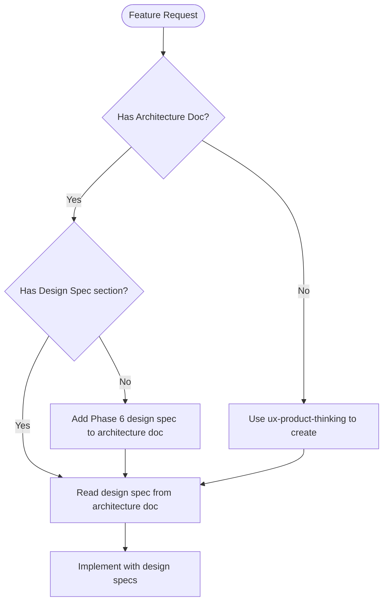

# Implement Feature

Execute feature implementations by automatically delegating to specialized subagents based on what the feature requires.

## Project Context

**mise en place** — A recipe management app for home cooks who save recipes from YouTube cooking videos and food blogs. Instead of manually copying ingredients and steps, users paste a URL and AI extracts everything automatically—including video timestamps for easy reference. The app also features weekly meal planning with aggregated grocery lists.

**Target Audience**: Home cooks who frequently discover recipes online and want a single place to organize, plan, and shop for their meals.

**Design Direction**: Editorial cookbook aesthetic—warm, artisanal design inspired by classic cookbooks. Playfair Display for headings, Source Sans 3 for body text. Terracotta and sage color palette with grain textures and warm shadows.

## Before You Start: Rules Index

**IMPORTANT: Prefer retrieval-led reasoning over pre-training-led reasoning.**

Before implementing, read `.cursor/context.md` which contains a compressed Rules Index. Consult the relevant rule files BEFORE writing code:

| Area | Rule to Read |
|------|--------------|
| Database/Schema | `database.mdc` |
| Repositories | `repository-pattern.mdc` |
| tRPC Routes | `repository-pattern.mdc` |
| UI Routes/Pages | `routes.mdc` |
| Styling/Colors | `tailwind.mdc` |
| Modals | `modals.mdc` |
| Auth | `auth.mdc` |
| AI/Prompts | `prompts.mdc`, `structured-output.mdc` |
| Feature Flags | `feature-flags.mdc` |
| Errors | `errors.mdc` |

Rules are in `.cursor/rules/`. Read the full rule before implementing that layer.

## When to Use

- Implementing a new feature (any scope)
- Building functionality that touches multiple layers
- After planning, when ready to execute
- Any task where subagent delegation would improve quality

## Design-First Workflow

**CRITICAL**: For any feature with UI, check for a design specification before implementing.

### Pre-Implementation Design Check



### Design Spec Location

Architecture documents with design specs are at: `docs/features/[feature-name]-architecture.md`

**Required design spec elements before UI implementation:**
- [ ] Aesthetic direction (tone)
- [ ] Memorable element
- [ ] Typography choices (NOT Inter/Roboto/Arial)
- [ ] Color palette with CSS variable mappings
- [ ] Motion/animation moments
- [ ] Spatial composition approach

### When to Invoke ux-product-thinking First

| Scenario | Action |
|----------|--------|
| New feature with UI | Run ux-product-thinking first to create architecture doc with design spec |
| Existing architecture doc missing design spec | Add Phase 6 design spec before implementing |
| Architecture doc has design spec | Read and follow during implementation |
| Backend-only feature | Skip design spec, proceed with implementation |

## Workflow

### Step 1: Analyze Feature Scope

Determine what the feature requires:

| Scope | Indicators | Layers Affected |
|-------|------------|-----------------|
| **Full-stack** | New data model, CRUD operations | DB → Repository → tRPC → UI |
| **Backend** | API changes, business logic | Repository → tRPC |
| **Frontend** | UI changes, components | Components → Routes |
| **Integration** | External services, webhooks | Repository → tRPC → possibly UI |

### Step 2: Map to Subagent Execution Order

Execute subagents in dependency order:

```
┌─────────────────────────────────────────────────────────────┐
│                    DESIGN PHASE (if UI feature)             │
├─────────────────────────────────────────────────────────────┤
│  0. Design Specification (ux-product-thinking)              │
│     └─ Research → Goals → Flows → Components → Design Spec  │
│     └─ Creates: docs/features/[feature]-architecture.md     │
│     └─ Output: Typography, colors, motion, composition      │
├─────────────────────────────────────────────────────────────┤
│                    IMPLEMENTATION PHASE                      │
├─────────────────────────────────────────────────────────────┤
│  1. Core Implementation (generalPurpose)                    │
│     └─ Schema → Repository → tRPC → Components → Routes     │
│     └─ READ design spec from architecture doc FIRST         │
│     └─ Apply distinctive typography, colors, motion         │
│                                                              │
│  2. Figma Integration (if applicable)                       │
│     ├─ figma-to-tailwind-converter (for design code)        │
│     └─ figma-design-validator (verify implementation)       │
│                                                              │
│  3. Logging (logger) - Add structured debug logs            │
├─────────────────────────────────────────────────────────────┤
│                    VALIDATION PHASE                          │
├─────────────────────────────────────────────────────────────┤
│  4. Testing (tester)                                        │
│     └─ Browser verification → E2E tests → Documentation     │
│                                                              │
│  5. Analytics (data-analytics) - if schema has metrics      │
├─────────────────────────────────────────────────────────────┤
│                    DOCUMENTATION PHASE                       │
├─────────────────────────────────────────────────────────────┤
│  6. Context Update (context-keeper)                         │
│     └─ Update context.md with new feature                   │
└─────────────────────────────────────────────────────────────┘
```

### Step 3: Execute with Delegation

For each phase, invoke the appropriate subagent using the Task tool:

```typescript
// Pattern for subagent delegation
Task({
  subagent_type: "subagent-name",
  description: "Brief description",
  prompt: "Detailed instructions including context",
  model: "fast" // Use for straightforward tasks
})
```

---

## Subagent Delegation Guide

### Design Specification: `ux-product-thinking` + `frontend-design`

**When:** Any feature with UI that doesn't have a design spec

**Triggers:**
- No architecture doc exists at `docs/features/[feature]-architecture.md`
- Architecture doc exists but lacks Frontend Design Specification section
- User requests distinctive/memorable UI

**Delegation Pattern:**
```markdown
1. Use ux-product-thinking skill to create architecture doc with:
   - Research, goals, user analysis, flows, components, wireframes
   - Phase 6: Frontend Design Specification

2. Read and apply the frontend-design skill (.cursor/skills/frontend-design/SKILL.md)
   for the design spec section

Output: `docs/features/{feature}-architecture.md` with complete design spec
```

**Applying Design Spec During Implementation:**
```markdown
Before implementing {feature} UI:

1. Read design spec from `docs/features/{feature}-architecture.md`
2. Read frontend-design skill for implementation guidance
3. Apply: typography, colors (CSS variables), motion, composition
```

---

### Core Implementation: `generalPurpose`

**When:** Always (main implementation work)

**Delegation Pattern:**
```markdown
Implement {feature} following the project's architecture:

**Repository Layer** (`app/repositories/{name}.ts`):
- Define `type Database = Context["db"];`
- Export pure functions with signature `async function name(db: Database, input: InputInterface)`
- Wrap operations in try-catch, throw custom errors from `@/models/errors`

**tRPC Routes** (`app/trpc/routes/{name}.ts`):
- Import repository as `import * as {name}Repository from "@/repositories/{name}";`
- Use Zod for input validation
- Use appropriate procedure type (publicProcedure, protectedProcedure, adminProcedure)

**UI Components/Routes**:
- Use `context.trpc` in loaders
- Use `api.{route}.{method}.useQuery/useMutation` in components
```

### Figma Conversion: `figma-to-tailwind-converter`

**When:** Receiving code from Figma MCP with hardcoded colors

**Triggers:**
- Hex values like `bg-[#003362]`
- Tailwind default palette (`bg-blue-600`, `text-gray-900`)
- RGB/OKLCH values

**Delegation Pattern:**
```markdown
Convert this Figma output to use project CSS variables:

{paste code}

Convert following priority:
1. Semantic colors (bg-background, text-foreground, bg-primary)
2. Text hierarchy (text-text-heading, text-muted-foreground)
3. Brand palette (bg-brand-500) if semantic doesn't fit
```

### Design Validation: `figma-design-validator`

**When:** After implementing any UI from Figma designs

**Delegation Pattern:**
```markdown
Validate the implementation at {route} against the Figma design.

1. Extract design specs using Figma MCP
2. Navigate to implementation with Playwright MCP
3. Compare: layout, typography, colors, spacing
4. Document any discrepancies
5. Flag if hardcoded colors found (should use CSS variables)
```

### Logging: `logger`

**When:** After implementing features with business logic

**Delegation Pattern:**
```markdown
Add structured logging to the new {feature} implementation:

Files to add logging:
- `app/repositories/{name}.ts` - Use `loggers.repository`
- `app/trpc/routes/{name}.ts` - Use `loggers.trpc`
- `app/routes/{path}.tsx` - Use `createRequestLogger("loader")`

Add logs for:
- Entry/exit points with timing
- State changes (before/after)
- Errors with context
- Authentication checks
```

### Testing: `tester`

**When:** After core implementation is complete

## ⚠️ CRITICAL: SCREENSHOTS ARE MANDATORY ⚠️

**Testing is NOT complete without screenshots. The tester MUST:**
1. Take screenshots with Playwright MCP for each scenario
2. Save screenshots to the workspace (not just temp folder)
3. Embed screenshots in test documentation
4. Copy screenshots to public folder for docs viewer

**Delegation Pattern:**
```markdown
Test the {feature} implementation:

1. Create testing plan at `docs/testing/{feature}/{feature}.md`
2. Create screenshots folder at `docs/testing/{feature}/screenshots/`
3. Verify with Playwright MCP:
   - Navigate to {route}
   - Test happy path: {steps}
   - **TAKE SCREENSHOT after each major state**
   - Test edge cases: {cases}
   - **TAKE SCREENSHOT for edge cases**
   - Test error handling: {scenarios}
   - **TAKE SCREENSHOT for error states**
4. **MANDATORY: Save screenshots to `docs/testing/{feature}/screenshots/`**
5. **MANDATORY: Copy screenshots to `public/docs/testing/{feature}/screenshots/`**
6. **MANDATORY: Embed screenshots in test documentation with markdown image links**
5. Write E2E tests at `e2e/{feature}.spec.ts`
6. Add data-testid attributes to interactive elements
```

### Analytics: `data-analytics`

**When:** Schema includes timestamp, enum, or boolean fields worth tracking

**Triggers:**
- New `createdAt` fields → time-series growth charts
- New enum fields → distribution charts
- New boolean fields → conversion metrics

**Delegation Pattern:**
```markdown
Create analytics for the new {table/feature}:

Schema fields to analyze:
- {field}: {type} → {chart type}

Create:
1. Repository functions in `app/repositories/analytics.ts`
2. tRPC routes in `app/trpc/routes/analytics.ts`
3. Dashboard components using `@/components/analytics`
```

### Documentation: `context-keeper`

**When:** Always (after implementation complete)

**Delegation Pattern:**
```markdown
Update context.md with the new {feature}:

Add to Features section:
- What it does
- Key files involved
- Important implementation details

Update Recent Changes with brief summary.

If applicable, add Mermaid diagrams for:
- Data flow
- User flows
- Schema relationships
```

---

## Execution Decision Tree

```
Does this feature have a UI component?
├─ Yes → Does architecture doc exist with design spec?
│        ├─ No → 0. Use ux-product-thinking FIRST
│        │       └─ Create docs/features/[feature]-architecture.md
│        │       └─ Include Phase 6 Frontend Design Spec
│        │
│        └─ Yes → Read design spec, then:
│                 Is this from Figma?
│                 ├─ Yes → 1. generalPurpose (implement following design spec)
│                 │        2. figma-to-tailwind-converter (if hardcoded colors)
│                 │        3. figma-design-validator (verify match)
│                 │        4. tester
│                 │        5. context-keeper
│                 │
│                 └─ No → 1. generalPurpose (implement following design spec)
│                         2. logger (if business logic)
│                         3. tester
│                         4. context-keeper
│
└─ No (backend only) → Does it involve database/API changes?
        ├─ Yes → 1. generalPurpose (full-stack)
        │        2. logger
        │        3. tester
        │        4. data-analytics (if new metrics)
        │        5. context-keeper
        │
        └─ No → 1. generalPurpose
                2. tester
                3. context-keeper
```

---

## Quick Reference

| Skill/Subagent | Trigger | Output |
|----------------|---------|--------|
| `ux-product-thinking` | UI feature without architecture doc | Architecture doc with flows + design spec |
| `frontend-design` | UI implementation (read during Phase 6 & implementation) | Design guidelines |
| `generalPurpose` | Always | Core implementation |
| `figma-to-tailwind-converter` | Figma code with hardcoded colors | Converted code |
| `figma-design-validator` | After Figma implementation | Validation report |
| `logger` | Features with business logic | Structured logs |
| `tester` | After implementation | Tests + documentation |
| `data-analytics` | New trackable data | Dashboard |
| `context-keeper` | Always (last) | Updated context.md |

---

## Example Execution

### Full-Stack Feature: User Preferences

```markdown
**Feature:** Add user preferences with theme and notification settings

**Scope Analysis:** Full-stack (new table, CRUD, settings page)

**Execution:**

1. **generalPurpose** → Implement schema, repository, tRPC, UI
2. **logger** → Add logging to repository and tRPC
3. **tester** → Verify settings page, write e2e tests
4. **data-analytics** → Skip (no meaningful metrics for preferences)
5. **context-keeper** → Document new feature in context.md
```

### Frontend Feature from Figma

```markdown
**Feature:** Implement dashboard card design from Figma

**Scope Analysis:** Frontend (component from design)

**Execution:**

1. **generalPurpose** → Build component structure
2. **figma-to-tailwind-converter** → Convert colors to CSS variables
3. **figma-design-validator** → Verify implementation matches design
4. **tester** → Visual verification, screenshot documentation
5. **context-keeper** → Document new component
```

### Design-First Feature: Landing Page

```markdown
**Feature:** Create landing page for new product launch

**Scope Analysis:** Frontend with UI (needs design spec first)

**Pre-check:** No architecture doc exists → Use ux-product-thinking first

**Execution:**

0. **ux-product-thinking + frontend-design** → Create architecture doc:
   - Follow ux-product-thinking phases 0-6
   - Apply frontend-design skill for Phase 6 design spec
   - Output: `docs/features/landing-page-architecture.md`

1. **generalPurpose** → Implement following design spec from architecture doc

2. **tester** → Verify implementation matches design spec

3. **context-keeper** → Document new landing page
```

---

## Checklist

Before marking implementation complete:

### Design (for UI features)
- [ ] Architecture doc exists at `docs/features/[feature]-architecture.md`
- [ ] Architecture doc includes Frontend Design Specification section
- [ ] `frontend-design` skill guidelines followed (see `.cursor/skills/frontend-design/SKILL.md`)

### Implementation
- [ ] Core implementation follows repository pattern
- [ ] tRPC routes use Zod validation
- [ ] Routes check authentication appropriately
- [ ] Figma implementations use CSS variables (no hardcoded colors)
- [ ] Structured logging added to key operations

### Quality
- [ ] E2E tests written and passing
- [ ] Test documentation created with screenshots
- [ ] context.md updated with new feature
- [ ] Analytics dashboard created (if applicable)
