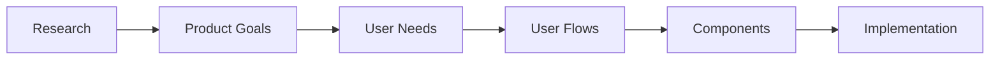
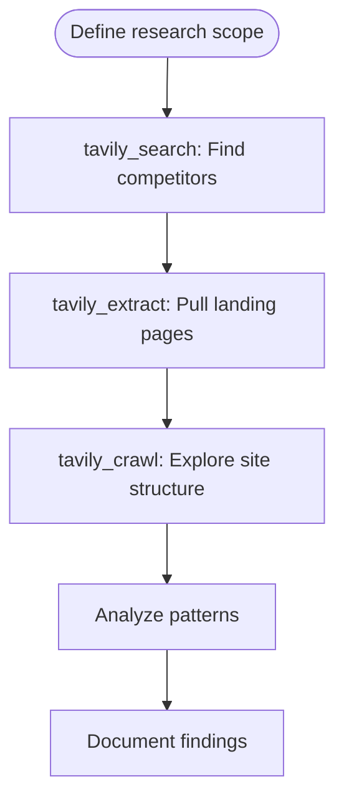
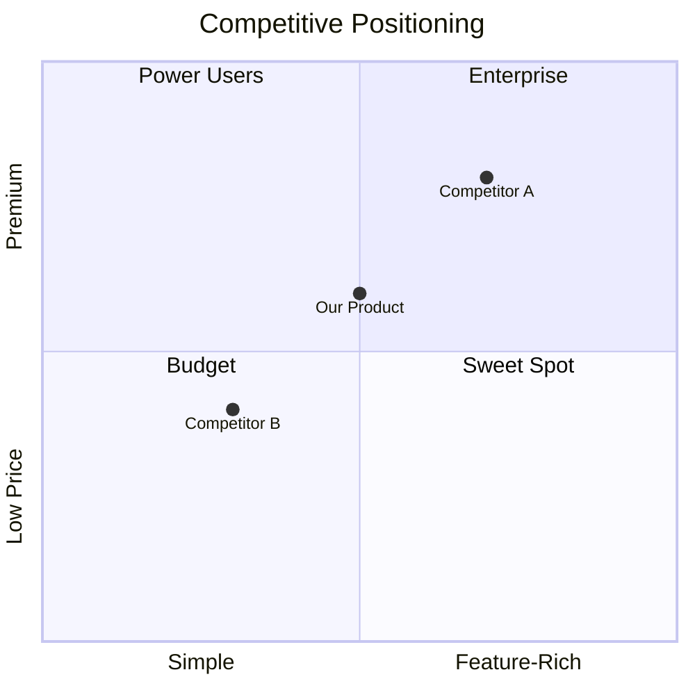
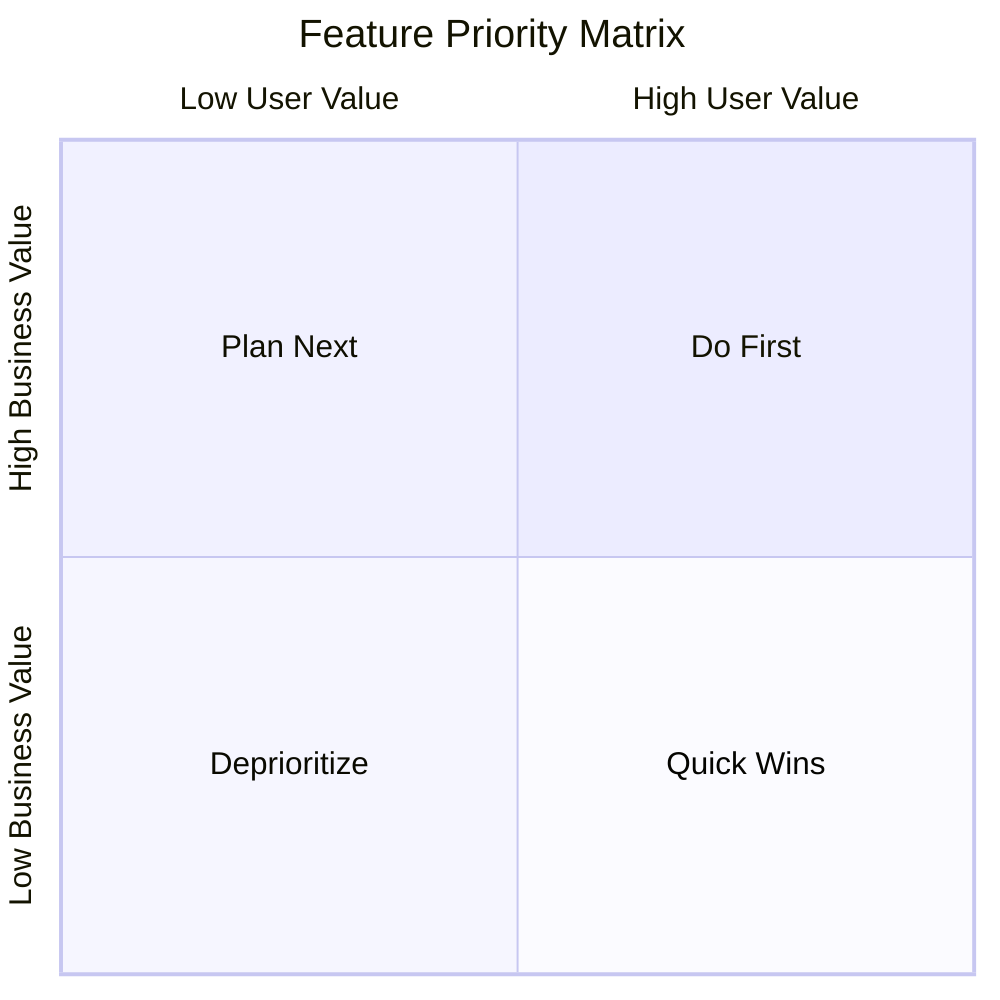
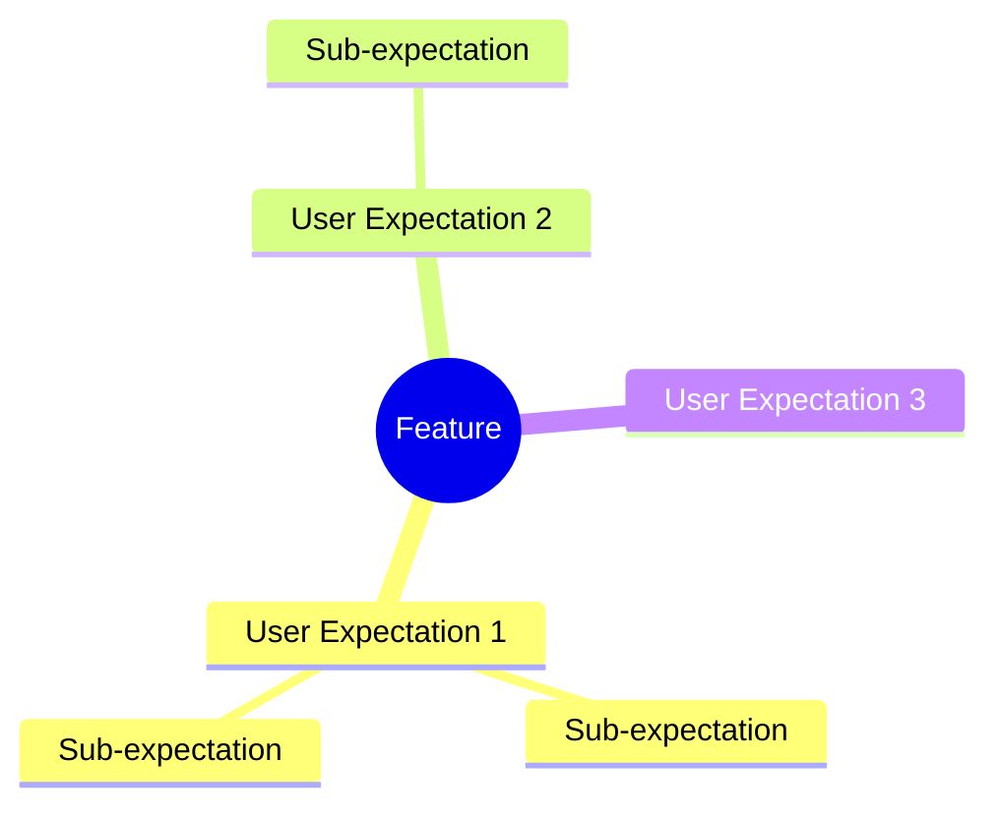
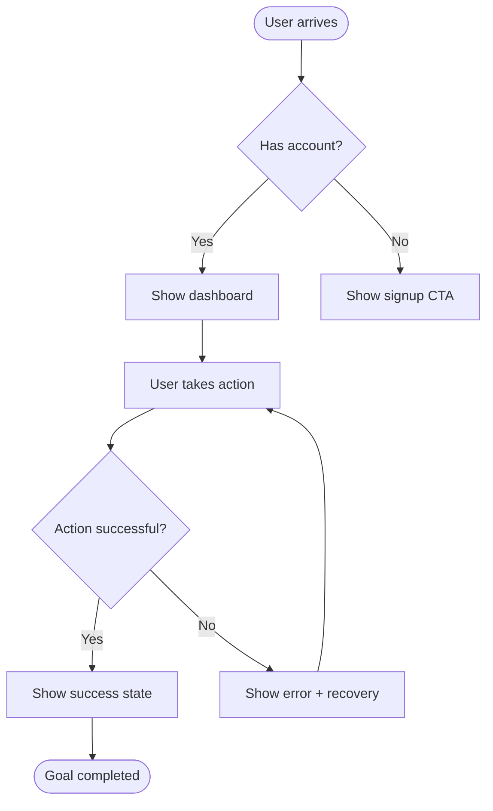
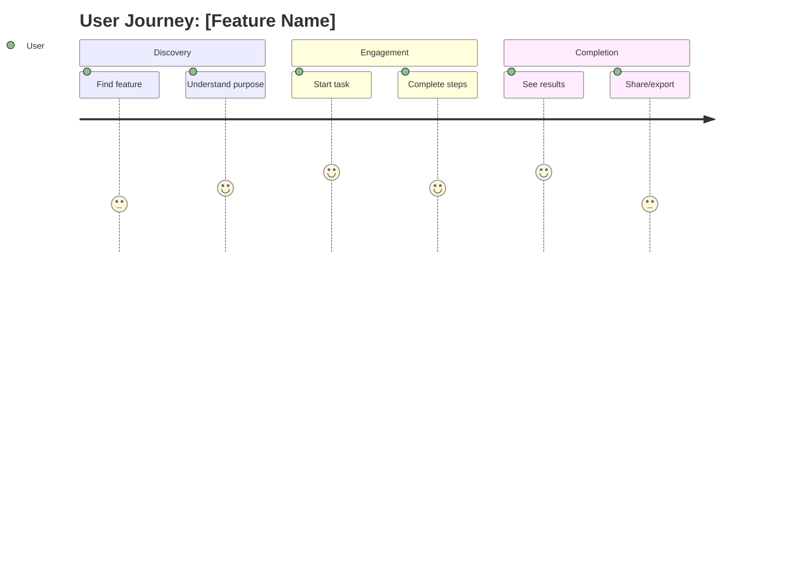
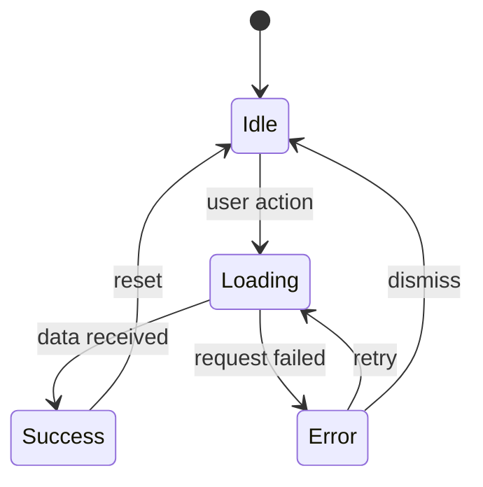
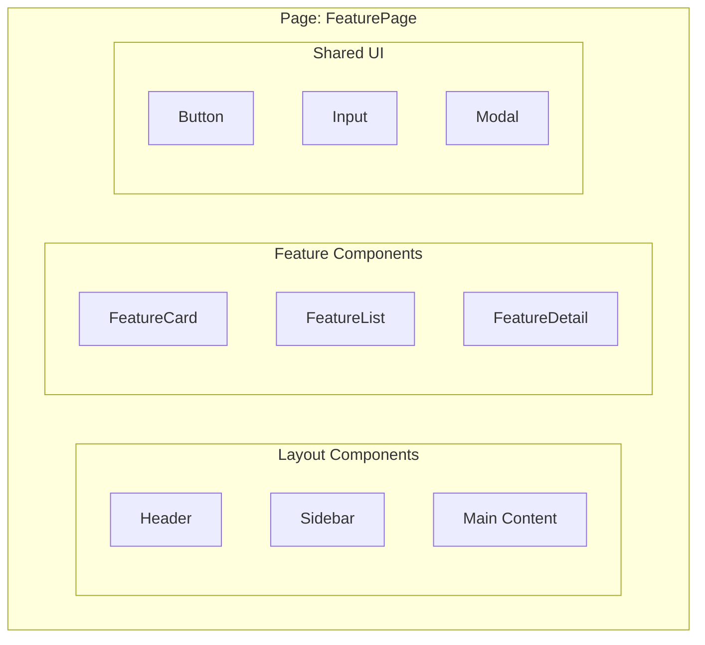
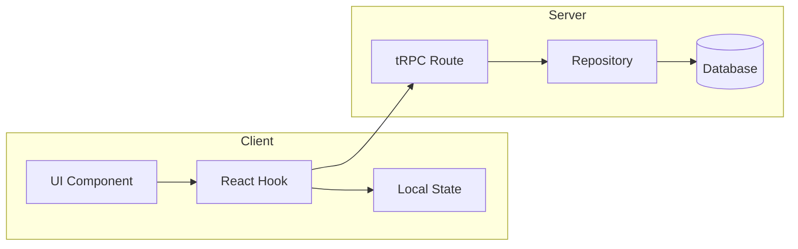

# UX Product Thinking

A structured approach to UI/UX design that aligns interface decisions with product goals. Uses Tavily for competitive research, produces mermaid diagrams for visualization, and integrates with context-keeper for documentation.

## When to Use

- Researching competitors and design inspiration
- Gathering branding colors and guidelines
- Designing a new feature or screen
- Mapping user journeys and flows
- Breaking down UI into components
- Evaluating UX trade-offs
- Documenting interface architecture

## Core Framework: RESEARCH → GOALS → USERS → FLOWS → UI



Work through each layer before moving to the next.

---

## Phase 0: Competitive Research (Tavily)

Before defining goals, research the landscape. Use **Tavily MCP tools** to gather competitive intelligence and design inspiration.

### Research Workflow



### 1. Find Competitors and Similar Products

Use `tavily_search` to discover competitors:

```
tavily_search:
  query: "[your product type] SaaS alternatives 2026"
  max_results: 10
  search_depth: "advanced"
```

**Search queries to try:**
- `"[product category] best tools comparison"`
- `"[product category] landing page examples"`
- `"[competitor name] design system"`
- `"[industry] SaaS UI trends 2026"`

### 2. Extract Branding & Design from Competitor Sites

Use `tavily_extract` to pull content from competitor pages:

```
tavily_extract:
  urls: ["https://competitor.com", "https://competitor.com/about"]
  extract_depth: "advanced"
  include_images: true
  query: "branding colors design style"
```

**Pages to extract:**
- Landing/home page (hero messaging, CTA style)
- Pricing page (tier structure, feature presentation)
- About page (brand voice, values)
- Product screenshots (UI patterns)

### 3. Explore Site Structure

Use `tavily_crawl` to understand information architecture:

```
tavily_crawl:
  url: "https://competitor.com"
  max_depth: 2
  instructions: "Find navigation structure, key features, and design patterns"
  include_images: true
```

### Research Documentation Template

```markdown
## Competitive Research: [Feature/Product]

### Competitors Analyzed
| Competitor | URL | Strengths | Weaknesses |
|------------|-----|-----------|------------|
| [Name] | [URL] | [What they do well] | [Gaps/opportunities] |

### Branding Patterns Observed
**Color Palettes:**
- Competitor A: Primary #XXXXX, Accent #XXXXX
- Competitor B: Primary #XXXXX, Accent #XXXXX
- **Common trend**: [e.g., "Dark mode with vibrant accents"]

**Typography:**
- Headlines: [Common font styles]
- Body: [Common font choices]

**Visual Style:**
- [e.g., "Minimalist with bold CTAs"]
- [e.g., "Illustration-heavy, friendly tone"]

### UX Patterns Worth Adopting
1. [Pattern]: [Where seen] - [Why it works]
2. [Pattern]: [Where seen] - [Why it works]

### Differentiation Opportunities
- [Gap in market we can fill]
- [Unique angle competitors miss]

### Design Inspiration
| Element | Source | Screenshot/URL | Notes |
|---------|--------|----------------|-------|
| Hero layout | [Competitor] | [URL] | [What to borrow] |
| Pricing cards | [Competitor] | [URL] | [What to borrow] |
```

### Competitive Landscape Diagram



---

## Phase 1: Product Goals Analysis

Before any UI work, clarify what success looks like.

### Goal Mapping Template

```markdown
## Feature: [Name]

### Business Goals
- Primary: [e.g., Increase conversion by 15%]
- Secondary: [e.g., Reduce support tickets]

### Success Metrics
| Metric | Current | Target | How Measured |
|--------|---------|--------|--------------|
| [Metric] | [Value] | [Value] | [Method] |

### Constraints
- Technical: [e.g., Must work offline]
- Business: [e.g., Ship by Q2]
- Design: [e.g., Match existing design system]
```

### Goal Priority Diagram



---

## Phase 2: User Analysis

Understand who uses the feature and what they need.

### User Persona Quick Template

```markdown
## Persona: [Name]

**Role**: [Job title or user type]
**Goal**: [What they're trying to accomplish]
**Pain Points**: 
- [Current frustration 1]
- [Current frustration 2]

**Context**: [When/where they use the product]
**Tech Comfort**: [Low/Medium/High]
```

### User Mental Model Diagram



---

## Phase 3: User Flow Design

Map how users move through the feature.

### Flow Types

1. **Happy Path**: Ideal journey to goal completion
2. **Error Paths**: Recovery from mistakes
3. **Edge Cases**: Unusual but valid scenarios

### User Flow Diagram Template



### Journey Map Template



### State Machine for Complex UI



---

## Phase 4: Component Architecture

Break the UI into logical, reusable parts.

### Component Hierarchy Diagram



### Component Spec Template

```markdown
## Component: [Name]

**Purpose**: [Single responsibility]
**Props**:
| Prop | Type | Required | Description |
|------|------|----------|-------------|
| | | | |

**States**: [idle, loading, error, success]
**Events**: [onClick, onChange, onSubmit]
**Accessibility**: [keyboard nav, aria labels, focus management]
```

### Data Flow Diagram



---

## Phase 5: Wireframe Specification

Text-based wireframe for AI implementation.

### Wireframe Template

```markdown
## Screen: [Name]

### Layout
┌─────────────────────────────────────┐
│ Header: Logo | Nav | User Menu      │
├─────────────────────────────────────┤
│ Sidebar    │ Main Content           │
│ - Nav 1    │ ┌─────────────────┐    │
│ - Nav 2    │ │ Card Component  │    │
│ - Nav 3    │ │ - Title         │    │
│            │ │ - Description   │    │
│            │ │ - Action Button │    │
│            │ └─────────────────┘    │
├─────────────────────────────────────┤
│ Footer: Links | Copyright           │
└─────────────────────────────────────┘

### Responsive Behavior
- Mobile: Sidebar becomes bottom nav
- Tablet: Sidebar collapses to icons
- Desktop: Full sidebar visible

### Interactions
1. [Element]: [Interaction] → [Result]
2. [Element]: [Interaction] → [Result]
```

---

## Integration: Context-Keeper Documentation

After completing UX design work, invoke the context-keeper subagent to document decisions.

### What to Document

1. **Feature overview** with user flow diagram
2. **Component architecture** with hierarchy diagram
3. **Key UX decisions** with rationale
4. **State management** approach

### Example Context Update

```markdown
## Features

### [Feature Name]
**Purpose**: [What problem it solves]
**User Flow**:
\`\`\`mermaid
flowchart TD
    A[Entry Point] --> B[Main Screen]
    B --> C[Action]
    C --> D[Result]
\`\`\`

**Key Components**: 
- `FeatureCard` - displays item summary
- `FeatureDetail` - full item view with actions

**UX Decisions**:
- Chose modal over page navigation for quick edits (reduces context switching)
- Progressive disclosure: advanced options hidden by default
```

### Invoking Context-Keeper

After UX design is complete:

```
Use the context-keeper subagent to update .cursor/context.md with:
1. The feature overview and purpose
2. User flow mermaid diagram
3. Component hierarchy
4. Key UX decisions and rationale
```

---

## Quick Reference: Mermaid Diagram Types

| Diagram | Use For | Syntax Start |
|---------|---------|--------------|
| Flowchart | User flows, decision trees | `flowchart TD` |
| Sequence | API interactions, multi-step processes | `sequenceDiagram` |
| State | UI states, component lifecycle | `stateDiagram-v2` |
| Journey | User experience mapping | `journey` |
| Mindmap | Mental models, feature exploration | `mindmap` |
| ER | Data relationships | `erDiagram` |
| Quadrant | Priority matrices | `quadrantChart` |

---

## Workflow Checklist

Copy and track progress:

```
UX Product Thinking Progress:
- [ ] Phase 0: Competitive research with Tavily (optional but recommended)
- [ ] Phase 1: Define product goals and success metrics
- [ ] Phase 2: Analyze users and their needs
- [ ] Phase 3: Design user flows (mermaid diagrams)
- [ ] Phase 4: Plan component architecture
- [ ] Phase 5: Create wireframe specifications
- [ ] Document: Update context.md via context-keeper
```

---

## Tavily MCP Quick Reference

| Tool | Use For | Key Parameters |
|------|---------|----------------|
| `tavily_search` | Find competitors, trends, inspiration | `query`, `max_results`, `search_depth` |
| `tavily_extract` | Pull content from specific URLs | `urls`, `include_images`, `extract_depth` |
| `tavily_crawl` | Explore site structure | `url`, `max_depth`, `instructions` |

---

## Additional Resources

For extended examples and templates, see:
- [mermaid-templates.md](mermaid-templates.md) - Copy-paste diagram templates
- [examples.md](examples.md) - Complete feature design examples
- [competitive-research.md](competitive-research.md) - Tavily research examples and queries
