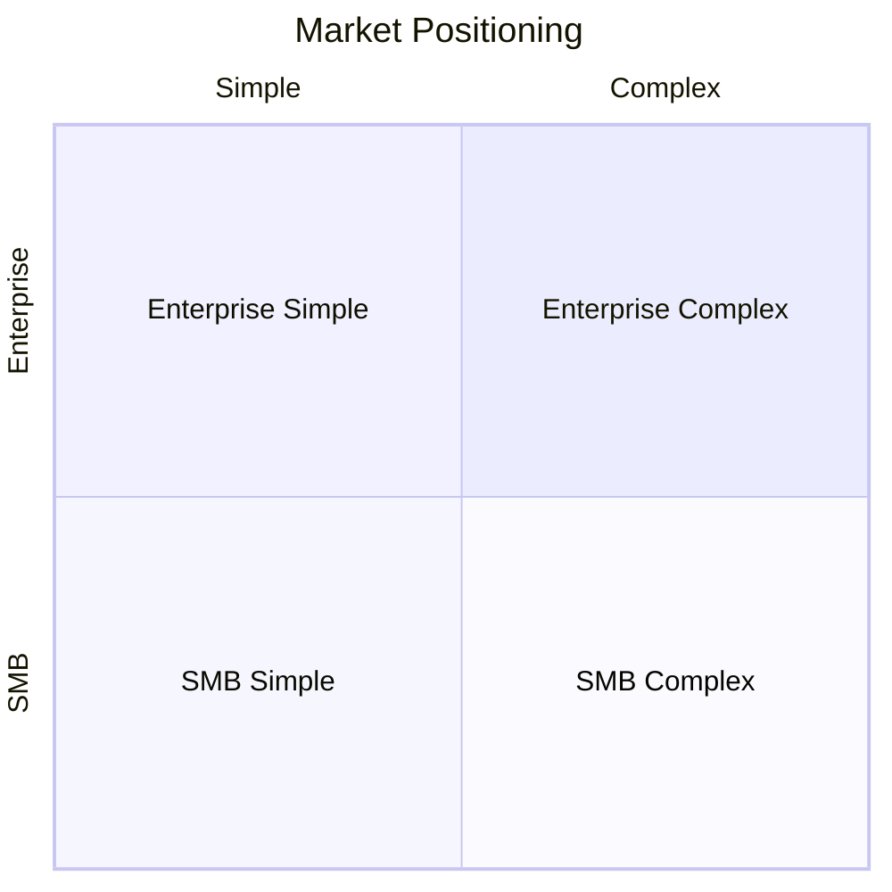
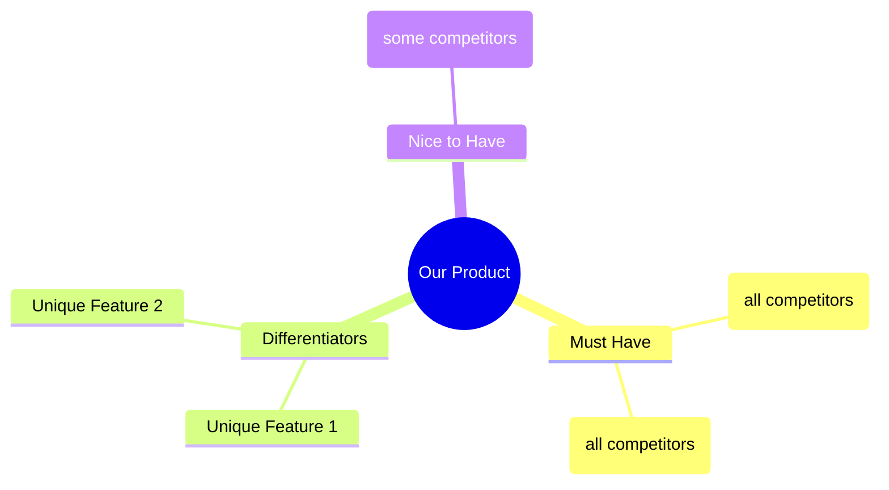
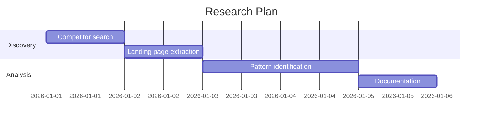

# Competitive Research with Tavily

Detailed examples and query templates for using Tavily MCP tools in UX research.

---

## Research Types

### 1. Direct Competitor Analysis

Find and analyze products in your space.

**Search for competitors:**
```
tavily_search:
  query: "best [product category] tools 2026 comparison"
  max_results: 10
  search_depth: "advanced"
  time_range: "year"
```

**Extract competitor landing pages:**
```
tavily_extract:
  urls: [
    "https://competitor1.com",
    "https://competitor2.com",
    "https://competitor3.com"
  ]
  extract_depth: "advanced"
  include_images: true
  query: "features pricing value proposition"
```

---

### 2. Branding & Color Research

Gather visual design inspiration.

**Search for brand guidelines:**
```
tavily_search:
  query: "[competitor name] brand guidelines design system"
  max_results: 5
  search_depth: "advanced"
  include_images: true
```

**Search for color trends:**
```
tavily_search:
  query: "SaaS website color trends 2026 dark mode"
  max_results: 10
  include_images: true
  include_image_descriptions: true
```

**Extract design system pages:**
```
tavily_extract:
  urls: [
    "https://company.com/design",
    "https://company.com/brand"
  ]
  include_images: true
  query: "colors typography spacing brand"
```

---

### 3. UX Pattern Research

Understand how others solve similar problems.

**Search for specific UI patterns:**
```
tavily_search:
  query: "[feature type] UX best practices examples"
  max_results: 10
  search_depth: "advanced"
```

Example queries:
- `"onboarding flow SaaS best practices 2026"`
- `"pricing page design patterns high conversion"`
- `"dashboard layout UX examples"`
- `"settings page information architecture"`
- `"empty states design examples"`

**Search for case studies:**
```
tavily_search:
  query: "[company name] redesign case study UX"
  max_results: 5
  search_depth: "advanced"
```

---

### 4. Industry Trends Research

Stay current with design and product trends.

**Search for trends:**
```
tavily_search:
  query: "[industry] SaaS UI trends 2026"
  max_results: 10
  time_range: "month"
  topic: "general"
```

**Search design publications:**
```
tavily_search:
  query: "site:uxdesign.cc OR site:smashingmagazine.com [topic]"
  max_results: 10
  search_depth: "advanced"
```

---

## Query Templates by Goal

### Finding Landing Page Inspiration

```
tavily_search:
  query: "best SaaS landing pages 2026 examples"
  max_results: 10
  include_images: true

tavily_search:
  query: "[industry] startup landing page design"
  max_results: 10
  include_images: true
```

### Pricing Page Research

```
tavily_search:
  query: "SaaS pricing page examples high conversion"
  max_results: 10
  include_images: true

tavily_extract:
  urls: ["https://competitor.com/pricing"]
  query: "pricing tiers features included"
  include_images: true
```

### Onboarding Flow Research

```
tavily_search:
  query: "SaaS onboarding best practices reduce churn"
  max_results: 10
  search_depth: "advanced"

tavily_crawl:
  url: "https://competitor.com"
  instructions: "Find signup flow, onboarding steps, first-time user experience"
  max_depth: 2
```

### Dashboard Design Research

```
tavily_search:
  query: "analytics dashboard design examples [industry]"
  max_results: 10
  include_images: true

tavily_search:
  query: "admin panel UI design modern"
  max_results: 10
  include_images: true
```

### Mobile Responsive Research

```
tavily_search:
  query: "mobile-first SaaS design responsive patterns"
  max_results: 10
  include_images: true
```

---

## Site Structure Analysis

Use `tavily_crawl` to understand competitor information architecture.

**Crawl navigation structure:**
```
tavily_crawl:
  url: "https://competitor.com"
  max_depth: 2
  max_breadth: 10
  instructions: "Map main navigation, feature pages, and content hierarchy"
```

**Crawl documentation:**
```
tavily_crawl:
  url: "https://competitor.com/docs"
  max_depth: 3
  select_paths: ["/docs/.*"]
  instructions: "Understand documentation structure and categories"
```

**Crawl blog for content strategy:**
```
tavily_crawl:
  url: "https://competitor.com/blog"
  max_depth: 2
  select_paths: ["/blog/.*"]
  instructions: "Identify content themes, categories, and post frequency"
```

---

## Research Output Templates

### Competitor Comparison Matrix

```markdown
## Competitor Analysis: [Product Category]

| Feature | Us | Competitor A | Competitor B | Competitor C |
|---------|----|--------------|--------------|--------------| 
| [Feature 1] | ❓ | ✅ | ✅ | ❌ |
| [Feature 2] | ❓ | ✅ | ❌ | ✅ |
| [Feature 3] | ❓ | ❌ | ✅ | ✅ |

### Positioning
- **Competitor A**: [Positioning/target market]
- **Competitor B**: [Positioning/target market]
- **Our opportunity**: [Gap to fill]
```

### Branding Research Summary

```markdown
## Branding Research: [Date]

### Color Analysis
| Competitor | Primary | Secondary | Accent | Background |
|------------|---------|-----------|--------|------------|
| [Name] | #XXXXXX | #XXXXXX | #XXXXXX | #XXXXXX |

### Typography Patterns
| Usage | Common Choices |
|-------|----------------|
| Headlines | Inter, Satoshi, Cal Sans |
| Body | Inter, System fonts |
| Code | JetBrains Mono, Fira Code |

### Visual Trends Observed
1. [Trend]: [Examples]
2. [Trend]: [Examples]

### Recommended Direction
Based on research, recommend:
- Primary color: [Color + reasoning]
- Typography: [Font + reasoning]
- Visual style: [Style + reasoning]
```

### UX Pattern Library

```markdown
## UX Patterns: [Feature Area]

### Pattern 1: [Name]
**Seen at**: [Competitors using it]
**How it works**: [Description]
**Why it works**: [UX reasoning]
**Consider for**: [Our use case]

### Pattern 2: [Name]
...
```

---

## Combining with Mermaid Documentation

After research, visualize findings:

### Competitive Landscape



### Feature Gap Analysis



### Research Timeline



---

## Tips for Effective Research

1. **Start broad, then narrow** - Use search first, then extract specific pages
2. **Include images** - Visual patterns are as important as text content
3. **Use advanced depth** - Gets more complete content from complex pages
4. **Document as you go** - Capture insights immediately, don't rely on memory
5. **Look beyond direct competitors** - Adjacent industries often have better patterns
6. **Check multiple sources** - One competitor's approach isn't the industry standard
7. **Note what doesn't work** - Anti-patterns are as valuable as good patterns
