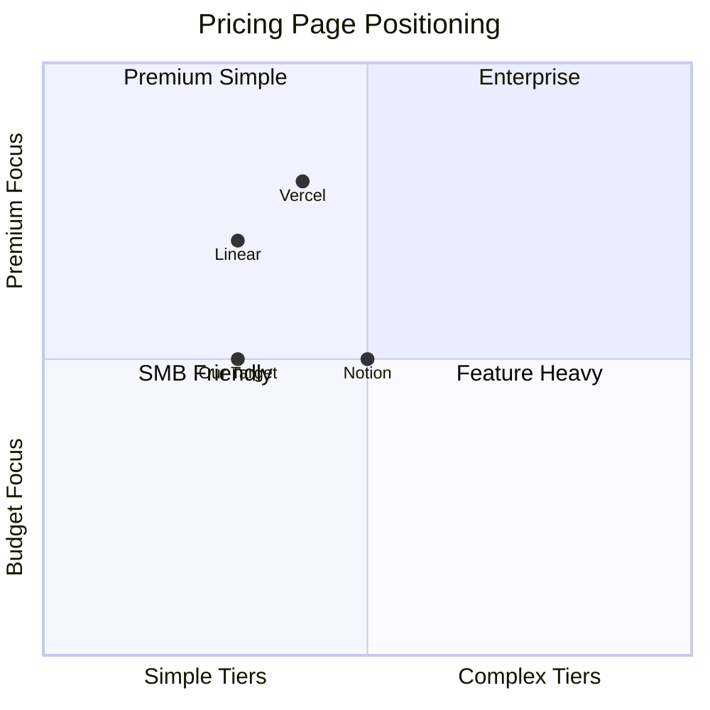
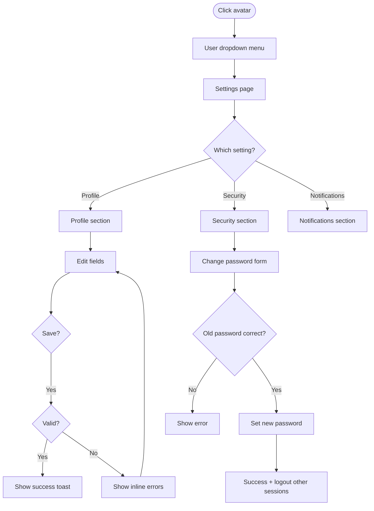
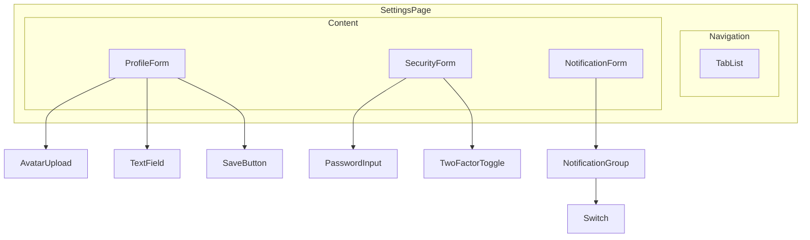
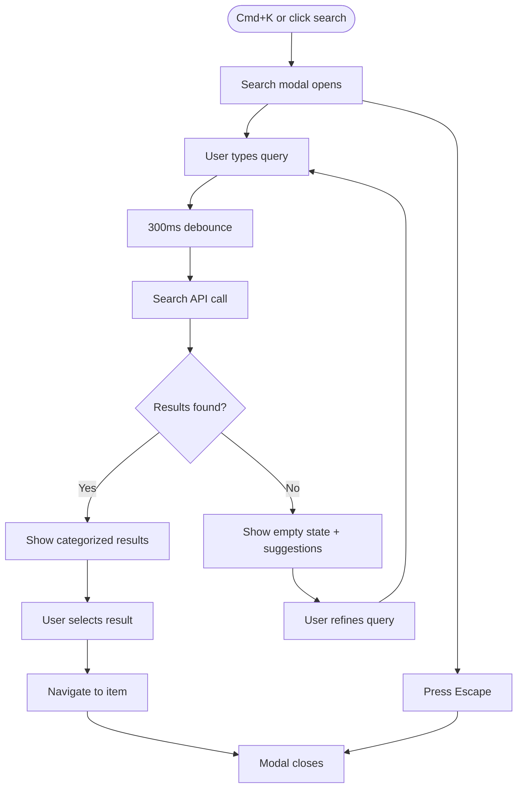
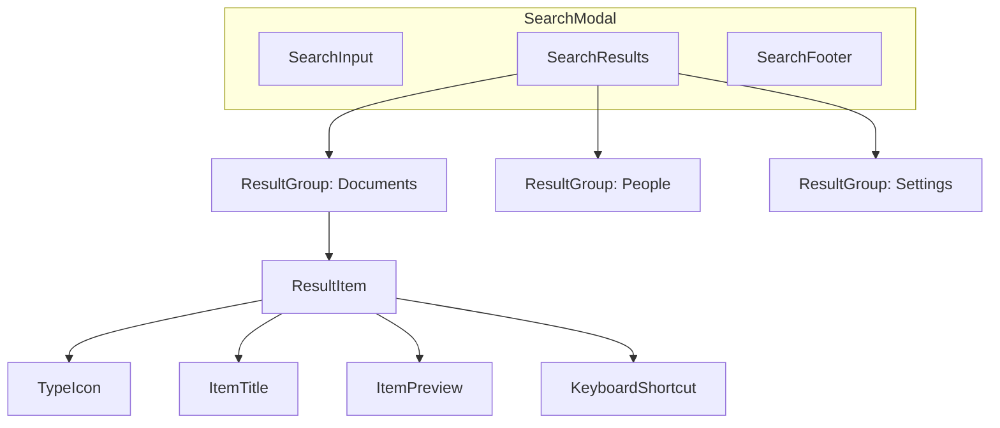
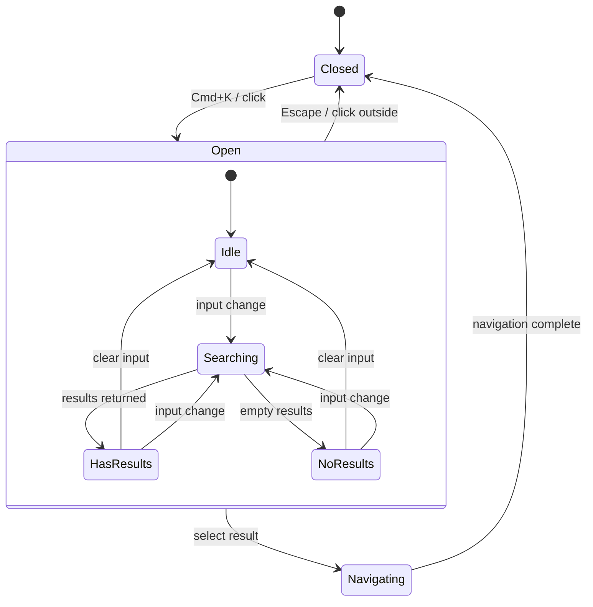
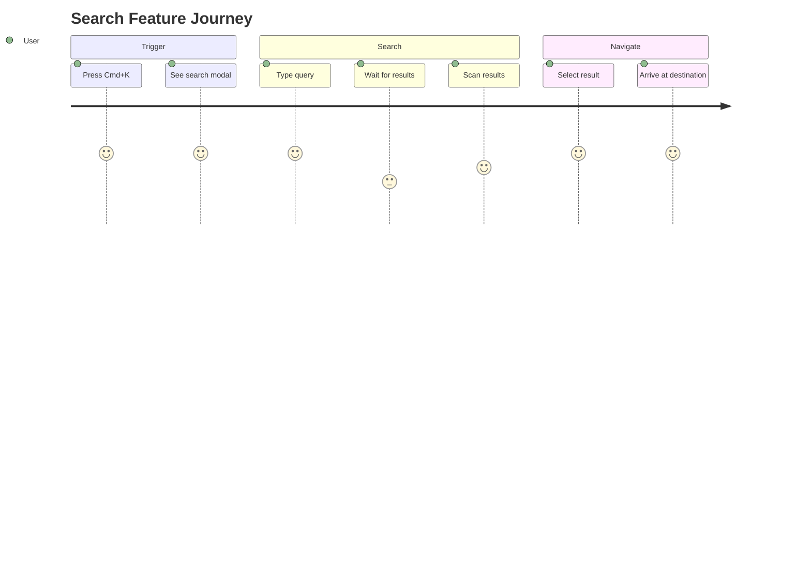
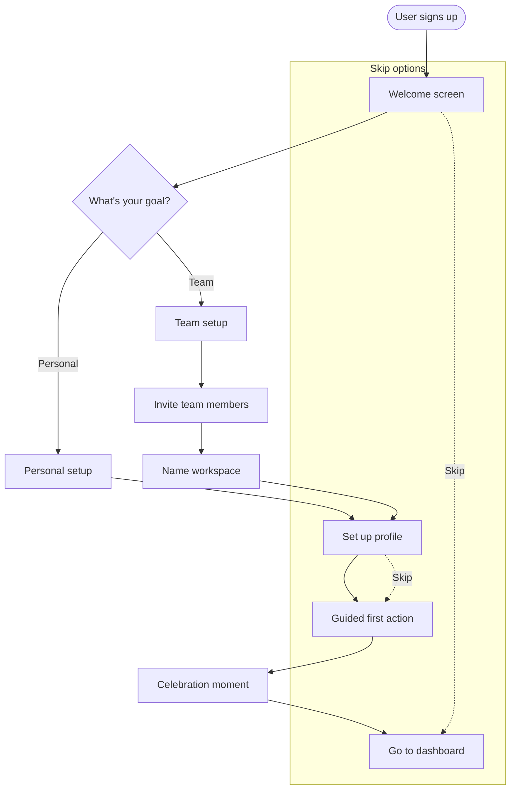

# UX Product Thinking Examples

Complete examples of the UX product thinking process applied to real features.

---

## Example 0: Competitive Research (Pricing Page Redesign)

Before redesigning a pricing page, research how competitors handle it.

### Tavily Research Commands

**Step 1: Find competitor pricing pages**
```
tavily_search:
  query: "SaaS pricing page examples high conversion 2026"
  max_results: 10
  search_depth: "advanced"
  include_images: true
```

**Step 2: Extract specific competitors**
```
tavily_extract:
  urls: [
    "https://linear.app/pricing",
    "https://notion.so/pricing", 
    "https://vercel.com/pricing"
  ]
  extract_depth: "advanced"
  include_images: true
  query: "pricing tiers features comparison annual monthly"
```

**Step 3: Search for best practices**
```
tavily_search:
  query: "pricing page UX psychology conversion optimization"
  max_results: 10
  search_depth: "advanced"
```

### Research Findings Template

```markdown
## Competitive Research: Pricing Page

### Competitors Analyzed
| Competitor | Tiers | Highlight Tier | Free Tier | Annual Discount |
|------------|-------|----------------|-----------|-----------------|
| Linear | 3 | Pro (middle) | Yes | 20% |
| Notion | 4 | Plus (middle) | Yes | ~17% |
| Vercel | 3 | Pro (middle) | Yes | 2 months free |

### Branding Patterns
**Color usage on pricing:**
- Linear: Minimal, purple accents on recommended tier
- Notion: Clean white, subtle shadows, brand orange for CTAs
- Vercel: Dark mode, gradient borders on featured tier

**Common patterns:**
- Middle tier highlighted (recommended)
- Feature comparison table below tiers
- FAQ section at bottom
- Toggle for monthly/annual
- "Contact sales" for enterprise

### UX Patterns to Adopt
1. **Highlighted recommended tier**: All competitors use visual distinction
2. **Feature checkmarks**: Clear ✓/✗ for quick scanning
3. **Annual savings callout**: Show dollar amount saved, not just %
4. **Sticky CTA on mobile**: Pricing summary stays visible on scroll

### Differentiation Opportunities
- Most competitors bury feature limits in fine print → Be transparent upfront
- Few show "cost per user" math → Add calculator for team pricing
- Limited social proof on pricing pages → Add customer logos/quotes
```

### Mermaid: Competitive Positioning



This research then feeds into Phase 1 (Product Goals) where you define what success looks like for your pricing page based on competitive gaps identified.

---

## Example 1: User Settings Feature

### Phase 1: Product Goals

```markdown
## Feature: User Settings

### Business Goals
- Primary: Reduce support tickets related to account issues by 30%
- Secondary: Increase user profile completion rate

### Success Metrics
| Metric | Current | Target | How Measured |
|--------|---------|--------|--------------|
| Support tickets (account) | 50/week | 35/week | Zendesk |
| Profile completion | 40% | 70% | Analytics |
| Settings page bounce rate | 60% | 30% | PostHog |

### Constraints
- Technical: Must support email change with verification
- Business: Launch within 2 sprints
- Design: Use existing component library
```

### Phase 2: User Analysis

```markdown
## Persona: Alex - Power User

**Role**: Team lead using the product daily
**Goal**: Quickly update account preferences without leaving workflow
**Pain Points**: 
- Can't find settings easily
- Password change requires contacting support
- No way to manage notification preferences

**Context**: Uses product on desktop during work hours
**Tech Comfort**: High
```

### Phase 3: User Flow



### Phase 4: Component Architecture



### Phase 5: Wireframe Spec

```markdown
## Screen: Settings Page

### Layout
┌─────────────────────────────────────────┐
│ ← Back to Dashboard    User Settings    │
├─────────────────────────────────────────┤
│ [Profile] [Security] [Notifications]    │
├─────────────────────────────────────────┤
│  ┌──────┐                               │
│  │Avatar│  Name: [_______________]      │
│  │Upload│  Email: [_______________]     │
│  └──────┘  Bio: [________________]      │
│                  [________________]      │
│                                         │
│            [Cancel]  [Save Changes]     │
└─────────────────────────────────────────┘

### Responsive Behavior
- Mobile: Tabs become dropdown selector
- Tablet: Same as desktop but narrower form
- Desktop: Full-width with comfortable spacing

### Interactions
1. Tab click: Switch to selected section with fade transition
2. Form field: Inline validation on blur
3. Save button: Disabled until changes made, shows loading state
4. Avatar: Click opens file picker, shows preview before save
```

### Context-Keeper Documentation

```markdown
## Features

### User Settings
**Purpose**: Allow users to manage profile, security, and notification preferences

**User Flow**:
\`\`\`mermaid
flowchart LR
    Avatar --> Menu --> Settings --> Tabs --> Forms --> Save
\`\`\`

**Key Components**:
- `SettingsPage` - Container with tab navigation
- `ProfileForm` - Name, email, bio, avatar upload
- `SecurityForm` - Password change, 2FA toggle
- `NotificationForm` - Email/push notification preferences

**Files**: `app/routes/settings.tsx`, `app/components/settings/`

**UX Decisions**:
- Used tabs over accordion (faster access to any section)
- Inline validation (immediate feedback, fewer form errors)
- Confirmation dialog for email change (prevent accidental lockout)
```

---

## Example 2: Search Feature

### Phase 1: Product Goals

```markdown
## Feature: Global Search

### Business Goals
- Primary: Increase feature discoverability (reduce "I didn't know that existed")
- Secondary: Reduce time to find content by 50%

### Success Metrics
| Metric | Current | Target | How Measured |
|--------|---------|--------|--------------|
| Avg searches/user/day | 0.5 | 2 | Analytics |
| Search success rate | N/A | 80% | Click after search |
| Time to find item | 45s | 20s | Session recording |
```

### Phase 2: User Analysis

```markdown
## Persona: Jordan - New User

**Role**: Recently onboarded team member
**Goal**: Find specific documents or features quickly
**Pain Points**: 
- Doesn't know where things are located
- Navigation hierarchy is deep
- Different content types in different places

**Context**: Uses product across mobile and desktop
**Tech Comfort**: Medium
```

### Phase 3: User Flow



### Phase 4: Component Architecture



### State Machine



### Journey Map



---

## Example 3: Onboarding Flow

### Phase 1: Product Goals

```markdown
## Feature: User Onboarding

### Business Goals
- Primary: Increase Day 7 retention from 30% to 50%
- Secondary: Reduce time to first value (first meaningful action)

### Success Metrics
| Metric | Current | Target | How Measured |
|--------|---------|--------|--------------|
| Onboarding completion | 45% | 80% | Analytics |
| Time to first value | 15 min | 5 min | Analytics |
| Day 7 retention | 30% | 50% | Cohort analysis |
```

### Phase 3: User Flow



### Wireframe Spec

```markdown
## Screen: Onboarding - Welcome

### Layout
┌─────────────────────────────────────────┐
│                                         │
│           Welcome to [Product]          │
│                                         │
│        What brings you here today?      │
│                                         │
│   ┌─────────────────────────────────┐   │
│   │  🏠  Personal projects          │   │
│   │      Organize my own work       │   │
│   └─────────────────────────────────┘   │
│                                         │
│   ┌─────────────────────────────────┐   │
│   │  👥  Team collaboration         │   │
│   │      Work with my team          │   │
│   └─────────────────────────────────┘   │
│                                         │
│               [Skip for now]            │
│                                         │
│            Step 1 of 4  ●○○○            │
└─────────────────────────────────────────┘

### Interactions
1. Card hover: Subtle lift effect
2. Card click: Animate to next step
3. Skip link: Go directly to dashboard with reminder tooltip
4. Progress dots: Show current position, not clickable
```

---

## Using These Examples

When applying UX product thinking to your feature:

1. **Copy the relevant template sections** from the examples
2. **Customize for your specific feature** and users
3. **Create mermaid diagrams** appropriate to your feature's complexity
4. **Document in context.md** via context-keeper subagent

Remember: Not every feature needs all phases. Simple features may skip Phase 2 (user analysis) if users are well understood. Focus your effort where complexity and risk are highest.
