# Mermaid Diagram Templates

Copy-paste templates for common UX documentation needs.

---

## User Flow Templates

### Basic Linear Flow

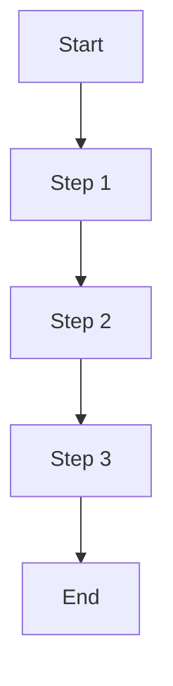
```mermaid
flowchart TD
    A[Start] --> B[Step 1]
    B --> C[Step 2]
    C --> D[Step 3]
    D --> E[End]
```

### Flow with Decision Points

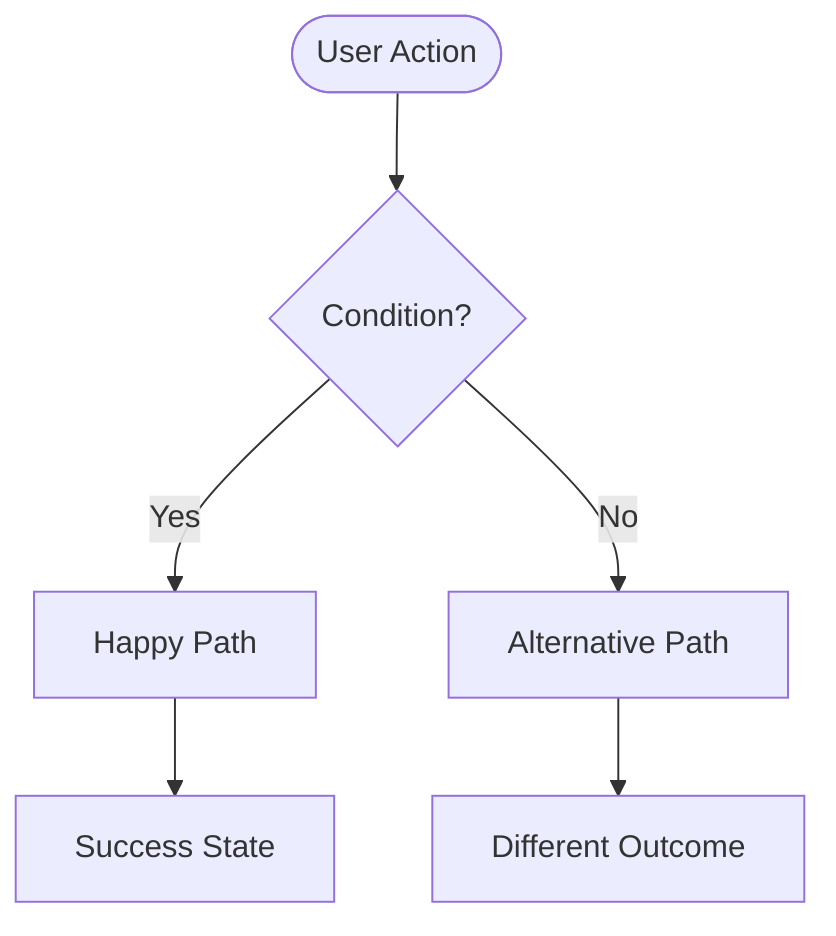
```mermaid
flowchart TD
    Start([User Action]) --> Check{Condition?}
    Check -->|Yes| PathA[Happy Path]
    Check -->|No| PathB[Alternative Path]
    PathA --> Result1[Success State]
    PathB --> Result2[Different Outcome]
```

### Flow with Error Handling

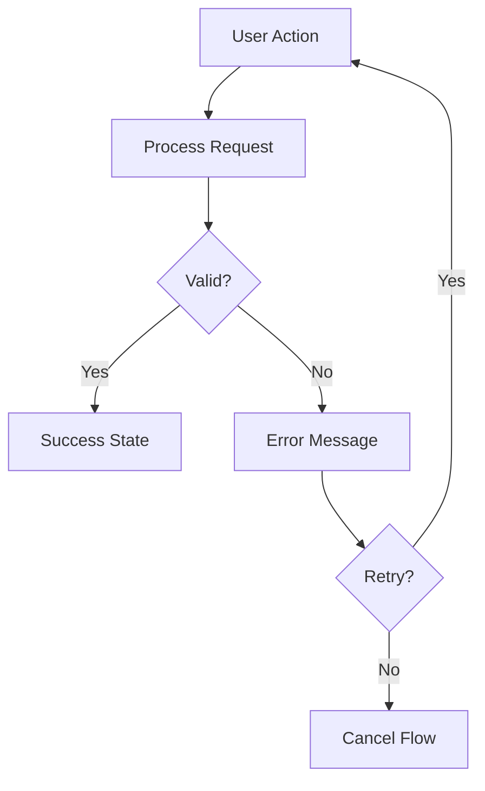
```mermaid
flowchart TD
    Action[User Action] --> Process[Process Request]
    Process --> Valid{Valid?}
    Valid -->|Yes| Success[Success State]
    Valid -->|No| Error[Error Message]
    Error --> Retry{Retry?}
    Retry -->|Yes| Action
    Retry -->|No| Cancel[Cancel Flow]
```

### Multi-Path Flow

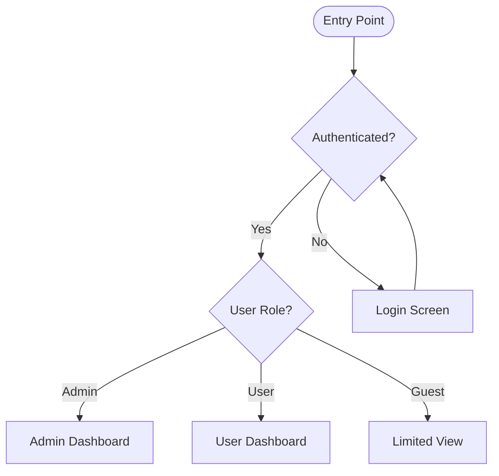
```mermaid
flowchart TD
    Entry([Entry Point]) --> Auth{Authenticated?}
    Auth -->|Yes| Role{User Role?}
    Auth -->|No| Login[Login Screen]
    Login --> Auth
    Role -->|Admin| AdminDash[Admin Dashboard]
    Role -->|User| UserDash[User Dashboard]
    Role -->|Guest| GuestView[Limited View]
```

---

## Journey Map Templates

### Simple Journey

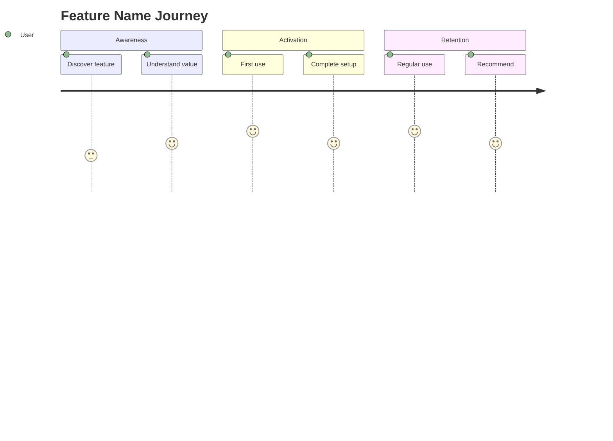
```mermaid
journey
    title Feature Name Journey
    section Awareness
      Discover feature: 3: User
      Understand value: 4: User
    section Activation  
      First use: 5: User
      Complete setup: 4: User
    section Retention
      Regular use: 5: User
      Recommend: 4: User
```

### Detailed Journey with Pain Points

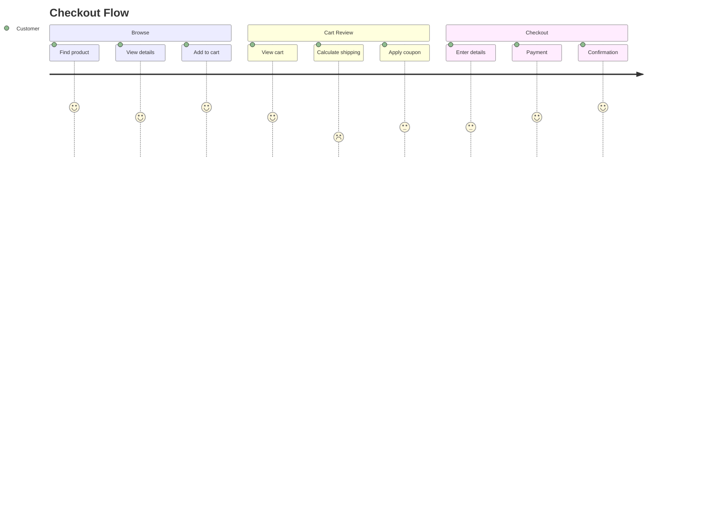
```mermaid
journey
    title Checkout Flow
    section Browse
      Find product: 5: Customer
      View details: 4: Customer
      Add to cart: 5: Customer
    section Cart Review
      View cart: 4: Customer
      Calculate shipping: 2: Customer
      Apply coupon: 3: Customer
    section Checkout
      Enter details: 3: Customer
      Payment: 4: Customer
      Confirmation: 5: Customer
```

---

## State Machine Templates

### Basic UI States

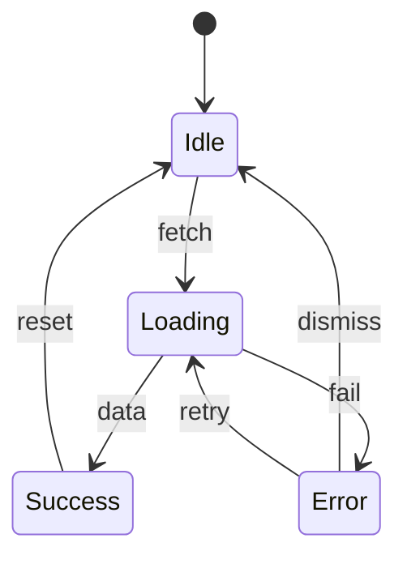
```mermaid
stateDiagram-v2
    [*] --> Idle
    Idle --> Loading: fetch
    Loading --> Success: data
    Loading --> Error: fail
    Success --> Idle: reset
    Error --> Idle: dismiss
    Error --> Loading: retry
```

### Form States

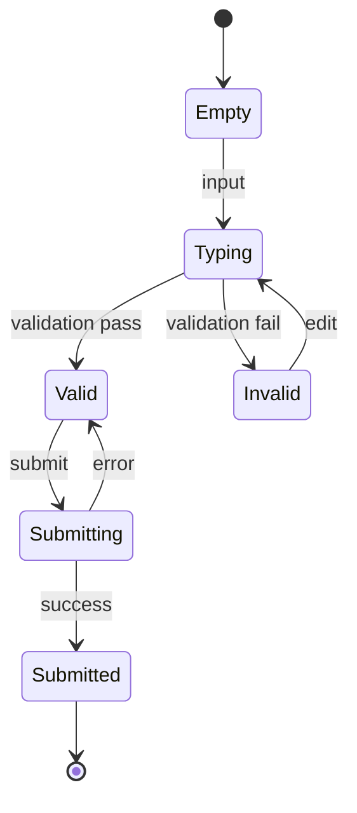
```mermaid
stateDiagram-v2
    [*] --> Empty
    Empty --> Typing: input
    Typing --> Valid: validation pass
    Typing --> Invalid: validation fail
    Invalid --> Typing: edit
    Valid --> Submitting: submit
    Submitting --> Submitted: success
    Submitting --> Valid: error
    Submitted --> [*]
```

### Modal States

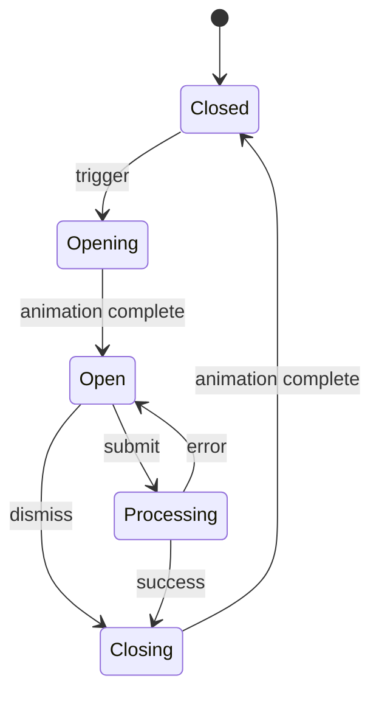
```mermaid
stateDiagram-v2
    [*] --> Closed
    Closed --> Opening: trigger
    Opening --> Open: animation complete
    Open --> Closing: dismiss
    Closing --> Closed: animation complete
    Open --> Processing: submit
    Processing --> Open: error
    Processing --> Closing: success
```

---

## Component Hierarchy Templates

### Page Layout

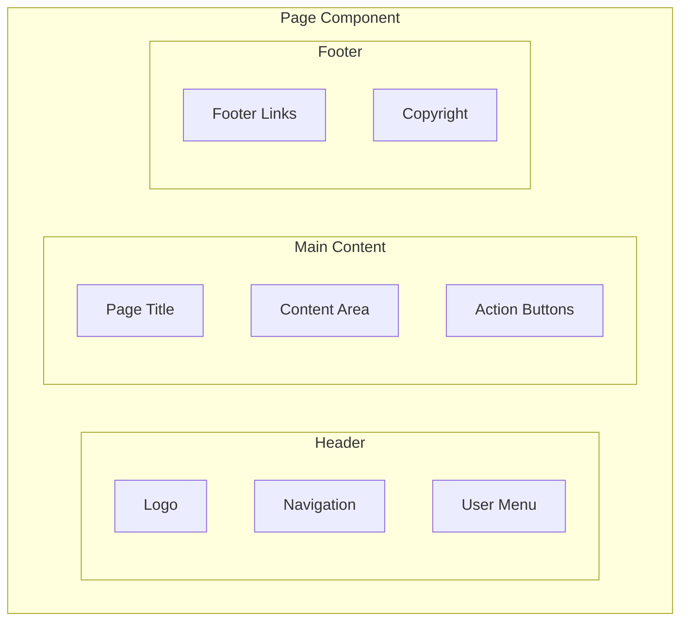
```mermaid
flowchart TD
    subgraph Page["Page Component"]
        subgraph Header["Header"]
            Logo[Logo]
            Nav[Navigation]
            UserMenu[User Menu]
        end
        subgraph Main["Main Content"]
            Title[Page Title]
            Content[Content Area]
            Actions[Action Buttons]
        end
        subgraph Footer["Footer"]
            Links[Footer Links]
            Copyright[Copyright]
        end
    end
```

### Feature Component Tree

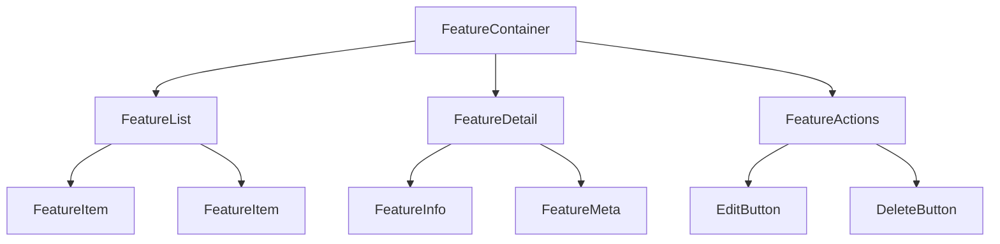
```mermaid
flowchart TD
    Feature[FeatureContainer]
    Feature --> List[FeatureList]
    Feature --> Detail[FeatureDetail]
    Feature --> Actions[FeatureActions]
    
    List --> Item1[FeatureItem]
    List --> Item2[FeatureItem]
    
    Detail --> Info[FeatureInfo]
    Detail --> Meta[FeatureMeta]
    
    Actions --> Edit[EditButton]
    Actions --> Delete[DeleteButton]
```

### Data Flow

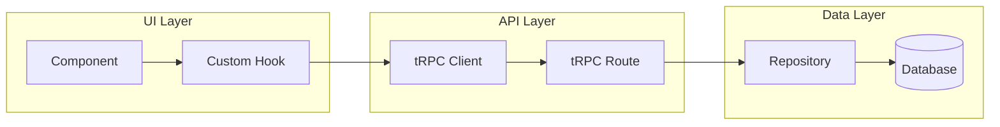
```mermaid
flowchart LR
    subgraph UI["UI Layer"]
        Component[Component]
        Hook[Custom Hook]
    end
    
    subgraph API["API Layer"]
        tRPC[tRPC Client]
        Route[tRPC Route]
    end
    
    subgraph Data["Data Layer"]
        Repo[Repository]
        DB[(Database)]
    end
    
    Component --> Hook
    Hook --> tRPC
    tRPC --> Route
    Route --> Repo
    Repo --> DB
```

---

## Sequence Diagram Templates

### API Request Flow

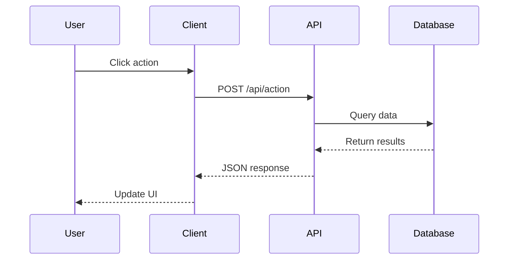
```mermaid
sequenceDiagram
    participant U as User
    participant C as Client
    participant A as API
    participant D as Database
    
    U->>C: Click action
    C->>A: POST /api/action
    A->>D: Query data
    D-->>A: Return results
    A-->>C: JSON response
    C-->>U: Update UI
```

### Authentication Flow

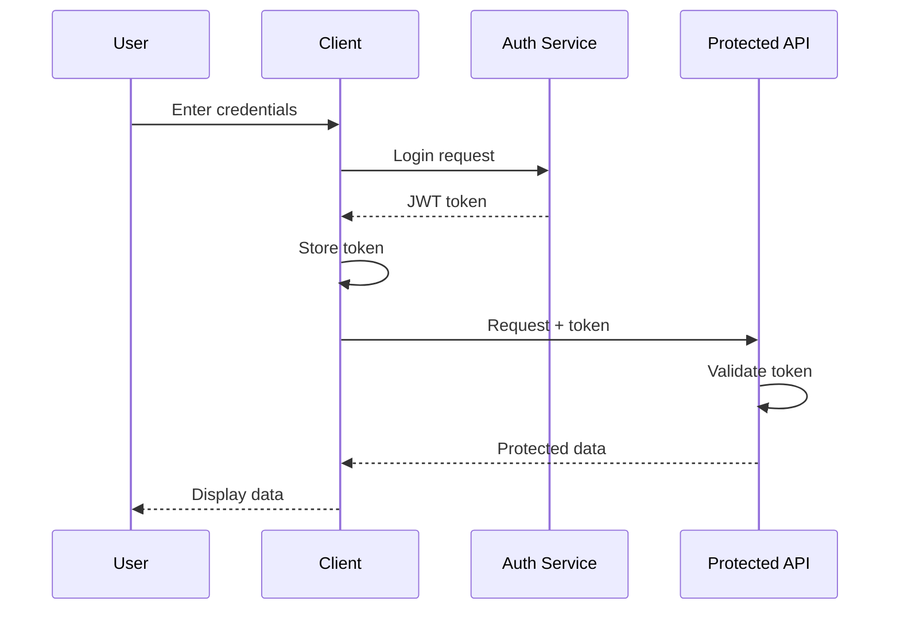
```mermaid
sequenceDiagram
    participant U as User
    participant C as Client
    participant Auth as Auth Service
    participant API as Protected API
    
    U->>C: Enter credentials
    C->>Auth: Login request
    Auth-->>C: JWT token
    C->>C: Store token
    C->>API: Request + token
    API->>API: Validate token
    API-->>C: Protected data
    C-->>U: Display data
```

### Real-time Updates

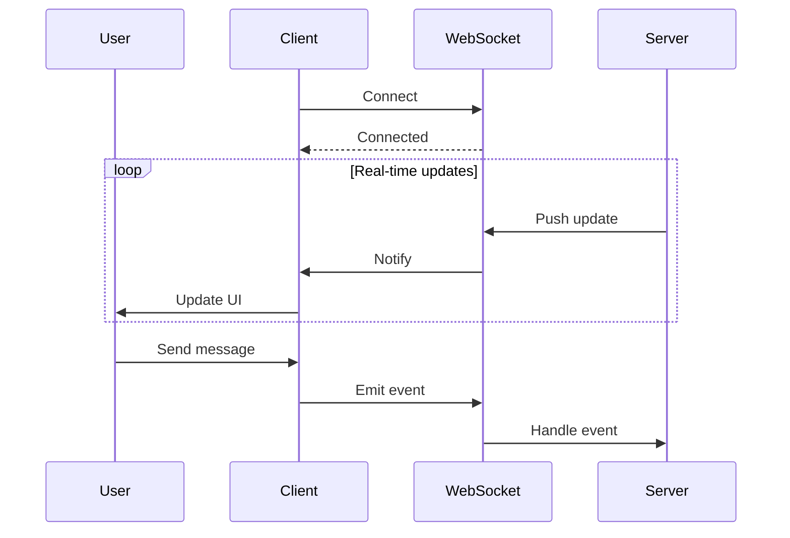
```mermaid
sequenceDiagram
    participant U as User
    participant C as Client
    participant WS as WebSocket
    participant S as Server
    
    C->>WS: Connect
    WS-->>C: Connected
    
    loop Real-time updates
        S->>WS: Push update
        WS->>C: Notify
        C->>U: Update UI
    end
    
    U->>C: Send message
    C->>WS: Emit event
    WS->>S: Handle event
```

---

## Entity Relationship Templates

### Basic Relationships

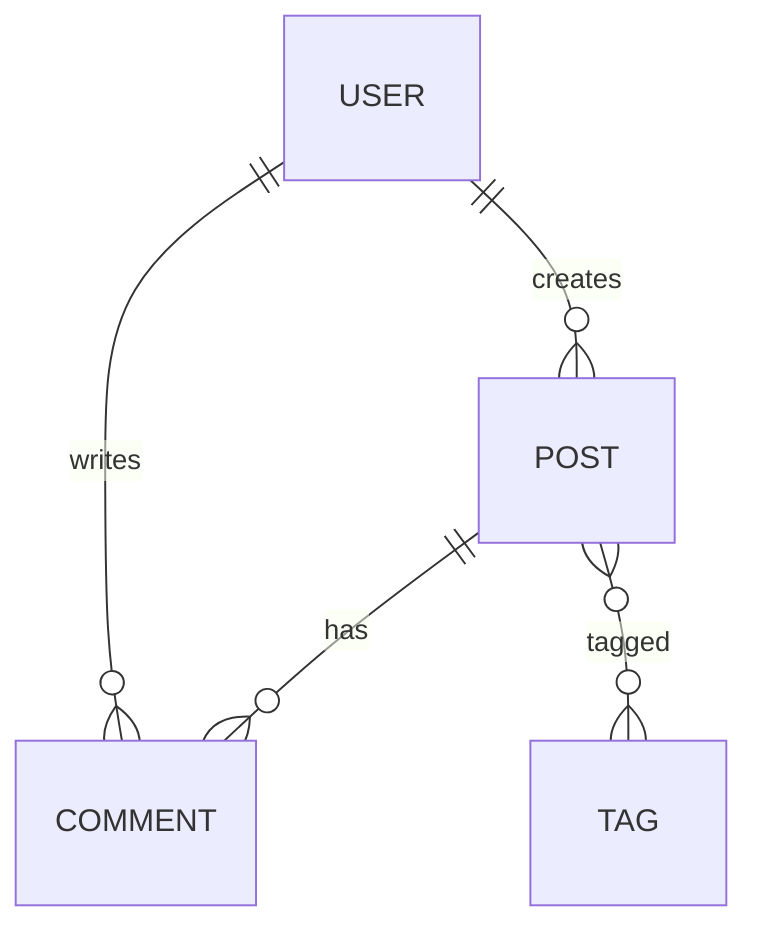
```mermaid
erDiagram
    USER ||--o{ POST : creates
    USER ||--o{ COMMENT : writes
    POST ||--o{ COMMENT : has
    POST }o--o{ TAG : tagged
```

### Detailed Schema

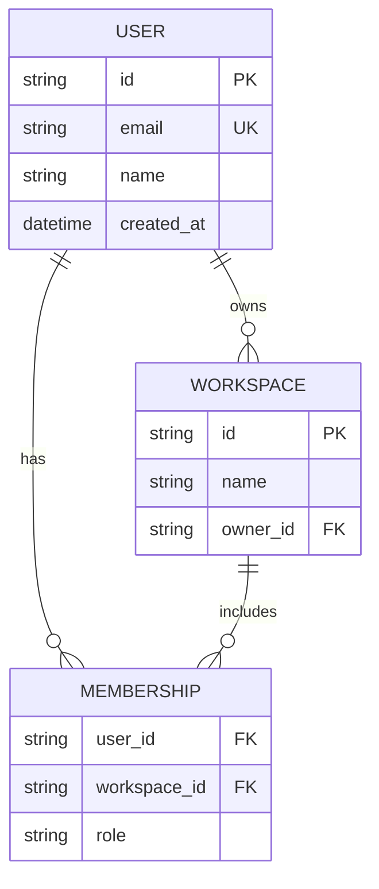
```mermaid
erDiagram
    USER {
        string id PK
        string email UK
        string name
        datetime created_at
    }
    
    WORKSPACE {
        string id PK
        string name
        string owner_id FK
    }
    
    MEMBERSHIP {
        string user_id FK
        string workspace_id FK
        string role
    }
    
    USER ||--o{ WORKSPACE : owns
    USER ||--o{ MEMBERSHIP : has
    WORKSPACE ||--o{ MEMBERSHIP : includes
```

---

## Priority & Planning Templates

### Feature Priority Quadrant

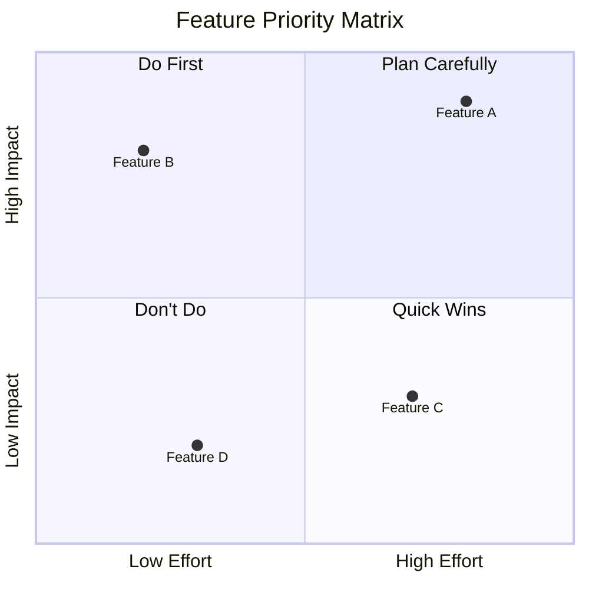
```mermaid
quadrantChart
    title Feature Priority Matrix
    x-axis Low Effort --> High Effort
    y-axis Low Impact --> High Impact
    quadrant-1 Plan Carefully
    quadrant-2 Do First
    quadrant-3 Don't Do
    quadrant-4 Quick Wins
    Feature A: [0.8, 0.9]
    Feature B: [0.2, 0.8]
    Feature C: [0.7, 0.3]
    Feature D: [0.3, 0.2]
```

### Mental Model

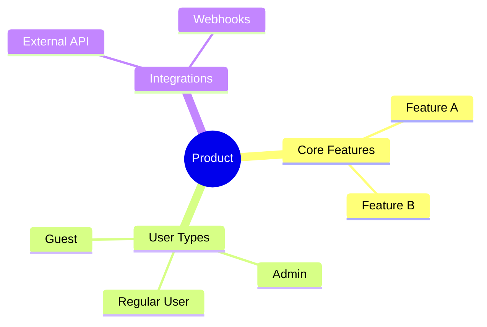
```mermaid
mindmap
    root((Product))
        Core Features
            Feature A
            Feature B
        User Types
            Admin
            Regular User
            Guest
        Integrations
            External API
            Webhooks
```

---

## Tips for Effective Diagrams

1. **Keep it simple** - Diagrams should clarify, not complicate
2. **Use consistent naming** - Match names to actual code/UI elements
3. **Show the happy path first** - Then add error/edge cases
4. **Group related elements** - Use subgraphs for visual organization
5. **Add descriptive labels** - Make arrows self-explanatory
