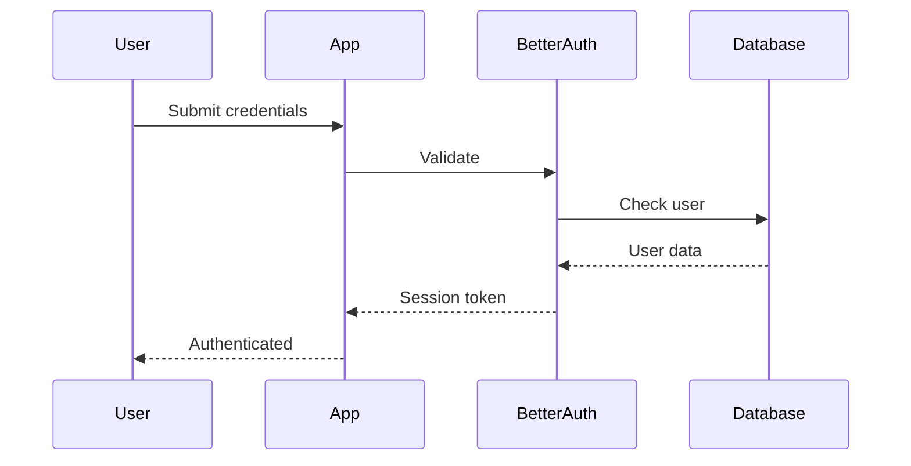
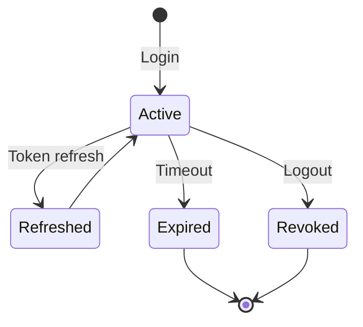

# Authentication System

## Overview

The application uses Better Auth for authentication, providing a secure and flexible auth system.

## Authentication Flow

## Supported Methods

### Email/Password
Traditional email and password authentication with:
- Password hashing (bcrypt)
- Email verification
- Password reset flow

### OAuth Providers
Social login support for:
- Google
- GitHub
- Discord

## Session Management

Sessions are stored in the database with configurable expiration.

## Security Considerations

1. **CSRF Protection** - All mutations require valid CSRF tokens
2. **Rate Limiting** - Failed login attempts are rate limited
3. **Secure Cookies** - HttpOnly, Secure, SameSite=Strict
4. **Session Invalidation** - Logout invalidates all sessions
