# Core Features: Information Architecture

A comprehensive architecture for the three highest-impact features identified through market research, designed to establish mise en place as the definitive recipe app for video-first home cooks.

---

## Table of Contents

1. [Overview](#overview)
2. [Research Foundation](#research-foundation)
3. [Feature 1: Video Timestamp Preservation](#feature-1-video-timestamp-preservation)
4. [Feature 2: Integrated Meal Planning Calendar](#feature-2-integrated-meal-planning-calendar)
5. [Feature 3: Freemium Pricing Model](#feature-3-freemium-pricing-model)
6. [User Flows](#user-flows)
7. [System Architecture](#system-architecture)
8. [Data Model](#data-model)
9. [UI Components](#ui-components)
10. [Frontend Design Specification](#frontend-design-specification)
11. [Technical Stack](#technical-stack)
12. [Implementation Roadmap](#implementation-roadmap)

---

## Overview

### Vision
Transform mise en place from a general recipe app into **the definitive platform for video-first recipe discovery**, with integrated meal planning that addresses the complete home cooking workflow.

### Core Value Proposition
- **Video Timestamp Preservation**: The only feature where competitors demonstrably fail
- **Integrated Meal Planning**: Complete workflow from recipe discovery to grocery shopping
- **Smart Freemium**: Free core features + premium AI enhancements

### Market Opportunity

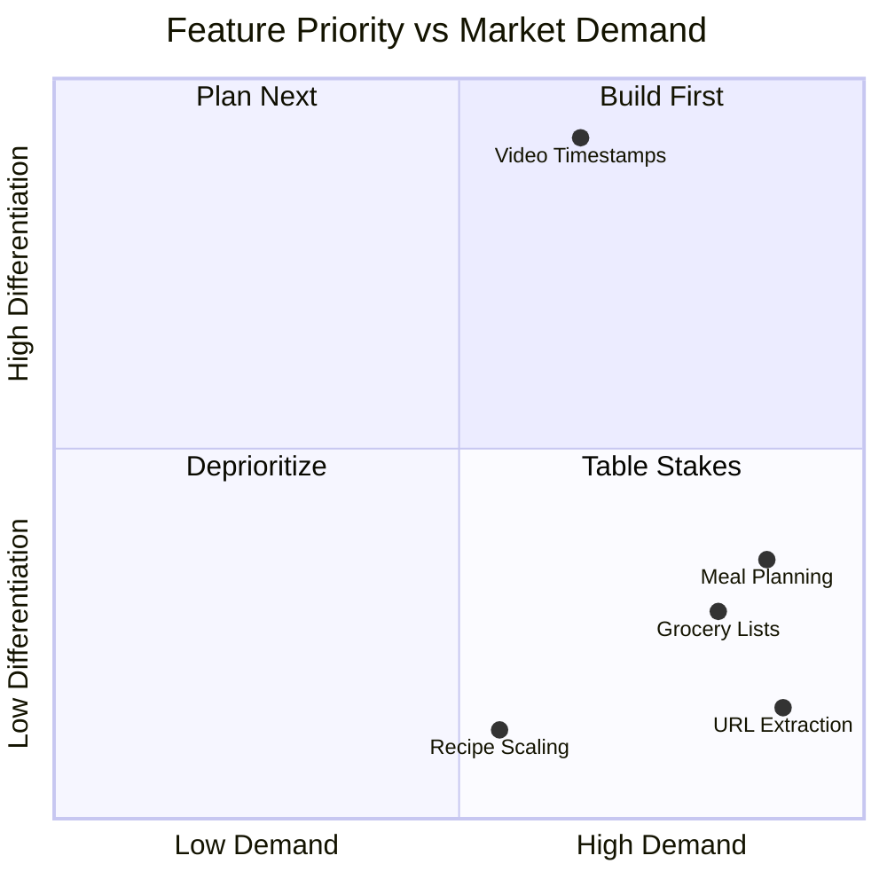

### Key Research Insights

| Insight | Source | Impact |
|---------|--------|--------|
| Video timestamp preservation is the **only underserved niche** | Reddit research [37] | Primary differentiator |
| 73.6% of recipe apps are free | Market research [12] | Freemium is mandatory |
| Strong subscription fatigue for basic features | User research [26, 35] | One-time or freemium model |
| "Chaotic mix" of recipe sources is top pain point | User interviews [22, 28] | Consolidation is key |
| AI extraction is now **table stakes** | Competitor analysis [31-33] | Not a differentiator |

---

## Research Foundation

### Competitive Landscape

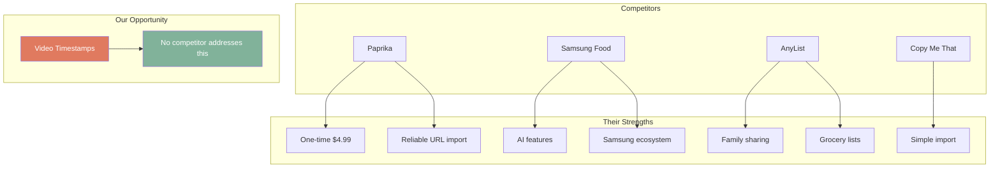

### ICP Fit Analysis

| ICP | Fit Score | Primary Need | Our Solution |
|-----|-----------|--------------|--------------|
| YouTube Recipe Enthusiast | 72/100 | Video timestamps, in-app playback | **Feature 1: Video Timestamps** |
| Overwhelmed Meal Planner | 68/100 | Unified planning, grocery automation | **Feature 2: Meal Planning** |
| Analog Recipe Archivist | 58/100 | Digitization, family sharing | Phase 2 focus |

---

## Feature 1: Video Timestamp Preservation

### Why This Feature

> "Reddit users explicitly request 'good YouTube functionality' in recipe managers [37], and the ability to extract from 'any video or webpage (youtube, instagram, tiktok, recipe blogs, etc.)' as a key differentiator [37]. This gap between video-based recipe discovery and current app capabilities presents a clear opportunity [23, 37]."

**Impact**: Captures early adopters in the fastest-growing recipe discovery channel and creates word-of-mouth differentiation.

### Feature Specification

#### Core Capabilities

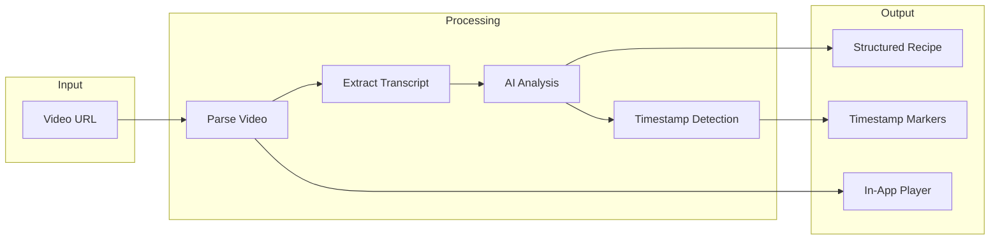

#### Supported Platforms

| Platform | Import Method | Timestamp Support | In-App Playback |
|----------|---------------|-------------------|-----------------|
| YouTube | URL paste, browser extension | ✓ Full | ✓ Embedded player |
| TikTok | URL paste | ✓ Auto-detected | ✓ Native embed |
| Instagram Reels | URL paste | ✓ Auto-detected | ✓ Native embed |
| Food Blogs | URL paste | N/A | N/A |

#### Timestamp Types

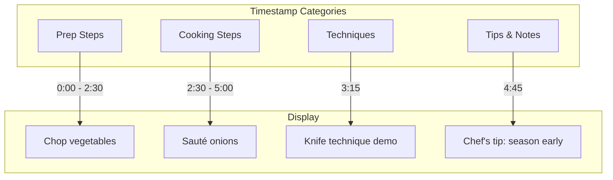

#### User Interface Elements

**Video Recipe View**:
```
┌─────────────────────────────────────────────────────────────────────┐
│ ┌───────────────────────────────────┐  ┌─────────────────────────┐ │
│ │                                   │  │ INGREDIENTS             │ │
│ │         [Video Player]            │  │ □ 2 cups flour          │ │
│ │                                   │  │ □ 1 tsp salt            │ │
│ │   ▶ 0:00 ──●────────────── 12:45  │  │ □ 3 eggs                │ │
│ │                                   │  │ □ ...                   │ │
│ └───────────────────────────────────┘  │                         │ │
│                                        │ ─────────────────────── │ │
│ TIMESTAMPS                             │ INSTRUCTIONS            │ │
│ ┌─────────────────────────────────┐   │                         │ │
│ │ ◉ 0:00  Prep ingredients        │   │ 1. Combine dry          │ │
│ │ ○ 2:30  Make the dough          │   │    ingredients          │ │
│ │ ○ 5:15  Rest the dough          │   │                         │ │
│ │ ○ 6:00  Shape pasta             │   │ 2. Add wet ingredients  │ │
│ │ ○ 9:30  Cook pasta              │   │    and mix until...     │ │
│ │ ○ 11:00 Final plating           │   │                         │ │
│ └─────────────────────────────────┘   └─────────────────────────┘ │
└─────────────────────────────────────────────────────────────────────┘
```

**Cooking Mode with Video**:
```
┌─────────────────────────────────────────────────────────────────────┐
│                    STEP 3 of 8                                      │
│ ━━━━━━━━━━━━━━━━━━━━━━━━●━━━━━━━━━━━━━━━━━━                        │
│                                                                     │
│      ┌───────────────────────────────────┐                         │
│      │                                   │                         │
│      │         [Video at 5:15]           │                         │
│      │                                   │                         │
│      │   ▶ Playing: "Shape pasta"        │                         │
│      └───────────────────────────────────┘                         │
│                                                                     │
│   Shape the pasta by rolling out the dough to                       │
│   1/8 inch thickness, then cut into strips.                         │
│                                                                     │
│   ⏱ Timer: 15:00 remaining                                          │
│                                                                     │
│   [← Previous]                           [Next →]                   │
│                                                                     │
│   🎬 Jump to video moment                                           │
└─────────────────────────────────────────────────────────────────────┘
```

### Technical Implementation

#### Video Processing Pipeline

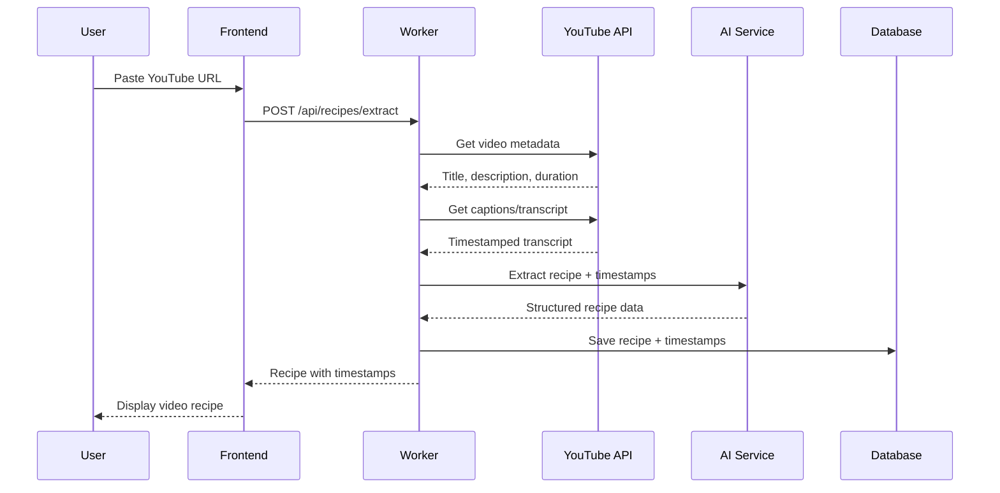

#### Data Structures

```typescript
interface VideoRecipe extends Recipe {
  videoSource: {
    platform: 'youtube' | 'tiktok' | 'instagram' | 'other';
    videoId: string;
    embedUrl: string;
    thumbnailUrl: string;
    duration: number; // seconds
  };
  
  timestamps: RecipeTimestamp[];
}

interface RecipeTimestamp {
  id: string;
  time: number; // seconds from start
  label: string;
  stepIndex?: number; // links to recipe step
  type: 'prep' | 'cook' | 'technique' | 'tip';
  confidence: number; // AI confidence score
}

interface CookingModeState {
  currentStep: number;
  videoSyncEnabled: boolean;
  currentTimestamp?: RecipeTimestamp;
}
```

---

## Feature 2: Integrated Meal Planning Calendar

### Why This Feature

> "Users want to 'make a meal plan, generate a shopping list, schedule leftovers' all within a single workflow [43], and busy families specifically seek apps that reduce the 'chaotic mix' of planning across multiple tools [22, 29]."

**Impact**: Prevents user leakage to comprehensive competitors by completing the full cooking workflow.

### Feature Specification

#### Core Capabilities

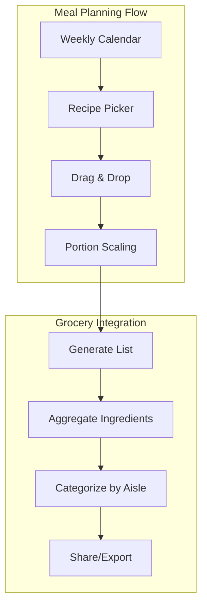

#### Weekly Calendar View

```
┌─────────────────────────────────────────────────────────────────────┐
│ MEAL PLAN: Week of January 27, 2026           [◀ Prev] [Next ▶]     │
├─────────────────────────────────────────────────────────────────────┤
│         Mon      Tue      Wed      Thu      Fri      Sat      Sun   │
├─────────────────────────────────────────────────────────────────────┤
│ Breakfast                                                            │
│ ┌──────┐┌──────┐┌──────┐┌──────┐┌──────┐┌──────┐┌──────┐           │
│ │Oatmea││Eggs  ││Oatmea││Eggs  ││Oatmea││Pancak││Eggs  │           │
│ │l Bowl││Toast ││l Bowl││Toast ││l Bowl││es    ││Bened.│           │
│ └──────┘└──────┘└──────┘└──────┘└──────┘└──────┘└──────┘           │
├─────────────────────────────────────────────────────────────────────┤
│ Lunch                                                                │
│ ┌──────┐┌──────┐┌──────┐┌──────┐┌──────┐┌──────┐┌──────┐           │
│ │Leftov││Salad ││Leftov││Soup  ││Leftov││      ││      │           │
│ │ers   ││      ││ers   ││      ││ers   ││ +Add ││ +Add │           │
│ └──────┘└──────┘└──────┘└──────┘└──────┘└──────┘└──────┘           │
├─────────────────────────────────────────────────────────────────────┤
│ Dinner                                                               │
│ ┌──────┐┌──────┐┌──────┐┌──────┐┌──────┐┌──────┐┌──────┐           │
│ │ 🎬   ││Taco  ││Pasta ││ 🎬   ││Pizza ││Stir  ││Roast │           │
│ │Ramen ││Night ││Primav││Salmon││Friday││Fry   ││Chicke│           │
│ └──────┘└──────┘└──────┘└──────┘└──────┘└──────┘└──────┘           │
├─────────────────────────────────────────────────────────────────────┤
│                                                                     │
│ [🛒 Generate Grocery List]        Servings: [4 ▼]    [Save Plan]    │
│                                                                     │
└─────────────────────────────────────────────────────────────────────┘

🎬 = Video recipe with timestamps
```

#### Recipe Picker Modal

```
┌─────────────────────────────────────────────────────────────────────┐
│ Add Recipe to Tuesday Dinner                               [✕]      │
├─────────────────────────────────────────────────────────────────────┤
│ [🔍 Search your recipes...]                                         │
│                                                                     │
│ ┌─────────────────────────────────────────────────────────────────┐ │
│ │ RECENTLY SAVED                                          See all │ │
│ │ ┌────────┐ ┌────────┐ ┌────────┐ ┌────────┐                    │ │
│ │ │  🎬    │ │        │ │  🎬    │ │        │                    │ │
│ │ │ Ramen  │ │ Tacos  │ │ Salmon │ │ Pasta  │                    │ │
│ │ │ 45 min │ │ 30 min │ │ 25 min │ │ 35 min │                    │ │
│ │ └────────┘ └────────┘ └────────┘ └────────┘                    │ │
│ └─────────────────────────────────────────────────────────────────┘ │
│                                                                     │
│ ┌─────────────────────────────────────────────────────────────────┐ │
│ │ QUICK OPTIONS                                                   │ │
│ │ ○ Leftovers from Monday                                         │ │
│ │ ○ Eating out                                                    │ │
│ │ ○ Custom meal (no recipe)                                       │ │
│ └─────────────────────────────────────────────────────────────────┘ │
│                                                                     │
│ [Cancel]                                         [Add to Plan]      │
└─────────────────────────────────────────────────────────────────────┘
```

#### Aggregated Grocery List

```
┌─────────────────────────────────────────────────────────────────────┐
│ GROCERY LIST                        Week of Jan 27    [Share] [✕]   │
├─────────────────────────────────────────────────────────────────────┤
│ Based on 14 meals • 4 servings each                                 │
│                                                                     │
│ PRODUCE (12 items)                                          [─]     │
│ ┌─────────────────────────────────────────────────────────────────┐ │
│ │ □ Onions ────────────────────────────────────── 4 large        │ │
│ │   └ Ramen (2), Tacos, Stir Fry                                 │ │
│ │ □ Garlic ────────────────────────────────────── 2 heads        │ │
│ │   └ Ramen, Pasta, Salmon, Stir Fry                             │ │
│ │ □ Bell peppers ──────────────────────────────── 3              │ │
│ │   └ Tacos, Stir Fry                                            │ │
│ │ □ Spinach ───────────────────────────────────── 2 bags         │ │
│ │   └ Salads (3 days)                                            │ │
│ └─────────────────────────────────────────────────────────────────┘ │
│                                                                     │
│ PROTEINS (5 items)                                          [─]     │
│ ┌─────────────────────────────────────────────────────────────────┐ │
│ │ □ Chicken thighs ────────────────────────────── 3 lbs          │ │
│ │ □ Salmon fillets ────────────────────────────── 4 (6oz each)   │ │
│ │ □ Ground beef ───────────────────────────────── 2 lbs          │ │
│ │ □ Eggs ──────────────────────────────────────── 2 dozen        │ │
│ │ □ Pork belly ────────────────────────────────── 1 lb           │ │
│ └─────────────────────────────────────────────────────────────────┘ │
│                                                                     │
│ DAIRY (4 items)                                             [+]     │
│ PANTRY (8 items)                                            [+]     │
│ FROZEN (2 items)                                            [+]     │
│                                                                     │
│ ───────────────────────────────────────────────────────────────     │
│ Estimated cost: $85-110         [Export to Apple Reminders]         │
└─────────────────────────────────────────────────────────────────────┘
```

### Technical Implementation

#### State Machine

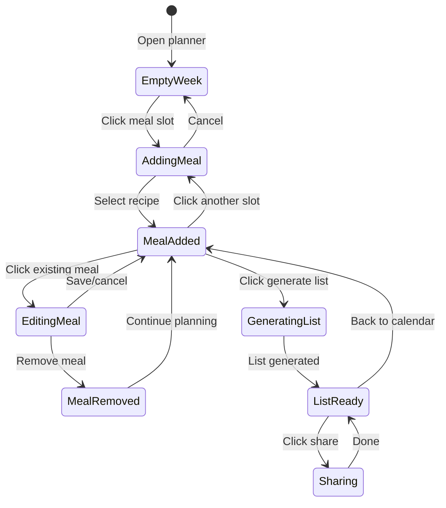

#### Data Structures

```typescript
interface MealPlan {
  id: string;
  userId: string;
  weekStartDate: string; // ISO date (Monday)
  defaultServings: number;
  meals: PlannedMeal[];
  createdAt: Date;
  updatedAt: Date;
}

interface PlannedMeal {
  id: string;
  date: string; // ISO date
  mealType: 'breakfast' | 'lunch' | 'dinner' | 'snack';
  recipeId?: string;
  customMealName?: string; // for "eating out" or custom
  servings: number;
  isLeftovers: boolean;
  leftoverFromId?: string; // references another PlannedMeal
}

interface GroceryList {
  id: string;
  mealPlanId: string;
  generatedAt: Date;
  items: GroceryItem[];
  estimatedCost?: {
    min: number;
    max: number;
    currency: string;
  };
}

interface GroceryItem {
  id: string;
  ingredient: string;
  quantity: string;
  unit: string;
  category: 'produce' | 'proteins' | 'dairy' | 'pantry' | 'frozen' | 'other';
  recipes: string[]; // recipe names that need this
  checked: boolean;
}
```

---

## Feature 3: Freemium Pricing Model

### Why This Model

> "Free apps capture 73.6% market share [12] and users show intense subscription resistance for basic recipe management [26, 35], as proven by Paprika's success with $4.99 one-time fees. However, AI meal planning grows at 16.64% CAGR [5], indicating users will pay for genuinely transformative features."

**Impact**: Maximizes user acquisition while capturing monetization upside from power users.

### Pricing Structure

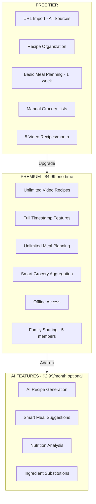

### Feature Matrix

| Feature | Free | Premium ($4.99) | AI Add-on (+$2.99/mo) |
|---------|------|-----------------|----------------------|
| URL Import (blogs) | ✓ Unlimited | ✓ | ✓ |
| URL Import (video) | 5/month | ✓ Unlimited | ✓ |
| Video Timestamps | View only | ✓ Full editing | ✓ |
| In-App Video Playback | ✓ | ✓ | ✓ |
| Recipe Organization | ✓ | ✓ | ✓ |
| Recipe Scaling | ✓ | ✓ | ✓ |
| Meal Planning | 1 week | ✓ Unlimited | ✓ |
| Grocery List | Manual | ✓ Smart aggregation | ✓ |
| Offline Access | — | ✓ | ✓ |
| Family Sharing | — | 5 members | 5 members |
| AI Recipe Generation | — | — | ✓ |
| Smart Meal Suggestions | — | — | ✓ |
| Nutrition Analysis | — | — | ✓ |
| Ingredient Substitutions | — | — | ✓ |

### Upgrade Flow

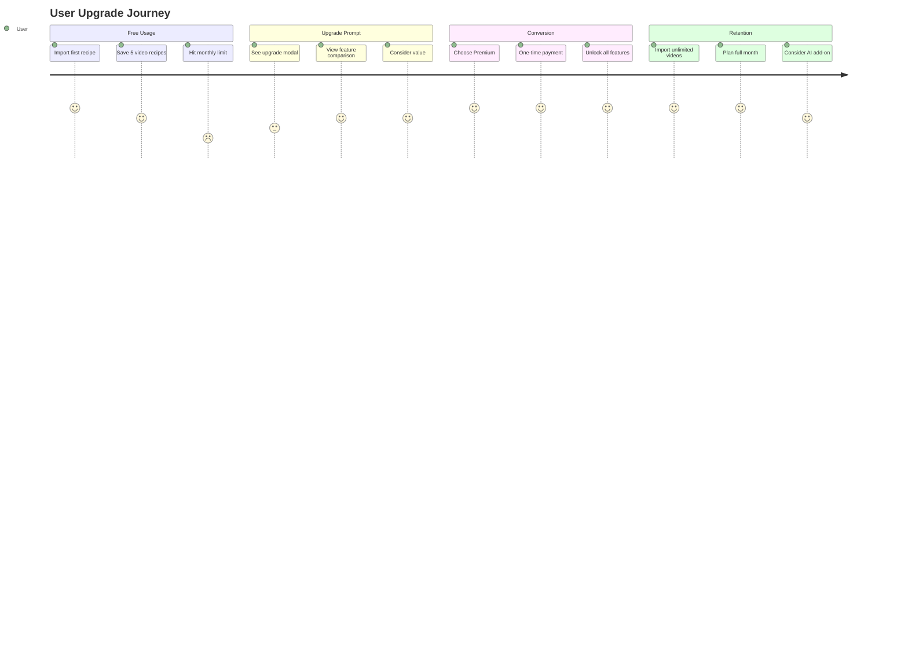

### Pricing UI

**Upgrade Modal**:
```
┌─────────────────────────────────────────────────────────────────────┐
│                                                              [✕]    │
│                                                                     │
│         You've imported 5 video recipes this month                  │
│                                                                     │
│   ┌───────────────────────────────────────────────────────────┐    │
│   │                      UNLOCK UNLIMITED                      │    │
│   │                                                            │    │
│   │   ✓ Unlimited video recipe imports                        │    │
│   │   ✓ Full timestamp editing & sync                         │    │
│   │   ✓ Unlimited meal planning                               │    │
│   │   ✓ Smart grocery list aggregation                        │    │
│   │   ✓ Offline access                                        │    │
│   │   ✓ Share with 5 family members                           │    │
│   │                                                            │    │
│   │               ┌──────────────────────┐                     │    │
│   │               │      $4.99           │                     │    │
│   │               │    ONE TIME          │                     │    │
│   │               │   No subscription    │                     │    │
│   │               └──────────────────────┘                     │    │
│   │                                                            │    │
│   │         [████ Upgrade Now ████]                           │    │
│   │                                                            │    │
│   │         ★★★★★ "Best $5 I've spent!" - HomeCook           │    │
│   └───────────────────────────────────────────────────────────┘    │
│                                                                     │
│                      [Maybe later →]                                │
└─────────────────────────────────────────────────────────────────────┘
```

---

## User Flows

### Complete User Journey

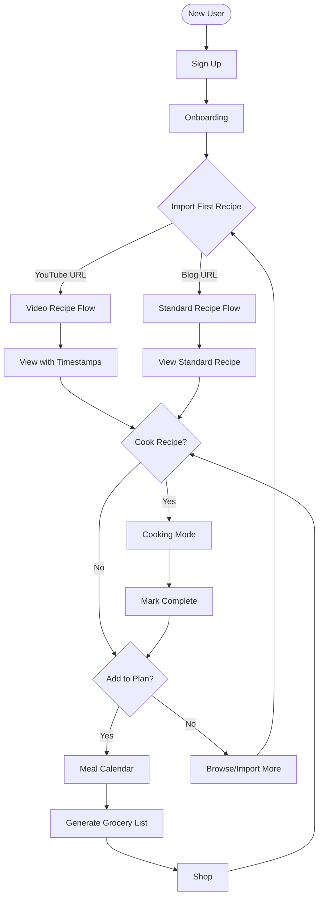

### Video Import Flow (Detail)

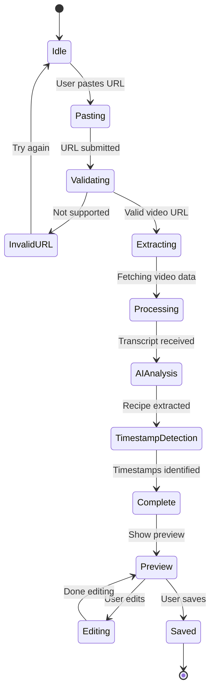

---

## System Architecture

### High-Level Architecture

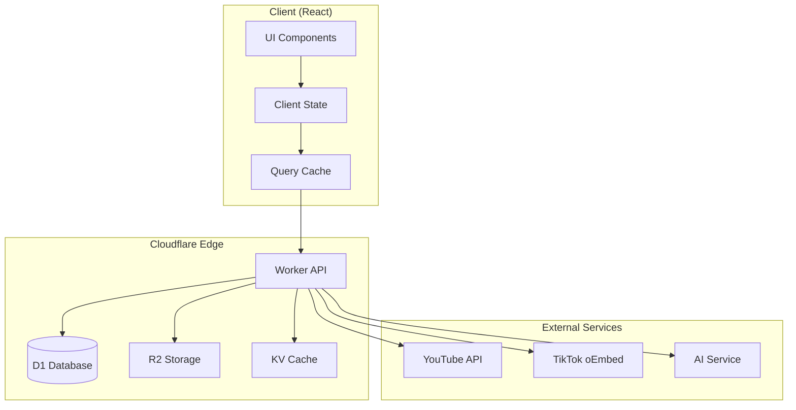

### Video Processing Pipeline

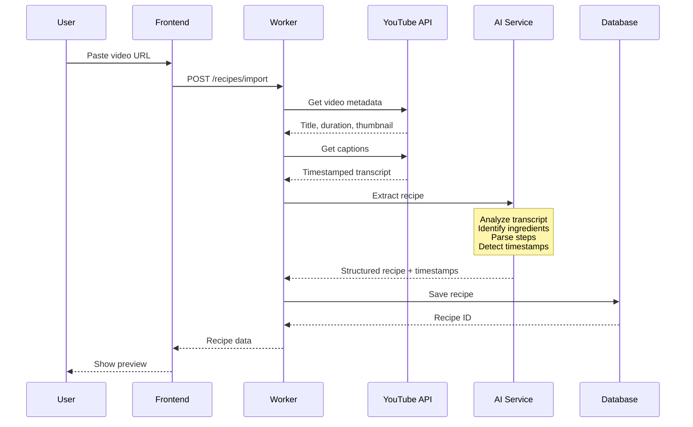

---

## Data Model

### Entity Relationship Diagram

```mermaid
erDiagram
    User ||--o{ Recipe : owns
    User ||--o{ MealPlan : creates
    
    Recipe ||--o{ RecipeTimestamp : has
    Recipe ||--o{ Ingredient : contains
    Recipe ||--o{ Instruction : includes
    Recipe ||--o| VideoSource : "may have"
    
    MealPlan ||--o{ PlannedMeal : contains
    PlannedMeal }o--|| Recipe : references
    
    MealPlan ||--o| GroceryList : generates
    GroceryList ||--o{ GroceryItem : contains
    
    User {
        string id PK
        string email
        string name
        string tier "free|premium|premium_ai"
        date premiumPurchasedAt
        date aiSubscriptionEnd
    }
    
    Recipe {
        string id PK
        string userId FK
        string title
        string sourceUrl
        string sourceType "blog|youtube|tiktok|instagram"
        int prepTime
        int cookTime
        int servings
        string imageUrl
    }
    
    VideoSource {
        string id PK
        string recipeId FK
        string platform
        string videoId
        string embedUrl
        string thumbnailUrl
        int duration
    }
    
    RecipeTimestamp {
        string id PK
        string recipeId FK
        int timeSeconds
        string label
        int stepIndex
        string type "prep|cook|technique|tip"
    }
    
    MealPlan {
        string id PK
        string userId FK
        date weekStart
        int defaultServings
    }
    
    PlannedMeal {
        string id PK
        string mealPlanId FK
        string recipeId FK
        date date
        string mealType "breakfast|lunch|dinner|snack"
        int servings
        boolean isLeftovers
    }
    
    GroceryList {
        string id PK
        string mealPlanId FK
        datetime generatedAt
        json estimatedCost
    }
    
    GroceryItem {
        string id PK
        string groceryListId FK
        string ingredient
        string quantity
        string unit
        string category
        json recipeRefs
        boolean checked
    }
```

---

## UI Components

### Component Hierarchy

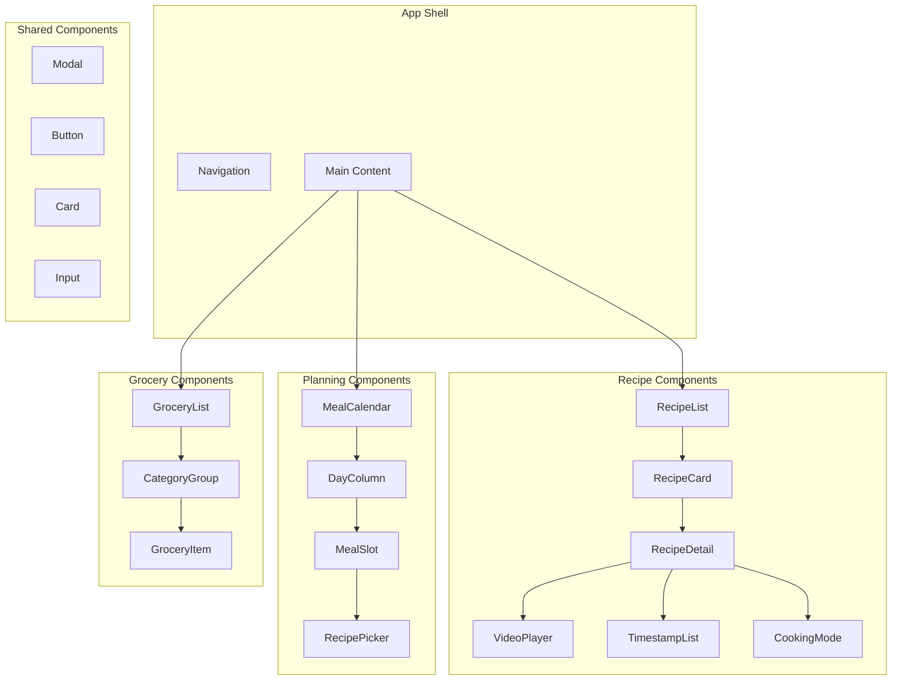

### Key Component Specs

#### VideoPlayer Component

| Prop | Type | Required | Description |
|------|------|----------|-------------|
| `videoSource` | `VideoSource` | ✓ | Video metadata and embed URL |
| `timestamps` | `RecipeTimestamp[]` | | Timestamp markers to display |
| `currentTime` | `number` | | Current playback position |
| `onTimeUpdate` | `(time: number) => void` | | Callback when time changes |
| `onTimestampClick` | `(ts: RecipeTimestamp) => void` | | Callback when timestamp clicked |

**States**: idle, loading, playing, paused, error
**Accessibility**: Keyboard controls (space=play/pause, arrows=skip), ARIA labels

#### MealCalendar Component

| Prop | Type | Required | Description |
|------|------|----------|-------------|
| `weekStart` | `Date` | ✓ | Monday of the displayed week |
| `meals` | `PlannedMeal[]` | ✓ | Planned meals for the week |
| `onMealAdd` | `(date, mealType) => void` | ✓ | Callback to add meal |
| `onMealRemove` | `(mealId) => void` | ✓ | Callback to remove meal |
| `onMealMove` | `(mealId, newDate, newType) => void` | | Drag-drop handler |

**States**: viewing, adding, editing, generating
**Accessibility**: Keyboard navigation, focus management, ARIA grid

---

## Frontend Design Specification

### Aesthetic Direction

**Tone**: Editorial cookbook meets modern web—warm, artisanal, trustworthy with moments of delightful animation.

**Memorable Element**: The **video timestamp pills** that pulse subtly when a step is reached, combined with the **warm grain texture** creates a distinctive experience that feels like a premium cookbook app.

### Typography

| Usage | Font | Weight | Class |
|-------|------|--------|-------|
| Display Headlines | Playfair Display | 700 | `font-display font-bold` |
| Section Headlines | Playfair Display | 600 | `font-display font-semibold` |
| Body Text | Source Sans 3 | 400 | `font-sans` |
| Body Emphasis | Source Sans 3 | 600 | `font-sans font-semibold` |
| UI Elements | Source Sans 3 | 500 | `font-sans font-medium` |
| Timestamps | Source Sans 3 | 500 | `font-sans font-medium tabular-nums` |

### Color Palette (OKLCH)

| Token | Value | Usage |
|-------|-------|-------|
| `--primary` | `oklch(0.55 0.14 35)` | Terracotta - CTAs, timestamps, accents |
| `--primary-foreground` | `oklch(0.98 0.01 35)` | Text on primary |
| `--accent` | `oklch(0.70 0.08 145)` | Sage green - success states, meal complete |
| `--background` | `oklch(0.985 0.005 85)` | Warm cream page background |
| `--card` | `oklch(0.995 0.003 85)` | Card backgrounds |
| `--video-overlay` | `oklch(0.15 0.02 35 / 0.9)` | Video player UI |
| `--timestamp-active` | `oklch(0.55 0.14 35)` | Active timestamp highlight |
| `--timestamp-inactive` | `oklch(0.75 0.05 35)` | Inactive timestamp |

### Motion Design

**Video Player**:
- Timestamp pills: Fade in staggered (0.1s delay each)
- Active timestamp: Scale 1.05 + glow effect
- Jump to timestamp: Video crossfade (0.3s)

**Meal Calendar**:
- Drag start: Scale 1.05 + shadow lift
- Drop zone highlight: Pulsing border
- Meal added: Pop in animation (spring physics)

**Grocery List**:
- Item check: Strikethrough slides in (0.2s)
- Category collapse: Smooth height transition (0.3s)
- Generate list: Staggered item reveal (0.05s each)

### Visual Effects

**Video Recipe Cards**:
- Thumbnail with video indicator (play button overlay)
- Timestamp count badge
- Duration indicator

**Timestamp Pills**:
```css
.timestamp-pill {
  background: var(--timestamp-inactive);
  padding: 0.25rem 0.75rem;
  border-radius: 9999px;
  font-variant-numeric: tabular-nums;
  transition: all 0.2s ease;
}

.timestamp-pill.active {
  background: var(--timestamp-active);
  color: var(--primary-foreground);
  box-shadow: 0 0 12px oklch(0.55 0.14 35 / 0.3);
}
```

---

## Technical Stack

### Stack Overview

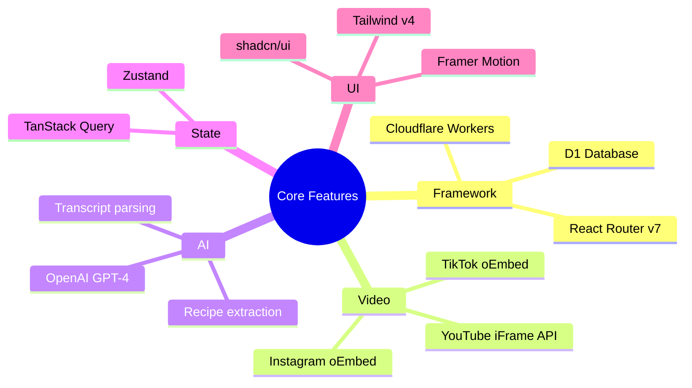

### API Endpoints

| Endpoint | Method | Description |
|----------|--------|-------------|
| `/api/recipes` | GET | List user's recipes |
| `/api/recipes` | POST | Create recipe (import) |
| `/api/recipes/:id` | GET | Get recipe details |
| `/api/recipes/:id` | PATCH | Update recipe |
| `/api/recipes/:id/timestamps` | GET | Get timestamps |
| `/api/recipes/:id/timestamps` | POST | Add timestamp |
| `/api/meal-plans` | GET | List meal plans |
| `/api/meal-plans` | POST | Create meal plan |
| `/api/meal-plans/:id` | GET | Get meal plan |
| `/api/meal-plans/:id/meals` | POST | Add meal to plan |
| `/api/meal-plans/:id/grocery-list` | POST | Generate grocery list |
| `/api/grocery-lists/:id` | GET | Get grocery list |
| `/api/grocery-lists/:id/items/:itemId` | PATCH | Check/uncheck item |

### Dependencies

```bash
# Video playback
# YouTube iFrame API (CDN loaded)

# AI Processing
bun add openai

# State management (existing)
# TanStack Query already installed

# Animations (existing)
# Framer Motion already installed
```

---

## Implementation Roadmap

### Phase 1: Video Timestamps (Weeks 1-3)
- [ ] Video URL detection and validation
- [ ] YouTube API integration
- [ ] Transcript fetching
- [ ] AI recipe extraction with timestamps
- [ ] VideoPlayer component
- [ ] TimestampList component
- [ ] Cooking mode with video sync

### Phase 2: Meal Planning (Weeks 4-6)
- [ ] MealPlan database schema
- [ ] MealCalendar component
- [ ] RecipePicker modal
- [ ] Drag-and-drop functionality
- [ ] PlannedMeal CRUD operations
- [ ] Week navigation

### Phase 3: Grocery Lists (Weeks 7-8)
- [ ] GroceryList database schema
- [ ] Ingredient aggregation algorithm
- [ ] Category classification
- [ ] GroceryList UI components
- [ ] Share/export functionality

### Phase 4: Freemium Implementation (Weeks 9-10)
- [ ] User tier tracking
- [ ] Usage limits (video imports)
- [ ] Upgrade modal
- [ ] Payment integration (Stripe)
- [ ] Feature gating logic

### Phase 5: Polish & Launch (Weeks 11-12)
- [ ] Performance optimization
- [ ] Offline support (Premium)
- [ ] Family sharing
- [ ] Analytics integration
- [ ] Bug fixes and testing

---

## Success Metrics

| Metric | Target | Measurement |
|--------|--------|-------------|
| Video recipe imports | 50% of new recipes | Analytics |
| Timestamp engagement | 70% of video viewers use timestamps | Analytics |
| Meal planning adoption | 40% of users create weekly plan | Analytics |
| Free → Premium conversion | 15% | Analytics |
| User retention (30-day) | 60% | Analytics |
| NPS score | 50+ | Survey |

---

*Architecture Document v1.0 - January 30, 2026*
