# Mise En Place: Current Architecture Overview

A comprehensive high-level view of the existing application architecture, covering all pages, components, data flow, and system structure.

---

## Table of Contents

1. [Overview](#overview)
2. [Application Structure](#application-structure)
3. [Route Map](#route-map)
4. [System Architecture](#system-architecture)
5. [Data Model](#data-model)
6. [Feature Summary](#feature-summary)
7. [Component Library](#component-library)
8. [Design System](#design-system)

---

## Overview

### Product Vision

**Mise En Place** is a recipe management app for home cooks who save recipes from YouTube cooking videos and food blogs. Users paste a URL and AI extracts everything automatically—including video timestamps for easy reference. The app also features weekly meal planning with aggregated grocery lists.

### Core Capabilities

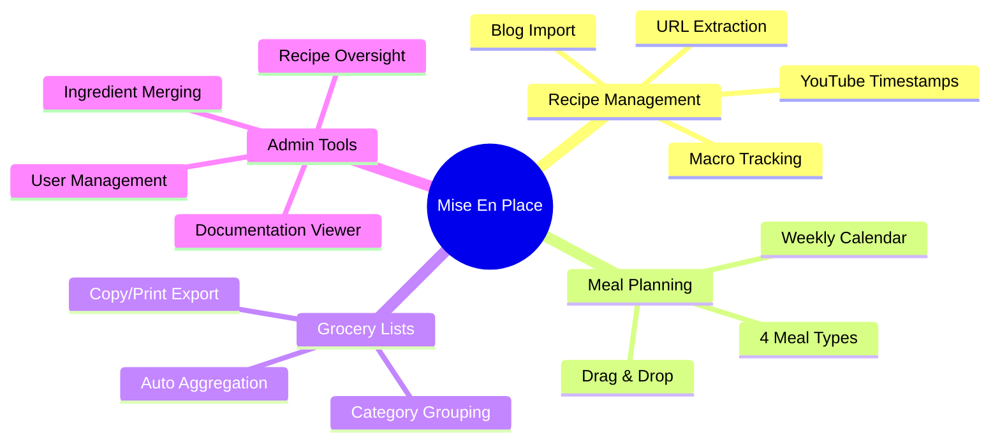

### Tech Stack

| Layer | Technology |
|-------|------------|
| **Frontend** | React 19, React Router v7, Tailwind v4, shadcn/ui |
| **Backend** | Cloudflare Workers (Edge Runtime) |
| **API** | tRPC with React Query |
| **Auth** | Better Auth (email/password + sessions) |
| **Database** | Cloudflare D1 (SQLite), Drizzle ORM |
| **Storage** | Cloudflare R2 |
| **AI** | Google Gemini 3, Claude Sonnet 4.5 (fallback) |
| **Analytics** | PostHog |

---

## Application Structure

### Folder Organization

```
app/
├── auth/                    # Authentication (Better Auth)
│   ├── client.ts           # Client-side auth hooks
│   └── server.ts           # Server auth configuration
├── components/
│   ├── analytics/          # Charts, stat cards, insights
│   ├── planner/            # Meal planner components
│   ├── recipes/            # Recipe-specific components
│   └── ui/                 # shadcn/ui primitives (60+ components)
├── db/
│   ├── index.ts            # Database connection
│   └── schema.ts           # Drizzle schema definitions
├── hooks/                  # Custom React hooks
├── lib/                    # Utility libraries
│   ├── claude.ts           # Claude AI client
│   ├── content-extractor.ts # Blog content extraction
│   ├── gemini.ts           # Gemini AI client
│   ├── utils.ts            # Shared utilities
│   └── youtube.ts          # YouTube transcript extraction
├── models/                 # Types and error classes
├── posthog/                # Analytics integration
├── repositories/           # Data access layer
│   ├── analytics.ts
│   ├── bucket.ts           # R2 storage operations
│   ├── ingredient.ts
│   ├── meal-plan.ts
│   ├── recipe.ts
│   └── user.ts
├── routes/                 # Page routes (see Route Map)
└── trpc/                   # API layer
    ├── routes/             # tRPC route handlers
    └── router.ts           # Router configuration
```

---

## Route Map

### Visual Route Hierarchy

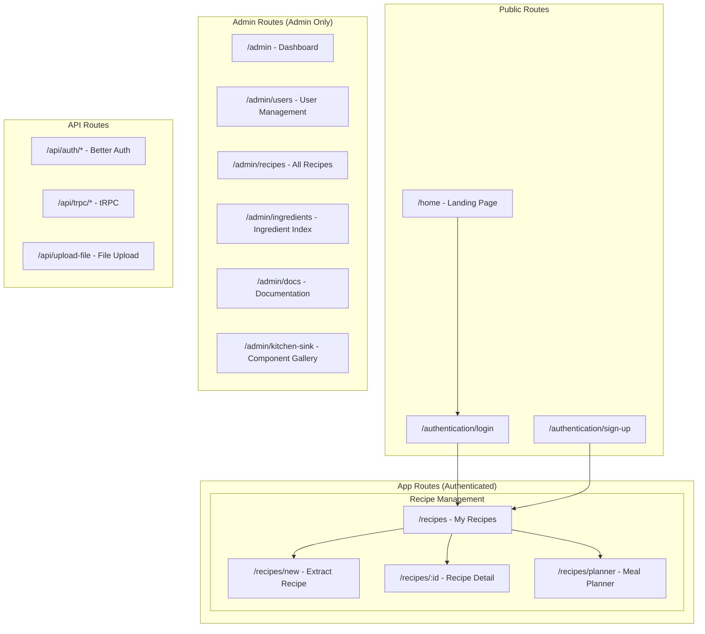

### Route Details

| Route | Layout | Purpose | Auth Required |
|-------|--------|---------|---------------|
| `/home` | Marketing | Landing page (in progress) | No |
| `/authentication/login` | Auth | User login form | No |
| `/authentication/sign-up` | Auth | User registration form | No |
| `/recipes` | App | Recipe collection with search/filter | Yes |
| `/recipes/new` | App | Extract new recipe from URL | Yes |
| `/recipes/:id` | App | Recipe detail with YouTube player | Yes |
| `/recipes/planner` | App | Weekly meal planner + grocery list | Yes |
| `/admin` | Admin | Analytics dashboard | Admin |
| `/admin/users` | Admin | User management table | Admin |
| `/admin/recipes` | Admin | All recipes across users | Admin |
| `/admin/ingredients` | Admin | Ingredient database with merge | Admin |
| `/admin/docs` | Admin | Markdown documentation viewer | Admin |
| `/admin/kitchen-sink` | Admin | Component showcase | Admin |

### Page Flow Diagram

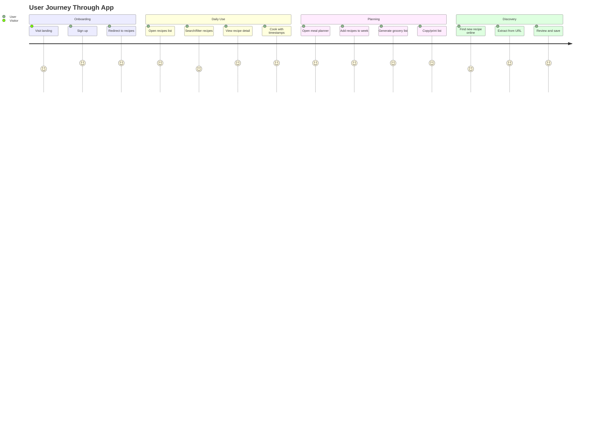

---

## System Architecture

### High-Level Data Flow

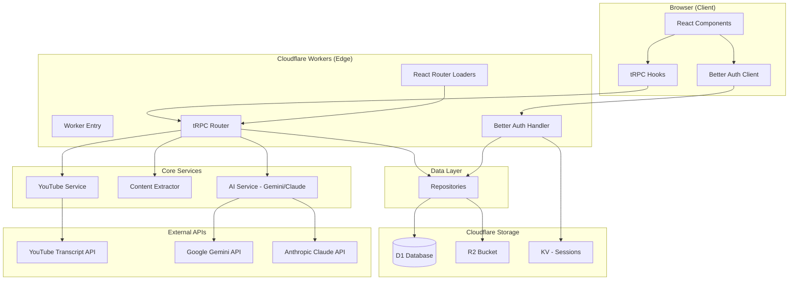

### Request/Response Patterns

**Server-Side Rendering (Loaders)**:
```
Route Loader → context.trpc.route.method() → Repository → D1 → Return data
```

**Client-Side Queries**:
```
Component → api.route.useQuery() → tRPC Client → /api/trpc/* → Repository → D1
```

**Mutations**:
```
Component → api.route.useMutation() → tRPC Client → /api/trpc/* → Repository → D1
```

---

## Data Model

### Entity Relationship Diagram

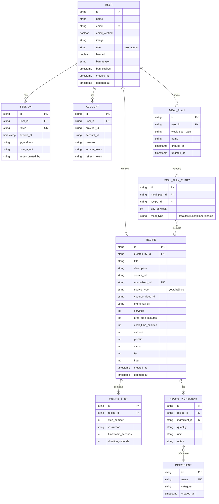

### Table Summary

| Table | Records | Purpose |
|-------|---------|---------|
| `user` | Core users | Auth, roles, bans |
| `session` | Active sessions | Session management |
| `account` | Auth accounts | OAuth/credential storage |
| `verification` | Email tokens | Email verification |
| `recipe` | User recipes | Extracted recipe data |
| `recipe_step` | Cooking steps | Instructions with timestamps |
| `ingredient` | Normalized ingredients | Ingredient database |
| `recipe_ingredient` | Junction | Recipe ↔ Ingredient link |
| `meal_plan` | Weekly plans | User's meal plan for a week |
| `meal_plan_entry` | Plan slots | Recipe assignments to day/meal |

---

## Feature Summary

### 1. Authentication

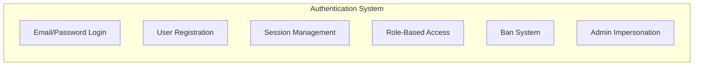

**Capabilities**:
- Email/password authentication
- User roles: `user`, `admin`
- Ban system with reason and expiration
- Admin impersonation for support
- Device tracking via user agent

**Key Files**: `app/auth/server.ts`, `app/auth/client.ts`

### 2. Recipe Extraction

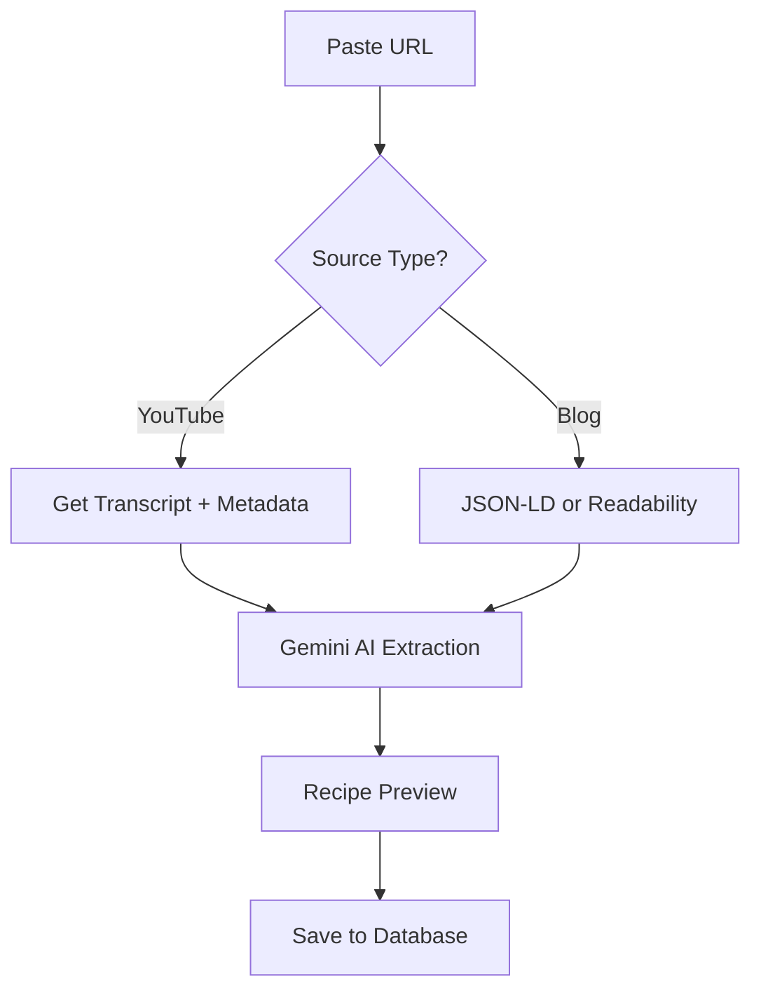

**Capabilities**:
- YouTube video extraction with timestamps
- Blog/recipe site extraction
- JSON-LD schema detection
- Readability fallback
- Dual AI providers (Gemini primary, Claude fallback)
- Macro estimation (calories, protein, carbs, fat, fiber)
- Duplicate URL detection

**Key Files**: `app/lib/youtube.ts`, `app/lib/content-extractor.ts`, `app/lib/gemini.ts`, `app/lib/claude.ts`

### 3. Recipe Collection

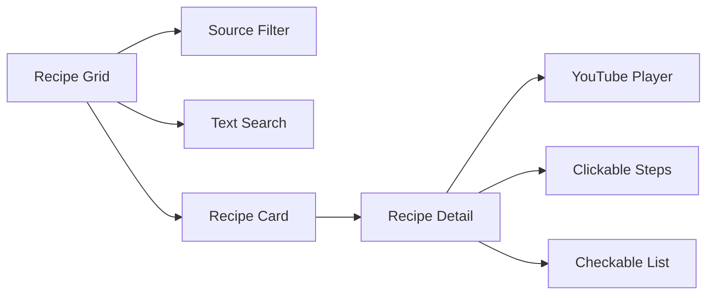

**Capabilities**:
- Grid view with thumbnails
- Filter by source type (YouTube/Blog/All)
- Full-text search
- Recipe detail with embedded YouTube player
- Clickable timestamps in steps
- Checkable ingredient list

**Routes**: `/recipes`, `/recipes/:id`

### 4. Meal Planning

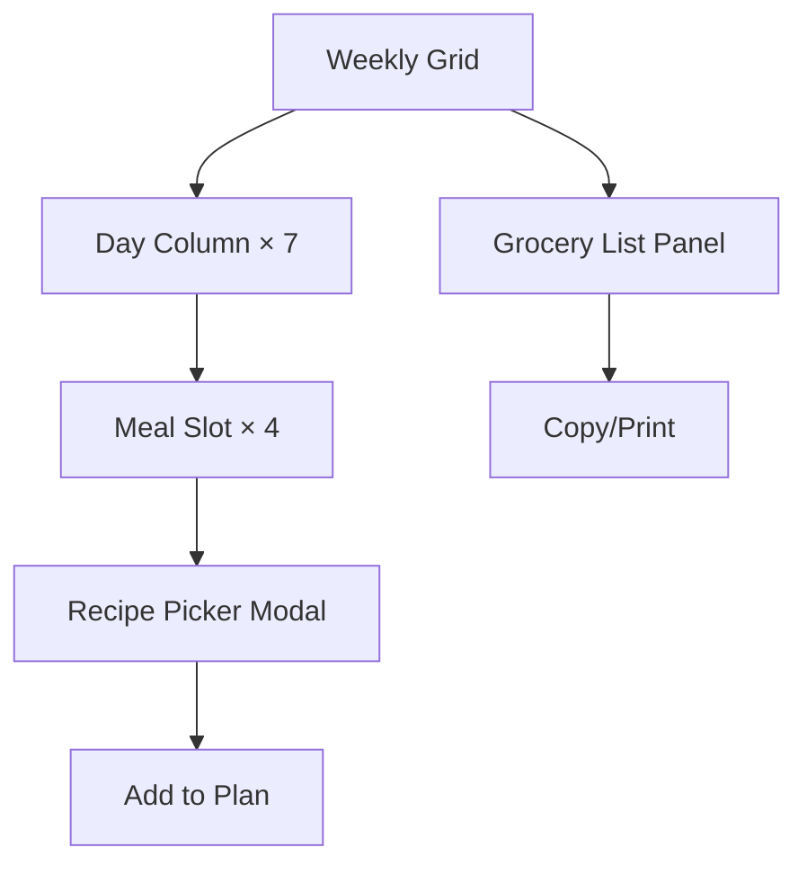

**Capabilities**:
- 7-day × 4-meal grid (breakfast, lunch, dinner, snacks)
- Week navigation (prev/next)
- Recipe picker modal with search
- Auto-aggregated grocery list
- Category-grouped ingredients
- Copy to clipboard / print export
- Daily and weekly macro summaries

**Route**: `/recipes/planner`

### 5. Admin Dashboard

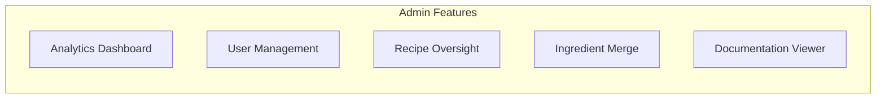

**Capabilities**:
- Analytics charts (time series, stat cards)
- User listing with search
- Ban/unban users
- Impersonate users
- View all recipes
- Ingredient database management
- Merge duplicate ingredients
- Markdown documentation viewer with Mermaid support

**Routes**: `/admin/*`

---

## Component Library

### UI Component Inventory

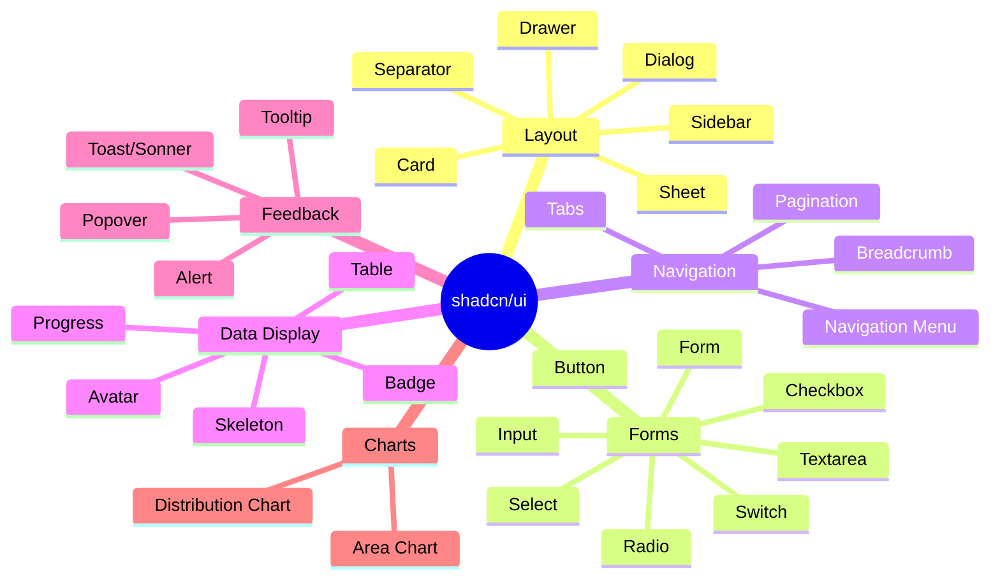

### Feature Components

| Component | Location | Purpose |
|-----------|----------|---------|
| `RecipeCard` | `components/recipes/` | Recipe thumbnail card |
| `RecipeExtractor` | `components/recipes/` | URL input and extraction |
| `RecipePreview` | `components/recipes/` | Preview before save |
| `RecipeSteps` | `components/recipes/` | Steps with timestamps |
| `IngredientsList` | `components/recipes/` | Checkable ingredients |
| `MacrosCard` | `components/recipes/` | Nutrition display |
| `YouTubePlayer` | `components/recipes/` | Embedded video player |
| `WeeklyPlannerGrid` | `components/planner/` | 7-day planner grid |
| `DayColumn` | `components/planner/` | Single day column |
| `MealSlot` | `components/planner/` | Meal type slot |
| `RecipePicker` | `components/planner/` | Recipe selection modal |
| `GroceryListPanel` | `components/planner/` | Aggregated grocery list |
| `MacroSummary` | `components/planner/` | Daily/weekly macros |
| `StatCard` | `components/analytics/` | KPI card |
| `TimeSeriesChart` | `components/analytics/` | Trend charts |
| `DistributionChart` | `components/analytics/` | Pie/donut charts |
| `MarkdownRenderer` | `components/` | Markdown with Mermaid |
| `FileUpload` | `components/` | R2 file uploader |

---

## Design System

### Editorial Cookbook Aesthetic

**Tone**: Warm, artisanal design inspired by classic cookbooks.

### Typography

| Usage | Font | Weight |
|-------|------|--------|
| Display Headlines | Playfair Display | 700 |
| Section Headlines | Playfair Display | 600 |
| Body Text | Source Sans 3 | 400 |
| UI Elements | Source Sans 3 | 500 |

### Color Palette (OKLCH)

| Token | Value | Usage |
|-------|-------|-------|
| `--primary` | `oklch(0.55 0.14 35)` | Terracotta - CTAs, accents |
| `--accent` | `oklch(0.70 0.08 145)` | Sage green - secondary |
| `--background` | `oklch(0.985 0.005 85)` | Warm cream |
| `--card` | `oklch(0.995 0.003 85)` | Card backgrounds |
| `--text-heading` | `oklch(0.25 0.03 35)` | Headings |
| `--text-body` | `oklch(0.35 0.02 35)` | Body text |

### Visual Effects

- **Grain texture**: 3% opacity noise overlay
- **Warm shadows**: Brown-tinted box shadows
- **Motion**: Subtle fade/scale animations (200-300ms)

---

## Current Limitations & Future Opportunities

### What's Missing

1. **Public Recipe Sharing** - No way to share recipes with others
2. **Family Collaboration** - Single-user meal plans only
3. **Offline Mode** - Requires internet connection
4. **Recipe Scaling** - Fixed serving sizes
5. **Video Platform Expansion** - Only YouTube, no TikTok/Instagram
6. **Mobile App** - Web-only, no native apps
7. **Pantry Tracking** - No ingredient inventory
8. **Store Integration** - No Instacart/Amazon Fresh

### Feature Backlog (From Research)

| Priority | Feature | Impact |
|----------|---------|--------|
| 1 | Share Recipe Collections | +7 PMF |
| 2 | Family Collaboration | Medium |
| 3 | TikTok/Instagram Import | High demand |
| 4 | Offline Access | Medium |
| 5 | AI Recipe Generation | Premium tier |
| 6 | Recipe Scaling | Quality of life |

---

*Architecture Overview v1.0 - January 30, 2026*
