# Custom Recipes: Information Architecture

A manual recipe creation feature allowing users to craft and share their own original recipes, displayed separately from URL-extracted recipes on public profiles.

---

## Table of Contents

1. [Overview](#overview)
2. [User Flow](#user-flow)
3. [System Architecture](#system-architecture)
4. [Data Model](#data-model)
5. [Feature Breakdown](#feature-breakdown)
6. [UI Components](#ui-components)
7. [Frontend Design Specification](#frontend-design-specification)
8. [Technical Stack](#technical-stack)
9. [Future Roadmap](#future-roadmap)

---

## Overview

### Vision

Enable home cooks to digitize their family recipes, personal creations, and handwritten notes into a beautifully organized digital format. Custom recipes are showcased separately on public profiles as "Original Recipes" to highlight the user's culinary creativity distinct from their "Collected Recipes" (extracted from the web).

### Core Value Proposition

- **One Input**: Manual form entry with guided structure
- **Key Outputs**: Beautifully formatted recipe card, shareable on public profile, usable in meal planning

### Product Goals

| Goal | Metric | Target |
|------|--------|--------|
| Feature adoption | % of users who create ≥1 custom recipe | 25% within 3 months |
| Profile engagement | Profile views with original recipes | 40% higher than profiles without |
| Recipe completion rate | % of started forms that are saved | >70% |

### Competitive Positioning

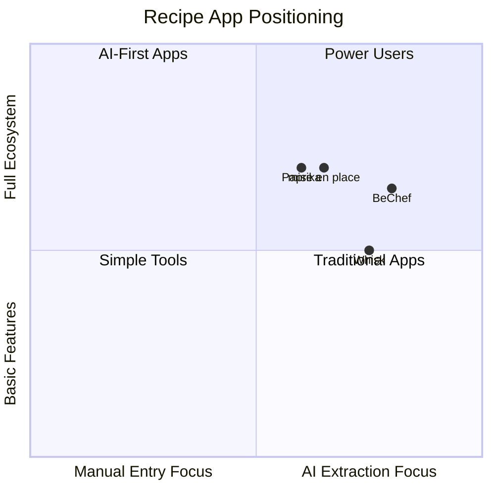

**Differentiation**: Most competitors treat manual entry as a fallback. We position original recipes as a **first-class feature** with dedicated profile showcase, emphasizing the heritage/family recipe preservation angle.

---

## User Flow

### Primary Flow: Creating a Custom Recipe

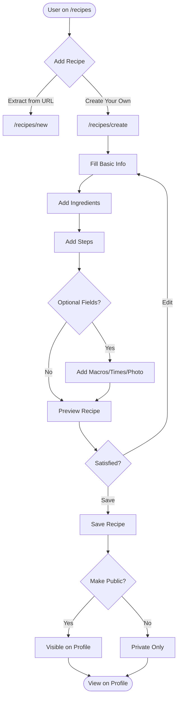

### Form State Machine

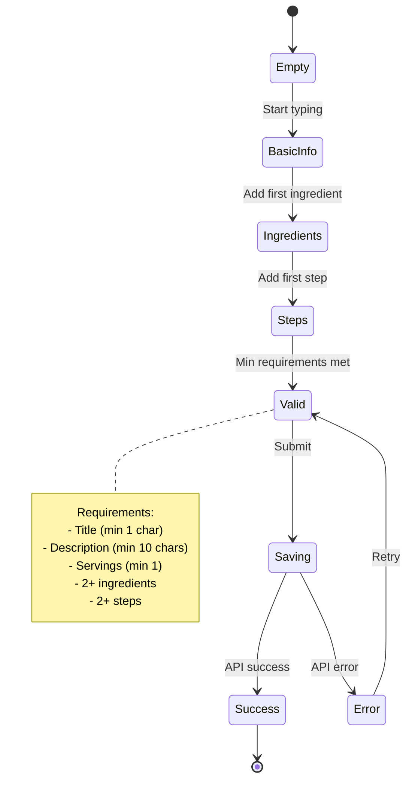

### User Journey Map

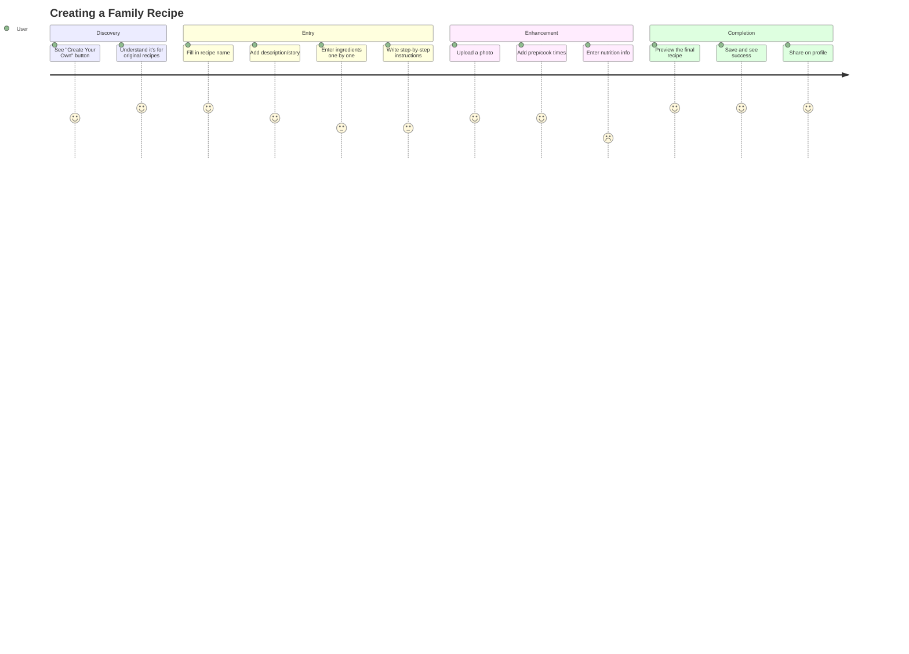

---

## System Architecture

### High-Level Architecture

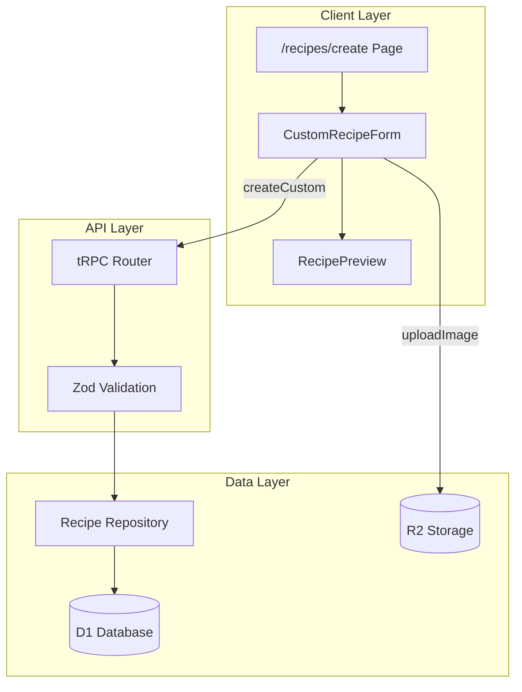

### Processing Pipeline

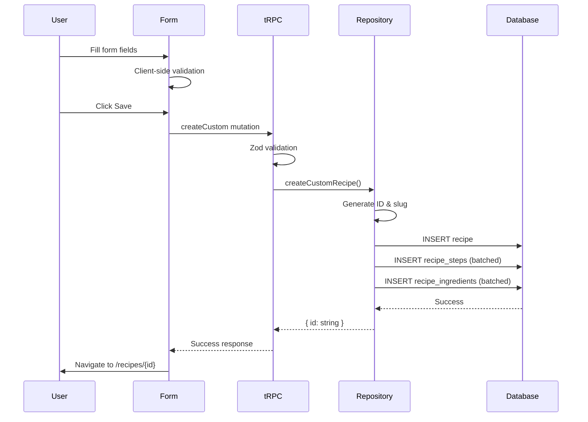

---

## Data Model

### Entity Relationship Diagram

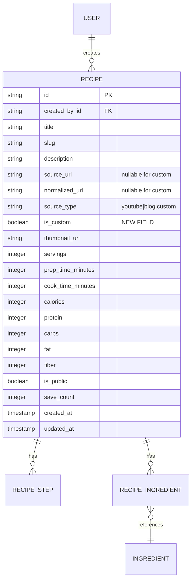

### TypeScript Interfaces

```typescript
// Input for creating custom recipe
interface CreateCustomRecipeInput {
  // Required fields
  title: string;              // min 1 char
  description: string;        // min 10 chars
  servings: number;           // min 1
  ingredients: Array<{
    name: string;
    quantity?: string;
    unit?: string;
    notes?: string;
  }>;                         // min 2 items
  steps: Array<{
    stepNumber: number;
    instruction: string;
  }>;                         // min 2 items
  
  // Optional fields
  thumbnailUrl?: string;
  prepTimeMinutes?: number;
  cookTimeMinutes?: number;
  calories?: number;
  protein?: number;
  carbs?: number;
  fat?: number;
  fiber?: number;
}

// Recipe with isCustom flag
interface RecipeWithType extends Recipe {
  isCustom: boolean;
  sourceType: "youtube" | "blog" | "custom";
}
```

### Schema Changes

```typescript
// app/db/schema.ts additions
export const recipe = sqliteTable("recipe", {
  // ... existing fields ...
  
  // Make nullable for custom recipes
  sourceUrl: text("source_url"),        // Remove .notNull()
  normalizedUrl: text("normalized_url"), // Remove .notNull()
  
  // New field
  isCustom: integer("is_custom", { mode: "boolean" })
    .default(false)
    .notNull(),
    
  // Update sourceType enum
  sourceType: text("source_type", { 
    enum: ["youtube", "blog", "custom"] 
  }).notNull(),
});
```

---

## Feature Breakdown

### Feature 1: Recipe Creation Form

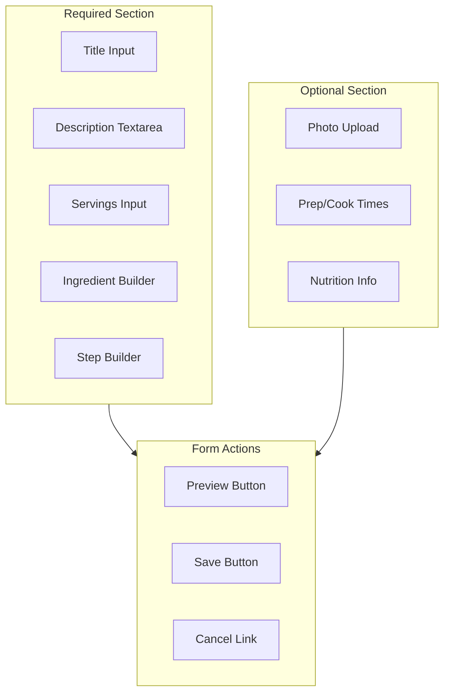

**Ingredient Builder Specifications:**
- Add ingredient button reveals input row
- Fields: Name (required), Quantity, Unit, Notes
- Drag-to-reorder capability
- Delete button on each row
- Auto-focus on name field when adding

**Step Builder Specifications:**
- Auto-numbered steps
- Textarea for each instruction
- Add step button
- Drag-to-reorder
- Delete button per step
- One clear action per step guidance

### Feature 2: Public Profile Sections

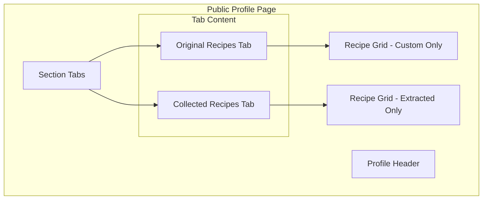

**Tab Behavior:**
- Default: "Original Recipes" if user has any, else "Collected Recipes"
- Show count in tab label: "Original Recipes (5)"
- URL updates with tab state: `/u/username?tab=original`
- Empty state per tab with contextual messaging

### Feature 3: Recipe Index Integration

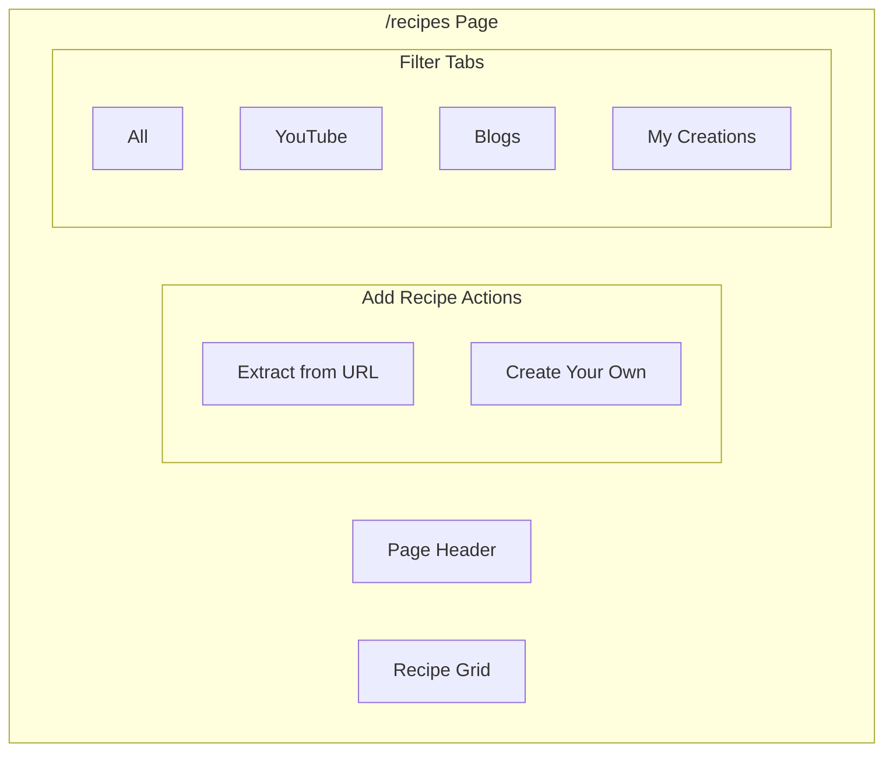

---

## UI Components

### Component Hierarchy

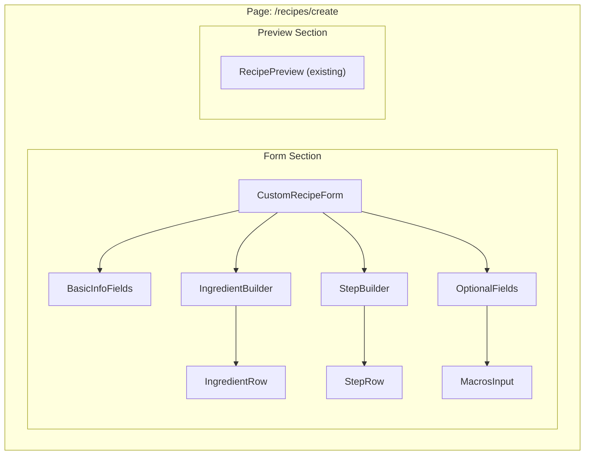

### Screen Wireframes

#### Screen: Create Recipe Page

```
┌─────────────────────────────────────────────────────────────────┐
│ ← Back to Recipes                                               │
├─────────────────────────────────────────────────────────────────┤
│                                                                 │
│   Create Your Own Recipe                                        │
│   Capture your culinary creations in your personal cookbook     │
│                                                                 │
├─────────────────────────────────────────────────────────────────┤
│ ┌─────────────────────────────────────────────────────────────┐ │
│ │ Recipe Name *                                               │ │
│ │ ┌─────────────────────────────────────────────────────────┐ │ │
│ │ │ Grandma's Apple Pie                                     │ │ │
│ │ └─────────────────────────────────────────────────────────┘ │ │
│ │                                                             │ │
│ │ Description *                                               │ │
│ │ ┌─────────────────────────────────────────────────────────┐ │ │
│ │ │ A cherished family recipe passed down through           │ │ │
│ │ │ generations. The secret is in the spice blend...        │ │ │
│ │ └─────────────────────────────────────────────────────────┘ │ │
│ │                                                             │ │
│ │ ┌─────────────┐  ┌─────────────┐  ┌─────────────┐          │ │
│ │ │ Servings *  │  │ Prep Time   │  │ Cook Time   │          │ │
│ │ │ [    8    ] │  │ [ 30 min  ] │  │ [ 45 min  ] │          │ │
│ │ └─────────────┘  └─────────────┘  └─────────────┘          │ │
│ └─────────────────────────────────────────────────────────────┘ │
│                                                                 │
│ ┌─────────────────────────────────────────────────────────────┐ │
│ │ Ingredients * (minimum 2)                                   │ │
│ │                                                             │ │
│ │ ┌────────────────────────────────────────────────────────┐  │ │
│ │ │ [2   ] [cups ] [all-purpose flour        ] [≡] [×]    │  │ │
│ │ └────────────────────────────────────────────────────────┘  │ │
│ │ ┌────────────────────────────────────────────────────────┐  │ │
│ │ │ [1   ] [cup  ] [butter, cold and cubed   ] [≡] [×]    │  │ │
│ │ └────────────────────────────────────────────────────────┘  │ │
│ │ ┌────────────────────────────────────────────────────────┐  │ │
│ │ │ [6   ] [     ] [Granny Smith apples      ] [≡] [×]    │  │ │
│ │ └────────────────────────────────────────────────────────┘  │ │
│ │                                                             │ │
│ │ [+ Add Ingredient]                                          │ │
│ └─────────────────────────────────────────────────────────────┘ │
│                                                                 │
│ ┌─────────────────────────────────────────────────────────────┐ │
│ │ Steps * (minimum 2)                                         │ │
│ │                                                             │ │
│ │ ┌────────────────────────────────────────────────────────┐  │ │
│ │ │ 1. Combine flour and salt in a large bowl. Cut in     │  │ │
│ │ │    butter until mixture resembles coarse crumbs.       │  │ │
│ │ │                                            [≡] [×]    │  │ │
│ │ └────────────────────────────────────────────────────────┘  │ │
│ │ ┌────────────────────────────────────────────────────────┐  │ │
│ │ │ 2. Peel, core, and slice apples into 1/4 inch         │  │ │
│ │ │    slices. Toss with sugar, cinnamon, and nutmeg.     │  │ │
│ │ │                                            [≡] [×]    │  │ │
│ │ └────────────────────────────────────────────────────────┘  │ │
│ │                                                             │ │
│ │ [+ Add Step]                                                │ │
│ └─────────────────────────────────────────────────────────────┘ │
│                                                                 │
│ ┌─────────────────────────────────────────────────────────────┐ │
│ │ ▼ Nutrition (optional)                                      │ │
│ │                                                             │ │
│ │ [Calories] [Protein] [Carbs] [Fat] [Fiber]                  │ │
│ │ [  350   ] [  4g   ] [ 45g ] [18g] [  2g ]                  │ │
│ └─────────────────────────────────────────────────────────────┘ │
│                                                                 │
│ ┌─────────────────────────────────────────────────────────────┐ │
│ │ Recipe Photo (optional)                                     │ │
│ │ ┌───────────────────────────────────────────┐               │ │
│ │ │                                           │               │ │
│ │ │     📷 Click to upload or drag & drop     │               │ │
│ │ │         PNG, JPG up to 5MB                │               │ │
│ │ │                                           │               │ │
│ │ └───────────────────────────────────────────┘               │ │
│ └─────────────────────────────────────────────────────────────┘ │
│                                                                 │
│         [Cancel]                    [Preview] [Save Recipe]     │
│                                                                 │
└─────────────────────────────────────────────────────────────────┘
```

#### Screen: Public Profile with Tabs

```
┌─────────────────────────────────────────────────────────────────┐
│ [mise en place logo]                            [Sign In]       │
├─────────────────────────────────────────────────────────────────┤
│                                                                 │
│   ┌───────┐                                                     │
│   │ Avatar│  Chef Maria                                         │
│   │       │  @mariascooks                                       │
│   └───────┘  Home cook passionate about Italian cuisine         │
│              and family recipes from Nonna.                     │
│                                                                 │
│   12 Recipes  ·  48 Saves  ·  Member since Jan 2026  [Share]    │
│                                                                 │
├─────────────────────────────────────────────────────────────────┤
│                                                                 │
│   [Original Recipes (5)]  |  Collected Recipes (7)              │
│   ────────────────────                                          │
│                                                                 │
│   ┌─────────────┐  ┌─────────────┐  ┌─────────────┐            │
│   │   🍝        │  │   🥧        │  │   🍪        │            │
│   │             │  │             │  │             │            │
│   │ Nonna's     │  │ Apple Pie   │  │ Chocolate   │            │
│   │ Bolognese   │  │             │  │ Chip Cookies│            │
│   │             │  │             │  │             │            │
│   │ ★ Original  │  │ ★ Original  │  │ ★ Original  │            │
│   └─────────────┘  └─────────────┘  └─────────────┘            │
│                                                                 │
└─────────────────────────────────────────────────────────────────┘
```

### Component Specifications

#### `CustomRecipeForm`

```markdown
**Purpose**: Main form component for creating custom recipes

**Props**:
| Prop | Type | Required | Description |
|------|------|----------|-------------|
| onSuccess | (id: string) => void | Yes | Called after successful save |
| onCancel | () => void | Yes | Called when user cancels |

**States**: idle, validating, submitting, error, success

**Form Fields** (via React Hook Form):
- title: string (min 1)
- description: string (min 10)
- servings: number (min 1)
- ingredients: array (min 2)
- steps: array (min 2)
- prepTimeMinutes: number (optional)
- cookTimeMinutes: number (optional)
- calories, protein, carbs, fat, fiber: number (all optional)
- thumbnailUrl: string (optional, from upload)
```

#### `IngredientBuilder`

```markdown
**Purpose**: Dynamic list builder for ingredients

**Props**:
| Prop | Type | Required | Description |
|------|------|----------|-------------|
| value | Ingredient[] | Yes | Current ingredients |
| onChange | (ingredients: Ingredient[]) => void | Yes | Update handler |
| error | string | No | Validation error message |

**Features**:
- Add/remove ingredient rows
- Drag-to-reorder (react-beautiful-dnd or @dnd-kit)
- Inline validation per row
- Auto-focus on new row
```

#### `StepBuilder`

```markdown
**Purpose**: Dynamic list builder for recipe steps

**Props**:
| Prop | Type | Required | Description |
|------|------|----------|-------------|
| value | Step[] | Yes | Current steps |
| onChange | (steps: Step[]) => void | Yes | Update handler |
| error | string | No | Validation error message |

**Features**:
- Auto-numbered steps (1, 2, 3...)
- Textarea for instructions
- Drag-to-reorder
- Delete button per step
- Minimum 2 steps enforcement
```

---

## Frontend Design Specification

### Aesthetic Direction

**Tone**: Editorial cookbook with warm, inviting form design
**Memorable Element**: The ingredient and step builders feel like writing in a physical recipe card

### Typography

| Usage | Font | Weight | Size |
|-------|------|--------|------|
| Page Title | Playfair Display | 600 | 2.25rem |
| Section Headers | Playfair Display | 500 | 1.25rem |
| Form Labels | Source Sans 3 | 500 | 0.875rem |
| Input Text | Source Sans 3 | 400 | 1rem |
| Helper Text | Source Sans 3 | 400 | 0.75rem |

### Color Usage

| Element | Token | Usage |
|---------|-------|-------|
| Required field indicator | `--primary` (terracotta) | Asterisk and focus ring |
| Form card background | `--card` | Slightly elevated from page |
| Section dividers | `--border` with 50% opacity | Subtle separation |
| Success state | `--accent` (sage) | Save confirmation |
| Error state | `--destructive` | Validation errors |

### Motion Design

- **Form sections**: Fade-in on page load with 75ms stagger
- **Add ingredient/step**: Slide-down with spring animation (200ms)
- **Delete row**: Fade-out + collapse (150ms)
- **Drag reorder**: Subtle shadow elevation while dragging
- **Save button**: Pulse animation when form becomes valid

### Visual Effects

- Form container: `shadow-warm` from design system
- Section cards: Subtle grain texture overlay (matches cookbook aesthetic)
- Photo upload zone: Dashed border with hover state
- Success toast: Warm celebration with recipe card preview

---

## UI Concepts

Visual mockups for the custom recipes feature, following the editorial cookbook aesthetic.

### Concept 1: Recipe Creation Form


**Visual Direction**: Warm, editorial cookbook feel with clear form hierarchy
**Key Design Elements**:
- Numbered sections (Basic Info, Ingredients, Steps) for clear progression
- Terracotta accent color for required field indicators and action buttons
- Drag handles and delete buttons for list management
- Collapsible nutrition section to reduce visual clutter
- Dashed photo upload zone with camera icon
- Cream background with subtle warm shadows

**Form Structure**:
- Required fields marked with terracotta asterisks
- Inline fields for servings and times to save vertical space
- Dynamic ingredient rows with quantity, unit, and name inputs
- Auto-numbered step textareas
- Preview and Save buttons in terracotta theme

### Concept 2: Public Profile with Recipe Tabs


**Visual Direction**: Clean profile showcase highlighting original creations
**Key Design Elements**:
- Tab navigation separating "Original Recipes" from "Collected Recipes"
- Active tab with terracotta underline indicator
- Recipe counts in tab labels for quick reference
- "Original" badge on custom recipe cards
- Consistent recipe card grid layout

**Profile Structure**:
- Avatar with initials fallback
- Display name in Playfair Display serif font
- Username and bio for personality
- Stats row with recipe count, saves, and join date
- Share button for profile sharing

---

## Technical Stack

### Stack Overview

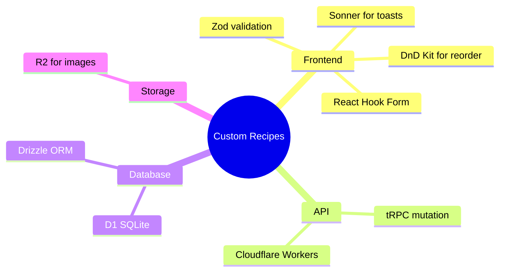

### API Endpoints

| Endpoint | Method | Description | Auth |
|----------|--------|-------------|------|
| `recipes.createCustom` | mutation | Create custom recipe | Protected |
| `recipes.list` | query | List recipes (add isCustom filter) | Protected |
| `profile.getPublicRecipes` | query | Updated to return separated lists | Public |

### Dependencies

```bash
# No new dependencies required
# Using existing:
# - react-hook-form (forms)
# - zod (validation)
# - @dnd-kit/core (drag and drop) - may need to add
# - sonner (toasts)
```

---

## Future Roadmap

### Phase 1 (Current Scope)

- [x] Schema changes for custom recipes
- [x] Create recipe form with validation
- [x] Repository and tRPC mutations
- [x] Public profile tab separation
- [x] Recipe index integration

### Phase 2 (Future)

- Recipe versioning (track changes over time)
- Recipe forking (clone and modify others' recipes)
- Recipe templates (start from common bases)
- AI assistance for nutrition estimation
- Recipe card PDF export

### Phase 3 (Long-term)

- Family/group recipe sharing
- Recipe collections/cookbooks
- Print-friendly recipe cards
- Recipe video recording integration

---

## Implementation Checklist

Based on plan-with-subagents workflow:

- [ ] **Task 1**: Schema + Migration (`generalPurpose`)
- [ ] **Task 2**: Repository layer (`generalPurpose`)
- [ ] **Task 3**: tRPC routes (`generalPurpose`)
- [ ] **Task 4**: CustomRecipeForm component (`generalPurpose`)
- [ ] **Task 5**: /recipes/create route (`generalPurpose`)
- [ ] **Task 6**: Profile tRPC updates (`generalPurpose`)
- [ ] **Task 7**: Profile UI tabs (`generalPurpose`)
- [ ] **Task 8**: Recipe index button (`generalPurpose`)
- [ ] **Task 9**: Testing with Playwright (`tester`)
- [ ] **Task 10**: Update context.md (`context-keeper`)

---

*Architecture Document v1.0 — Custom Recipes Feature*
