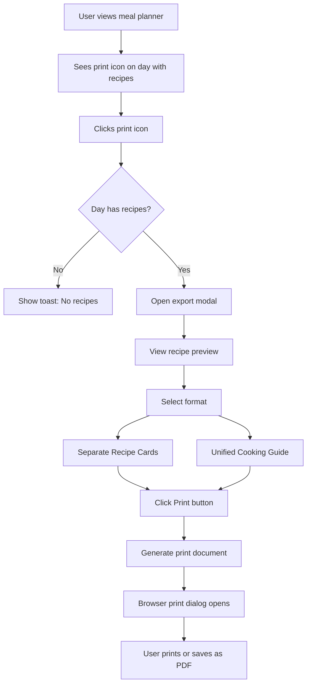
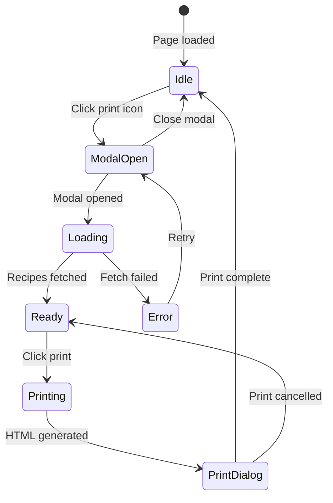
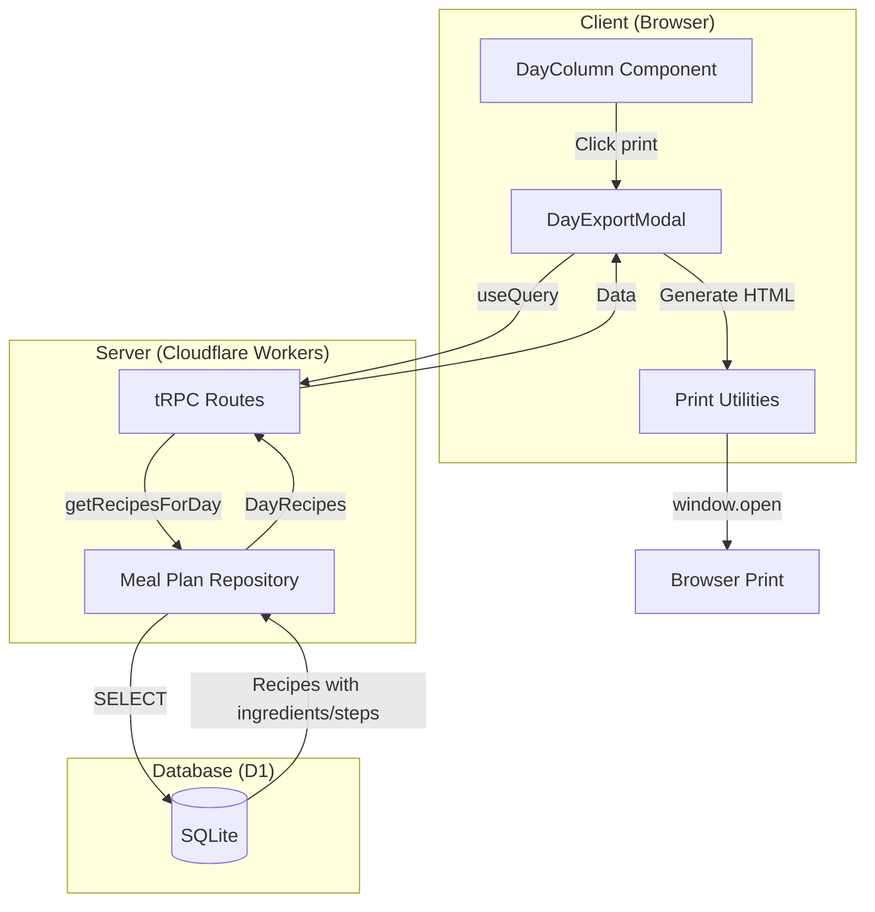
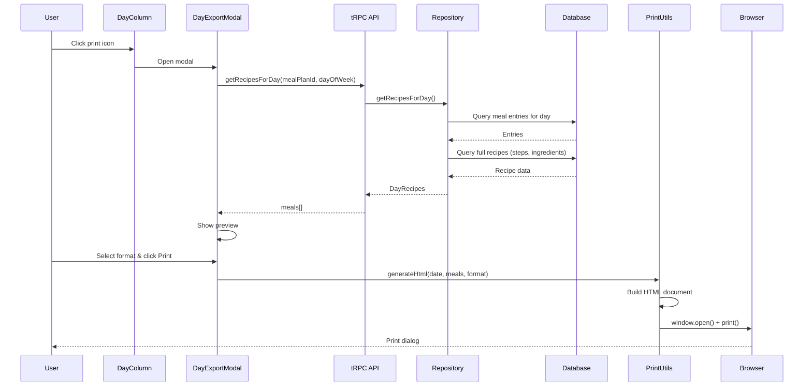
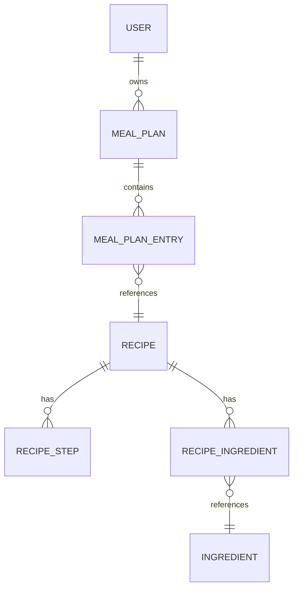
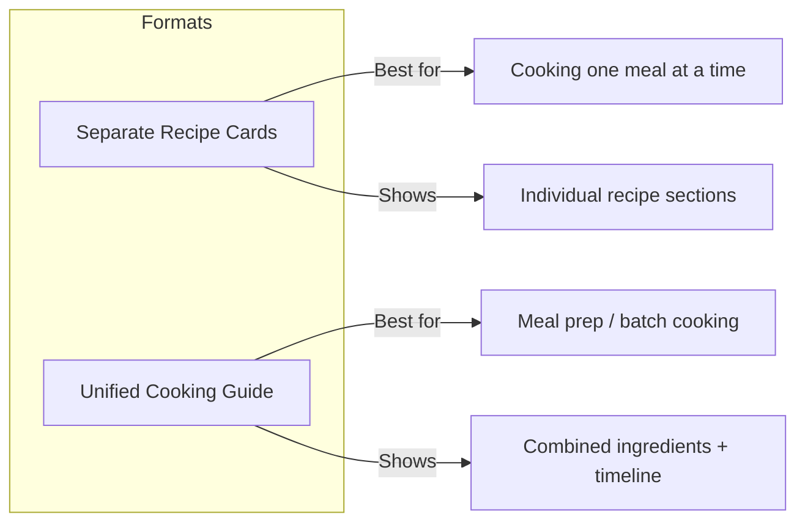
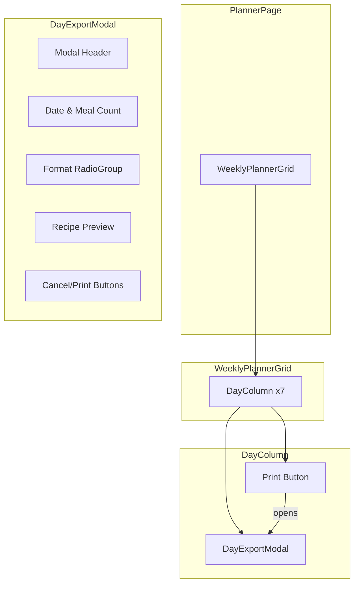
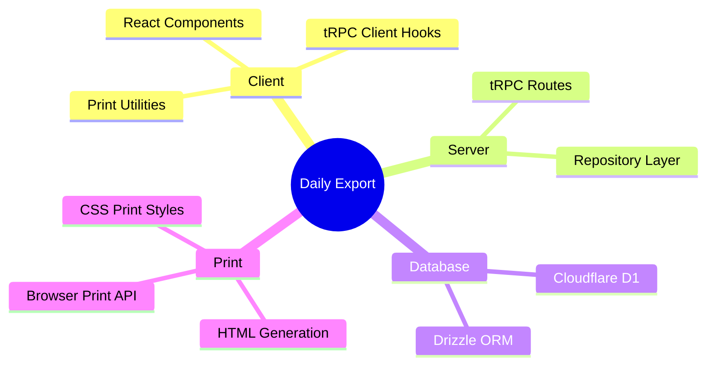

# Daily Meal Export: Information Architecture

Export recipes and cooking instructions for a day's meals from the meal planner, with two format options: separate recipe cards or a unified cooking guide.

---

## Table of Contents

1. [Overview](#overview)
2. [User Flow](#user-flow)
3. [System Architecture](#system-architecture)
4. [Data Model](#data-model)
5. [Feature Breakdown](#feature-breakdown)
6. [UI Components](#ui-components)
7. [Frontend Design Specification](#frontend-design-specification)
8. [Technical Stack](#technical-stack)
9. [Future Roadmap](#future-roadmap)

---

## Overview

### Vision

Home cooks with planned meals want a quick way to print their day's recipes for cooking without constantly checking their phone or computer. The daily meal export feature provides two print formats optimized for different cooking styles.

### Core Value Proposition

- **One Click**: Print button visible on each day with recipes
- **Two Formats**: Separate recipe cards or unified cooking guide
- **Print-Optimized**: Clean typography, checkboxes for ingredients, clear step numbering

### User Story

As a home cook with meals planned, I want to print my day's recipes so I can cook without checking my phone/computer.

---

## User Flow

### Primary Flow Diagram



### Detailed State Machine



---

## System Architecture

### High-Level Architecture



### Processing Pipeline



---

## Data Model

### Entity Relationship (Existing)



### TypeScript Data Structures

```typescript
// Input to getRecipesForDay
interface GetRecipesForDayInput {
  mealPlanId: string;
  userId: string;
  dayOfWeek: number; // 0=Monday, 6=Sunday
}

// Full recipe data for export
interface RecipeForExport {
  id: string;
  title: string;
  description: string | null;
  sourceUrl: string;
  sourceType: "youtube" | "blog";
  thumbnailUrl: string | null;
  servings: number | null;
  prepTimeMinutes: number | null;
  cookTimeMinutes: number | null;
  calories: number | null;
  protein: number | null;
  carbs: number | null;
  fat: number | null;
  fiber: number | null;
  steps: Array<{
    id: string;
    stepNumber: number;
    instruction: string;
    timestampSeconds: number | null;
    durationSeconds: number | null;
  }>;
  ingredients: Array<{
    id: string;
    quantity: string | null;
    unit: string | null;
    notes: string | null;
    ingredient: {
      id: string;
      name: string;
      category: string | null;
    };
  }>;
}

// Meal entry for a day
interface MealForExport {
  mealType: "breakfast" | "lunch" | "dinner" | "snacks";
  recipe: RecipeForExport;
}

// API response
interface DayRecipes {
  dayOfWeek: number;
  meals: MealForExport[];
}
```

---

## Feature Breakdown

### Feature 1: Print Button on Day Column

Entry point for the export feature, visible when a day has at least one recipe.

**Behavior:**
- Hidden when no recipes for the day
- Hidden during loading states
- Positioned in top-right of day header
- Opens export modal on click

### Feature 2: Export Format Selection

Modal allows users to choose between two print formats.



### Feature 3: Print Document Generation

Generates optimized HTML for printing with proper typography and layout.

**Separate Recipe Cards Format:**
- Each recipe as a distinct section
- Page break avoidance for recipes
- Ingredients grouped by category with checkboxes
- Numbered steps
- Macros summary per recipe

**Unified Cooking Guide Format:**
- Combined shopping list (aggregated ingredients)
- Cooking timeline organized by meal type
- Daily macro totals
- Single cohesive document

---

## UI Components

### Component Hierarchy



### Screen Wireframes

#### Day Column with Print Button

```
┌─────────────────────────────────┐
│  Mon                      [🖨️]  │
│   27                            │
│  Calories: 1,850                │
├─────────────────────────────────┤
│ BREAKFAST                       │
│ ┌─────────────────────────────┐ │
│ │ Avocado Toast               │ │
│ └─────────────────────────────┘ │
│ LUNCH                           │
│ ┌─────────────────────────────┐ │
│ │ Caesar Salad                │ │
│ └─────────────────────────────┘ │
│ DINNER                          │
│ ┌─────────────────────────────┐ │
│ │ Grilled Salmon              │ │
│ └─────────────────────────────┘ │
│ SNACKS                          │
│ ┌─────────────────────────────┐ │
│ │ + Add recipe                │ │
│ └─────────────────────────────┘ │
└─────────────────────────────────┘
```

#### Export Modal

```
┌─────────────────────────────────────────┐
│ Print Day's Recipes                   ✕ │
├─────────────────────────────────────────┤
│                                         │
│ Monday, January 27                      │
│ 3 recipes planned                       │
│                                         │
│ ┌─────────────────────────────────────┐ │
│ │ ○ Separate Recipe Cards             │ │
│ │   Each recipe printed as its own    │ │
│ │   section with ingredients & steps  │ │
│ └─────────────────────────────────────┘ │
│                                         │
│ ┌─────────────────────────────────────┐ │
│ │ ● Unified Cooking Guide             │ │
│ │   Combined shopping list and        │ │
│ │   cooking timeline for the day      │ │
│ └─────────────────────────────────────┘ │
│                                         │
│ ┌─────────────────────────────────────┐ │
│ │ INCLUDED RECIPES                    │ │
│ │ BREAKFAST  Avocado Toast            │ │
│ │ LUNCH      Caesar Salad             │ │
│ │ DINNER     Grilled Salmon           │ │
│ └─────────────────────────────────────┘ │
│                                         │
├─────────────────────────────────────────┤
│                        [Cancel] [Print] │
└─────────────────────────────────────────┘
```

---

## Frontend Design Specification

### Aesthetic Direction

**Tone**: Editorial cookbook - warm, readable, practical

Follows the established mise en place design system with print-optimized styling.

### Typography

| Usage | Font | Weight |
|-------|------|--------|
| Recipe titles | Playfair Display | 600 |
| Section headers | Source Sans 3 | 600 |
| Body text | Source Sans 3 | 400 |
| Meta info | Source Sans 3 | 400 |

### Print Styling

| Element | Style |
|---------|-------|
| Ingredient checkboxes | 14px square, 1.5px border |
| Step numbers | 28px circle, muted background |
| Section dividers | 1px dotted border |
| Page margins | 0.5in for print |

### Color Palette (Print)

| Token | Value | Usage |
|-------|-------|-------|
| Text | #1a1a1a | Primary content |
| Muted | #666666 | Secondary text, labels |
| Border | #e5e5e5 | Section dividers |
| Background | #f5f5f5 | Badges, step numbers |
| Checkbox border | #999999 | Ingredient checkboxes |

---

## Technical Stack

### Stack Overview



### API Endpoints

| Method | Route | Input | Output |
|--------|-------|-------|--------|
| Query | `mealPlan.getRecipesForDay` | `{ mealPlanId, dayOfWeek }` | `DayRecipes` |

### Key Files

| Layer | File | Purpose |
|-------|------|---------|
| Repository | `app/repositories/meal-plan.ts` | `getRecipesForDay()` function |
| tRPC | `app/trpc/routes/meal-plan.ts` | `getRecipesForDay` query |
| Print Utils | `app/lib/print/day-recipes.ts` | HTML generators |
| Modal | `app/components/planner/day-export-modal.tsx` | Export modal component |
| Day Column | `app/components/planner/day-column.tsx` | Print button integration |

---

## Future Roadmap

### Phase 1 (Current)

- [x] Print button on day columns
- [x] Export modal with format selection
- [x] Separate recipe cards format
- [x] Unified cooking guide format
- [x] Print-optimized styling

### Phase 2+

- [ ] Save as PDF option (client-side)
- [ ] Email day's recipes
- [ ] Share day's meal plan link
- [ ] Custom export templates
- [ ] Multi-day export (date range)
- [ ] Scaling servings at export time

---

*Architecture Document v1.0*
