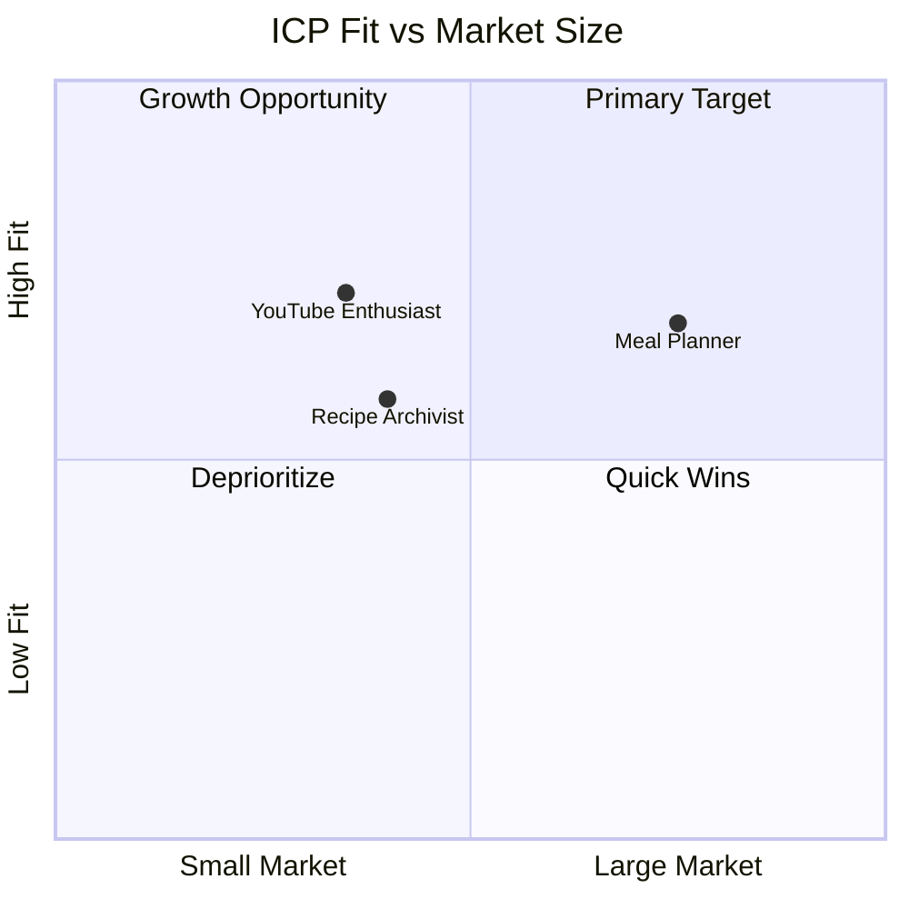
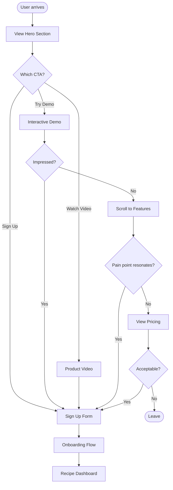
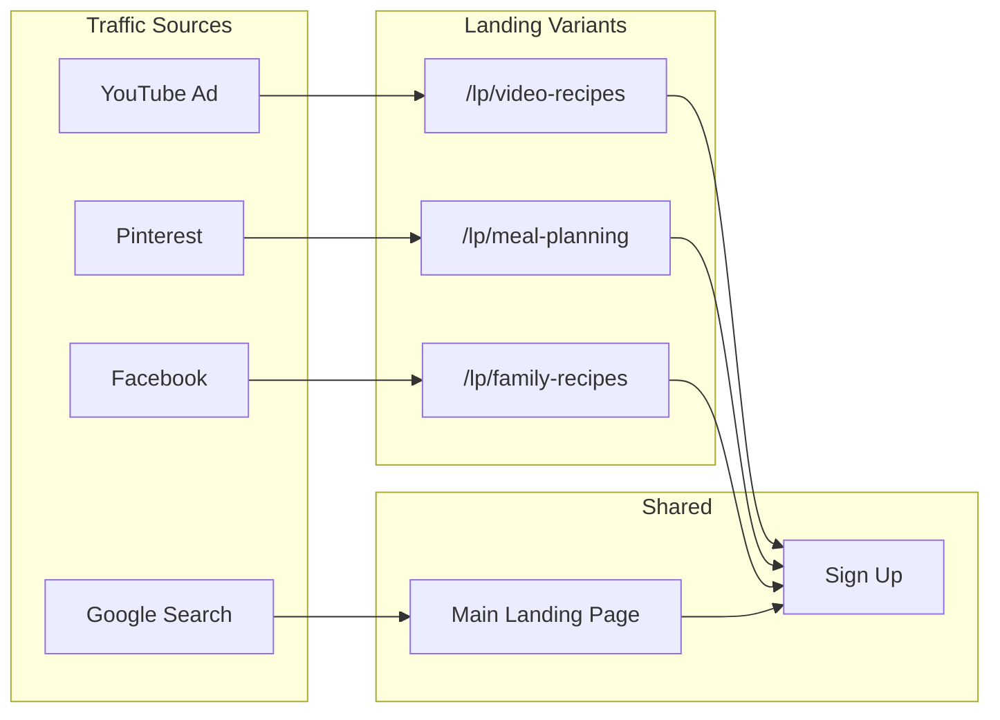
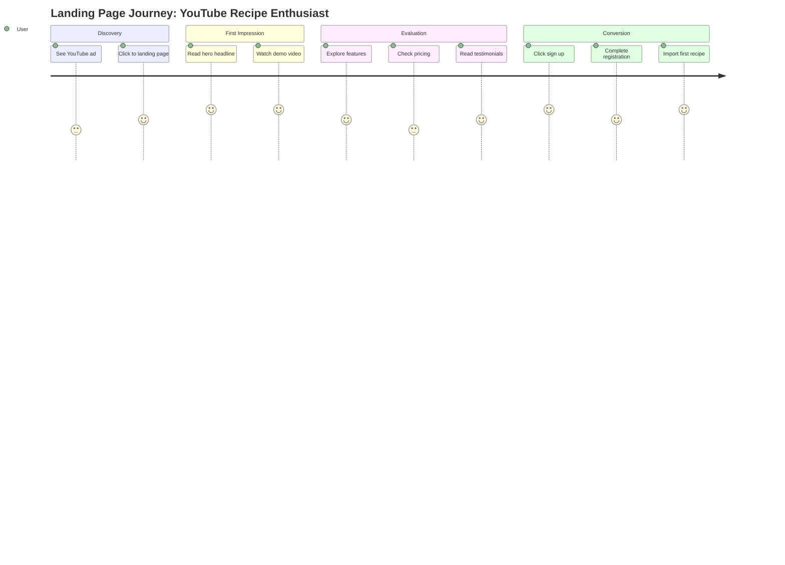
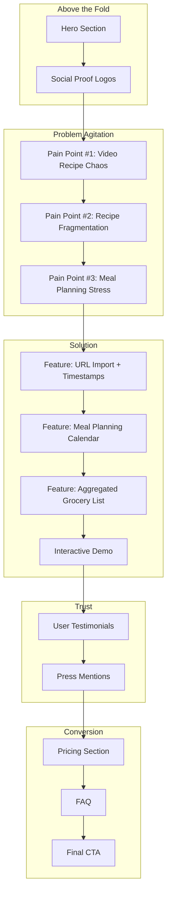
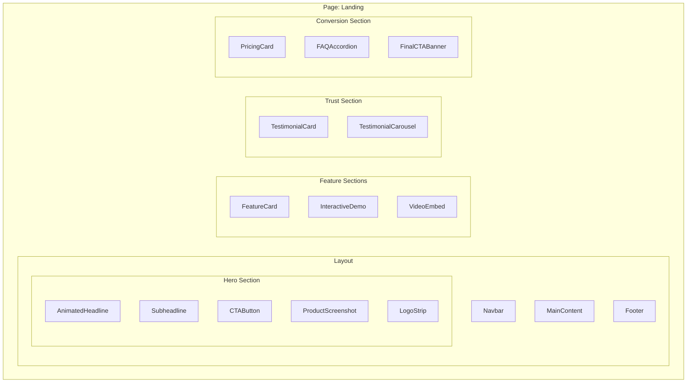
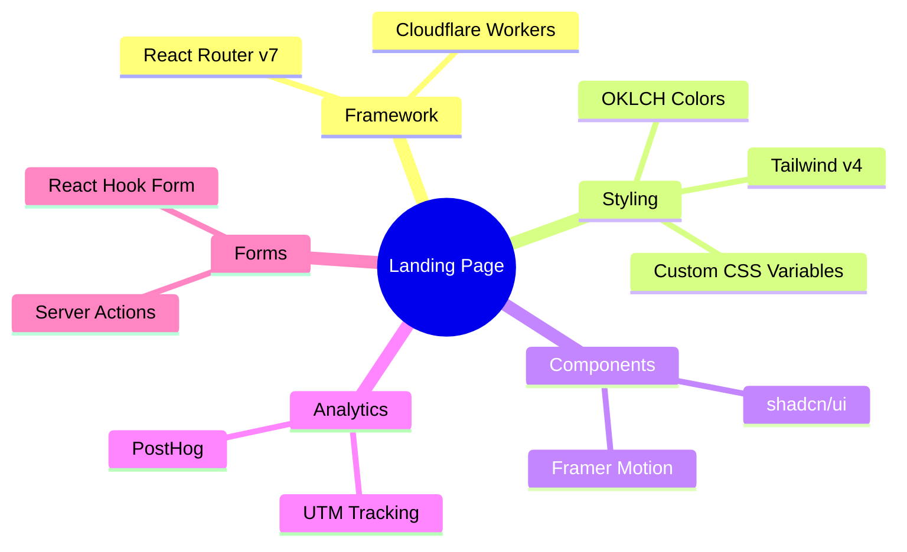

# Landing Page: Information Architecture

A conversion-focused landing page for mise en place, targeting three distinct ICPs with tailored messaging and visual design.

---

## Table of Contents

1. [Overview](#overview)
2. [ICP Analysis](#icp-analysis)
3. [User Flow](#user-flow)
4. [Competitive Positioning](#competitive-positioning)
5. [Content Strategy](#content-strategy)
6. [UI Components](#ui-components)
7. [Frontend Design Specification](#frontend-design-specification)
8. [UI Concepts](#ui-concepts)
9. [Technical Stack](#technical-stack)
10. [Future Roadmap](#future-roadmap)

---

## Overview

### Vision
Create a landing page that immediately communicates mise en place's unique value proposition—**video recipe management with timestamp preservation**—while addressing the specific pain points of each target audience segment.

### Core Value Proposition
- **One Input**: Paste a URL from YouTube, TikTok, or any food blog
- **Key Outputs**: 
  - Clean, organized recipe with ingredients and steps
  - Video timestamps for easy reference while cooking
  - Automatic weekly meal planning with grocery lists

### Market Context
The recipe app market is projected to reach **$2,268M by 2033** (from $724.4M in 2024), with AI meal planning growing at **16.64% CAGR**. However, AI-powered URL extraction has become table stakes—our differentiation lies in **video timestamp preservation**, a feature where competitors demonstrably fail.

---

## ICP Analysis

### Competitive Positioning



### ICP 1: YouTube Recipe Enthusiast
**Fit Score: 72/100** | Primary Target

| Attribute | Detail |
|-----------|--------|
| **Demographics** | Tech-comfortable home cooks, aged 25-40 |
| **Discovery** | YouTube cooking channels, TikTok, Instagram Reels |
| **Primary Pain** | Existing apps fail to import YouTube recipes or lose video links during import |
| **Secondary Pain** | Manually writing down ingredients from videos wastes time and creates errors |
| **Key Feature Need** | Video timestamp preservation with in-app playback |
| **Willingness to Pay** | Medium-high for video-specific features |

**Messaging Focus**: "Finally, a recipe app that speaks video"

**Hero Copy Options**:
- "Stop pausing. Start cooking."
- "Your YouTube recipes, organized with timestamps"
- "The only recipe app built for video"

### ICP 2: Overwhelmed Meal Planner
**Fit Score: 68/100** | Secondary Target

| Attribute | Detail |
|-----------|--------|
| **Demographics** | Busy parents, aged 30-50, dual-income households |
| **Discovery** | Pinterest, parenting blogs, word-of-mouth |
| **Primary Pain** | Juggling a "chaotic mix" of cookbooks, browser tabs, and apps makes cooking stressful |
| **Secondary Pain** | Planning meals for families requires coordinating dietary preferences, budgets, time |
| **Key Feature Need** | Integrated meal planning calendar + automated grocery lists |
| **Willingness to Pay** | Medium; price-sensitive, prefer one-time purchase |

**Messaging Focus**: "Meal planning, finally simplified"

**Hero Copy Options**:
- "What's for dinner? Finally answered."
- "One week planned. One list generated. One app."
- "Meal planning for busy families who actually cook"

### ICP 3: Analog Recipe Archivist
**Fit Score: 58/100** | Tertiary Target

| Attribute | Detail |
|-----------|--------|
| **Demographics** | Home cooks aged 40-65, recipe collectors |
| **Discovery** | Facebook groups, family referrals |
| **Primary Pain** | Physical recipe cards are fragile and at risk of being lost |
| **Secondary Pain** | Emotional attachment to handwritten recipes makes digital transition feel like loss |
| **Key Feature Need** | Easy digitization + family sharing + legacy preservation |
| **Willingness to Pay** | Medium for preservation features; values one-time pricing |

**Messaging Focus**: "Preserve your family's food story"

**Hero Copy Options**:
- "Grandma's recipes, safe forever"
- "From kitchen cards to digital keepsakes"
- "Keep your family recipes. Share the tradition."

---

## User Flow

### Primary Landing Page Flow



### ICP-Specific Entry Points



### User Journey Map



---

## Competitive Positioning

### Feature Comparison Matrix

| Feature | mise en place | Paprika | Samsung Food | AnyList |
|---------|--------------|---------|--------------|---------|
| URL Import | ✓ | ✓ | ✓ | ✓ |
| **YouTube Timestamps** | ✓ | ✗ | ✗ | ✗ |
| **In-App Video Playback** | ✓ | ✗ | ✗ | ✗ |
| TikTok/Reels Import | ✓ | ✗ | Partial | ✗ |
| Meal Planning | ✓ | ✓ | ✓ | ✓ |
| Grocery List | ✓ | ✓ | ✓ | ✓ |
| Recipe Scaling | ✓ | ✓ | ✓ | ✗ |
| Offline Mode | ✓ | ✓ | ✗ | ✓ |
| One-Time Purchase | ✓ | ✓ | ✗ (Subscription) | ✓ |

### Positioning Statement
"For home cooks who discover recipes on YouTube, mise en place is the recipe management app that preserves video timestamps and provides in-app playback, unlike traditional recipe apps that only work with text-based blogs."

---

## Content Strategy

### Above-the-Fold Content (Hero)

**Universal Hero Structure**:
1. **Headline**: Problem-aware hook
2. **Subheadline**: Solution statement with key differentiator
3. **Visual**: Product screenshot or demo video
4. **Primary CTA**: "Start Free" / "Try Demo"
5. **Social Proof**: "Join 10,000+ home cooks"

### Section Flow



### Headline Matrix by ICP

| Section | YouTube Enthusiast | Meal Planner | Recipe Archivist |
|---------|-------------------|--------------|------------------|
| Hero | "Stop pausing. Start cooking." | "What's for dinner? Finally answered." | "Grandma's recipes, safe forever." |
| Pain | "Tired of scrubbing through videos for the ingredient list?" | "Recipe chaos across 47 browser tabs?" | "Worried about losing family recipes?" |
| Solution | "AI extracts recipes with timestamps from any video" | "Plan your week in minutes, shop with one list" | "Digitize once, share forever" |
| CTA | "Import Your First Video" | "Plan This Week Free" | "Preserve Your Recipes" |

---

## UI Components

### Component Hierarchy



### Screen Wireframe: Hero Section

```
┌─────────────────────────────────────────────────────────────────────┐
│ [Logo]              Features  Pricing  Blog           [Sign In]     │
├─────────────────────────────────────────────────────────────────────┤
│                                                                     │
│                    ┌─────────────────────────────┐                  │
│   Stop pausing.    │                             │                  │
│   Start cooking.   │    [Product Screenshot]     │                  │
│                    │    showing video recipe     │                  │
│   AI extracts      │    with timestamp markers   │                  │
│   recipes from     │                             │                  │
│   YouTube videos   └─────────────────────────────┘                  │
│   with timestamps.                                                  │
│                                                                     │
│   [████ Start Free ████]   [Watch Demo →]                          │
│                                                                     │
│   ★★★★★ "Finally works with YouTube!" - @HomeCook                  │
│                                                                     │
├─────────────────────────────────────────────────────────────────────┤
│   Trusted by home cooks from:  [Logo] [Logo] [Logo] [Logo]         │
└─────────────────────────────────────────────────────────────────────┘
```

### Screen Wireframe: Feature Section

```
┌─────────────────────────────────────────────────────────────────────┐
│                                                                     │
│              How it works (in 30 seconds)                           │
│              ─────────────────────────────                          │
│                                                                     │
│   ┌─────────────┐   ┌─────────────┐   ┌─────────────┐              │
│   │      1      │   │      2      │   │      3      │              │
│   │             │   │             │   │             │              │
│   │   Paste     │   │     AI      │   │    Cook     │              │
│   │   any URL   │ → │  extracts   │ → │    with     │              │
│   │             │   │  everything │   │  timestamps │              │
│   │ [YouTube]   │   │             │   │             │              │
│   │ [TikTok]    │   │ ingredients │   │  jump to    │              │
│   │ [Blog]      │   │   + steps   │   │  any step   │              │
│   │             │   │   + video   │   │             │              │
│   └─────────────┘   └─────────────┘   └─────────────┘              │
│                                                                     │
│                   [████ Try it now ████]                           │
│                                                                     │
└─────────────────────────────────────────────────────────────────────┘
```

---

## Frontend Design Specification

### Aesthetic Direction
**Tone**: Editorial cookbook meets modern web—warm, artisanal, trustworthy with moments of delightful animation.

**Memorable Element**: The **grain texture overlay** combined with **terracotta accent color** creates a distinctive visual identity that stands apart from typical cold, minimalist SaaS designs.

### Typography

| Usage | Font | Weight | Class |
|-------|------|--------|-------|
| Display Headlines | Playfair Display | 700 | `font-display font-bold` |
| Section Headlines | Playfair Display | 600 | `font-display font-semibold` |
| Body Text | Source Sans 3 | 400 | `font-sans` |
| Body Emphasis | Source Sans 3 | 600 | `font-sans font-semibold` |
| UI Elements | Source Sans 3 | 500 | `font-sans font-medium` |

### Color Palette (OKLCH)

| Token | Value | Usage |
|-------|-------|-------|
| `--primary` | `oklch(0.55 0.14 35)` | Terracotta - CTAs, links, accents |
| `--primary-foreground` | `oklch(0.98 0.01 35)` | Text on primary |
| `--accent` | `oklch(0.70 0.08 145)` | Sage green - secondary elements |
| `--background` | `oklch(0.985 0.005 85)` | Warm cream page background |
| `--card` | `oklch(0.995 0.003 85)` | Card backgrounds |
| `--text-heading` | `oklch(0.25 0.03 35)` | Dark warm brown for headings |
| `--text-body` | `oklch(0.35 0.02 35)` | Body text |
| `--text-body-subtle` | `oklch(0.55 0.015 35)` | Secondary text |

### Motion Design

**Page Load**:
- Hero headline: Fade up + reveal (0.6s ease-out)
- Product screenshot: Slide in from right (0.8s ease-out, 0.2s delay)
- Social proof: Fade in (0.4s, 0.6s delay)

**Key Interactions**:
- CTA buttons: Scale 1.02 on hover, subtle shadow lift
- Feature cards: Lift + shadow on hover (transform: translateY(-4px))
- Video timestamps: Pulse animation on first view to draw attention

**Signature Moment**: When user hovers over a feature card showing video timestamps, the timestamps animate sequentially to demonstrate the scrubbing experience.

### Visual Effects

**Background Treatment**:
- Subtle grain texture at 3% opacity (SVG noise filter)
- Warm cream base color

**Shadows**:
```css
.shadow-warm {
  box-shadow: 0 4px 12px oklch(0.35 0.05 35 / 0.08);
}
.shadow-warm-lg {
  box-shadow: 0 12px 40px oklch(0.35 0.05 35 / 0.12);
}
```

**Hero Section**:
- Large product screenshot with `shadow-warm-lg`
- Optional: subtle animated gradient behind hero image

---

## UI Concepts

Three distinct landing page concepts, each tailored to resonate with a specific ICP while maintaining the editorial cookbook aesthetic.

### Concept 1: "Video-First" (YouTube Recipe Enthusiast)


**Visual Direction**: Dynamic, playful, video-centric

**Hero Design**:
- Split layout: 40% text / 60% video mockup
- Animated video player showing timestamp markers
- Floating timestamp pills that animate in sequence
- Play button CTA with ripple effect

**Color Emphasis**: 
- Heavier use of terracotta (energy, action)
- Video player UI in dark theme for contrast

**Key Visual Elements**:
- YouTube/TikTok platform logos prominent
- Before/after comparison (chaotic vs organized)
- Timestamp visualization as hero feature

**Headline**: "Stop pausing. Start cooking."
**Subheadline**: "AI extracts recipes from YouTube with timestamps—so you can cook along without scrubbing back."

---

### Concept 2: "Calm Control" (Overwhelmed Meal Planner)


**Visual Direction**: Serene, organized, reassuring

**Hero Design**:
- Full-width hero with centered content
- Calendar/planner mockup as hero visual
- Soft animations suggest order from chaos
- Family-oriented imagery (warm, inviting kitchen scenes)

**Color Emphasis**:
- More sage green (calm, balance)
- Softer terracotta accents
- Extra warm, cream-heavy backgrounds

**Key Visual Elements**:
- Weekly calendar grid visualization
- Grocery list with checkmarks
- Time-saved statistics ("Save 3 hours/week")

**Headline**: "What's for dinner? Finally answered."
**Subheadline**: "Plan your week in minutes. Generate one grocery list. Reclaim your evenings."

---

### Concept 3: "Legacy Keeper" (Analog Recipe Archivist)


**Visual Direction**: Nostalgic, warm, heritage-focused

**Hero Design**:
- Asymmetric layout with handwritten texture elements
- Recipe card → digital transition animation
- Family photo collage aesthetic
- Warm, sepia-toned imagery

**Color Emphasis**:
- Deeper terracotta (warmth, tradition)
- Cream backgrounds with paper texture
- Gold accents for premium feel

**Key Visual Elements**:
- Handwritten recipe card transitioning to digital
- Family tree / sharing visualization
- "Preserved for generations" messaging

**Headline**: "Grandma's recipes, safe forever."
**Subheadline**: "Digitize your family's food story. Share across generations. Never lose a recipe again."

---

## Technical Stack

### Stack Overview



### Key Dependencies

```bash
# Already installed
bun add framer-motion  # For animations

# Existing in project
# - React Router v7
# - Tailwind v4
# - shadcn/ui components
# - PostHog analytics
```

### Route Structure

| Route | Purpose | ICP Target |
|-------|---------|------------|
| `/` | Main landing page | All |
| `/lp/video-recipes` | Video-focused variant | YouTube Enthusiast |
| `/lp/meal-planning` | Planning-focused variant | Meal Planner |
| `/lp/family-recipes` | Legacy-focused variant | Recipe Archivist |

---

## Future Roadmap

### Phase 1: MVP Landing (Current)
- [ ] Single landing page with all-ICP messaging
- [ ] Hero section with product screenshot
- [ ] Feature sections
- [ ] Pricing section
- [ ] FAQ
- [ ] Sign-up integration

### Phase 2: ICP Variants
- [ ] Create `/lp/video-recipes` variant
- [ ] Create `/lp/meal-planning` variant
- [ ] Create `/lp/family-recipes` variant
- [ ] Set up UTM tracking per variant

### Phase 3: Optimization
- [ ] A/B test headlines
- [ ] A/B test hero layouts
- [ ] Add testimonials carousel
- [ ] Add interactive demo
- [ ] Implement exit-intent popup

### Phase 4: Growth
- [ ] SEO optimization
- [ ] Blog integration
- [ ] Referral program section
- [ ] Partner/integration logos

---

## Implementation Checklist

```
Landing Page Implementation Progress:
- [x] ICP Analysis and research synthesis
- [x] User flow diagrams
- [x] Competitive positioning
- [x] Content strategy
- [x] Component hierarchy
- [x] Wireframes
- [x] Frontend design specification
- [x] UI concepts for all 3 ICPs
- [ ] Implementation: Hero section
- [ ] Implementation: Feature sections
- [ ] Implementation: Pricing section
- [ ] Implementation: FAQ section
- [ ] Implementation: Footer
- [ ] ICP variant pages
- [ ] Analytics integration
```

---

*Architecture Document v1.0 - January 30, 2026*
