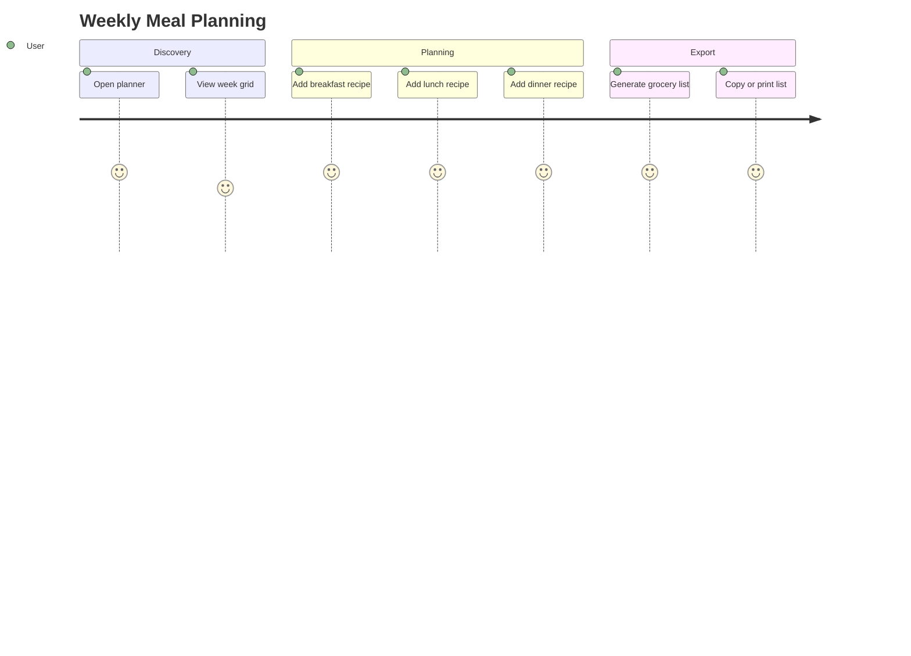
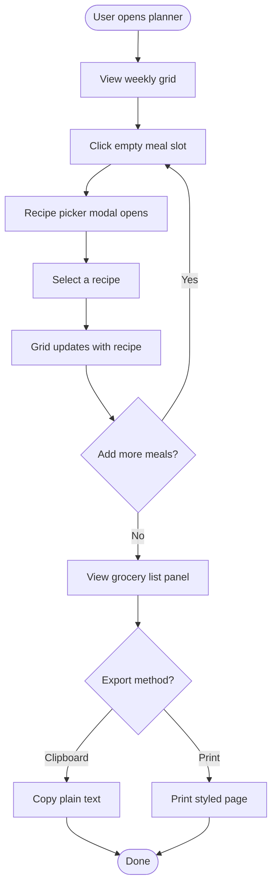
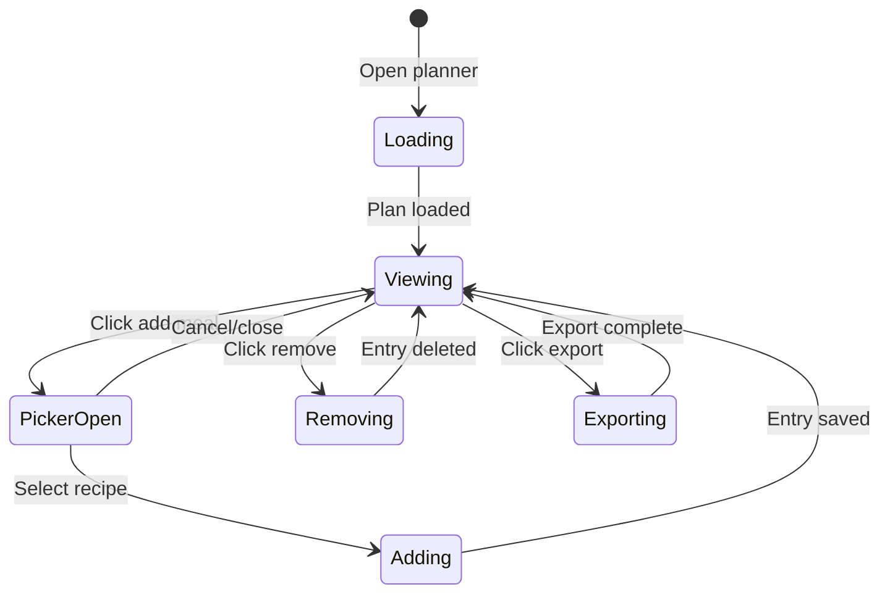
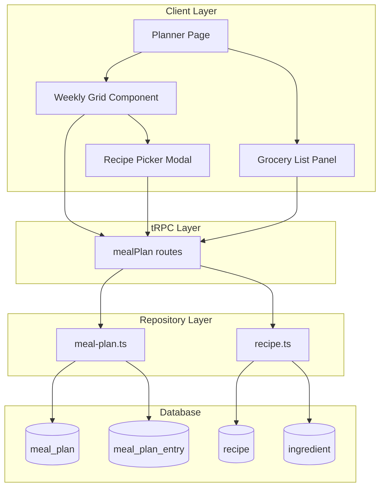
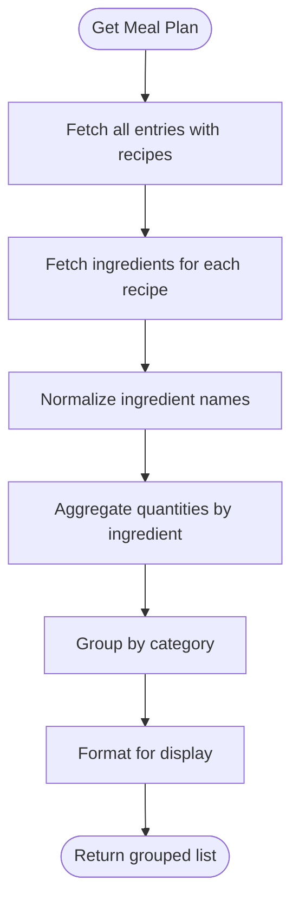
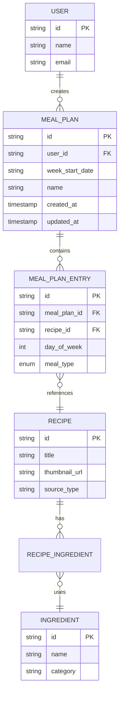
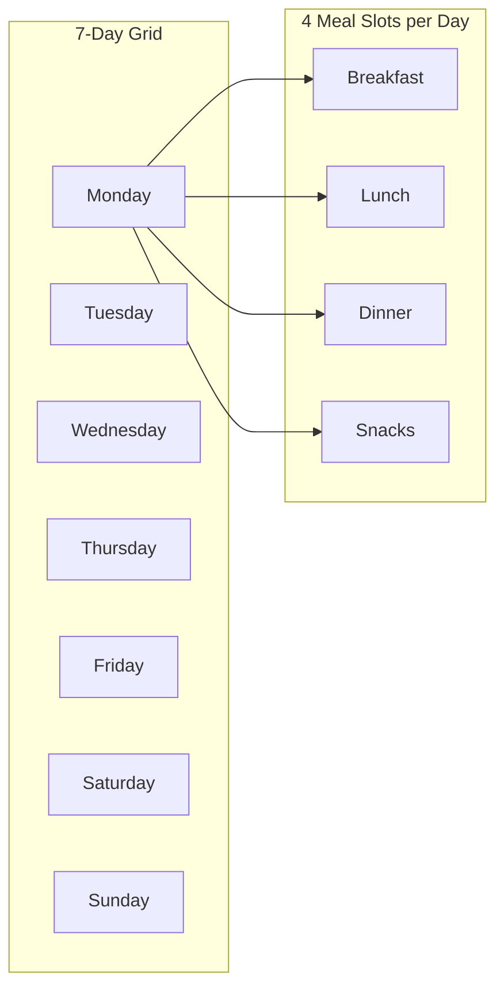
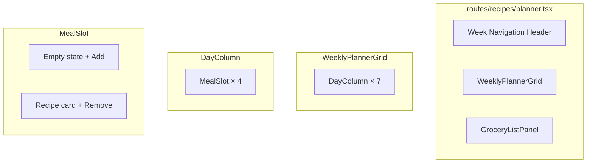

# Week Meal Planner: Information Architecture

A weekly meal planning feature that enables users to organize recipes by meal type and generate aggregated grocery lists.

---

## Table of Contents

1. [Overview](#overview)
2. [User Flow](#user-flow)
3. [System Architecture](#system-architecture)
4. [Data Model](#data-model)
5. [Feature Breakdown](#feature-breakdown)
6. [UI Components](#ui-components)
7. [Frontend Design Specification](#frontend-design-specification)
8. [Technical Stack](#technical-stack)
9. [API Endpoints](#api-endpoints)

---

## Overview

### Vision

Enable users to plan their weekly meals by assigning saved recipes to specific days and meal types, then export a consolidated grocery list for efficient shopping.

### Core Value Proposition

- **One Calendar**: 7-day × 4-meal grid (breakfast, lunch, dinner, snacks)
- **Recipe Integration**: Pull from user's saved recipe collection
- **Smart Grocery List**: Auto-aggregated ingredients with quantity combining
- **Export Options**: Copy to clipboard or print styled list

### User Journey



---

## User Flow

### Primary Flow Diagram



### State Machine



---

## System Architecture

### High-Level Architecture



### Grocery List Aggregation



---

## Data Model

### Entity Relationship Diagram



### TypeScript Interfaces

```typescript
interface MealPlan {
  id: string;
  userId: string;
  weekStartDate: string; // ISO date (YYYY-MM-DD)
  name: string | null;
  createdAt: Date;
  updatedAt: Date;
}

interface MealPlanEntry {
  id: string;
  mealPlanId: string;
  recipeId: string;
  dayOfWeek: number; // 0=Monday, 6=Sunday
  mealType: "breakfast" | "lunch" | "dinner" | "snacks";
}

interface GroceryListItem {
  ingredientId: string;
  ingredientName: string;
  category: string | null;
  quantities: Array<{
    quantity: string | null;
    unit: string | null;
    notes: string | null;
    recipeTitle: string;
  }>;
}
```

---

## Feature Breakdown

### Feature 1: Weekly Grid View



**Specifications:**
- Responsive grid: 2 cols mobile, 4 cols tablet, 7 cols desktop
- Each day shows date header with day name
- Today's column highlighted
- Week navigation with prev/next buttons

### Feature 2: Recipe Picker Modal

**Specifications:**
- Search filter for user's recipes
- Thumbnail + title display
- Source type badge (YouTube/Blog)
- Closes on selection, updating grid optimistically

### Feature 3: Grocery List Export

**Export Formats:**

| Format | Method | Output |
|--------|--------|--------|
| Clipboard | Copy button | Plain text grouped by category |
| Print | Print button | Styled HTML with checkboxes |

---

## UI Components

### Component Hierarchy



### Screen Wireframe

```
┌─────────────────────────────────────────────────────────────────────┐
│ Weekly Meal Planner                               [< Prev] [Next >] │
│ Week of January 27, 2026                          [Today]           │
├─────────────────────────────────────────────────────────────────────┤
│ Mon 27    │ Tue 28    │ Wed 29    │ Thu 30    │ Fri 31    │ Sat/Sun │
├───────────┼───────────┼───────────┼───────────┼───────────┼─────────┤
│ BREAKFAST │           │           │           │           │         │
│ ┌───────┐ │ + Add     │ + Add     │ + Add     │ + Add     │ + Add   │
│ │Recipe │ │           │           │           │           │         │
│ └───────┘ │           │           │           │           │         │
├───────────┼───────────┼───────────┼───────────┼───────────┼─────────┤
│ LUNCH     │           │           │           │           │         │
├───────────┼───────────┼───────────┼───────────┼───────────┼─────────┤
│ DINNER    │           │           │           │           │         │
├───────────┼───────────┼───────────┼───────────┼───────────┼─────────┤
│ SNACKS    │           │           │           │           │         │
└───────────┴───────────┴───────────┴───────────┴───────────┴─────────┘

┌─ Grocery List (collapsible) ────────────────────────────────────────┐
│ [Copy] [Print]                                      12 ingredients  │
├─────────────────────────────────────────────────────────────────────┤
│ Proteins                    │ Produce                               │
│ □ 2 lbs chicken breast      │ □ 3 onions                            │
└─────────────────────────────┴───────────────────────────────────────┘
```

---

## Frontend Design Specification

### Aesthetic Direction

**Tone**: Editorial cookbook - warm, artisanal, refined

**Memorable Element**: The warm terracotta meal type headers against cream backgrounds

### Typography

| Usage | Font | Weight |
|-------|------|--------|
| Page title | Playfair Display | 600 |
| Day headers | Playfair Display | 500 |
| Meal type labels | Source Sans 3 | 600 (uppercase, tracking) |
| Body text | Source Sans 3 | 400 |

### Color Palette

| Token | Value | Usage |
|-------|-------|-------|
| --primary | oklch(0.55 0.14 35) | Terracotta - headers, accents |
| --accent | oklch(0.70 0.08 145) | Sage - action buttons |
| --background | oklch(0.98 0.01 90) | Warm cream - page bg |
| --card | white | Card backgrounds |

### Motion Design

- **Adding recipe**: Fade in + scale (0.95 → 1.0, 200ms)
- **Removing recipe**: Fade out (150ms)
- **Week navigation**: Cross-fade between weeks
- **Panel toggle**: Smooth height transition (300ms)

---

## Technical Stack

### Dependencies

```bash
# No new dependencies required - uses existing:
# - React Router for routing
# - tRPC for API
# - Drizzle ORM for database
# - shadcn/ui for components
# - Tailwind for styling
```

### Key Files

| Layer | File | Purpose |
|-------|------|---------|
| Schema | `app/db/schema.ts` | mealPlan, mealPlanEntry tables |
| Migration | `drizzle/0002_add_meal_plan_tables.sql` | DB migration |
| Repository | `app/repositories/meal-plan.ts` | CRUD + aggregation |
| tRPC | `app/trpc/routes/meal-plan.ts` | API endpoints |
| Components | `app/components/planner/` | UI components |
| Route | `app/routes/recipes/planner.tsx` | Main page |

---

## API Endpoints

| Endpoint | Method | Input | Output |
|----------|--------|-------|--------|
| `mealPlan.getOrCreateForWeek` | Query | `{ weekStartDate: string }` | `MealPlanWithEntries` |
| `mealPlan.addEntry` | Mutation | `{ mealPlanId, recipeId, dayOfWeek, mealType }` | `{ id: string }` |
| `mealPlan.removeEntry` | Mutation | `{ entryId: string }` | `{ success: boolean }` |
| `mealPlan.getGroceryList` | Query | `{ mealPlanId: string }` | `GroceryList` |
| `mealPlan.getRecipesForPicker` | Query | `{ search?: string }` | `Recipe[]` |

---

## Future Enhancements

### Phase 2+

- **Meal prep mode**: Batch cooking workflow
- **Nutritional summary**: Weekly macros totals
- **Template weeks**: Save and reuse meal plans
- **Sharing**: Share plans with family members
- **Pantry integration**: Exclude items already owned
- **Smart suggestions**: AI-powered meal recommendations

---

*Architecture Document v1.0 - January 2026*
