# Meal Planner UX Upgrade: Information Architecture

Enhancements to the multi-course meal planning feature: persistent saved meals with sharing, print-optimized views, and improved AI generation loading experience.

---

## Table of Contents

1. [Overview](#overview)
2. [User Flow](#user-flow)
3. [Feature 1: Save & Share Meals](#feature-1-save--share-meals)
4. [Feature 2: Print-Optimized Views](#feature-2-print-optimized-views)
5. [Feature 3: AI Generation Loading UX](#feature-3-ai-generation-loading-ux)
6. [Data Model](#data-model)
7. [UI Components](#ui-components)
8. [Frontend Design Specification](#frontend-design-specification)
9. [API Endpoints](#api-endpoints)
10. [Implementation Checklist](#implementation-checklist)

---

## Overview

### Vision

Transform the multi-course meal planner from a transient tool into a persistent, shareable resource. Users can save their meal plans, share them with family and friends, edit them over time, and print beautiful cooking guides for the kitchen.

### Core Value Proposition

| Feature | Current State | Target State |
|---------|---------------|--------------|
| **Persistence** | Meals exist only during session | Meals saved permanently, accessible from "My Meals" |
| **Sharing** | None | Shareable links, visible on public profile |
| **Printing** | Basic timeline print | Polished cookbook-style printable guide |
| **AI Loading** | Inline "Generating..." button | Dedicated loading page with progress feedback |

### Success Metrics

| Metric | Target | How Measured |
|--------|--------|--------------|
| Meal save rate | >80% of created meals are saved | Saved / Created ratio |
| Share engagement | 30% of saved meals are shared | Meals with `isPublic = true` |
| Print usage | 40% of completed meals trigger print | PostHog event tracking |
| Loading abandonment | <5% abandon during generation | Drop-off rate on loading page |

### Competitive Positioning

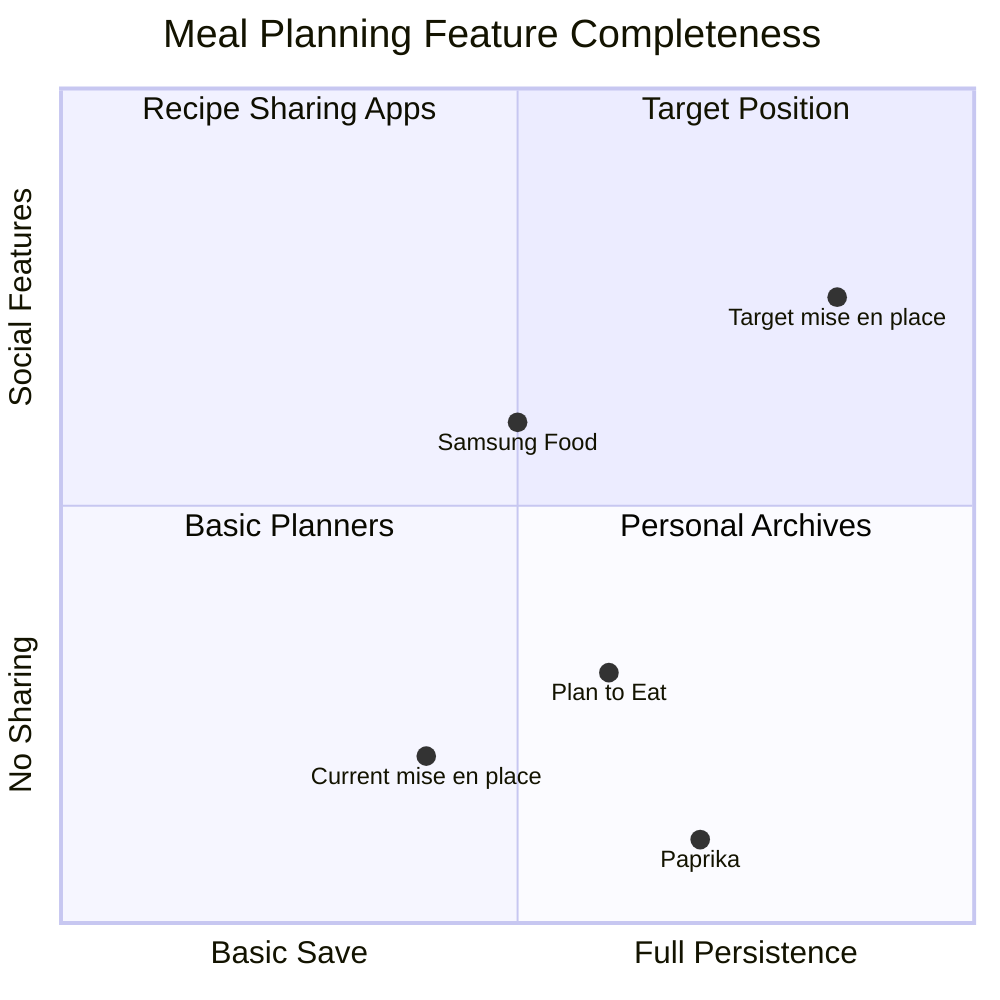

---

## User Flow

### Primary Flow: Create, Save, Share, Print

```mermaid
flowchart TD
    Start([User starts meal planning]) --> Setup[Fill meal setup form]
    Setup --> Courses[Add courses/recipes]
    Courses --> AI{Request AI?}
    
    AI -->|Yes| Loading[Navigate to loading page]
    Loading --> Wait[Show generation progress]
    Wait --> Generated[Timeline generated]
    Generated --> Review[Review timeline]
    
    AI -->|No| ManualTimeline[Manual planning]
    ManualTimeline --> Review
    
    Review --> Save[Save meal]
    Save --> Saved[Meal saved to "My Meals"]
    
    Saved --> Actions{Next action?}
    Actions -->|Share| ShareModal[Open share modal]
    Actions -->|Print| PrintModal[Open print options]
    Actions -->|Edit| Edit[Edit meal details]
    Actions -->|Done| End([Return to recipes])
    
    ShareModal --> CopyLink[Copy shareable link]
    ShareModal --> TogglePublic[Toggle public visibility]
    
    PrintModal --> SelectFormat[Choose format]
    SelectFormat --> PrintPreview[Print preview]
    PrintPreview --> Print[Print/Download]
```

### State Machine: Meal Lifecycle

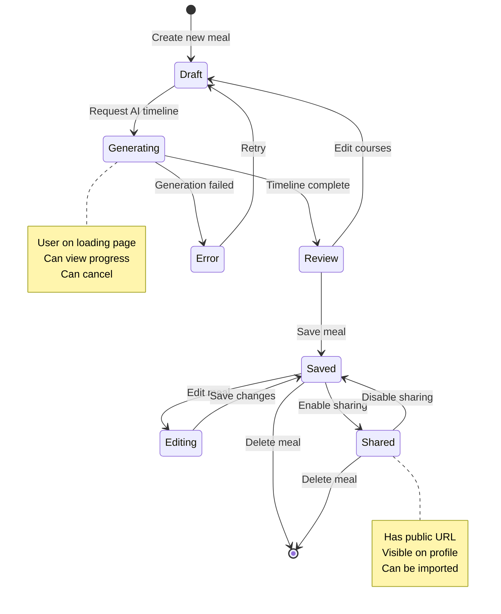

### User Journey Map

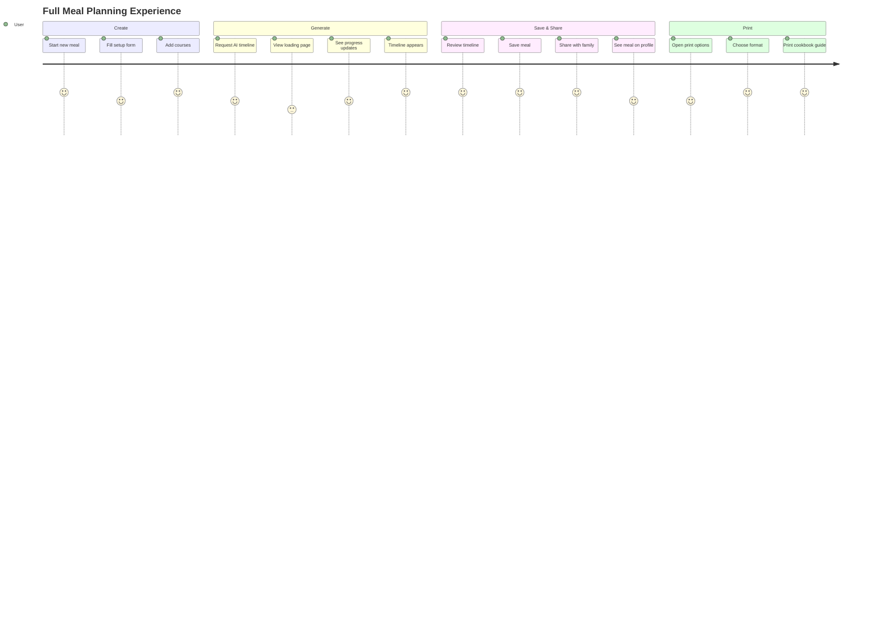

---

## Feature 1: Save & Share Meals

### 1.1 Saved Meals List

Users need a dedicated place to view and manage their saved meal plans.

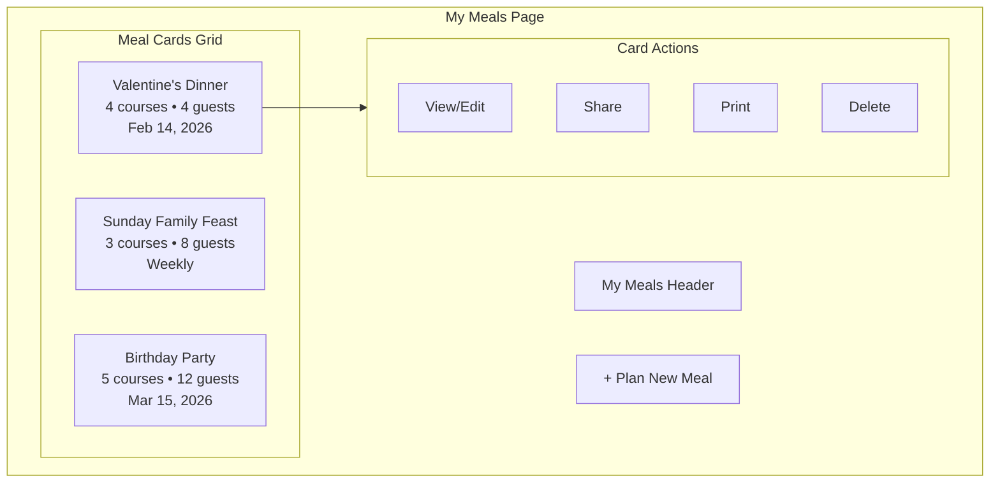

**Route:** `/recipes/meals` — List all saved meals

**Features:**
- Grid of meal cards with thumbnail, name, guest count, date
- Quick actions: View, Share, Print, Delete
- Filter by upcoming/past
- Search by meal name

### 1.2 Meal Detail Page

A dedicated page for viewing and editing a saved meal.

**Route:** `/recipes/meals/:mealId` — View/edit individual meal

**Features:**
- Full meal details with all courses
- Edit inline or via modal
- View generated timeline
- Shopping list access
- Share and print buttons

### 1.3 Sharing Functionality

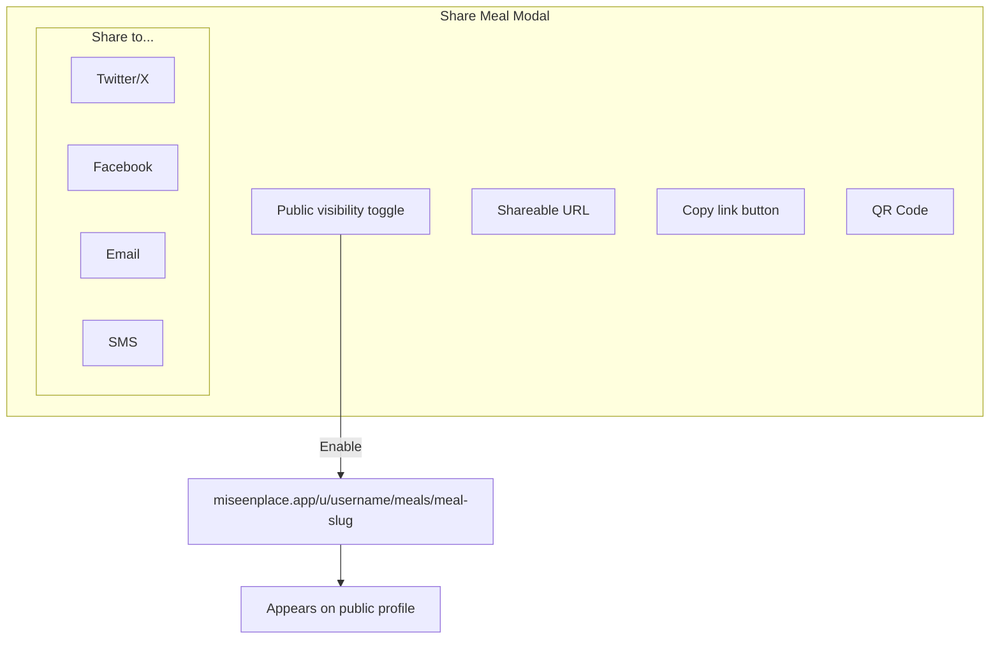

**Public URL Structure:**
- Profile meals list: `/u/[username]/meals`
- Individual meal: `/u/[username]/meals/[meal-slug]`

**Sharing Features:**
- Toggle meal public/private
- Copy shareable link
- Social sharing buttons
- QR code for mobile sharing
- Viewers can import meal to their account

### 1.4 Edit Flow

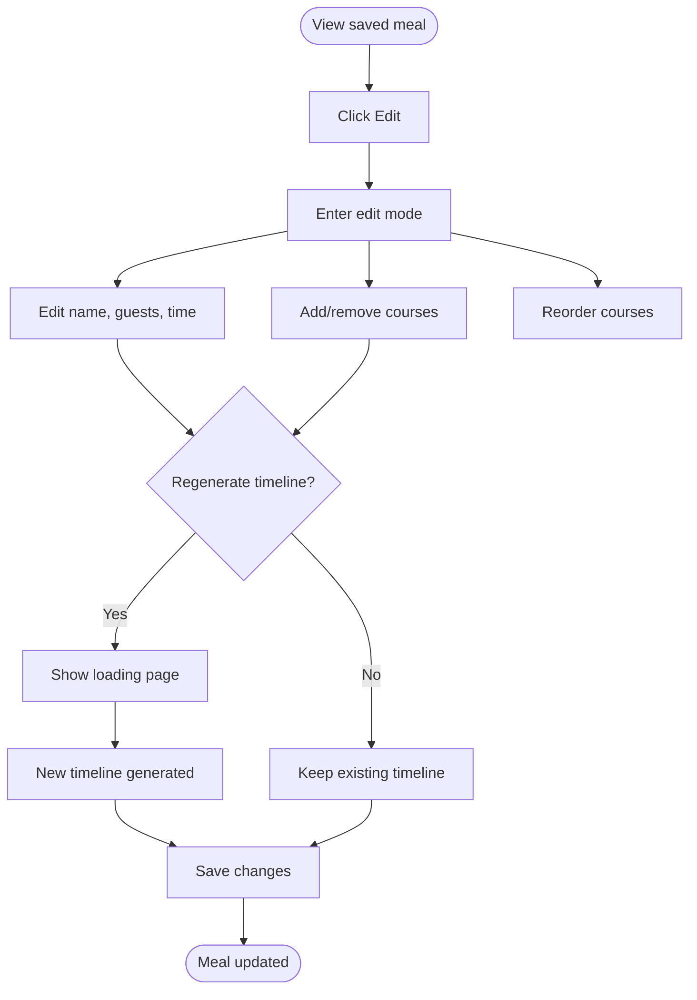

---

## Feature 2: Print-Optimized Views

### 2.1 Print Format Options

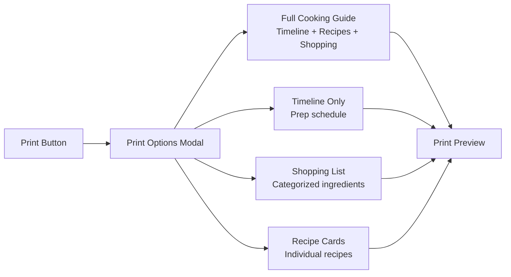

### 2.2 Full Cooking Guide Format

The signature printable format — a complete cookbook-style guide for the entire meal.

**ASCII Wireframe:**

```
┌─────────────────────────────────────────────────────────────────────┐
│                                                                     │
│                     Valentine's Day Dinner                          │
│                    ─────────────────────────                        │
│                 February 14, 2026 • 4 Guests                        │
│                     Serving at 7:00 PM                              │
│                                                                     │
├─────────────────────────────────────────────────────────────────────┤
│                                                                     │
│   THE MENU                                                          │
│   ─────────                                                         │
│                                                                     │
│   Appetizer    Bruschetta with Tomato & Basil                      │
│   Main Course  Herb-Crusted Rack of Lamb                           │
│   Side Dish    Roasted Root Vegetables                             │
│   Dessert      Chocolate Lava Cakes                                │
│                                                                     │
├─────────────────────────────────────────────────────────────────────┤
│                                                                     │
│   SHOPPING LIST                                                     │
│   ─────────────                                                     │
│                                                                     │
│   PRODUCE                           PROTEINS                        │
│   □ 4 Roma tomatoes                 □ 2 lb rack of lamb             │
│   □ 1 bunch fresh basil             □ 8 oz dark chocolate           │
│   □ 2 lbs root vegetables                                           │
│   □ 1 head garlic                   DAIRY                           │
│                                     □ 1 cup heavy cream             │
│   BAKERY                            □ 4 eggs                        │
│   □ 1 baguette                      □ 4 tbsp butter                 │
│                                                                     │
├─────────────────────────────────────────────────────────────────────┤
│                                                                     │
│   COOKING TIMELINE                                                  │
│   ────────────────                                                  │
│                                                                     │
│   3:00 PM ───────────────────────────────────────────────────────   │
│                                                                     │
│   ⏱ PREP • Chocolate Lava Cakes                                    │
│     Prepare ramekins, chop chocolate, measure ingredients           │
│     Duration: 20 min                                                │
│                                                                     │
│   ⏱ PREP • Rack of Lamb                                            │
│     Prep herb crust, bring lamb to room temp                       │
│     Duration: 30 min                                                │
│                                                                     │
│   5:30 PM ───────────────────────────────────────────────────────   │
│                                                                     │
│   🔥 COOK • Rack of Lamb                                           │
│     Sear and roast at 400°F                                        │
│     Duration: 35 min                                                │
│                                                                     │
│   ... continues ...                                                 │
│                                                                     │
├─────────────────────────────────────────────────────────────────────┤
│                                                                     │
│   RECIPES                                                           │
│   ───────                                                           │
│                                                                     │
│   APPETIZER: BRUSCHETTA WITH TOMATO & BASIL                        │
│   Serves 4 • Prep 15 min                                           │
│                                                                     │
│   Ingredients:                                                      │
│   □ 4 Roma tomatoes, diced                                         │
│   □ 1/4 cup fresh basil, chiffonade                                │
│   □ 2 cloves garlic, minced                                        │
│   □ 2 tbsp olive oil                                               │
│   □ 1 baguette, sliced                                             │
│                                                                     │
│   Instructions:                                                     │
│   1. Toast baguette slices until golden                            │
│   2. Combine tomatoes, basil, garlic, and oil                      │
│   3. Season with salt and pepper                                   │
│   4. Top bread with tomato mixture                                 │
│                                                                     │
│   ... more recipes ...                                              │
│                                                                     │
├─────────────────────────────────────────────────────────────────────┤
│                                                                     │
│   mise en place • miseenplace.app/u/chef-sarah/meals/valentines    │
│                                                                     │
└─────────────────────────────────────────────────────────────────────┘
```

### 2.3 Print Styles

Following the existing print infrastructure in `app/lib/print/day-recipes.ts`:

```css
/* Print-specific additions for meal plans */

.print-meal-header {
  text-align: center;
  padding: 2rem 0;
  border-bottom: 3px double var(--border);
  margin-bottom: 2rem;
}

.print-meal-title {
  font-family: 'Playfair Display', serif;
  font-size: 2.5rem;
  font-weight: 600;
  margin-bottom: 0.5rem;
}

.print-meal-subtitle {
  font-size: 1.1rem;
  color: #666;
  font-style: italic;
}

.print-menu-list {
  display: grid;
  grid-template-columns: 120px 1fr;
  gap: 0.75rem;
  margin: 1.5rem 0;
}

.print-course-type {
  font-weight: 600;
  text-transform: uppercase;
  font-size: 0.75rem;
  letter-spacing: 0.1em;
  color: #666;
}

.print-timeline-time {
  font-family: 'Source Sans 3', sans-serif;
  font-weight: 700;
  font-size: 1rem;
  border-bottom: 2px solid #333;
  padding-bottom: 0.25rem;
  margin-top: 1.5rem;
}

@page {
  size: letter;
  margin: 0.75in;
}

@media print {
  .no-print { display: none; }
  .page-break { page-break-before: always; }
}
```

---

## Feature 3: AI Generation Loading UX

### 3.1 Current vs Proposed Flow

```mermaid
flowchart TD
    subgraph Current["Current Flow (Problematic)"]
        C1[User clicks 'Generate Timeline']
        C2[Button shows 'Generating...']
        C3[User waits 3-8 seconds staring at button]
        C4[Page content updates with timeline]
        
        C1 --> C2 --> C3 --> C4
    end
    
    subgraph Proposed["Proposed Flow (Better UX)"]
        P1[User clicks 'Generate Timeline']
        P2[Immediately navigate to loading page]
        P3[Show animated progress + tips]
        P4[Timeline appears in place]
        P5[User can explore timeline]
        
        P1 --> P2 --> P3 --> P4 --> P5
    end
```

### 3.2 Loading Page Design

**Route:** `/recipes/meals/:mealId/generating`

The loading page provides:
1. Immediate feedback (no staring at button)
2. Visual progress indication
3. Helpful tips while waiting
4. Option to cancel

**ASCII Wireframe:**

```
┌─────────────────────────────────────────────────────────────────────┐
│                                                                     │
│                                                                     │
│                         [Animated Chef Hat]                         │
│                              ∙ ∙ ∙                                  │
│                                                                     │
│                    Creating Your Cooking Timeline                   │
│                    ─────────────────────────────                    │
│                                                                     │
│            Our AI chef is analyzing your menu and creating          │
│               a perfectly timed cooking schedule...                 │
│                                                                     │
│                                                                     │
│             ┌──────────────────────────────────────┐               │
│             │████████████░░░░░░░░░░░░░░░░░░░░░░░░░│               │
│             └──────────────────────────────────────┘               │
│                         Analyzing recipes...                        │
│                                                                     │
│                                                                     │
│          ┌────────────────────────────────────────────┐            │
│          │                                            │            │
│          │   💡 TIP: The AI accounts for rest time   │            │
│          │   for meats, so your lamb will be         │            │
│          │   perfectly rested before serving.        │            │
│          │                                            │            │
│          └────────────────────────────────────────────┘            │
│                                                                     │
│                                                                     │
│                         [Cancel Generation]                         │
│                                                                     │
└─────────────────────────────────────────────────────────────────────┘
```

### 3.3 Progress States

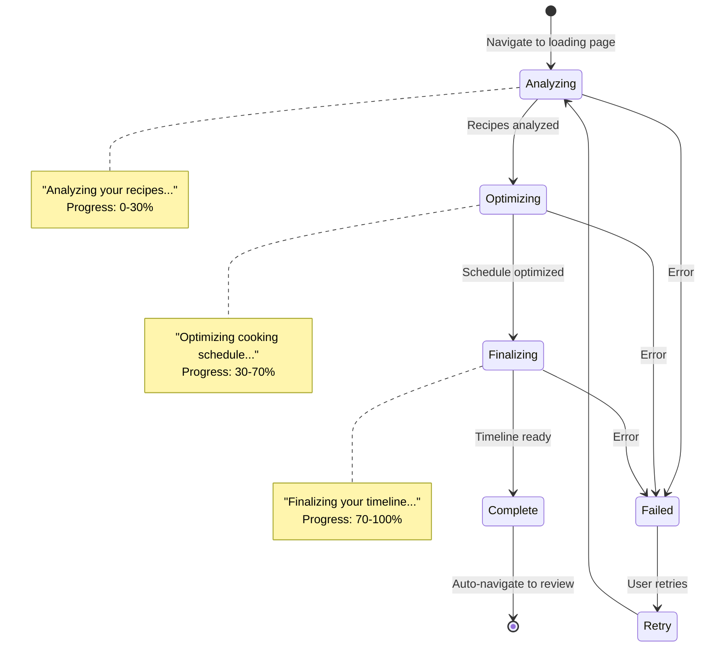

### 3.4 Implementation Approach

1. **On "Generate Timeline" click:**
   - Create a pending timeline record in database
   - Immediately navigate to `/recipes/meals/:mealId/generating`
   - Start the AI generation in background

2. **Loading page polls for status:**
   - Check generation status every 1-2 seconds
   - Update progress bar and message
   - Show rotating tips

3. **On completion:**
   - Auto-navigate to timeline review
   - Show success toast

4. **On error:**
   - Show error message with retry option
   - Option to go back to courses

---

## Data Model

### Schema Updates

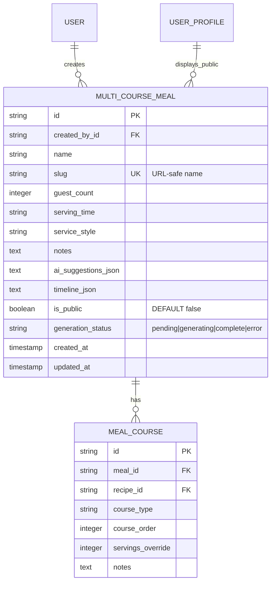

### New Columns on `multi_course_meal`

| Column | Type | Default | Description |
|--------|------|---------|-------------|
| `slug` | TEXT | NULL | URL-safe identifier for sharing |
| `is_public` | INTEGER | 0 | Whether meal is publicly visible |
| `generation_status` | TEXT | NULL | 'pending', 'generating', 'complete', 'error' |

### TypeScript Interfaces

```typescript
// Generation status for loading page
type GenerationStatus = 'pending' | 'generating' | 'complete' | 'error';

interface GenerationProgress {
  status: GenerationStatus;
  progress: number;        // 0-100
  message: string;         // e.g., "Analyzing recipes..."
  error?: string;          // Error message if failed
}

// Extended meal interface with sharing
interface MultiCourseMealWithSharing extends MultiCourseMeal {
  slug: string | null;
  isPublic: boolean;
  generationStatus: GenerationStatus | null;
  shareUrl?: string;       // Computed: /u/[username]/meals/[slug]
}

// Print format options
type PrintFormat = 
  | 'full-guide'      // Complete cooking guide
  | 'timeline-only'   // Just the timeline
  | 'shopping-list'   // Just ingredients
  | 'recipe-cards';   // Individual recipes

interface PrintOptions {
  format: PrintFormat;
  includeQrCode: boolean;
  mealId: string;
}
```

---

## UI Components

### Component Hierarchy

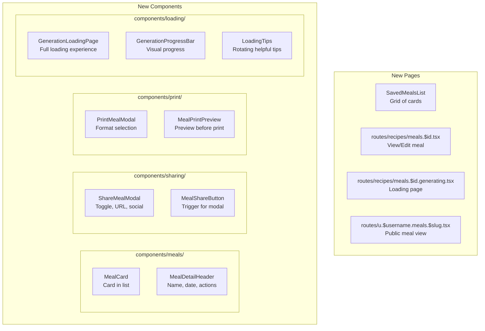

### Component Specifications

#### `GenerationLoadingPage`

```markdown
**Purpose**: Full-page loading experience during AI timeline generation

**Props**:
| Prop | Type | Required | Description |
|------|------|----------|-------------|
| mealId | string | Yes | ID of meal being generated |
| mealName | string | Yes | Display name |
| onCancel | () => void | Yes | Cancel and go back |

**Features**:
- Animated icon (chef hat or cooking pot)
- Progress bar with percentage
- Status message that updates
- Rotating tips/facts
- Cancel button
- Auto-navigate on completion

**Polling Logic**:
- Poll every 1.5 seconds
- Update progress bar smoothly
- Handle network errors gracefully
```

#### `ShareMealModal`

```markdown
**Purpose**: Control meal sharing settings and get shareable link

**Props**:
| Prop | Type | Required | Description |
|------|------|----------|-------------|
| meal | MultiCourseMeal | Yes | Meal to share |
| open | boolean | Yes | Modal visibility |
| onOpenChange | (open: boolean) => void | Yes | Toggle handler |

**Features**:
- Toggle public/private
- Copy shareable URL
- Social sharing buttons
- QR code generation
- Preview of public appearance
```

#### `PrintMealModal`

```markdown
**Purpose**: Select print format and preview

**Props**:
| Prop | Type | Required | Description |
|------|------|----------|-------------|
| meal | MultiCourseMealWithTimeline | Yes | Full meal data |
| open | boolean | Yes | Modal visibility |
| onOpenChange | (open: boolean) => void | Yes | Toggle handler |

**Features**:
- Format selection (radio buttons)
- Preview thumbnail for each format
- "Include QR code" checkbox
- Print button
- Download as PDF option (future)
```

---

## Frontend Design Specification

### Aesthetic Direction

**Tone**: Professional yet warm — these are special meals worth celebrating and sharing.

**Memorable Elements**:
- The elegant print guide that looks like a page from a cookbook
- The reassuring loading animation that shows AI "cooking up" your timeline

### Typography

| Usage | Font | Weight | Size |
|-------|------|--------|------|
| Meal card title | Playfair Display | 600 | 1.25rem |
| Progress message | Source Sans 3 | 500 | 1rem |
| Loading tips | Source Sans 3 | 400 | 0.875rem |
| Print headers | Playfair Display | 600 | 2rem |
| Print body | Source Sans 3 | 400 | 0.9rem |

### Color Usage

| Element | Token | Notes |
|---------|-------|-------|
| Progress bar fill | `--primary` | Terracotta gradient |
| Loading background | `--background` | Warm cream |
| Tip card background | `--muted` | Subtle contrast |
| Share toggle on | `--accent` | Sage green |
| Print headers | `--foreground` | High contrast for print |

### Motion Design

| Element | Animation | Timing |
|---------|-----------|--------|
| Loading icon | Gentle bounce + rotate | 2s loop |
| Progress bar | Smooth fill | 300ms ease |
| Tip carousel | Fade + slide | 400ms ease-out |
| Modal entry | Scale up + fade | 200ms spring |
| Card hover | Subtle lift | 150ms |

### Loading Page Visual Concept

```
     ╭──────────────────────────────────────────╮
     │                                          │
     │          ┌─────────────────┐            │
     │          │     👨‍🍳          │            │
     │          │   ∙ ∙ ∙         │            │
     │          └─────────────────┘            │
     │                                          │
     │     Creating Your Cooking Timeline      │
     │     ────────────────────────────        │
     │                                          │
     │   ▓▓▓▓▓▓▓▓▓▓▓▓░░░░░░░░░░░░  45%        │
     │   Optimizing cooking schedule...        │
     │                                          │
     │   ┌─────────────────────────────────┐   │
     │   │ 💡 Did you know? Our AI checks │   │
     │   │ for oven temperature conflicts  │   │
     │   │ between courses.                │   │
     │   └─────────────────────────────────┘   │
     │                                          │
     │           [ Cancel Generation ]          │
     │                                          │
     ╰──────────────────────────────────────────╯
```

---

## API Endpoints

### New tRPC Routes

| Endpoint | Type | Description | Auth |
|----------|------|-------------|------|
| `multiCourseMeal.list` | Query | List user's saved meals | Protected |
| `multiCourseMeal.setPublic` | Mutation | Toggle public visibility | Protected |
| `multiCourseMeal.getBySlug` | Query | Get meal by slug (public) | Public |
| `multiCourseMeal.getGenerationStatus` | Query | Poll generation progress | Protected |
| `multiCourseMeal.startGeneration` | Mutation | Start async timeline generation | Protected |
| `multiCourseMeal.cancelGeneration` | Mutation | Cancel pending generation | Protected |
| `multiCourseMeal.getPrintData` | Query | Get full data for printing | Protected |

### Route Definitions

```typescript
// multiCourseMeal.setPublic
setPublic: protectedProcedure
  .input(z.object({
    mealId: z.string(),
    isPublic: z.boolean(),
  }))
  .mutation(async ({ ctx, input }) => {
    // If enabling public, generate slug if needed
    // Update is_public flag
    return { success: true, shareUrl: string };
  })

// multiCourseMeal.getGenerationStatus
getGenerationStatus: protectedProcedure
  .input(z.object({ mealId: z.string() }))
  .query(async ({ ctx, input }) => {
    return {
      status: 'generating' | 'complete' | 'error',
      progress: 0-100,
      message: string,
      error?: string,
    };
  })

// multiCourseMeal.startGeneration
startGeneration: protectedProcedure
  .input(z.object({ mealId: z.string() }))
  .mutation(async ({ ctx, input }) => {
    // Set status to 'pending'
    // Enqueue background job for AI generation
    // Return immediately
    return { redirectTo: `/recipes/meals/${input.mealId}/generating` };
  })
```

### Public Routes

| Route | Method | Purpose |
|-------|--------|---------|
| `/u/[username]/meals` | GET | Public meals list (SSR) |
| `/u/[username]/meals/[slug]` | GET | Public meal detail (SSR) |

---

## Implementation Checklist

```
Meal Planner UX Upgrade Progress:

DATABASE:
- [ ] Add `slug` column to multi_course_meal
- [ ] Add `is_public` column to multi_course_meal  
- [ ] Add `generation_status` column to multi_course_meal
- [ ] Create migration file

REPOSITORY:
- [ ] Add `listMeals` function
- [ ] Add `setPublicVisibility` function
- [ ] Add `getBySlug` function (public)
- [ ] Add `updateGenerationStatus` function
- [ ] Update `generateTimeline` to use async pattern

TRPC:
- [ ] Add `multiCourseMeal.list` query
- [ ] Add `multiCourseMeal.setPublic` mutation
- [ ] Add `multiCourseMeal.getBySlug` query (public)
- [ ] Add `multiCourseMeal.getGenerationStatus` query
- [ ] Add `multiCourseMeal.startGeneration` mutation
- [ ] Add `multiCourseMeal.getPrintData` query

PAGES:
- [ ] Create `/recipes/meals` - My Meals list page
- [ ] Create `/recipes/meals/:id` - Meal detail/edit page  
- [ ] Create `/recipes/meals/:id/generating` - Loading page
- [ ] Create `/u/:username/meals` - Public meals list
- [ ] Create `/u/:username/meals/:slug` - Public meal detail

COMPONENTS:
- [ ] Create `MealCard` component
- [ ] Create `SavedMealsList` component
- [ ] Create `GenerationLoadingPage` component
- [ ] Create `GenerationProgressBar` component
- [ ] Create `LoadingTips` component
- [ ] Create `ShareMealModal` component
- [ ] Create `PrintMealModal` component
- [ ] Create `MealPrintPreview` component

PRINT:
- [ ] Create `generateMealGuideHtml` function
- [ ] Create `generateTimelineOnlyHtml` function
- [ ] Create `generateMealShoppingListHtml` function
- [ ] Add print styles for meal format

INTEGRATION:
- [ ] Update meal creation flow to redirect to loading
- [ ] Add share button to meal detail page
- [ ] Add print button to meal detail page
- [ ] Add meals link to recipes sidebar/nav
- [ ] Update profile page to show public meals

TESTING:
- [ ] E2E test: Create and save meal
- [ ] E2E test: Generation loading page
- [ ] E2E test: Share meal flow
- [ ] E2E test: Print meal flow
- [ ] E2E test: Edit saved meal
```

---

## Future Enhancements

### Phase 2+

- **Collaborative editing**: Invite family to edit meal together
- **Meal templates**: Save meals as reusable templates
- **Import from link**: Import someone else's shared meal
- **PDF export**: Download meal guide as PDF
- **Calendar integration**: Add meal to Google/Apple Calendar
- **Notification reminders**: Get prep reminders based on timeline

---

*Architecture Document v1.0 — Meal Planner UX Upgrade*
