# Multi-Course Meal Planner: Information Architecture

A feature for planning and executing elegant multi-course meals with AI assistance—from selecting complementary recipes to generating prep timelines and scaled shopping lists.

---

## Table of Contents

1. [Overview](#overview)
2. [Competitive Research](#competitive-research)
3. [User Analysis](#user-analysis)
4. [User Flow](#user-flow)
5. [System Architecture](#system-architecture)
6. [Data Model](#data-model)
7. [Feature Breakdown](#feature-breakdown)
8. [UI Components](#ui-components)
9. [Frontend Design Specification](#frontend-design-specification)
10. [Technical Stack](#technical-stack)
11. [Future Roadmap](#future-roadmap)

---

## Overview

### Vision

Transform dinner party planning from a stressful, scattered process into an elegant, guided experience. Home cooks can select recipes from their collection, receive AI suggestions for complementary courses, scale everything for their guest count, and get a personalized cooking timeline that ensures every dish is served at its best.

### Core Value Proposition

- **Input**: Select recipes + set guest count + choose service style + specify serving time
- **AI Assistance**: Menu balance suggestions, dietary accommodations, course pairing recommendations
- **Key Outputs**: Organized multi-course menu, scaled shopping list, step-by-step cooking timeline

### Product Goals

| Goal | Metric | Target |
|------|--------|--------|
| Feature adoption | % of users who create ≥1 multi-course meal | 20% within 3 months |
| Completion rate | % of started meals that are saved | >65% |
| User satisfaction | NPS for feature | >40 |
| Repeat usage | Users who create 2+ multi-course meals | 50% of adopters |

### Competitive Positioning

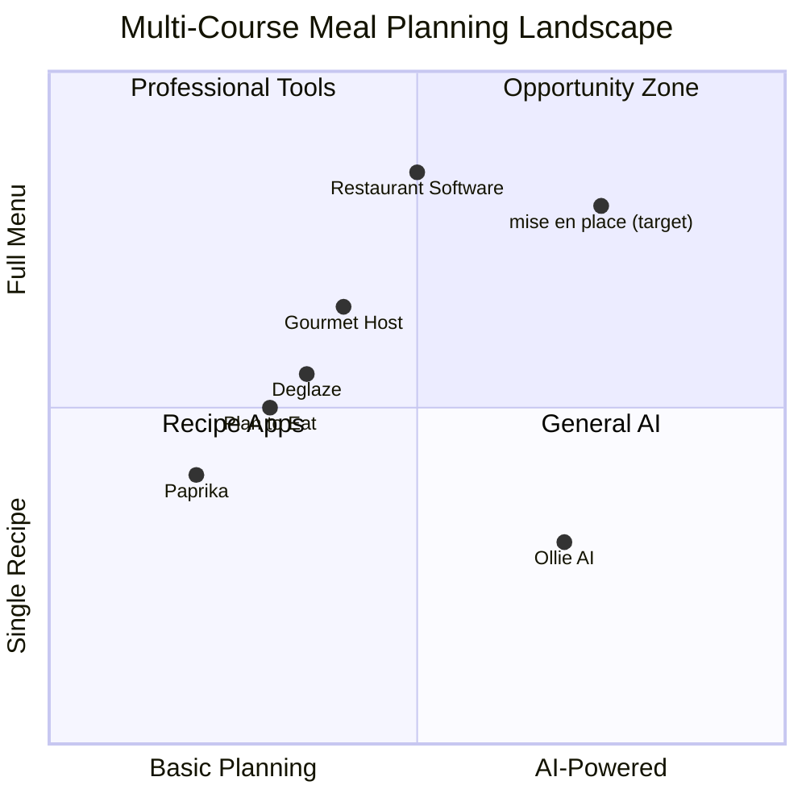

**Market Gap**: Existing apps either focus on weekly meal planning (not special occasions) or are restaurant-focused tools. No consumer app combines recipe management + multi-course planning + AI-assisted timing + guest scaling in one integrated experience.

**Differentiation**:
1. **Integrated with existing recipe library** - Not starting from scratch
2. **AI-powered menu balance** - Suggests complementary courses
3. **Cooking timeline generator** - Works backward from serving time
4. **Home cook focused** - Unlike restaurant software

---

## Competitive Research

### Competitors Analyzed

| Competitor | URL | Strengths | Weaknesses |
|------------|-----|-----------|------------|
| Deglaze | deglaze.app | Multi-recipe timing, screen-on mode | No AI, no guest scaling |
| Gourmet Host | thegourmethost.com | Event-focused, task tracking | In beta, no recipe library |
| Ollie AI | ollie.ai | AI meal planning, family focus | Weekly focused, not events |
| Paprika | paprikaapp.com | Recipe organization, timers | No multi-course coordination |
| Plan to Eat | plantoeat.com | Calendar planning, import | Manual everything |

### Feature Gaps Identified

1. **No integrated AI for course pairing** - Users must figure out menu balance themselves
2. **Guest scaling is external** - Requires separate calculators
3. **No prep timeline generation** - Biggest pain point for home dinner parties
4. **No service style considerations** - Plated vs family style affects timing

### UX Patterns Worth Adopting

| Pattern | Source | Why It Works |
|---------|--------|--------------|
| Screen-on cooking mode | Deglaze | Keeps device awake during cooking |
| Task delegation | Gourmet Host | Assign prep tasks to helpers |
| Visual timeline | Restaurant software | Clear at-a-glance schedule |
| Recipe grouping with tags | Paprika | Easy menu organization |

---

## User Analysis

### Primary User Persona

```markdown
## Persona: The Ambitious Home Host

**Role**: Home cook who enjoys entertaining
**Goal**: Host memorable dinner parties without the chaos
**Pain Points**: 
- "I always underestimate prep time and end up stressed"
- "Scaling recipes for more people is error-prone"
- "I don't know how to pace a multi-course meal"
- "By the main course, I'm too exhausted to enjoy my own party"

**Context**: Hosts dinner parties 4-8 times per year, typically 4-12 guests
**Tech Comfort**: High - comfortable with apps
```

### ICP Analysis

| ICP | Fit Score | Primary Pain | Key Feature Need |
|-----|-----------|--------------|------------------|
| Dinner Party Host | 90/100 | Coordination stress | Cooking timeline |
| Holiday Entertainer | 85/100 | Large group scaling | Guest count scaling |
| Food Enthusiast | 75/100 | Menu creativity | AI suggestions |
| Casual Host | 60/100 | Simplicity | Quick setup |

### ICP Positioning

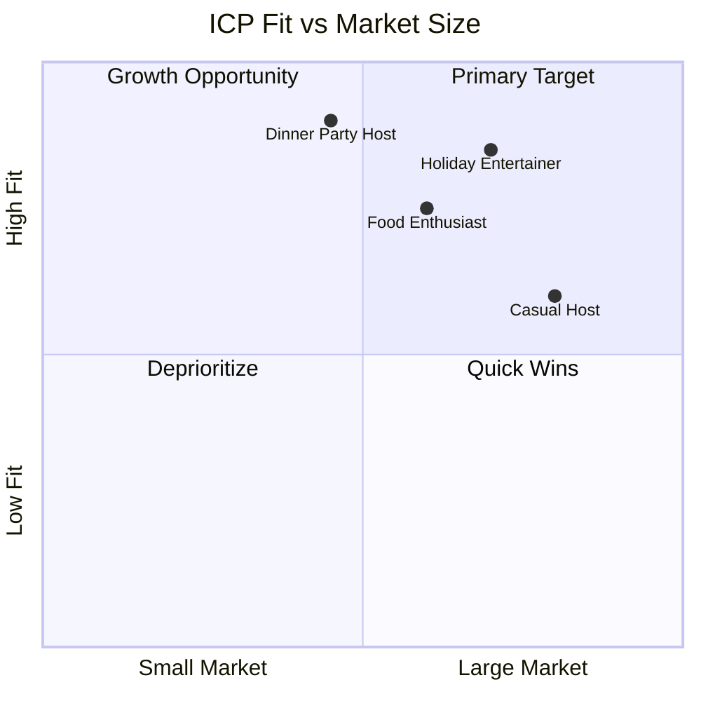

### User Mental Model

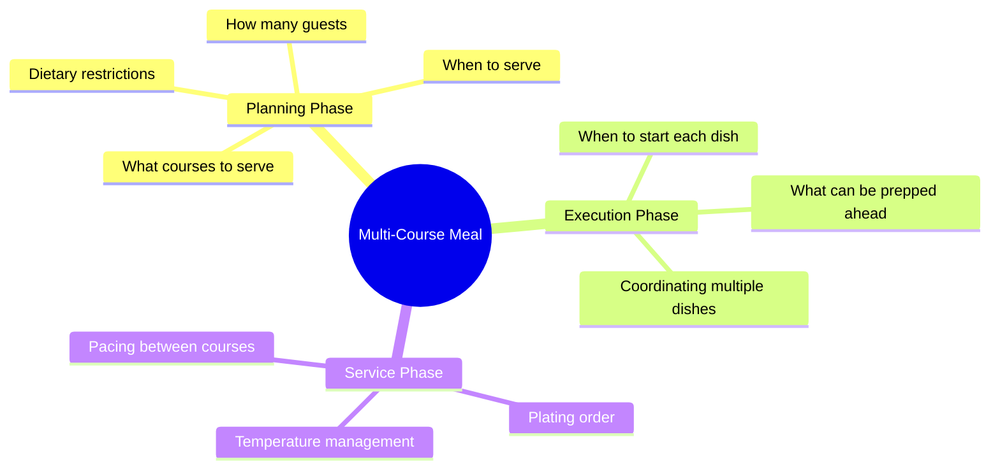

---

## User Flow

### Primary Flow: Creating a Multi-Course Meal

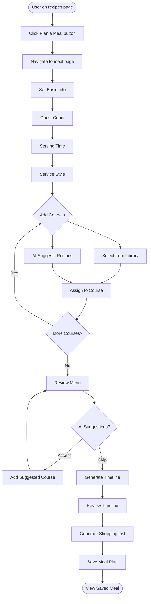

### State Machine

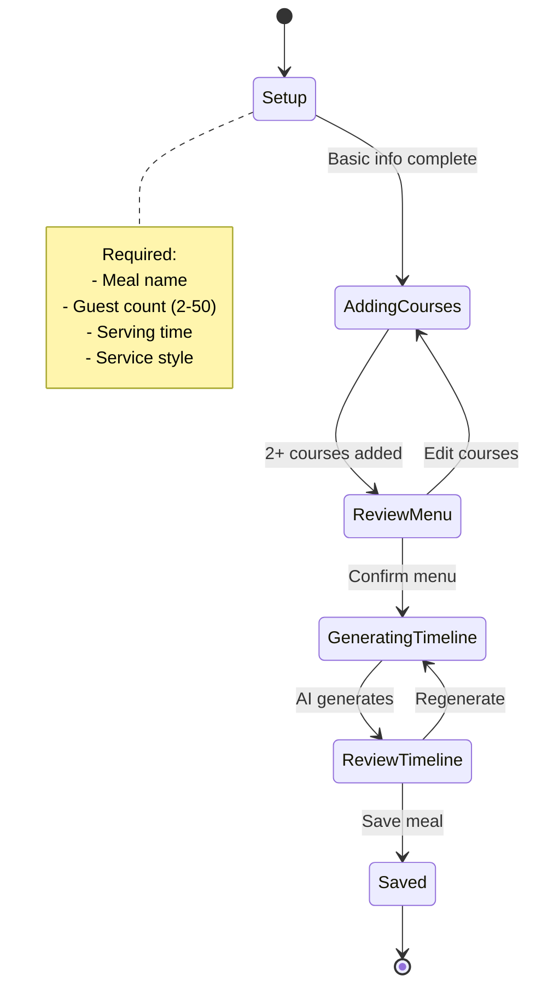

### User Journey Map

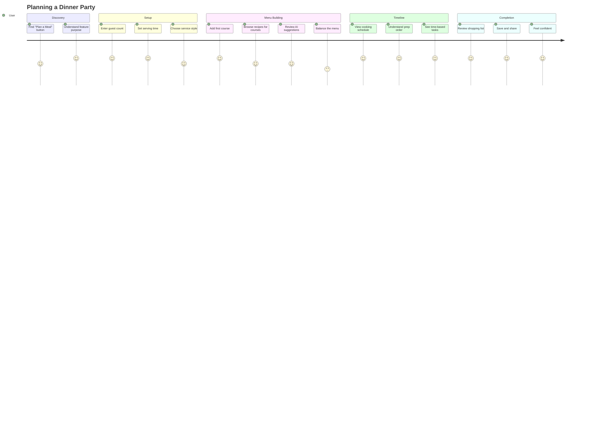

---

## System Architecture

### High-Level Architecture

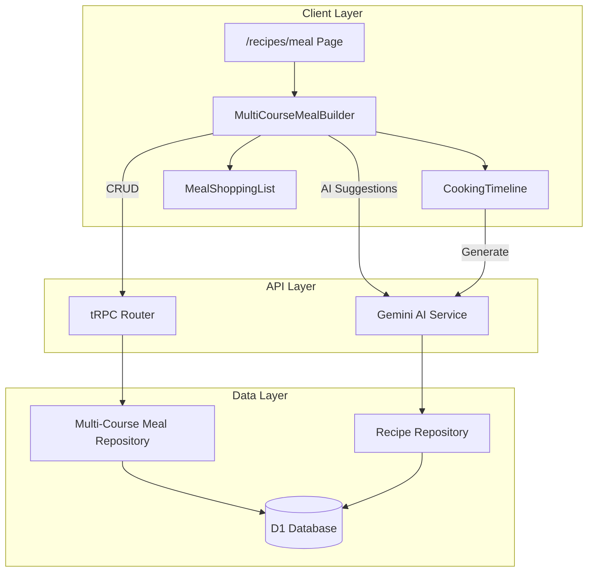

### AI Processing Pipeline

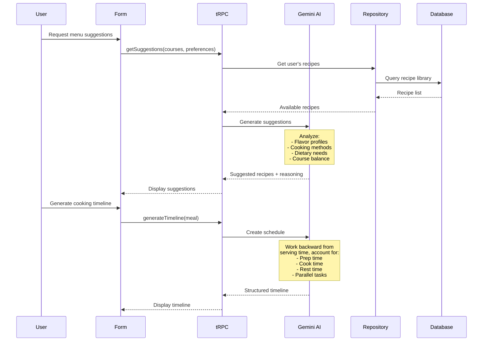

---

## Data Model

### Entity Relationship Diagram

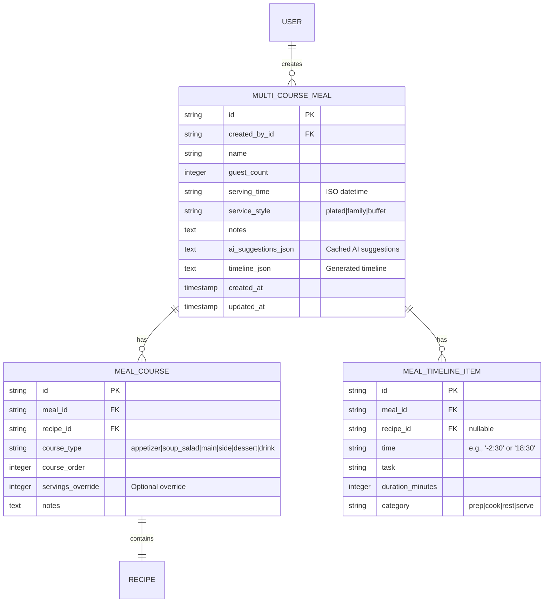

### TypeScript Interfaces

```typescript
// Service styles for multi-course meals
type ServiceStyle = "plated" | "family" | "buffet";

// Course types
type CourseType = 
  | "appetizer" 
  | "soup_salad" 
  | "main" 
  | "side" 
  | "dessert" 
  | "drink";

// Input for creating a multi-course meal
interface CreateMultiCourseMealInput {
  name: string;
  guestCount: number;            // 2-50
  servingTime: string;           // ISO datetime
  serviceStyle: ServiceStyle;
  notes?: string;
  courses: Array<{
    recipeId: string;
    courseType: CourseType;
    courseOrder: number;
    servingsOverride?: number;
    notes?: string;
  }>;
}

// AI suggestion request
interface MenuSuggestionRequest {
  existingCourses: Array<{
    recipeId: string;
    courseType: CourseType;
  }>;
  guestCount: number;
  dietaryRestrictions?: string[];
  preferredCuisine?: string;
}

// AI suggestion response
interface MenuSuggestion {
  courseType: CourseType;
  suggestedRecipeId?: string;     // From user's library
  suggestion: string;              // AI explanation
  reasoning: string;               // Why this complements
}

// Timeline item
interface TimelineItem {
  id: string;
  time: string;                    // Relative or absolute
  task: string;
  recipeId?: string;
  recipeName?: string;
  durationMinutes: number;
  category: "prep" | "cook" | "rest" | "serve";
  isParallel?: boolean;            // Can be done with others
}

// Full meal with timeline
interface MultiCourseMealWithTimeline {
  id: string;
  name: string;
  guestCount: number;
  servingTime: string;
  serviceStyle: ServiceStyle;
  courses: Array<{
    id: string;
    recipe: Recipe;
    courseType: CourseType;
    courseOrder: number;
    scaledServings: number;
  }>;
  timeline: TimelineItem[];
  shoppingList: AggregatedIngredient[];
}
```

### Schema Changes

```typescript
// app/db/schema.ts additions

export const multiCourseMeal = sqliteTable("multi_course_meal", {
  id: text("id").primaryKey(),
  createdById: text("created_by_id")
    .notNull()
    .references(() => user.id, { onDelete: "cascade" }),
  name: text("name").notNull(),
  guestCount: integer("guest_count").notNull(),
  servingTime: text("serving_time").notNull(),
  serviceStyle: text("service_style", { 
    enum: ["plated", "family", "buffet"] 
  }).notNull(),
  notes: text("notes"),
  aiSuggestionsJson: text("ai_suggestions_json"),
  timelineJson: text("timeline_json"),
  createdAt: integer("created_at", { mode: "timestamp_ms" })
    .default(sql`(unixepoch() * 1000)`)
    .notNull(),
  updatedAt: integer("updated_at", { mode: "timestamp_ms" })
    .default(sql`(unixepoch() * 1000)`)
    .$onUpdate(() => new Date())
    .notNull(),
});

export const mealCourse = sqliteTable("meal_course", {
  id: text("id").primaryKey(),
  mealId: text("meal_id")
    .notNull()
    .references(() => multiCourseMeal.id, { onDelete: "cascade" }),
  recipeId: text("recipe_id")
    .notNull()
    .references(() => recipe.id, { onDelete: "cascade" }),
  courseType: text("course_type", { 
    enum: ["appetizer", "soup_salad", "main", "side", "dessert", "drink"] 
  }).notNull(),
  courseOrder: integer("course_order").notNull(),
  servingsOverride: integer("servings_override"),
  notes: text("notes"),
});
```

---

## Feature Breakdown

### Feature 1: Meal Setup

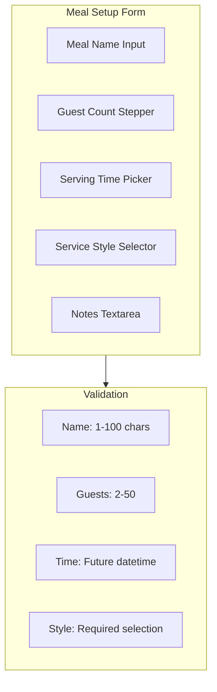

**Service Style Options:**
| Style | Description | Timing Impact |
|-------|-------------|---------------|
| Plated | Individual portions served | Staggered cooking, precise timing |
| Family | Dishes served in center | Batch cooking, same time finish |
| Buffet | Self-serve spread | Can be prepared ahead |

### Feature 2: Course Builder

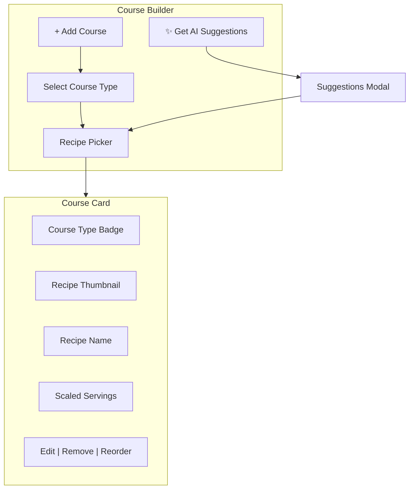

**Course Types:**
1. Appetizer / Amuse-bouche
2. Soup / Salad
3. Main Course
4. Side Dish
5. Dessert
6. Drink / Beverage

### Feature 3: AI Menu Suggestions

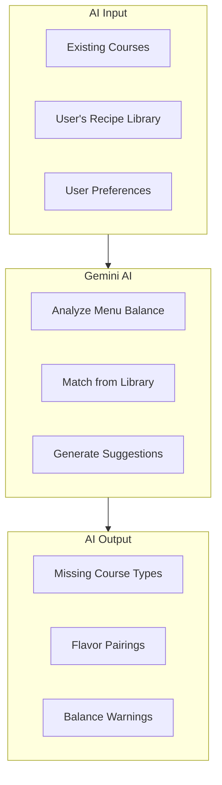

**AI Suggestion Types:**
1. **Gap Filling**: "You're missing a salad course. Consider your 'Caesar Salad' to balance the richness of the main."
2. **Pairing Suggestions**: "Your lamb main pairs well with your 'Roasted Root Vegetables' side."
3. **Balance Warnings**: "Multiple heavy courses detected. Consider a lighter appetizer."
4. **Dietary Alerts**: "One guest is vegetarian—your current menu has no veggie main."

### Feature 4: Cooking Timeline Generator

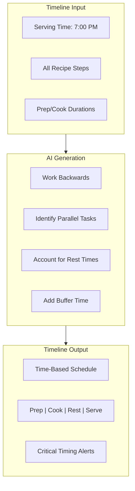

**Timeline Example:**
```
2:00 PM - PREP: Make pie dough, refrigerate (Dessert)
3:00 PM - PREP: Chop vegetables for sides
3:30 PM - PREP: Marinate the lamb
4:30 PM - COOK: Start lamb roast
5:00 PM - PREP: Assemble apple pie
5:15 PM - COOK: Pie goes in oven
5:45 PM - COOK: Start roasted vegetables
6:15 PM - REST: Lamb out, resting
6:30 PM - COOK: Finish salad, plate appetizers
6:45 PM - SERVE: Appetizers
7:00 PM - SERVE: Salad course
7:20 PM - SERVE: Main + sides
7:45 PM - SERVE: Dessert
```

### Feature 5: Scaled Shopping List

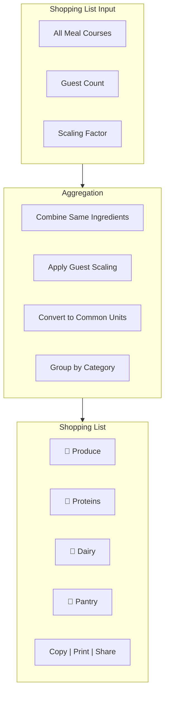

---

## UI Components

### Component Hierarchy

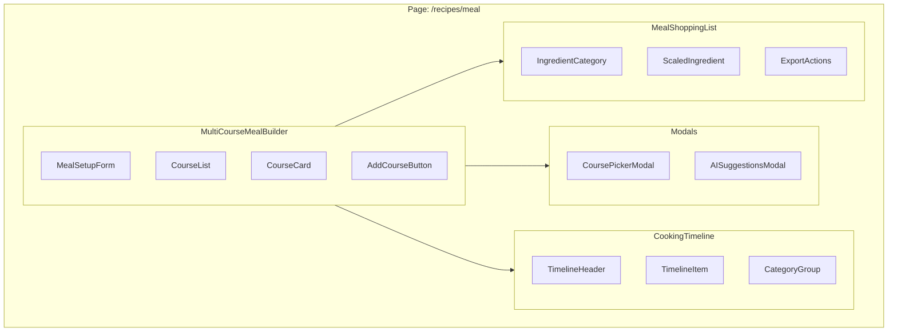

### Screen Wireframes

#### Screen: Meal Builder Page

```
┌─────────────────────────────────────────────────────────────────┐
│ ← Back to Recipes                                               │
├─────────────────────────────────────────────────────────────────┤
│                                                                 │
│   Plan a Multi-Course Meal                                      │
│   Create an elegant dining experience with AI assistance        │
│                                                                 │
├─────────────────────────────────────────────────────────────────┤
│ ┌─────────────────────────────────────────────────────────────┐ │
│ │ MEAL DETAILS                                                │ │
│ │                                                             │ │
│ │ Meal Name                                                   │ │
│ │ ┌─────────────────────────────────────────────────────────┐ │ │
│ │ │ Valentine's Day Dinner                                  │ │ │
│ │ └─────────────────────────────────────────────────────────┘ │ │
│ │                                                             │ │
│ │ ┌─────────────┐  ┌─────────────────┐  ┌─────────────────┐  │ │
│ │ │ Guests      │  │ Serving Time    │  │ Service Style   │  │ │
│ │ │ [-] 4 [+]   │  │ 7:00 PM ▼       │  │ ○ Plated        │  │ │
│ │ │             │  │ Feb 14, 2026    │  │ ● Family Style  │  │ │
│ │ └─────────────┘  └─────────────────┘  │ ○ Buffet        │  │ │
│ │                                       └─────────────────┘  │ │
│ └─────────────────────────────────────────────────────────────┘ │
│                                                                 │
│ ┌─────────────────────────────────────────────────────────────┐ │
│ │ COURSES                           [✨ Get AI Suggestions]   │ │
│ │                                                             │ │
│ │ ┌───────────────────────────────────────────────────────┐   │ │
│ │ │ 1. APPETIZER                                          │   │ │
│ │ │ ┌────┐  Bruschetta with Tomato & Basil               │   │ │
│ │ │ │ 🍅 │  Serves 4 (scaled from 2)                     │   │ │
│ │ │ └────┘                              [Edit] [Remove]  │   │ │
│ │ └───────────────────────────────────────────────────────┘   │ │
│ │                                                             │ │
│ │ ┌───────────────────────────────────────────────────────┐   │ │
│ │ │ 2. MAIN COURSE                                        │   │ │
│ │ │ ┌────┐  Herb-Crusted Rack of Lamb                    │   │ │
│ │ │ │ 🍖 │  Serves 4 (scaled from 2)                     │   │ │
│ │ │ └────┘                              [Edit] [Remove]  │   │ │
│ │ └───────────────────────────────────────────────────────┘   │ │
│ │                                                             │ │
│ │ ┌───────────────────────────────────────────────────────┐   │ │
│ │ │ 3. DESSERT                                            │   │ │
│ │ │ ┌────┐  Chocolate Lava Cakes                         │   │ │
│ │ │ │ 🍫 │  Serves 4 (scaled from 4)                     │   │ │
│ │ │ └────┘                              [Edit] [Remove]  │   │ │
│ │ └───────────────────────────────────────────────────────┘   │ │
│ │                                                             │ │
│ │ [+ Add Course]                                              │ │
│ │                                                             │ │
│ │ 💡 AI Tip: Consider adding a salad course to balance       │ │
│ │    the richness of the lamb and chocolate.                 │ │
│ └─────────────────────────────────────────────────────────────┘ │
│                                                                 │
│         [Cancel]                    [Generate Timeline →]      │
│                                                                 │
└─────────────────────────────────────────────────────────────────┘
```

#### Screen: Cooking Timeline

```
┌─────────────────────────────────────────────────────────────────┐
│ ← Back to Menu                    Valentine's Day Dinner        │
├─────────────────────────────────────────────────────────────────┤
│                                                                 │
│   Cooking Timeline                                              │
│   Serving 4 guests at 7:00 PM, February 14                     │
│                                                                 │
├─────────────────────────────────────────────────────────────────┤
│                                                                 │
│   ┌───────────────────────────────────────────────────────────┐ │
│   │ 3:00 PM  ─────────────────────────────────────────────    │ │
│   │                                                           │ │
│   │ ⏱ PREP · Chocolate Lava Cakes                            │ │
│   │   Prepare ramekins, chop chocolate, measure ingredients   │ │
│   │   Duration: 20 min                                        │ │
│   │                                                           │ │
│   │ ⏱ PREP · Rack of Lamb                                    │ │
│   │   Prep herb crust, bring lamb to room temp                │ │
│   │   Duration: 30 min                                        │ │
│   └───────────────────────────────────────────────────────────┘ │
│                                                                 │
│   ┌───────────────────────────────────────────────────────────┐ │
│   │ 5:30 PM  ─────────────────────────────────────────────    │ │
│   │                                                           │ │
│   │ 🔥 COOK · Rack of Lamb                                   │ │
│   │   Sear and roast at 400°F                                │ │
│   │   Duration: 35 min                                        │ │
│   └───────────────────────────────────────────────────────────┘ │
│                                                                 │
│   ┌───────────────────────────────────────────────────────────┐ │
│   │ 6:05 PM  ─────────────────────────────────────────────    │ │
│   │                                                           │ │
│   │ 🛑 REST · Rack of Lamb                                   │ │
│   │   Tent with foil, let rest                               │ │
│   │   Duration: 15 min                                        │ │
│   │                                                           │ │
│   │ ⏱ PREP · Bruschetta                                      │ │
│   │   Toast bread, dice tomatoes, assemble                   │ │
│   │   Duration: 15 min                                        │ │
│   └───────────────────────────────────────────────────────────┘ │
│                                                                 │
│   ┌───────────────────────────────────────────────────────────┐ │
│   │ 6:45 PM  ─────────────────────────────────────────────    │ │
│   │                                                           │ │
│   │ 🍽️ SERVE · Bruschetta (Appetizer)                        │ │
│   │   Plate and bring to table                               │ │
│   └───────────────────────────────────────────────────────────┘ │
│                                                                 │
│   ┌───────────────────────────────────────────────────────────┐ │
│   │ 7:00 PM  ─────────────────────────────────────────────    │ │
│   │                                                           │ │
│   │ 🔥 COOK · Chocolate Lava Cakes                           │ │
│   │   Bake at 425°F (start when guests arrive)               │ │
│   │   Duration: 12 min                                        │ │
│   │                                                           │ │
│   │ 🍽️ SERVE · Rack of Lamb (Main)                           │ │
│   │   Slice, plate with sides                                │ │
│   └───────────────────────────────────────────────────────────┘ │
│                                                                 │
│   ┌───────────────────────────────────────────────────────────┐ │
│   │ 7:30 PM  ─────────────────────────────────────────────    │ │
│   │                                                           │ │
│   │ 🍽️ SERVE · Chocolate Lava Cakes (Dessert)                │ │
│   │   Unmold and serve immediately with ice cream            │ │
│   └───────────────────────────────────────────────────────────┘ │
│                                                                 │
│   [View Shopping List]              [Print Timeline]  [Save]   │
│                                                                 │
└─────────────────────────────────────────────────────────────────┘
```

### Component Specifications

#### `MultiCourseMealBuilder`

```markdown
**Purpose**: Main orchestrator for building multi-course meals

**Props**:
| Prop | Type | Required | Description |
|------|------|----------|-------------|
| initialMeal | MultiCourseMeal | No | Edit existing meal |
| onSave | (meal: MultiCourseMeal) => void | Yes | Save callback |
| onCancel | () => void | Yes | Cancel callback |

**States**: setup, building, reviewing, generating, saved

**Subcomponents**:
- MealSetupForm
- CourseList
- AISuggestionsPanel
```

#### `CookingTimeline`

```markdown
**Purpose**: Display generated cooking schedule

**Props**:
| Prop | Type | Required | Description |
|------|------|----------|-------------|
| timeline | TimelineItem[] | Yes | Generated timeline |
| servingTime | string | Yes | Target serving time |
| onRegenerate | () => void | Yes | Request new timeline |

**Features**:
- Time-based grouping
- Category color coding (prep/cook/rest/serve)
- Collapsible sections
- Print-friendly view
```

#### `MealShoppingList`

```markdown
**Purpose**: Aggregated, scaled shopping list

**Props**:
| Prop | Type | Required | Description |
|------|------|----------|-------------|
| ingredients | AggregatedIngredient[] | Yes | Scaled ingredients |
| guestCount | number | Yes | For display |
| mealName | string | Yes | For export header |

**Features**:
- Category grouping
- Checkboxes for checking off
- Copy to clipboard
- Print view
- Scale adjustment
```

---

## UI Concepts

Visual mockups for the multi-course meal planner feature, following the editorial cookbook aesthetic.

### Concept 1: Meal Builder Page


**Visual Direction**: Warm, inviting form design with clear hierarchy
**Key Design Elements**:
- Two-column layout: Setup on left, courses on right
- Terracotta course type badges (Appetizer, Main Course, Dessert)
- Guest count stepper with elegant icons
- Service style selection with visual indicators
- AI suggestion tip at bottom with lightbulb icon
- "Get AI Suggestions" button with sparkle accent
- Prominent "Generate Timeline" CTA in terracotta

**Form Structure**:
- Meal details section with date/time picker
- Course cards with recipe thumbnails and scaled servings
- Easy add/remove course functionality

### Concept 2: Cooking Timeline


**Visual Direction**: Professional kitchen prep sheet with warm aesthetics
**Key Design Elements**:
- Vertical timeline with connecting line
- Time badges on left column
- Color-coded category badges (PREP, COOK, REST, SERVE)
- Clear task descriptions with durations
- Icons for each category (clock, flame, pause, plate)

**Timeline Structure**:
- Works backward from serving time
- Groups parallel tasks at same time
- Clear visual distinction between task types
- Export options: View Shopping List, Print Timeline

---

## Frontend Design Specification

### Aesthetic Direction

**Tone**: Elegant and celebratory—this is for special occasions, not everyday meals
**Memorable Element**: The cooking timeline that feels like a professional kitchen's prep sheet

### Typography

| Usage | Font | Weight | Size |
|-------|------|--------|------|
| Page Title | Playfair Display | 600 | 2rem |
| Section Headers | Playfair Display | 500 | 1.25rem |
| Course Type Labels | Source Sans 3 | 600 | 0.75rem (uppercase) |
| Timeline Time | Source Sans 3 | 700 | 1rem |
| Timeline Task | Source Sans 3 | 400 | 0.875rem |

### Color Usage

| Element | Token | Usage |
|---------|-------|-------|
| Course type badges | `--primary` (terracotta) | Appetizer, Main badges |
| AI suggestion accent | `--accent` (sage) | Sparkle icon, suggestion cards |
| Timeline prep | `--muted` | Gray background |
| Timeline cook | `--primary/20` | Warm terracotta tint |
| Timeline serve | `--accent/20` | Sage green tint |
| Guest count highlight | `--primary` | Scaled serving numbers |

### Motion Design

- **Course cards**: Slide-in from right when added (200ms spring)
- **Timeline generation**: Skeleton loading with pulse, items fade-in sequentially
- **AI suggestions**: Shimmer effect while generating, gentle bounce on arrival
- **Save success**: Confetti micro-animation (subtle, celebration-appropriate)

### Visual Effects

- **Course cards**: Elevated with `shadow-warm`, subtle hover lift
- **Timeline**: Vertical connecting line between time blocks
- **AI panel**: Gradient border with subtle glow
- **Print view**: Clean, minimal, no shadows—optimized for paper

### Layout Principles

- **Two-column on desktop**: Builder on left, preview/timeline on right
- **Stacked on mobile**: Full-width cards, timeline below
- **Course ordering**: Drag handles visible, smooth reorder animation

---

## Technical Stack

### Stack Overview

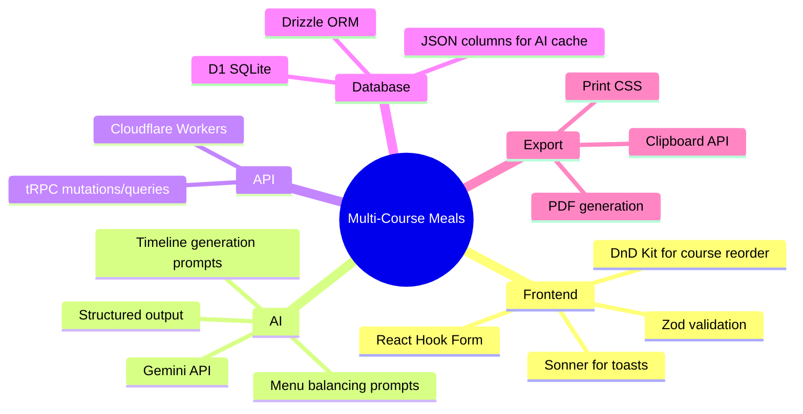

### API Endpoints

| Endpoint | Method | Description | Auth |
|----------|--------|-------------|------|
| `multiCourseMeal.create` | mutation | Create new meal | Protected |
| `multiCourseMeal.update` | mutation | Update meal | Protected |
| `multiCourseMeal.delete` | mutation | Delete meal | Protected |
| `multiCourseMeal.getById` | query | Get meal with courses | Protected |
| `multiCourseMeal.list` | query | List user's meals | Protected |
| `multiCourseMeal.getMenuSuggestions` | mutation | AI menu suggestions | Protected |
| `multiCourseMeal.generateTimeline` | mutation | AI cooking timeline | Protected |
| `multiCourseMeal.getShoppingList` | query | Aggregated ingredients | Protected |

### AI Prompts

**Menu Suggestion Prompt Structure:**
```
You are a culinary expert helping plan a multi-course meal.

Current menu:
{courses with recipe details}

Guest count: {n}
Service style: {style}

User's available recipes:
{recipe library summary}

Suggest improvements for menu balance considering:
1. Flavor progression (light to rich)
2. Cooking method variety
3. Temperature variety (hot/cold)
4. Color and presentation
5. Dietary accommodations

Return structured suggestions...
```

**Timeline Generation Prompt Structure:**
```
You are a professional chef creating a cooking timeline.

Meal: {name}
Serving time: {time}
Guest count: {n}
Service style: {style}

Courses and recipes:
{detailed recipe info with prep/cook times}

Create a timeline working backward from serving time.
Account for:
1. Prep that can be done hours ahead
2. Cooking times and oven/stovetop conflicts
3. Rest times for meats
4. Last-minute assembly
5. Buffer time between courses (15 min for plated)

Return structured timeline...
```

### Dependencies

```bash
# No new dependencies required
# Using existing:
# - react-hook-form (forms)
# - zod (validation)  
# - @dnd-kit/core (drag and drop for course reorder)
# - sonner (toasts)
# - @google/genai (Gemini AI - already in project)
```

---

## Future Roadmap

### Phase 1 (Current Scope)

- [ ] Schema + Migration for multi-course meals
- [ ] Repository layer with CRUD
- [ ] tRPC routes for meal management
- [ ] MultiCourseMealBuilder component
- [ ] Course picker modal
- [ ] Guest count scaling
- [ ] Basic shopping list aggregation
- [ ] AI menu suggestions (Gemini)
- [ ] AI cooking timeline generation
- [ ] Print/export functionality

### Phase 2 (Future)

- Wine pairing suggestions
- Helper task assignment (delegate to guests)
- Dietary restriction filtering
- Template meals (save and reuse)
- Cost estimation per guest
- Recipe substitution suggestions

### Phase 3 (Long-term)

- Collaborative meal planning (shared editing)
- Integration with grocery delivery services
- Voice-guided cooking mode
- Post-meal reviews and notes
- Meal history and analytics

---

## Implementation Checklist

Based on plan-with-subagents workflow:

- [ ] **Task 1**: Schema + Migration (`generalPurpose`)
- [ ] **Task 2**: Repository layer (`generalPurpose`)
- [ ] **Task 3**: tRPC routes (`generalPurpose`)
- [ ] **Task 4**: AI service functions - menu suggestions + timeline (`generalPurpose`)
- [ ] **Task 5**: MealSetupForm component (`generalPurpose`)
- [ ] **Task 6**: CourseList + CourseCard components (`generalPurpose`)
- [ ] **Task 7**: CoursePickerModal component (`generalPurpose`)
- [ ] **Task 8**: AI Suggestions panel (`generalPurpose`)
- [ ] **Task 9**: CookingTimeline component (`generalPurpose`)
- [ ] **Task 10**: MealShoppingList component (`generalPurpose`)
- [ ] **Task 11**: /recipes/meal route page (`generalPurpose`)
- [ ] **Task 12**: Print/export functionality (`generalPurpose`)
- [ ] **Task 13**: Testing with Playwright (`tester`)
- [ ] **Task 14**: Update context.md (`context-keeper`)

---

*Architecture Document v1.0 — Multi-Course Meal Planner Feature*
