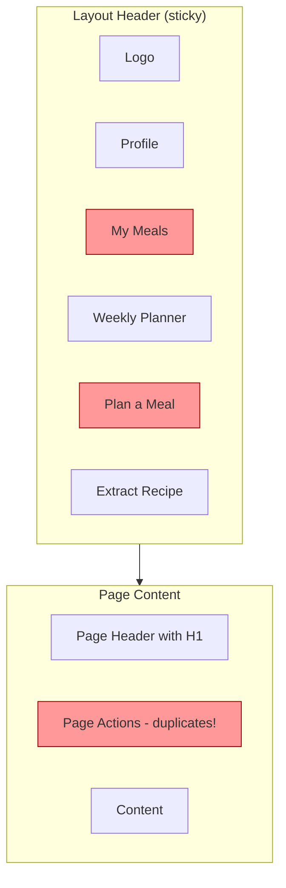
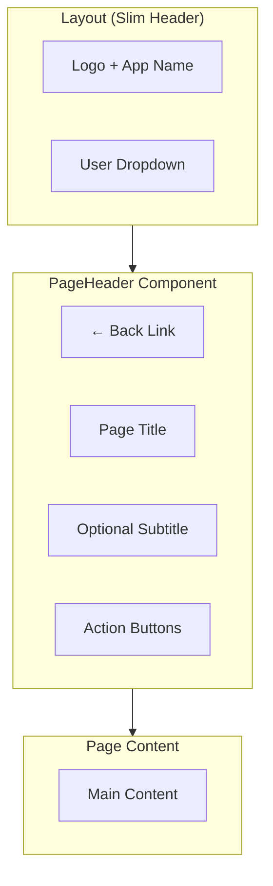

# Navigation Architecture

A unified navigation system that eliminates redundant headers and establishes clear information hierarchy.

---

## Table of Contents

1. [Overview](#overview)
2. [Current Problems](#current-problems)
3. [Proposed Architecture](#proposed-architecture)
4. [Component Design](#component-design)
5. [Button Hierarchy](#button-hierarchy)
6. [Implementation Plan](#implementation-plan)

---

## Overview

### Vision
Create a streamlined navigation experience where each screen has a single, purposeful header that combines branding, context, and actions without duplication.

### Core Principles
- **Single Header Rule**: Each page has exactly one header area
- **Context Ownership**: Pages own their title and actions; layout owns branding and user nav
- **Clear Hierarchy**: Primary actions are immediately visible; secondary actions in menus
- **Responsive First**: Mobile navigation is thoughtful, not just collapsed

---

## Current Problems

### 1. Duplicate Navigation Elements


The layout has 5-6 buttons that conditionally show/hide based on 7+ route checks. Individual pages then add their own headers with similar buttons.

### 2. Complex Conditional Logic
```typescript
// Current: 7 route checks in layout
const isNewPage = location.pathname === "/recipes/new";
const isPlannerPage = location.pathname === "/recipes/planner";
const isMealsListPage = location.pathname === "/recipes/meals";
const isMealDetailPage = location.pathname.match(/^\/recipes\/meals\/[a-f0-9-]+/);
const isMealPlannerPage = location.pathname === "/recipes/meal";
const isProfilePage = location.pathname === "/recipes/profile";
const isDetailPage = location.pathname.match(/^\/recipes\/[a-f0-9-]+$/);
```

### 3. Inconsistent Button Styles
- Mixed `variant="ghost"`, `variant="outline"`, and default
- No clear hierarchy for primary vs secondary actions
- Inconsistent sizing (`size="sm"` vs `size="icon"`)

---

## Proposed Architecture

### New Navigation Hierarchy



### Key Changes

1. **Layout Header**: Only logo + user menu (avatar dropdown with Profile, Logout)
2. **PageHeader Component**: Reusable component each page uses for its header
3. **Page Actions**: Each page defines its own primary/secondary actions
4. **No Duplication**: Single source of truth for each navigation element

---

## Component Design

### PageHeader Component

```
┌─────────────────────────────────────────────────────────────────┐
│ ← Back to Recipes    [Secondary Action]  [Primary Action ▸]     │
│                                                                  │
│ Page Title                                                       │
│ Optional subtitle or description text                            │
└─────────────────────────────────────────────────────────────────┘
```

**Props:**
| Prop | Type | Description |
|------|------|-------------|
| `title` | string | Page heading (h1) |
| `subtitle` | string? | Optional description |
| `backTo` | { label: string; href: string }? | Back navigation |
| `actions` | ReactNode? | Action buttons slot |

### User Menu (Avatar Dropdown)

```
┌──────────────────┐
│ My Recipes       │ ← Link to /recipes
├──────────────────┤
│ My Meals         │ ← Link to /recipes/meals
│ Weekly Planner   │ ← Link to /recipes/planner
├──────────────────┤
│ Profile Settings │ ← Link to /recipes/profile
├──────────────────┤
│ Sign Out         │
└──────────────────┘
```

---

## Button Hierarchy

### Action Button Classes

| Type | Variant | Use Case | Example |
|------|---------|----------|---------|
| **Primary CTA** | `default` + `shadow-warm` | Main page action | "Extract Recipe", "Save Meal" |
| **Secondary Action** | `outline` | Important but not primary | "Weekly Planner" |
| **Tertiary/Nav** | `ghost` | Navigation, back buttons | "← Back", user menu items |

### Button Sizes

| Size | Use Case |
|------|----------|
| `default` (h-9) | Standard actions |
| `sm` (h-8) | Toolbar actions, space-constrained |
| `icon` (size-9) | Icon-only buttons (back, menu) |
| `icon-sm` (size-8) | Small icon buttons |

---

## Implementation Plan

### Phase 1: Create Shared Components

1. Create `PageHeader` component in `app/components/layout/page-header.tsx`
2. Create `UserMenu` component in `app/components/layout/user-menu.tsx`

### Phase 2: Update Layout

1. Simplify `app/routes/recipes/_layout.tsx`:
   - Remove all action buttons
   - Keep only logo + UserMenu
   - Remove conditional route logic

### Phase 3: Update Pages

Update each page to use PageHeader with appropriate actions:

| Page | Back Link | Primary Action | Secondary Actions |
|------|-----------|----------------|-------------------|
| `/recipes` (list) | None | Extract Recipe | My Meals, Weekly Planner |
| `/recipes/new` | Recipes | Submit | - |
| `/recipes/:id` | Recipes | Edit (if owner) | Share |
| `/recipes/planner` | Recipes | - | Add Recipe |
| `/recipes/meals` | Recipes | Plan a Meal | - |
| `/recipes/meals/:id` | My Meals | Share, Print | Edit |
| `/recipes/meal` | Recipes | Save | - |
| `/recipes/profile` | Recipes | Save | View Public Profile |

### Phase 4: Clean Up

1. Remove unused conditional logic from layout
2. Ensure consistent button hierarchy across all pages
3. Test responsive behavior

---

## Visual Comparison

### Before
```
┌─────────────────────────────────────────────────────────────────┐
│ [←] 🍳 mise en place │ Profile │ My Meals │ Planner │ +Extract │
├─────────────────────────────────────────────────────────────────┤
│ ┌─────────────────────────────────────────────────────────────┐ │
│ │ My Meals                            [+ Plan a Meal]         │ │
│ │ Manage your multi-course meals                              │ │
│ └─────────────────────────────────────────────────────────────┘ │
│                                                                 │
│ [ Cards... ]                                                    │
└─────────────────────────────────────────────────────────────────┘
```

### After
```
┌─────────────────────────────────────────────────────────────────┐
│ 🍳 mise en place                                        [👤 ▾]  │
├─────────────────────────────────────────────────────────────────┤
│ ← Back to Recipes                            [+ Plan a Meal ▸] │
│                                                                 │
│ My Meals                                                        │
│ Manage your multi-course dining experiences                     │
├─────────────────────────────────────────────────────────────────┤
│                                                                 │
│ [ Cards... ]                                                    │
└─────────────────────────────────────────────────────────────────┘
```

---

*Architecture Document v1.0*
