# Public Meal Plans: Information Architecture

A feature for sharing curated weekly meal plans publicly, allowing users to showcase their planning approach and enabling visitors to import complete meal plans with one click.

---

## Table of Contents

1. [Overview](#overview)
2. [User Flow](#user-flow)
3. [System Architecture](#system-architecture)
4. [Data Model](#data-model)
5. [Feature Breakdown](#feature-breakdown)
6. [UI Components](#ui-components)
7. [Frontend Design Specification](#frontend-design-specification)
8. [Technical Stack](#technical-stack)
9. [Future Roadmap](#future-roadmap)

---

## Overview

### Vision
Enable home cooks to share their weekly meal planning expertise with others. Instead of sharing individual recipes, users can share complete curated meal plans—a week's worth of coordinated meals with aggregated grocery lists—that visitors can import directly into their own planner.

### Core Value Proposition
- **For Creators**: Showcase meal planning creativity, build an audience, share curated weekly menus
- **For Visitors**: Skip the "what's for dinner" decision fatigue by importing proven meal plans
- **For the Platform**: Viral sharing mechanism, content discovery, increased engagement

### Competitive Positioning

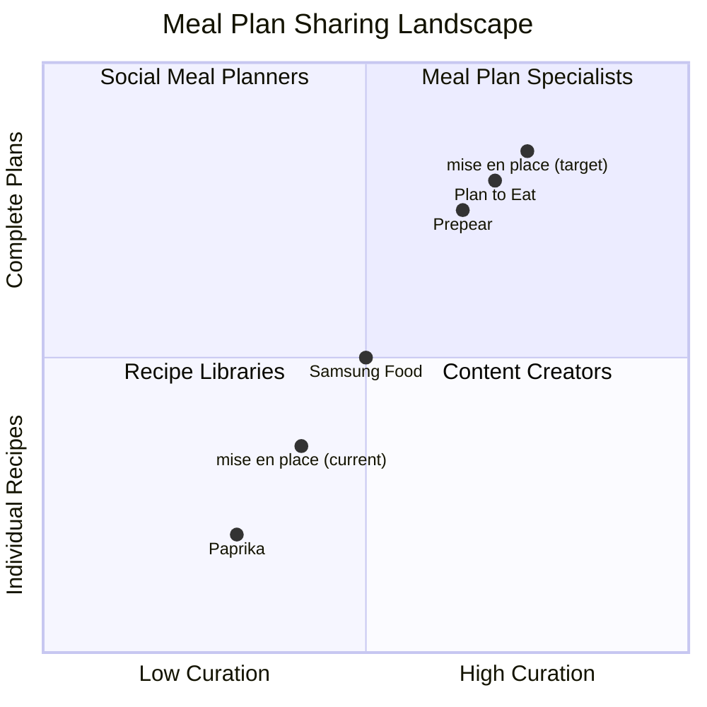

**Differentiation**: While competitors focus on recipe sharing or subscription meal plans from influencers, mise en place enables peer-to-peer meal plan sharing with **YouTube video integration**—the only app where shared plans include timestamped video references.

---

## User Flow

### Primary Flow: Save & Share a Meal Plan

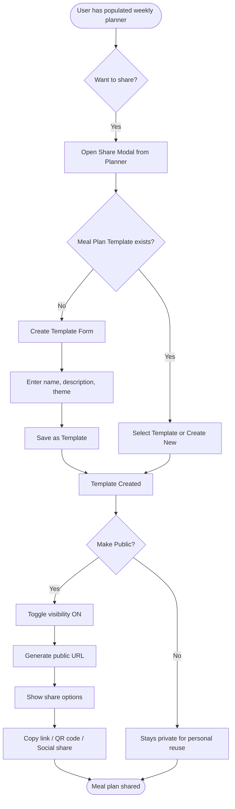

### Detailed State Machine

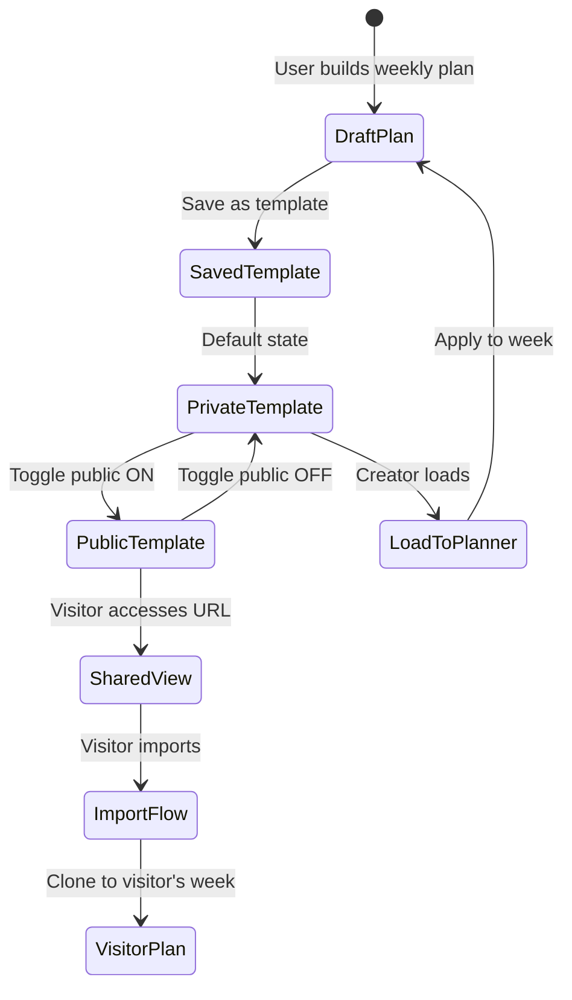

### Visitor Import Journey

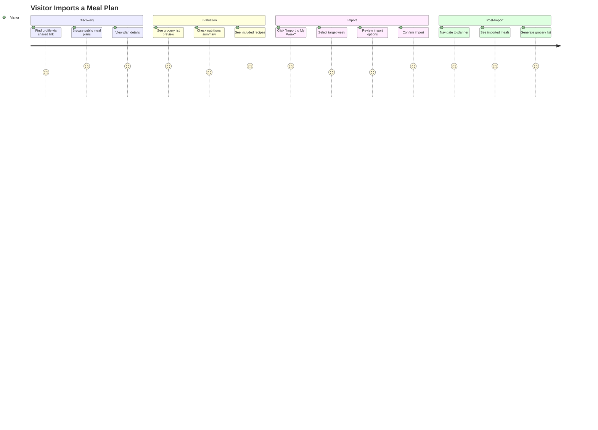

---

## System Architecture

### High-Level Architecture

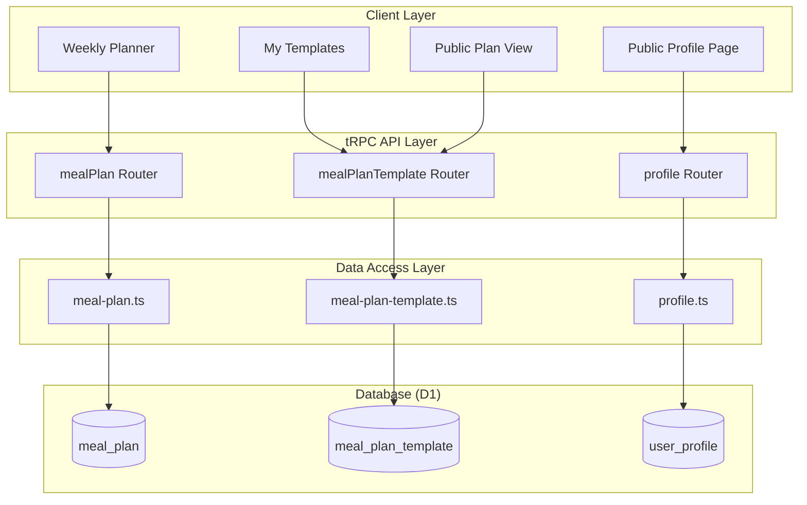

### Import Processing Sequence

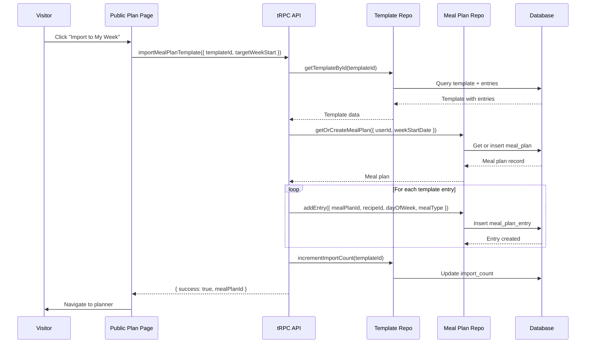

---

## Data Model

### Entity Relationship Diagram

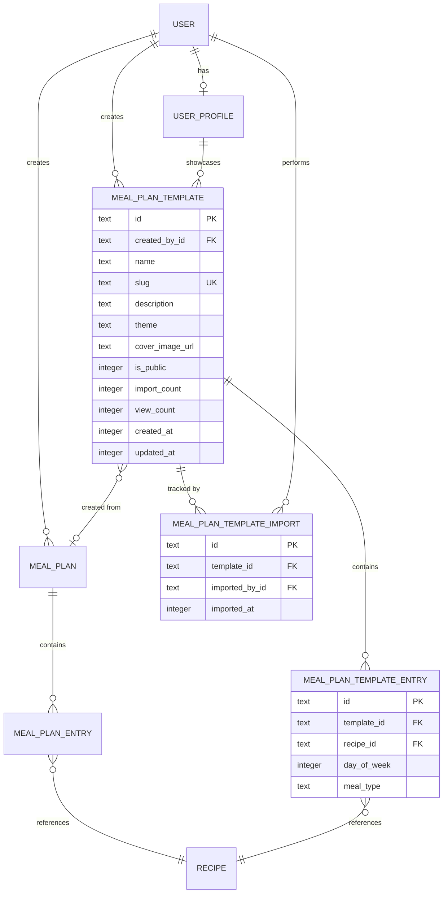

### TypeScript Data Structures

```typescript
// New table: meal_plan_template
interface MealPlanTemplate {
  id: string;
  createdById: string;
  name: string;
  slug: string;
  description: string | null;
  theme: string | null; // e.g., "Mediterranean", "Budget-Friendly", "Quick Weeknight"
  coverImageUrl: string | null;
  isPublic: boolean;
  importCount: number;
  viewCount: number;
  createdAt: Date;
  updatedAt: Date;
}

// New table: meal_plan_template_entry
interface MealPlanTemplateEntry {
  id: string;
  templateId: string;
  recipeId: string;
  dayOfWeek: number; // 0-6 (Monday-Sunday)
  mealType: "breakfast" | "lunch" | "dinner" | "snacks";
}

// New table: meal_plan_template_import
interface MealPlanTemplateImport {
  id: string;
  templateId: string;
  importedById: string;
  importedAt: Date;
}

// Response types for API
interface PublicMealPlanTemplateResponse {
  template: {
    id: string;
    name: string;
    slug: string;
    description: string | null;
    theme: string | null;
    coverImageUrl: string | null;
    importCount: number;
    viewCount: number;
    createdAt: Date;
  };
  entries: Array<{
    dayOfWeek: number;
    mealType: string;
    recipe: {
      id: string;
      title: string;
      slug: string | null;
      thumbnailUrl: string | null;
      sourceType: "youtube" | "blog" | "original";
      calories: number | null;
      protein: number | null;
      prepTimeMinutes: number | null;
      cookTimeMinutes: number | null;
    };
  }>;
  groceryPreview: {
    totalIngredients: number;
    categories: Array<{ name: string; count: number }>;
  };
  nutritionSummary: {
    avgCalories: number;
    avgProtein: number;
    totalRecipes: number;
  };
  creator: {
    username: string;
    displayName: string | null;
    avatarUrl: string | null;
  };
}
```

---

## Feature Breakdown

### Feature 1: Save Weekly Plan as Template

**Purpose**: Allow users to save their current weekly meal plan as a reusable template.

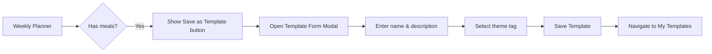

**User Story**: As a home cook, I want to save my current week's meal plan as a named template so I can reuse it or share it later.

**Acceptance Criteria**:
- [ ] "Save as Template" button appears when planner has at least 3 meals
- [ ] Form captures: name (required), description (optional), theme (optional dropdown)
- [ ] Slug auto-generated from name
- [ ] Success toast with link to view template
- [ ] Template appears in "My Templates" section

### Feature 2: My Templates Management

**Purpose**: Central hub for managing saved meal plan templates.

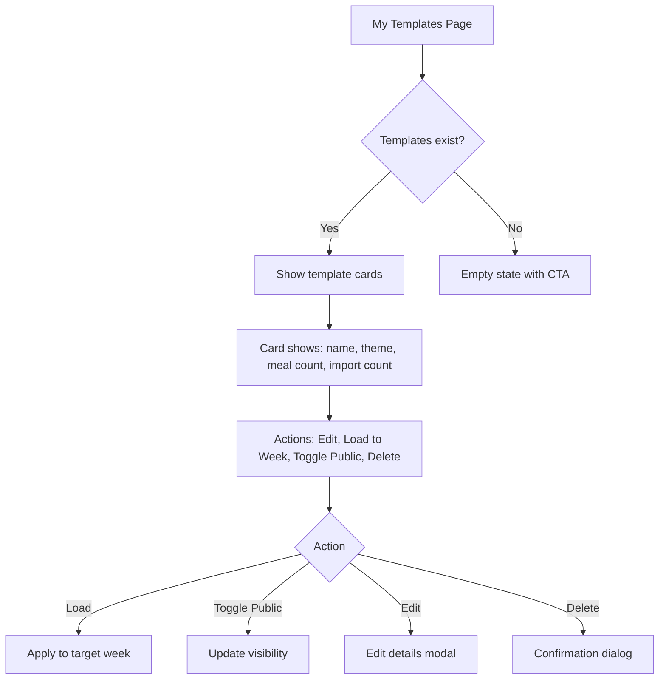

**Key Features**:
- Grid of template cards with cover images
- Quick actions: Load to week, Edit, Share, Delete
- Visibility toggle with real-time URL preview
- Import count and view count stats

### Feature 3: Public Meal Plan View

**Purpose**: Public page for viewing and importing a shared meal plan.

**URL Structure**: `/u/[username]/plans/[slug]`

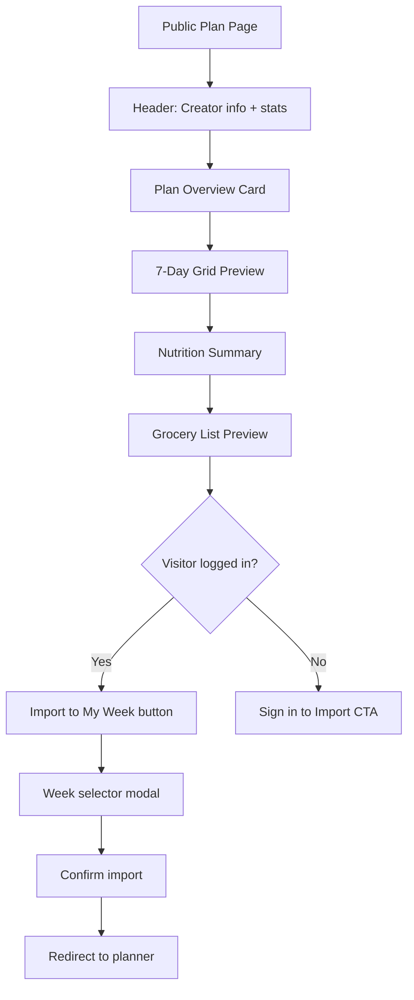

**Features**:
- Compact weekly grid showing meal thumbnails
- Expandable recipe cards
- Aggregated grocery list preview (categories + counts)
- Weekly nutrition summary
- Share buttons (copy link, QR code)
- One-click import with week selection

### Feature 4: Import Meal Plan

**Purpose**: Clone a public meal plan template to visitor's weekly planner.

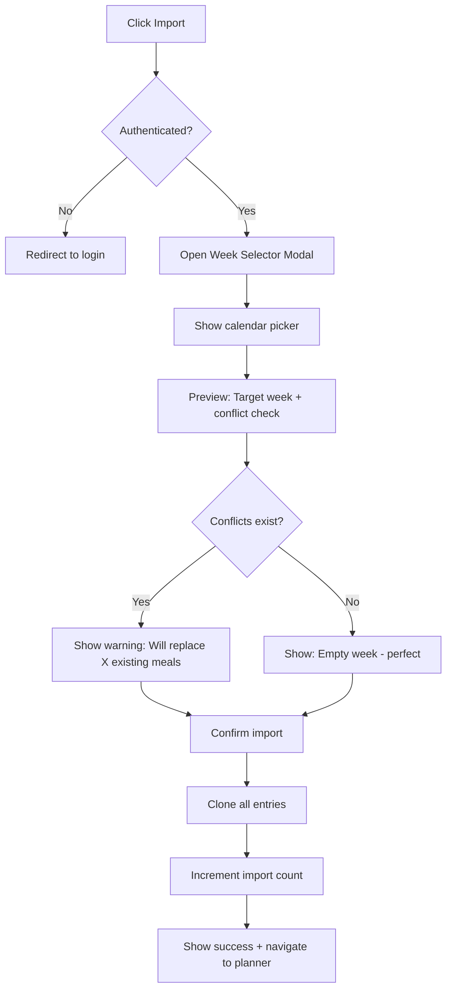

**Import Behavior**:
- **Replace mode** (default): Overwrites existing meals in the target week
- **Merge mode** (future): Only fills empty slots
- Recipes must be public or owned by visitor
- Non-public recipes gracefully skipped with warning

### Feature 5: Profile Integration

**Purpose**: Display public meal plan templates on user's public profile.

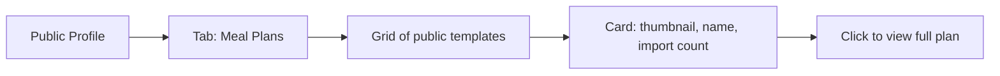

**Tab Order**: Original Recipes | Collected Recipes | **Meal Plans**

---

## UI Components

### Component Hierarchy

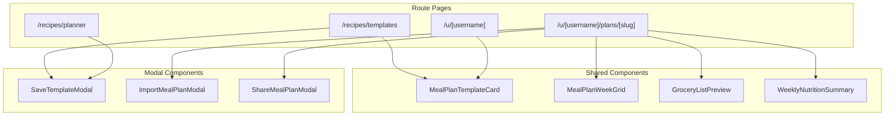

### Screen Wireframes

#### Screen: Save Template Modal

```
┌─────────────────────────────────────────────────────────┐
│ ✕                    Save as Template                   │
├─────────────────────────────────────────────────────────┤
│                                                         │
│  Template Name *                                        │
│  ┌─────────────────────────────────────────────────┐   │
│  │ Mediterranean Week                               │   │
│  └─────────────────────────────────────────────────┘   │
│                                                         │
│  Description                                            │
│  ┌─────────────────────────────────────────────────┐   │
│  │ Fresh, healthy Mediterranean meals perfect for   │   │
│  │ summer. Light lunches and flavorful dinners.     │   │
│  └─────────────────────────────────────────────────┘   │
│                                                         │
│  Theme Tag                                              │
│  ┌─────────────────────────────────────────────────┐   │
│  │ Mediterranean ▼                                  │   │
│  └─────────────────────────────────────────────────┘   │
│                                                         │
│  Preview                                                │
│  ┌─────────────────────────────────────────────────┐   │
│  │ 📅 7 days • 🍽️ 14 meals • 🛒 43 ingredients    │   │
│  └─────────────────────────────────────────────────┘   │
│                                                         │
│           [ Cancel ]        [ Save Template ]           │
│                                                         │
└─────────────────────────────────────────────────────────┘
```

#### Screen: Public Meal Plan View

```
┌─────────────────────────────────────────────────────────────────────┐
│ ← Back to @sarah's profile                     🔗 Share   📥 Import │
├─────────────────────────────────────────────────────────────────────┤
│                                                                     │
│  ┌────────────────────────────────────────────────────────────┐    │
│  │  Mediterranean Week                                         │    │
│  │  ━━━━━━━━━━━━━━━━━━━━                                      │    │
│  │  Fresh, healthy Mediterranean meals perfect for summer.     │    │
│  │                                                             │    │
│  │  🏷️ Mediterranean  •  📥 127 imports  •  👁️ 1.2k views     │    │
│  │                                                             │    │
│  │  Created by @sarah • Sarah Chen                             │    │
│  └────────────────────────────────────────────────────────────┘    │
│                                                                     │
│  ┌─────┬─────┬─────┬─────┬─────┬─────┬─────┐                       │
│  │ Mon │ Tue │ Wed │ Thu │ Fri │ Sat │ Sun │  ← Weekly Preview     │
│  ├─────┼─────┼─────┼─────┼─────┼─────┼─────┤                       │
│  │ 🥗  │ 🍲  │ 🥙  │ 🍝  │ 🐟  │ 🍖  │ 🥘  │  ← Dinner thumbnails  │
│  │ 🥪  │ 🥗  │ 🍜  │ 🥗  │ 🥪  │ — │ — │  ← Lunch thumbnails   │
│  └─────┴─────┴─────┴─────┴─────┴─────┴─────┘                       │
│                                                                     │
│  ┌─ Weekly Summary ────────────────────────────────────────────┐   │
│  │  📊 Avg 1,850 cal/day  •  🥩 95g protein  •  14 recipes    │   │
│  └─────────────────────────────────────────────────────────────┘   │
│                                                                     │
│  ┌─ Grocery List Preview ──────────────────────────────────────┐   │
│  │  43 ingredients across 7 categories                         │   │
│  │  🥬 Produce (12)  •  🥩 Meat (4)  •  🧀 Dairy (6)  •  ...  │   │
│  └─────────────────────────────────────────────────────────────┘   │
│                                                                     │
│  ┌─ Recipes Included ──────────────────────────────────────────┐   │
│  │  ┌────────┐  ┌────────┐  ┌────────┐  ┌────────┐            │   │
│  │  │  🖼️   │  │  🖼️   │  │  🖼️   │  │  🖼️   │   ...      │   │
│  │  │ Greek  │  │ Hummus │  │ Lemon  │  │ Shaksh │            │   │
│  │  │ Salad  │  │ Bowl   │  │ Chicken│  │ -uka   │            │   │
│  │  └────────┘  └────────┘  └────────┘  └────────┘            │   │
│  └─────────────────────────────────────────────────────────────┘   │
│                                                                     │
│         [ 📥 Import to My Week ]   (Primary CTA)                   │
│                                                                     │
└─────────────────────────────────────────────────────────────────────┘
```

### Design System Tokens

| Token | Value | Usage |
|-------|-------|-------|
| `--template-card-bg` | `var(--card)` | Template card background |
| `--template-badge-bg` | `var(--secondary)` | Theme tag badge |
| `--import-count-text` | `var(--muted-foreground)` | Stats text |
| `--week-grid-border` | `var(--border)` | Grid cell borders |
| `--import-cta-bg` | `var(--primary)` | Primary import button |

---

## Frontend Design Specification

### Aesthetic Direction
**Tone**: Editorial cookbook meets weekly planner—warm, organized, inspiring
**Memorable Element**: The compact 7-day visual grid that shows meal thumbnails at a glance

### Typography

| Usage | Font | Weight |
|-------|------|--------|
| Template name | Playfair Display | 600 (semibold) |
| Description | Source Sans 3 | 400 (regular) |
| Stats/badges | Source Sans 3 | 500 (medium) |

### Color Palette

| Token | Value | Usage |
|-------|-------|-------|
| Background | `var(--background)` | Page background |
| Card | `var(--card)` | Template cards, week grid |
| Primary | `var(--primary)` | Import button, active states |
| Secondary | `var(--secondary)` | Theme tags, stat badges |
| Muted | `var(--muted-foreground)` | Descriptions, counts |

### Motion Design
- **Card hover**: Subtle lift (`translateY(-2px)`) with shadow increase
- **Import success**: Confetti burst or checkmark animation
- **Grid reveal**: Staggered fade-in for meal thumbnails

### Visual Effects
- Grain texture on hero section (consistent with app)
- Warm shadows on template cards
- Subtle gradient on week grid header

---

## Technical Stack

### Stack Overview

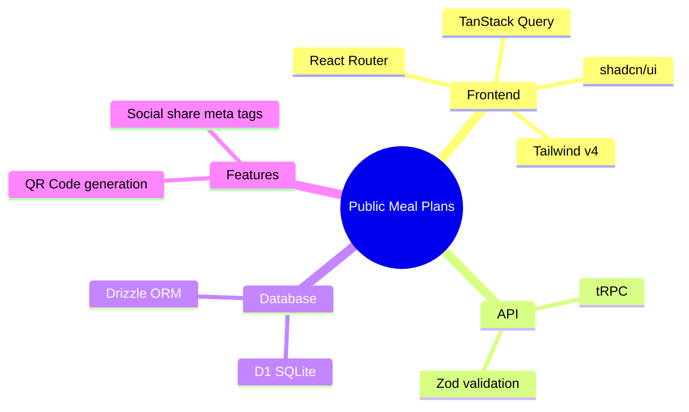

### API Endpoints

| Route | Method | Description |
|-------|--------|-------------|
| `mealPlanTemplate.create` | mutation | Create template from current week |
| `mealPlanTemplate.update` | mutation | Update template details/visibility |
| `mealPlanTemplate.delete` | mutation | Delete a template |
| `mealPlanTemplate.list` | query | Get user's templates |
| `mealPlanTemplate.getBySlug` | query | Get public template by slug |
| `mealPlanTemplate.listPublic` | query | Get user's public templates |
| `mealPlanTemplate.import` | mutation | Import template to user's week |
| `mealPlanTemplate.incrementViewCount` | mutation | Track views |

### New Files

```
app/
├── repositories/
│   └── meal-plan-template.ts     # Template data access
├── trpc/routes/
│   └── meal-plan-template.ts     # tRPC routes
├── routes/recipes/
│   └── templates.tsx             # My Templates page
├── routes/u.[username].plans.tsx # Public plans list
├── routes/u.[username].plans.[slug].tsx # Single public plan
└── components/
    └── meal-plan-template/
        ├── template-card.tsx     # Template card component
        ├── save-template-modal.tsx
        ├── import-modal.tsx
        ├── week-preview-grid.tsx
        └── grocery-preview.tsx
```

### Migration

```sql
-- drizzle/0008_add_meal_plan_templates.sql

CREATE TABLE `meal_plan_template` (
  `id` text PRIMARY KEY NOT NULL,
  `created_by_id` text NOT NULL,
  `name` text NOT NULL,
  `slug` text NOT NULL,
  `description` text,
  `theme` text,
  `cover_image_url` text,
  `is_public` integer DEFAULT false NOT NULL,
  `import_count` integer DEFAULT 0 NOT NULL,
  `view_count` integer DEFAULT 0 NOT NULL,
  `created_at` integer DEFAULT (cast(unixepoch('subsecond') * 1000 as integer)) NOT NULL,
  `updated_at` integer DEFAULT (cast(unixepoch('subsecond') * 1000 as integer)) NOT NULL,
  FOREIGN KEY (`created_by_id`) REFERENCES `user`(`id`) ON UPDATE no action ON DELETE cascade
);

CREATE UNIQUE INDEX `meal_plan_template_slug_unique` ON `meal_plan_template` (`created_by_id`, `slug`);

CREATE TABLE `meal_plan_template_entry` (
  `id` text PRIMARY KEY NOT NULL,
  `template_id` text NOT NULL,
  `recipe_id` text NOT NULL,
  `day_of_week` integer NOT NULL,
  `meal_type` text NOT NULL,
  FOREIGN KEY (`template_id`) REFERENCES `meal_plan_template`(`id`) ON UPDATE no action ON DELETE cascade,
  FOREIGN KEY (`recipe_id`) REFERENCES `recipe`(`id`) ON UPDATE no action ON DELETE cascade
);

CREATE TABLE `meal_plan_template_import` (
  `id` text PRIMARY KEY NOT NULL,
  `template_id` text NOT NULL,
  `imported_by_id` text NOT NULL,
  `imported_at` integer DEFAULT (cast(unixepoch('subsecond') * 1000 as integer)) NOT NULL,
  FOREIGN KEY (`template_id`) REFERENCES `meal_plan_template`(`id`) ON UPDATE no action ON DELETE cascade,
  FOREIGN KEY (`imported_by_id`) REFERENCES `user`(`id`) ON UPDATE no action ON DELETE cascade
);
```

---

## Future Roadmap

### Phase 1 (Current Scope)
- [ ] Database schema for templates
- [ ] Save weekly plan as template
- [ ] My Templates management page
- [ ] Toggle template visibility
- [ ] Public template view page
- [ ] Import template to week
- [ ] Profile integration (Meal Plans tab)
- [ ] Share modal with QR code

### Phase 2: Social Discovery
- [ ] Browse public templates (explore page)
- [ ] Template search by theme/creator
- [ ] "Like" or "Save" public templates
- [ ] Following system for creators
- [ ] Activity feed (new templates from followed users)

### Phase 3: Advanced Features
- [ ] Template versioning (update a public template)
- [ ] Scheduling (auto-load template on a future week)
- [ ] Template collections (group related templates)
- [ ] Collaboration (co-create templates with family)
- [ ] Template comments and ratings
- [ ] Export as PDF (printable meal plan guide)

---

## UI Concepts

Three distinct concepts targeting different ICPs, each tailored to resonate with a specific user persona while maintaining the editorial cookbook aesthetic.

### Concept 1: "The Curator's Canvas" (YouTube Recipe Enthusiast)


**Visual Direction**: Dynamic, video-forward design showcasing YouTube integration
**Target Fit Score**: 72/100

**Hero Design**:
- Split-screen layout with video thumbnail mosaic
- 7-day grid showing recipe thumbnails with play button overlays
- Prominent YouTube badges on video-sourced recipes
- Mediterranean theme tag with import/view stats

**Color Emphasis**: Heavier primary (terracotta) for energy and action

**Key Visual Elements**:
- Video play icons on recipe cards
- Import count prominently displayed
- Chef creator profile integration
- Grocery list preview at bottom

**Headline**: "Mediterranean Week"
**Subheadline**: "Experience the vibrant flavors with easy-to-follow video recipes from top YouTube creators"

---

### Concept 2: "The Organizer's Oasis" (Overwhelmed Meal Planner)


**Visual Direction**: Calm, organized, grid-focused design for busy families
**Target Fit Score**: 68/100

**Hero Design**:
- Clean 7-day grid as the visual centerpiece
- Full week at a glance with breakfast/lunch/dinner/snacks rows
- Prep time badges on each meal
- Total time per day at bottom of columns

**Color Emphasis**: Sage green for calm, organized feel

**Key Visual Elements**:
- "547 families use this plan" social proof
- Time badges showing prep minutes
- "All recipes under 30 minutes" badge
- Grocery list category breakdown
- Clear "Copy This Plan to My Week" CTA

**Headline**: "Quick Family Dinners"
**Subheadline**: "30-minute meals for busy weeknights. 547 families use this plan."

---

### Concept 3: "The Heritage Keeper" (Analog Recipe Archivist)


**Visual Direction**: Warm, nostalgic, cookbook-inspired heritage aesthetic
**Target Fit Score**: 58/100

**Hero Design**:
- Magazine-style editorial layout
- Handwritten script accents
- Featured "Sunday's Centerpiece" recipe highlight
- Personal family story quote block

**Color Emphasis**: Warm cream with deep terracotta and gold accents

**Key Visual Elements**:
- "Family Recipe" badges
- Grandmother portrait illustration
- "Passed down from Rosa" attribution
- Heritage statistics: "Shared by 89 families • Passed down 3 generations"
- "Print as Recipe Book" secondary action

**Headline**: "Grandma Rosa's Sunday Suppers"
**Subheadline**: "A week of Italian comfort. These are the meals my grandmother made every Sunday..."

---

*Architecture Document v1.0 — Public Meal Plans — February 3, 2026*
