# Recipe Extraction App: Information Architecture

A professional-grade application that transforms YouTube cooking videos and blog posts into structured, actionable recipes with nutritional data and precise timestamps.

---

## Table of Contents

1. [Overview](#overview)
2. [User Flow](#user-flow)
3. [System Architecture](#system-architecture)
4. [Data Model](#data-model)
5. [Feature Breakdown](#feature-breakdown)
6. [UI Components](#ui-components)
7. [Technical Stack](#technical-stack)
8. [Admin Features](#admin-features)
9. [Future Roadmap](#future-roadmap)

---

## Overview

### Vision

Recipe Extraction is a precision tool for home cooks who want to extract, organize, and track recipes from video content and food blogs. The application emphasizes accuracy, clarity, and professional-grade nutritional tracking with an ingredient database for future meal planning.

### Core Value Proposition

- **One Input**: Paste a YouTube URL or blog link
- **Three Outputs**: Macros, Steps, Timestamps
- **Future Value**: Ingredient index for meal planning

### Competitive Positioning

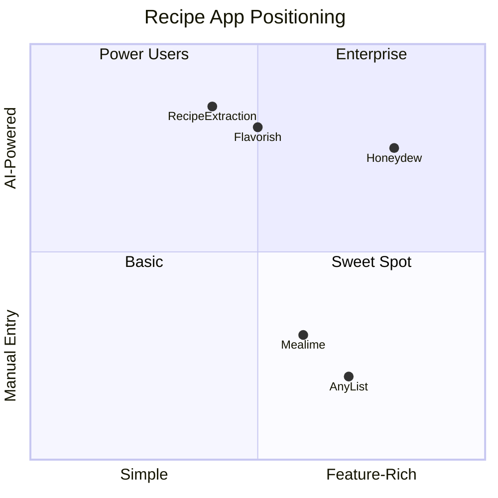

---

## User Flow

### Primary Flow Diagram

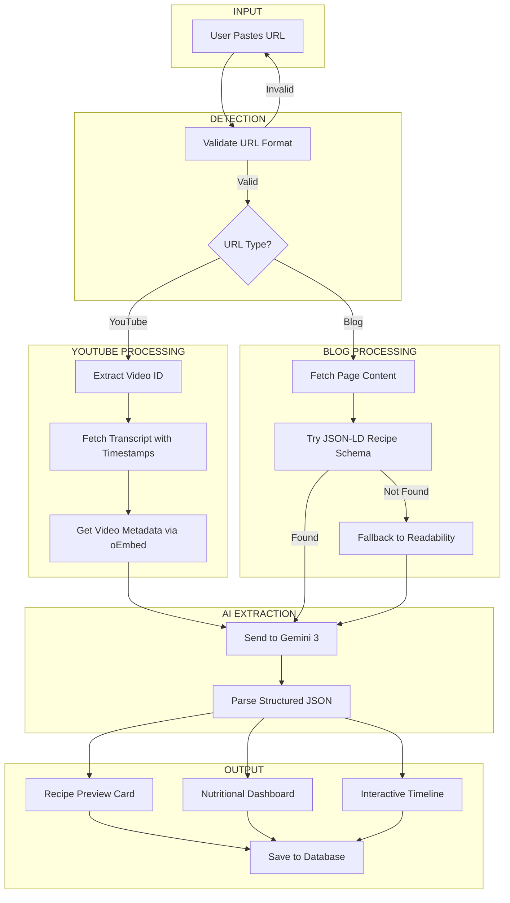

### Detailed State Machine

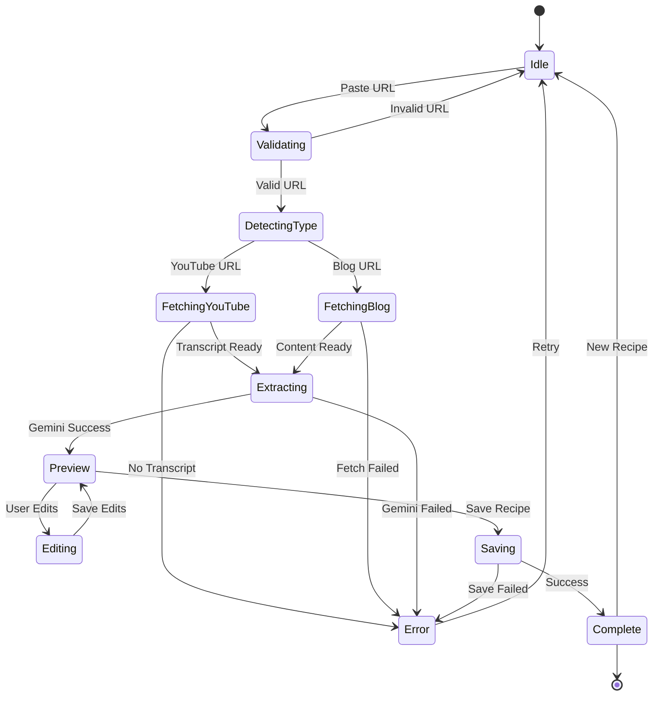

### User Journey Map

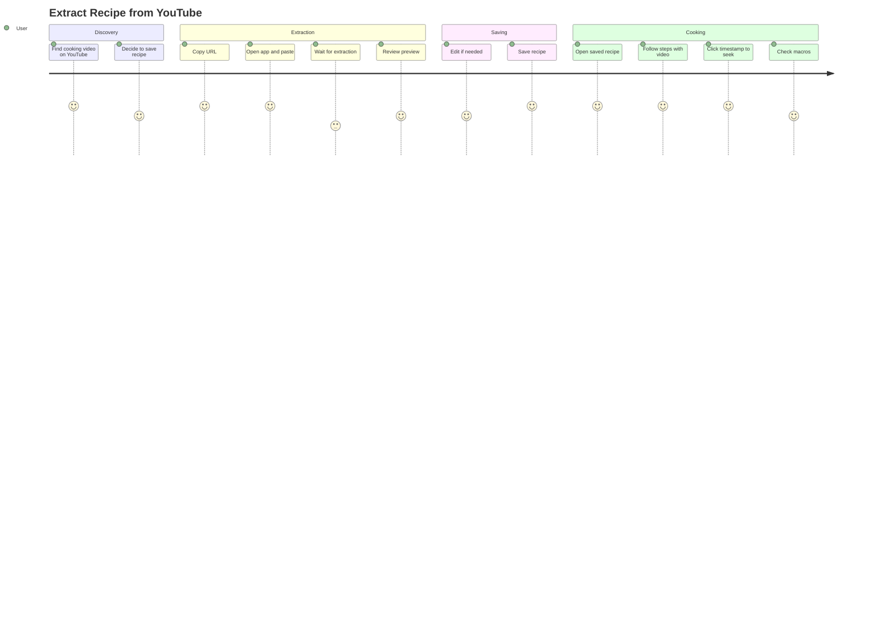

---

## System Architecture

### High-Level Architecture

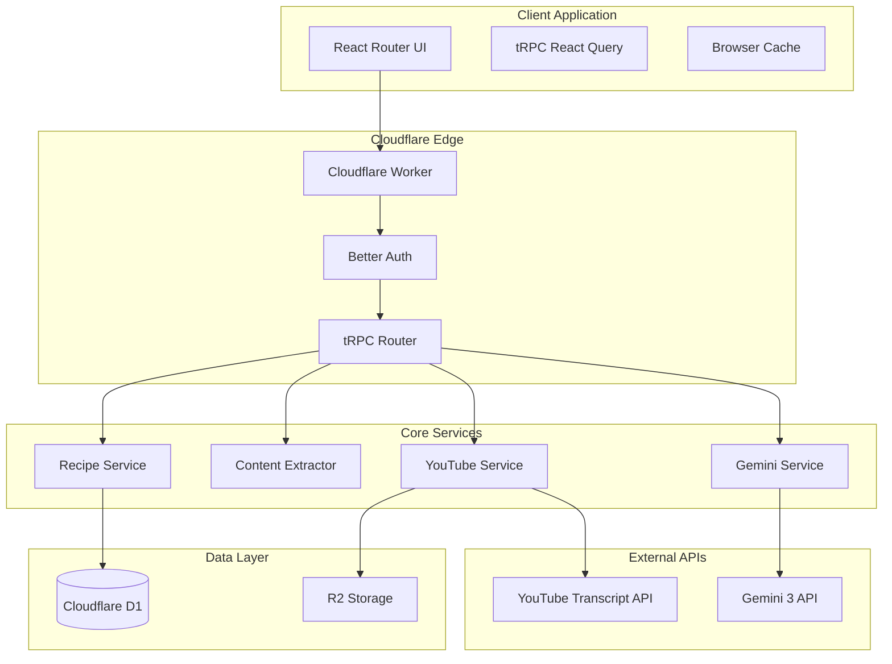

### Processing Pipeline

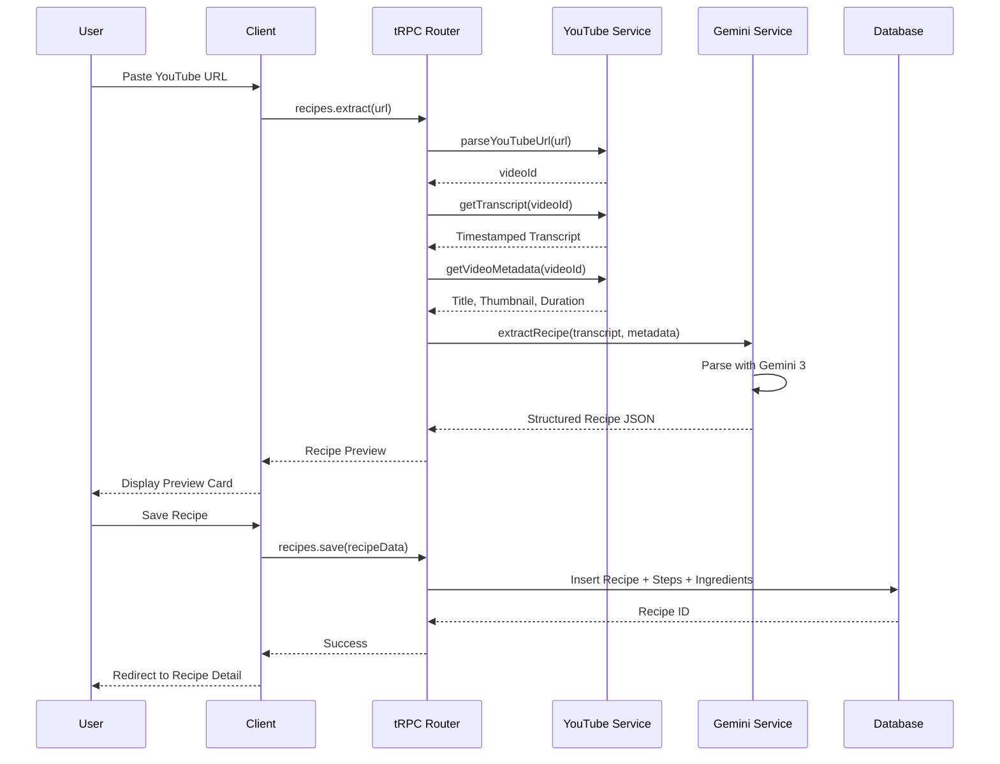

---

## Data Model

### Entity Relationship Diagram

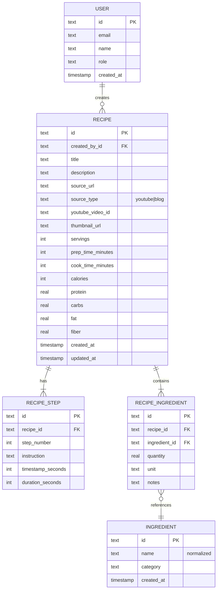

### TypeScript Data Structures

```typescript
interface Recipe {
  id: string;
  createdById: string;
  
  // Source
  title: string;
  description: string | null;
  sourceUrl: string;
  sourceType: 'youtube' | 'blog';
  youtubeVideoId: string | null;
  thumbnailUrl: string | null;
  
  // Timing
  servings: number;
  prepTimeMinutes: number | null;
  cookTimeMinutes: number | null;
  
  // Macros (per serving)
  calories: number | null;
  protein: number | null;  // grams
  carbs: number | null;    // grams
  fat: number | null;      // grams
  fiber: number | null;    // grams
  
  // Relations
  steps: RecipeStep[];
  ingredients: RecipeIngredient[];
  
  // Timestamps
  createdAt: Date;
  updatedAt: Date;
}

interface RecipeStep {
  id: string;
  recipeId: string;
  stepNumber: number;
  instruction: string;
  timestampSeconds: number | null;  // for YouTube
  durationSeconds: number | null;
}

interface Ingredient {
  id: string;
  name: string;           // normalized (e.g., "chicken breast")
  category: string | null; // e.g., "protein", "vegetable"
  createdAt: Date;
}

interface RecipeIngredient {
  id: string;
  recipeId: string;
  ingredientId: string;
  quantity: number | null;  // e.g., 2
  unit: string | null;      // e.g., "cups", "lbs"
  notes: string | null;     // e.g., "diced"
  
  // Joined
  ingredient: Ingredient;
}
```

---

## Feature Breakdown

### 1. URL Input and Validation

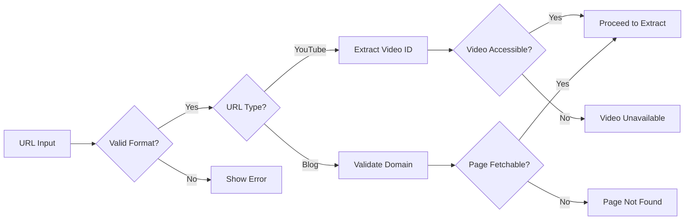

**Validation Rules:**
- YouTube: Supports youtube.com/watch, youtu.be, youtube.com/embed
- Blog: Any valid HTTP/HTTPS URL
- Video must have captions/transcript available
- Blog must be publicly accessible

### 2. Macro Extraction

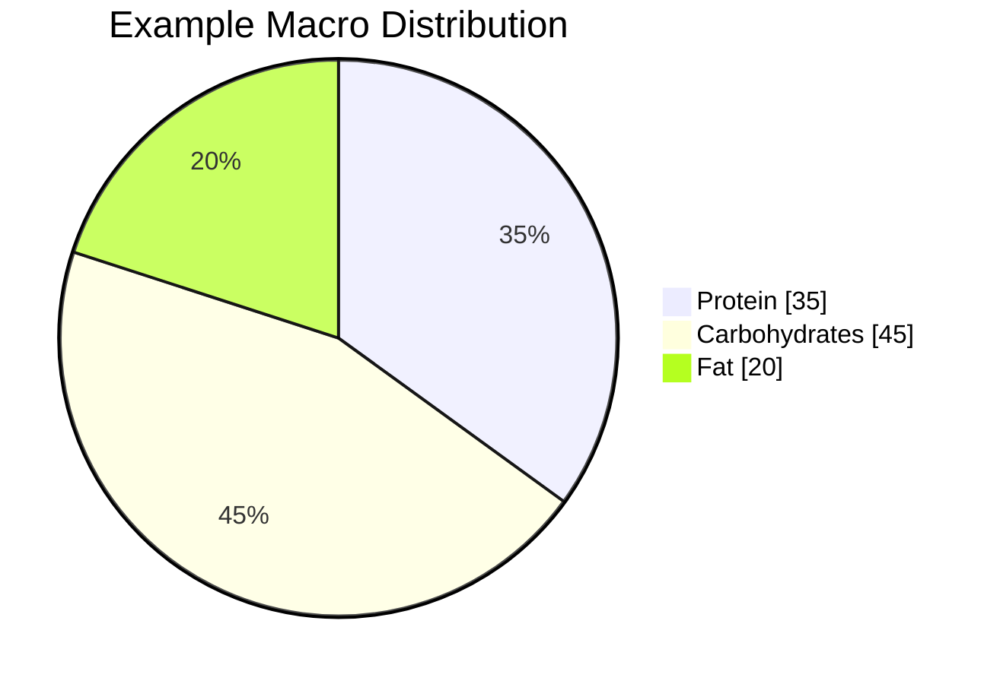

**Nutrition Features:**
- AI-estimated macros per serving
- Total recipe nutrition (servings × per serving)
- Visual macro breakdown
- Calorie and fiber tracking

### 3. Step-by-Step Instructions with Timestamps

| Component | Description |
|-----------|-------------|
| Step Number | Sequential ordering (1, 2, 3...) |
| Instruction | Clear, actionable cooking instruction |
| Timestamp | Click to seek YouTube video |
| Visual Indicator | Highlight active step during playback |

### 4. Interactive Video Timeline

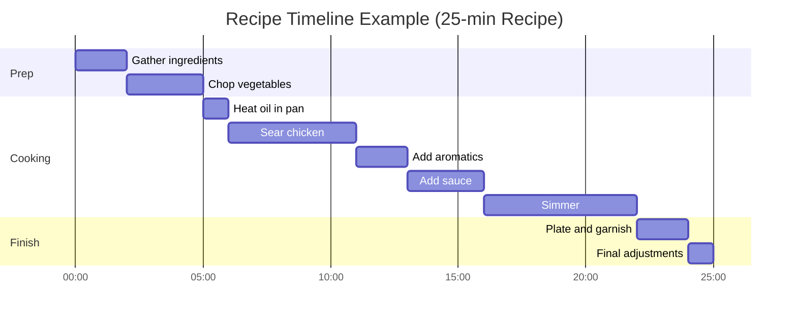

---

## UI Components

### Component Hierarchy

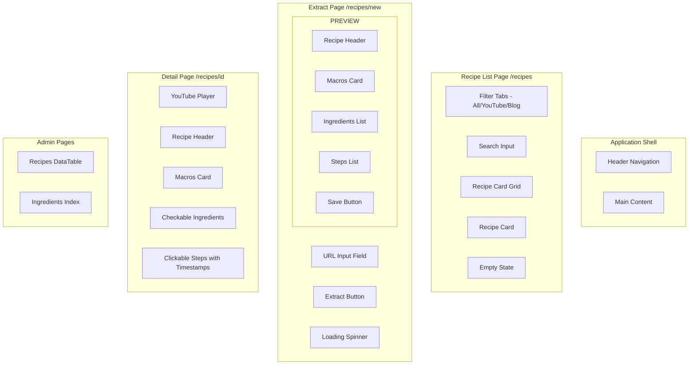

### Screen Wireframes

#### Extract New Recipe (/recipes/new)

```
┌─────────────────────────────────────────────────────────────┐
│ Logo                              My Recipes    [User Menu] │
├─────────────────────────────────────────────────────────────┤
│                                                             │
│  ┌───────────────────────────────────────────────────────┐  │
│  │  Extract a Recipe                                     │  │
│  │                                                       │  │
│  │  Paste a YouTube video or blog URL                    │  │
│  │  ┌─────────────────────────────────────┐ ┌─────────┐  │  │
│  │  │ https://youtube.com/watch?v=...     │ │ Extract │  │  │
│  │  └─────────────────────────────────────┘ └─────────┘  │  │
│  │                                                       │  │
│  │  Supports: YouTube, food blogs, recipe sites          │  │
│  └───────────────────────────────────────────────────────┘  │
│                                                             │
│  [After extraction - Preview Card]                          │
│  ┌───────────────────────────────────────────────────────┐  │
│  │ ┌─────────┐  Chicken Tikka Masala              [Edit] │  │
│  │ │ thumb   │  Source: Joshua Weissman (YouTube)        │  │
│  │ │         │  Servings: 4 | Prep: 20min | Cook: 30min  │  │
│  │ └─────────┘                                           │  │
│  ├───────────────────────────────────────────────────────┤  │
│  │ Macros per serving                                    │  │
│  │ ┌────────┐ ┌────────┐ ┌────────┐ ┌────────┐          │  │
│  │ │ 520    │ │ 35g    │ │ 28g    │ │ 32g    │          │  │
│  │ │ kcal   │ │protein │ │ carbs  │ │ fat    │          │  │
│  │ └────────┘ └────────┘ └────────┘ └────────┘          │  │
│  ├───────────────────────────────────────────────────────┤  │
│  │ Ingredients (12)                                      │  │
│  │ • 2 lbs chicken thighs, boneless                      │  │
│  │ • 1 cup yogurt                                        │  │
│  │ • 2 tbsp garam masala                                 │  │
│  ├───────────────────────────────────────────────────────┤  │
│  │ Steps (8)                                             │  │
│  │ 1. [0:45] Marinate chicken in yogurt and spices      │  │
│  │ 2. [3:20] Heat oil in a large pan                    │  │
│  │ 3. [5:15] Add onions and cook until golden           │  │
│  ├───────────────────────────────────────────────────────┤  │
│  │                              [Cancel]  [Save Recipe]  │  │
│  └───────────────────────────────────────────────────────┘  │
└─────────────────────────────────────────────────────────────┘
```

#### Recipe Detail (/recipes/:id)

```
┌─────────────────────────────────────────────────────────────┐
│ Logo                              My Recipes    [User Menu] │
├─────────────────────────────────────────────────────────────┤
│ ← Back to Recipes                                           │
│                                                             │
│ ┌─────────────────────────────────────────────────────────┐ │
│ │                                                         │ │
│ │        [YouTube Video Embed - 16:9 aspect ratio]        │ │
│ │                                                         │ │
│ └─────────────────────────────────────────────────────────┘ │
│                                                             │
│ Chicken Tikka Masala                            [⋮ Menu]    │
│ Source: Joshua Weissman • Saved Jan 25, 2026                │
│                                                             │
│ ┌──────────────────────┐  ┌──────────────────────────────┐  │
│ │ Macros per serving   │  │ Ingredients                  │  │
│ │ ────────────────     │  │ ☐ 2 lbs chicken thighs      │  │
│ │ 520 kcal             │  │ ☐ 1 cup yogurt              │  │
│ │ 35g protein          │  │ ☐ 2 tbsp garam masala       │  │
│ │ 28g carbs            │  │ ☐ 1 can tomato sauce        │  │
│ │ 32g fat              │  │ ☐ 1 cup heavy cream         │  │
│ │                      │  │                              │  │
│ │ Servings: 4          │  │                              │  │
│ └──────────────────────┘  └──────────────────────────────┘  │
│                                                             │
│ ┌─────────────────────────────────────────────────────────┐ │
│ │ Steps                                                   │ │
│ │                                                         │ │
│ │ 1. [▶ 0:45] Marinate chicken in yogurt and spices      │ │
│ │    for at least 30 minutes, preferably overnight.       │ │
│ │                                                         │ │
│ │ 2. [▶ 3:20] Heat oil in a large pan over medium-high   │ │
│ │    heat. Sear marinated chicken until golden.           │ │
│ │                                                         │ │
│ │ 3. [▶ 5:15] Add onions and cook until translucent,     │ │
│ │    about 5 minutes. Add garlic and ginger.              │ │
│ └─────────────────────────────────────────────────────────┘ │
└─────────────────────────────────────────────────────────────┘
```

#### My Recipes (/recipes)

```
┌─────────────────────────────────────────────────────────────┐
│ Logo                              My Recipes    [User Menu] │
├─────────────────────────────────────────────────────────────┤
│                                                             │
│ My Recipes                              [+ Extract Recipe]  │
│                                                             │
│ ┌─────────┐ ┌─────────────────────────────────────────────┐ │
│ │ All     │ │ Search recipes...                           │ │
│ │ YouTube │ └─────────────────────────────────────────────┘ │
│ │ Blogs   │                                                 │
│ └─────────┘                                                 │
│                                                             │
│ ┌───────────────┐ ┌───────────────┐ ┌───────────────┐      │
│ │ [thumbnail]   │ │ [thumbnail]   │ │ [thumbnail]   │      │
│ │               │ │               │ │               │      │
│ │ Chicken Tikka │ │ Pasta Carb... │ │ Thai Green... │      │
│ │ Masala        │ │               │ │               │      │
│ │ ───────────── │ │ ───────────── │ │ ───────────── │      │
│ │ 520 kcal      │ │ 680 kcal      │ │ 420 kcal      │      │
│ │ 35g protein   │ │ 22g protein   │ │ 28g protein   │      │
│ │ YouTube       │ │ Blog          │ │ YouTube       │      │
│ └───────────────┘ └───────────────┘ └───────────────┘      │
│                                                             │
│ ┌───────────────┐ ┌───────────────┐                        │
│ │ [thumbnail]   │ │      +        │                        │
│ │               │ │               │                        │
│ │ Beef Bulgogi  │ │  Add New      │                        │
│ │               │ │  Recipe       │                        │
│ │ ───────────── │ │               │                        │
│ │ 450 kcal      │ │               │                        │
│ │ 42g protein   │ │               │                        │
│ └───────────────┘ └───────────────┘                        │
└─────────────────────────────────────────────────────────────┘
```

### Design System

| Element | Specification |
|---------|--------------|
| **Primary Color** | CSS variable `--primary` |
| **Background** | CSS variable `--background` |
| **Card Surface** | CSS variable `--card` |
| **Text Primary** | CSS variable `--foreground` |
| **Text Muted** | CSS variable `--muted-foreground` |
| **Border** | CSS variable `--border` |
| **Success** | `text-green-500` |
| **Error** | `text-destructive` |
| **Font Family** | System font stack (Inter) |
| **Border Radius** | `rounded-lg` (cards), `rounded-md` (inputs) |

---

## Technical Stack

### Stack Overview

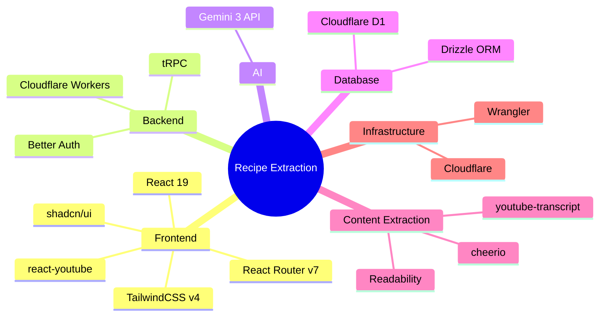

### API Endpoints (tRPC)

| Route | Type | Description |
|-------|------|-------------|
| `recipes.extract` | Mutation | Extract recipe from URL (returns preview) |
| `recipes.save` | Mutation | Save extracted recipe to database |
| `recipes.list` | Query | Get user's recipes (paginated) |
| `recipes.get` | Query | Get single recipe with all relations |
| `recipes.delete` | Mutation | Delete a recipe |
| `ingredients.list` | Query | Get all ingredients with usage count (admin) |
| `ingredients.merge` | Mutation | Merge duplicate ingredients (admin) |

### Dependencies

```bash
# Core extraction
bun add youtube-transcript cheerio @mozilla/readability linkedom

# AI
bun add @google/generative-ai

# Video player
bun add react-youtube
```

### Environment Variables

```bash
GEMINI_API_KEY=your_gemini_api_key
```

---

## Admin Features

### Recipes Management

Admin can view all recipes across all users:
- Filter by source type (YouTube/Blog)
- Filter by date range
- View recipe details
- Delete inappropriate recipes

### Ingredient Index

The ingredient database enables future meal planning:

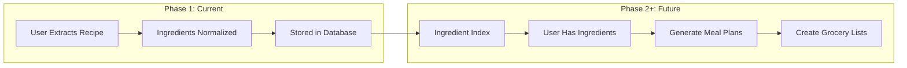

**Admin Capabilities:**
- Browse all ingredients
- See usage count per ingredient
- Merge duplicate ingredients (e.g., "chicken breast" and "chicken breasts")
- Assign categories to ingredients

---

## Future Roadmap

### Phase 1 (Current)
- Recipe extraction from YouTube and blogs
- Step-by-step with timestamps
- Macros per serving
- Ingredient database building

### Phase 2: Meal Planning
- Weekly meal calendar
- Drag-and-drop recipes
- Nutritional goals tracking

### Phase 3: Grocery Lists
- Auto-generate from meal plan
- Combine ingredients across recipes
- Check off while shopping

### Phase 4: Pantry Management
- Track ingredients on hand
- "What can I make?" suggestions
- Expiration tracking

### Phase 5: Integrations
- Instacart integration
- Amazon Fresh integration
- Apple Reminders sync

---

## Summary

Recipe Extraction transforms the chaos of cooking videos and food blogs into structured, professional-grade recipe documentation. The clean interface puts focus on the content while Gemini 3 handles the complexity of parsing content into actionable data.

### Key Differentiators

1. **Precision Timestamps** - Click to jump directly to any step in the video
2. **AI-Estimated Macros** - Nutritional analysis without manual entry
3. **Dual Source Support** - YouTube videos AND blog posts
4. **Ingredient Database** - Building toward intelligent meal planning
5. **Modern Stack** - Cloudflare edge, React Router, shadcn/ui

---

*Architecture Document v1.0 - January 2026*
