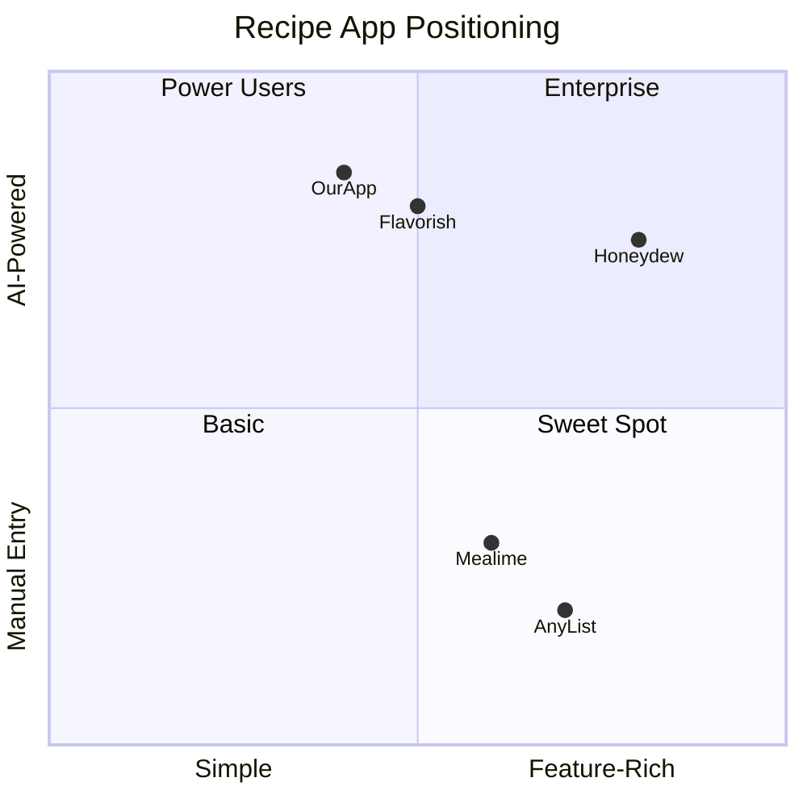
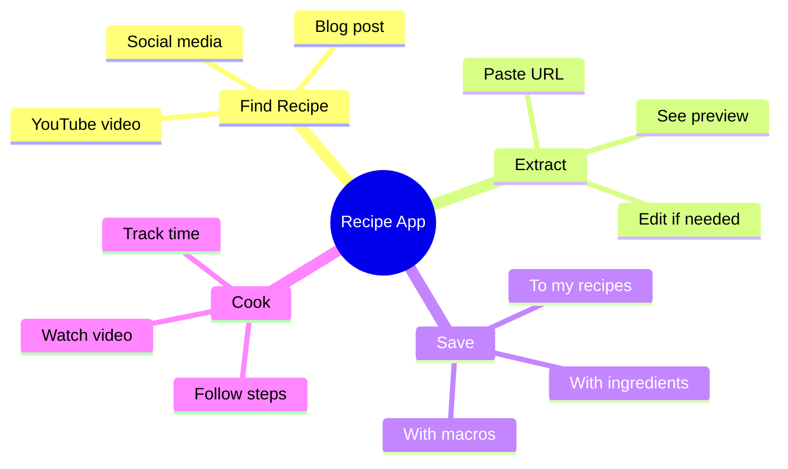
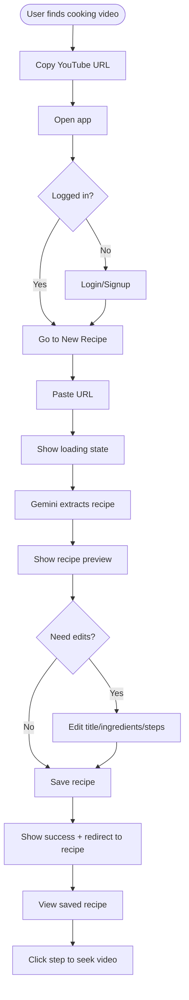
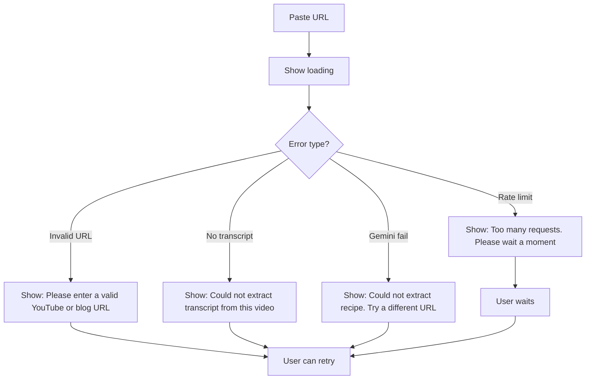
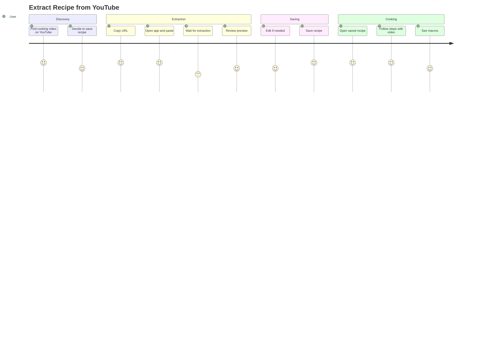
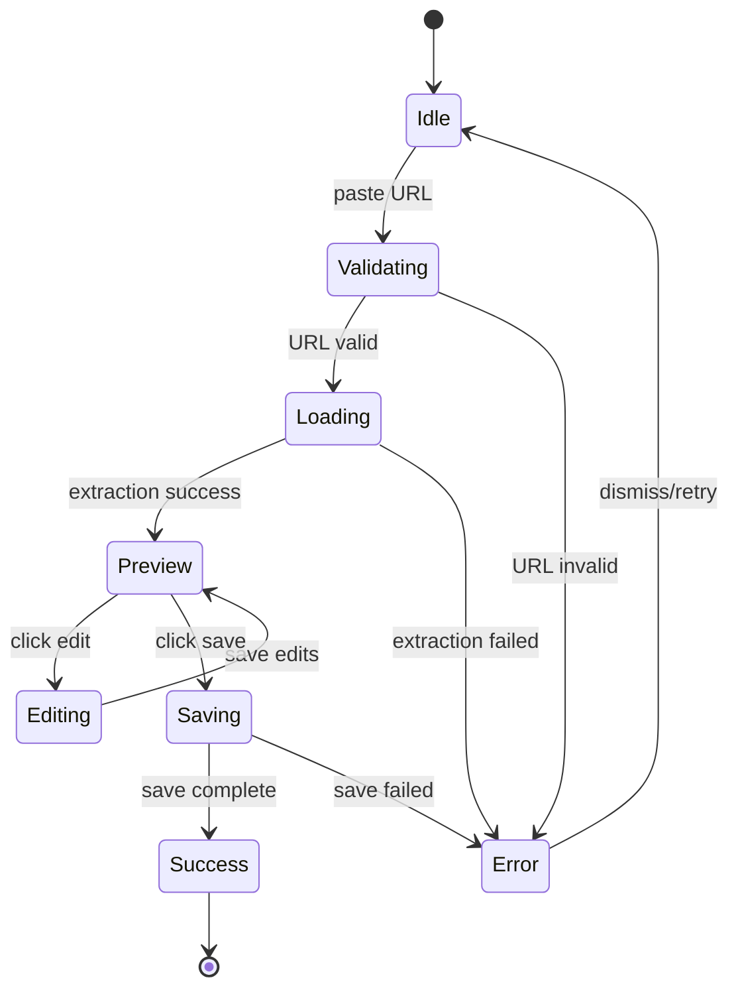
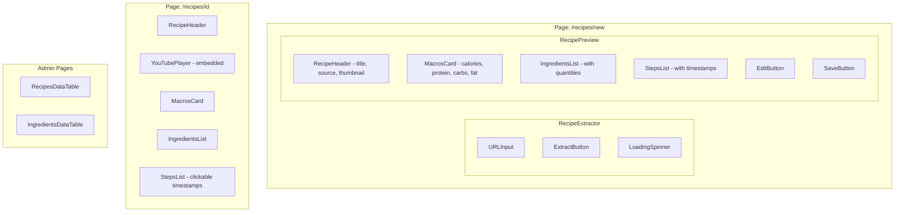
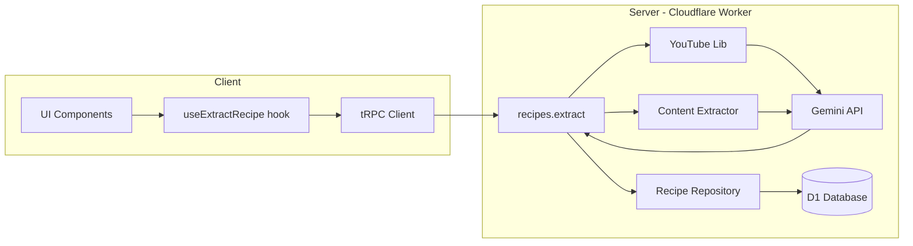

# Recipe Extraction App - UX Documentation

> **Full Architecture Document**: See [recipe-extraction-architecture.md](./recipe-extraction-architecture.md) for complete system architecture, data models, and technical specifications.

## Overview

A recipe extraction app that takes YouTube or blog URLs, uses Gemini 3 to extract step-by-step recipes with timestamps and AI-estimated macros, stores ingredients for future meal planning, and provides an admin view of all recipes.

---

## Phase 0: Competitive Research

### Competitors Analyzed

| Competitor | URL | Strengths | Weaknesses |
|------------|-----|-----------|------------|
| Honeydew Recipe Manager | honeydewcook.com | AI imports from social media, Instacart integration, meal planning calendar | Complex UI, subscription required |
| Flavorish | flavorish.app | Clean AI extraction from TikTok/YouTube/Instagram, fills gaps with AI | Limited macro tracking |
| BeChef | bechef.app | Computer vision extracts from videos even without captions | Less accurate for text blogs |
| Mealime | mealime.com | Simple meal planning, great grocery lists | No video/social import |
| PlanEat AI | planeatai.com | Weekly meal plans, grouped grocery lists | No URL extraction |

### UX Patterns Worth Adopting

1. **Paste-and-extract flow** (Flavorish): Single input field, instant extraction preview
2. **Video timestamp linking** (Simon Willison's cooking timer): Click step to seek video
3. **Macro cards** (MealPrepPro): Clean visual display of nutrition per serving
4. **Ingredient normalization** (AnyList): Smart grouping of similar ingredients

### Differentiation Opportunities

- **YouTube timestamp mapping**: Steps sync with video timestamps (competitors don't do this well)
- **Ingredient database**: Building index for future meal planning (most apps are recipe-first)
- **Gemini 3 extraction**: Modern LLM vs traditional schema parsing

### Competitive Positioning



---

## Phase 1: Product Goals

### Feature: Recipe Extraction (Phase 1)

#### Business Goals
- **Primary**: Enable users to save recipes from any YouTube video or blog URL
- **Secondary**: Build ingredient database for future meal planning features

#### Success Metrics

| Metric | Target | How Measured |
|--------|--------|--------------|
| Extraction success rate | >90% | Successful extractions / total attempts |
| Time to extract | <15 seconds | Median extraction time |
| User saves per session | >1.5 | Recipes saved / sessions |
| Ingredient uniqueness | <30% duplicates | Unique ingredients / total stored |

#### Constraints
- **Technical**: Cloudflare Workers runtime (no long-running processes)
- **Cost**: Gemini API costs per extraction
- **Legal**: YouTube ToS compliance (transcript extraction only)

---

## Phase 2: User Analysis

### Persona: Home Cook Hannah

**Role**: Home cook who watches cooking YouTube  
**Goal**: Save recipes from videos she watches without manual typing  
**Pain Points**: 
- Bookmarks pile up, can never find the right video
- Pausing/rewinding videos while cooking is frustrating
- Estimating nutrition from video recipes is tedious

**Context**: Watches cooking videos on phone, cooks in kitchen with tablet  
**Tech Comfort**: Medium (uses apps daily, not technical)

### Persona: Meal Prep Mike

**Role**: Fitness-focused meal prepper  
**Goal**: Track macros from recipes he finds online  
**Pain Points**: 
- Most recipes don't include macro information
- Manually calculating nutrition is time-consuming
- Recipes from blogs have too much story, hard to find actual recipe

**Context**: Plans meals on Sunday, batch cooks  
**Tech Comfort**: High (uses multiple fitness/nutrition apps)

### User Mental Model



---

## Phase 3: User Flows

### Happy Path: Extract Recipe from YouTube



### Error Path: Extraction Fails



### User Journey Map



### State Machine: Recipe Extraction



---

## Phase 4: Component Architecture

### Component Hierarchy



### Component Specifications

#### URLInput
**Purpose**: Accept and validate YouTube/blog URLs  
**Props**:
| Prop | Type | Required | Description |
|------|------|----------|-------------|
| value | string | Yes | Current URL value |
| onChange | function | Yes | Handler for URL changes |
| onSubmit | function | Yes | Handler for extraction trigger |
| isLoading | boolean | No | Disable input during extraction |
| error | string | No | Validation error message |

**States**: idle, focused, error, disabled  
**Events**: onChange, onPaste, onSubmit  
**Accessibility**: aria-label, aria-invalid, focus management

#### MacrosCard
**Purpose**: Display nutrition macros per serving  
**Props**:
| Prop | Type | Required | Description |
|------|------|----------|-------------|
| calories | number | No | Calories per serving |
| protein | number | No | Protein in grams |
| carbs | number | No | Carbohydrates in grams |
| fat | number | No | Fat in grams |
| fiber | number | No | Fiber in grams |
| servings | number | No | Number of servings |

**Visual**: Card with circular progress or bar chart for each macro

#### YouTubePlayer
**Purpose**: Embed YouTube video with timestamp seeking  
**Props**:
| Prop | Type | Required | Description |
|------|------|----------|-------------|
| videoId | string | Yes | YouTube video ID |
| onTimeUpdate | function | No | Current time callback |
| seekTo | number | No | Timestamp to seek to |

**Features**: Respond to external seek commands, emit current time

#### StepsList
**Purpose**: Display recipe steps with optional timestamps  
**Props**:
| Prop | Type | Required | Description |
|------|------|----------|-------------|
| steps | Step[] | Yes | Array of step objects |
| onStepClick | function | No | Handler for timestamp click |
| activeStep | number | No | Currently active step index |

**Behavior**: Click timestamp → emit seek event → highlight active step

### Data Flow



---

## Phase 5: Wireframe Specifications

### Screen: Extract New Recipe (/recipes/new)

```
┌─────────────────────────────────────────────────────────────┐
│ Header: Logo | My Recipes | [User Menu]                     │
├─────────────────────────────────────────────────────────────┤
│                                                             │
│  ┌───────────────────────────────────────────────────────┐  │
│  │  🍳 Extract a Recipe                                  │  │
│  │                                                       │  │
│  │  Paste a YouTube video or blog URL                    │  │
│  │  ┌─────────────────────────────────────┐ ┌─────────┐  │  │
│  │  │ https://youtube.com/watch?v=...     │ │ Extract │  │  │
│  │  └─────────────────────────────────────┘ └─────────┘  │  │
│  │                                                       │  │
│  │  Supports: YouTube, food blogs, recipe sites          │  │
│  └───────────────────────────────────────────────────────┘  │
│                                                             │
│  [After extraction - Preview Card]                          │
│  ┌───────────────────────────────────────────────────────┐  │
│  │ ┌─────────┐  Chicken Tikka Masala              [Edit] │  │
│  │ │ 🖼️      │  Source: Joshua Weissman (YouTube)        │  │
│  │ │ thumb   │  Servings: 4 | Prep: 20min | Cook: 30min  │  │
│  │ └─────────┘                                           │  │
│  ├───────────────────────────────────────────────────────┤  │
│  │ Macros per serving                                    │  │
│  │ ┌────────┐ ┌────────┐ ┌────────┐ ┌────────┐          │  │
│  │ │ 520    │ │ 35g    │ │ 28g    │ │ 32g    │          │  │
│  │ │ kcal   │ │protein │ │ carbs  │ │ fat    │          │  │
│  │ └────────┘ └────────┘ └────────┘ └────────┘          │  │
│  ├───────────────────────────────────────────────────────┤  │
│  │ Ingredients (12)                                      │  │
│  │ • 2 lbs chicken thighs, boneless                      │  │
│  │ • 1 cup yogurt                                        │  │
│  │ • 2 tbsp garam masala                                 │  │
│  │ • ...                                                 │  │
│  ├───────────────────────────────────────────────────────┤  │
│  │ Steps (8)                                             │  │
│  │ 1. [0:45] Marinate chicken in yogurt and spices...   │  │
│  │ 2. [3:20] Heat oil in a large pan...                 │  │
│  │ 3. [5:15] Add onions and cook until golden...        │  │
│  │ • ...                                                 │  │
│  ├───────────────────────────────────────────────────────┤  │
│  │                              [Cancel]  [Save Recipe]  │  │
│  └───────────────────────────────────────────────────────┘  │
│                                                             │
└─────────────────────────────────────────────────────────────┘
```

### Screen: Recipe Detail (/recipes/:id)

```
┌─────────────────────────────────────────────────────────────┐
│ Header: Logo | My Recipes | [User Menu]                     │
├─────────────────────────────────────────────────────────────┤
│ ← Back to Recipes                                           │
│                                                             │
│ ┌─────────────────────────────────────────────────────────┐ │
│ │                                                         │ │
│ │        [YouTube Video Embed - 16:9 aspect ratio]        │ │
│ │                                                         │ │
│ └─────────────────────────────────────────────────────────┘ │
│                                                             │
│ Chicken Tikka Masala                            [⋮ Menu]    │
│ Source: Joshua Weissman • Saved Jan 25, 2026                │
│                                                             │
│ ┌──────────────────────┐  ┌──────────────────────────────┐  │
│ │ Macros per serving   │  │ Ingredients                  │  │
│ │ ────────────────     │  │ ☐ 2 lbs chicken thighs      │  │
│ │ 520 kcal             │  │ ☐ 1 cup yogurt              │  │
│ │ 35g protein          │  │ ☐ 2 tbsp garam masala       │  │
│ │ 28g carbs            │  │ ☐ 1 can tomato sauce        │  │
│ │ 32g fat              │  │ ☐ 1 cup heavy cream         │  │
│ │                      │  │ ☐ ...                       │  │
│ │ Servings: 4          │  │                              │  │
│ └──────────────────────┘  └──────────────────────────────┘  │
│                                                             │
│ ┌─────────────────────────────────────────────────────────┐ │
│ │ Steps                                                   │ │
│ │                                                         │ │
│ │ 1. [▶ 0:45] Marinate chicken in yogurt and spices     │ │
│ │    for at least 30 minutes, preferably overnight.      │ │
│ │                                                         │ │
│ │ 2. [▶ 3:20] Heat oil in a large pan over medium-high  │ │
│ │    heat. Sear marinated chicken until golden.          │ │
│ │                                                         │ │
│ │ 3. [▶ 5:15] Add onions and cook until translucent,    │ │
│ │    about 5 minutes.                                    │ │
│ │                                                         │ │
│ │ ...                                                     │ │
│ └─────────────────────────────────────────────────────────┘ │
│                                                             │
└─────────────────────────────────────────────────────────────┘
```

### Screen: My Recipes (/recipes)

```
┌─────────────────────────────────────────────────────────────┐
│ Header: Logo | My Recipes | [User Menu]                     │
├─────────────────────────────────────────────────────────────┤
│                                                             │
│ My Recipes                              [+ Extract Recipe]  │
│                                                             │
│ ┌─────────┐ ┌─────────────────────────────────────────────┐ │
│ │ All     │ │ 🔍 Search recipes...                        │ │
│ │ YouTube │ └─────────────────────────────────────────────┘ │
│ │ Blogs   │                                                 │
│ └─────────┘                                                 │
│                                                             │
│ ┌───────────────┐ ┌───────────────┐ ┌───────────────┐      │
│ │ 🖼️            │ │ 🖼️            │ │ 🖼️            │      │
│ │               │ │               │ │               │      │
│ │ Chicken Tikka │ │ Pasta Carb... │ │ Thai Green... │      │
│ │ Masala        │ │               │ │               │      │
│ │ ───────────── │ │ ───────────── │ │ ───────────── │      │
│ │ 520 kcal      │ │ 680 kcal      │ │ 420 kcal      │      │
│ │ 35g protein   │ │ 22g protein   │ │ 28g protein   │      │
│ │ YouTube       │ │ Blog          │ │ YouTube       │      │
│ └───────────────┘ └───────────────┘ └───────────────┘      │
│                                                             │
│ ┌───────────────┐ ┌───────────────┐                        │
│ │ 🖼️            │ │ ➕            │                        │
│ │               │ │               │                        │
│ │ Beef Bulgogi  │ │ Add New       │                        │
│ │               │ │ Recipe        │                        │
│ │ ───────────── │ │               │                        │
│ │ 450 kcal      │ │               │                        │
│ │ 42g protein   │ │               │                        │
│ │ YouTube       │ │               │                        │
│ └───────────────┘ └───────────────┘                        │
│                                                             │
└─────────────────────────────────────────────────────────────┘
```

### Responsive Behavior

- **Mobile (< 640px)**: 
  - Single column layout
  - Video stacks above content
  - Macros in horizontal scroll
  - Steps as expandable accordion

- **Tablet (640px - 1024px)**: 
  - Two-column recipe cards
  - Video takes full width
  - Side-by-side macros and ingredients

- **Desktop (> 1024px)**: 
  - Three-column recipe cards
  - Video with sidebar layout on detail page
  - All sections visible without scroll

---

## Technical Decisions

| Decision | Choice | Rationale |
|----------|--------|-----------|
| LLM Provider | Gemini 3 | User preference, good structured output |
| Transcript API | youtube-transcript npm | Free, no API key, works in Node |
| Blog Extraction | cheerio + readability | Lightweight, works on edge |
| Macros | AI-estimated | Simpler than nutrition API for MVP |
| Ingredient Normalization | Gemini + admin merge | LLM normalizes, admin handles duplicates |
| Video Player | react-youtube | Popular, well-maintained, supports seeking |

---

## Future Phases (Out of Scope for Phase 1)

- **Phase 2**: Meal planning calendar with drag-drop recipes
- **Phase 3**: Smart grocery list generation from meal plan
- **Phase 4**: Pantry tracking ("what can I make with what I have?")
- **Phase 5**: Grocery app integrations (Instacart, Amazon Fresh)
