# Recipe Collection Sharing: Information Architecture

A social feature enabling users to create public profile pages showcasing their best recipes and share them with friends, family, and the broader cooking community.

---

## Table of Contents

1. [Overview](#overview)
2. [ICP Analysis](#icp-analysis)
3. [User Flow](#user-flow)
4. [System Architecture](#system-architecture)
5. [Data Model](#data-model)
6. [Feature Breakdown](#feature-breakdown)
7. [UI Components](#ui-components)
8. [UI Concepts](#ui-concepts)
9. [Frontend Design Specification](#frontend-design-specification)
10. [API Endpoints](#api-endpoints)
11. [Privacy & Security](#privacy--security)
12. [Future Roadmap](#future-roadmap)

---

## Overview

### Vision

Enable users to curate and share their recipe collections publicly, creating a viral growth loop while serving the genuine need for recipe sharing among friends and families. This feature transforms mise en place from a personal organization tool into a social platform for culinary discovery.

### Strategic Rationale

From the market research report:
- **+7 PMF Score Impact** - One of the highest-impact quick wins identified
- **Viral Loop Creation** - Shared collections drive organic discovery
- **Network Effects** - Family sharing creates household-level stickiness
- **Content Marketing** - Public profiles generate SEO value

### Core Value Proposition

| For Sharers | For Viewers |
|-------------|-------------|
| Showcase favorite recipes | Discover curated collections |
| Share with family/friends easily | Import recipes to own collection |
| Build cooking reputation | Follow favorite cooks |
| One link for all recipes | No login required to browse |

### Competitive Gap


---

## ICP Analysis

### How Each ICP Benefits


### ICP-Specific Use Cases

| ICP | Primary Use Case | Share Target | Privacy Need |
|-----|------------------|--------------|--------------|
| **YouTube Enthusiast** | "Check out my favorite video recipes" | Social media, food communities | Public by default |
| **Meal Planner** | "Here's our family meal rotation" | Partner, family group chat | Private link sharing |
| **Recipe Archivist** | "Grandma's recipes, preserved for generations" | Extended family | Family-only access |

---

## User Flow

### Primary Flow: Creating a Public Profile


### Flow: Viewer Discovers Shared Profile


### State Machine: Profile Visibility


### User Journey Map


---

## System Architecture

### High-Level Architecture


### Share Link Generation


### Recipe Import Flow


---

## Data Model

### Entity Relationship Diagram

```mermaid
erDiagram
    USER ||--o| USER_PROFILE : has
    USER ||--o{ RECIPE : owns
    USER ||--o{ RECIPE_COLLECTION : creates
    RECIPE_COLLECTION ||--o{ COLLECTION_RECIPE : contains
    COLLECTION_RECIPE }o--|| RECIPE : references
    RECIPE ||--o{ RECIPE_IMPORT : is_source_of
    USER ||--o{ RECIPE_IMPORT : imports
    
    USER {
        string id PK
        string name
        string email
    }
    
    USER_PROFILE {
        string id PK
        string user_id FK UK
        string username UK "url-safe, unique"
        string display_name
        string bio
        string avatar_url
        boolean is_public
        int view_count
        timestamp created_at
        timestamp updated_at
    }
    
    RECIPE_COLLECTION {
        string id PK
        string user_id FK
        string name
        string description
        string slug "url-safe"
        int display_order
        boolean is_public
        timestamp created_at
    }
    
    COLLECTION_RECIPE {
        string id PK
        string collection_id FK
        string recipe_id FK
        int display_order
        boolean is_featured
    }
    
    RECIPE {
        string id PK
        string created_by_id FK
        string title
        string slug "url-safe"
        boolean is_public "default false"
        int save_count "import count"
    }
    
    RECIPE_IMPORT {
        string id PK
        string source_recipe_id FK
        string imported_recipe_id FK
        string imported_by_id FK
        timestamp imported_at
    }
```

### New Tables

#### `user_profile`

| Column | Type | Constraints | Description |
|--------|------|-------------|-------------|
| `id` | TEXT | PK | UUID |
| `user_id` | TEXT | FK, UNIQUE | Link to user |
| `username` | TEXT | UNIQUE | URL-safe handle (e.g., "chef-sarah") |
| `display_name` | TEXT | | Public name |
| `bio` | TEXT | | Profile description |
| `avatar_url` | TEXT | | R2 stored image |
| `is_public` | INTEGER | DEFAULT 0 | Profile visibility |
| `view_count` | INTEGER | DEFAULT 0 | Analytics |
| `created_at` | INTEGER | | Timestamp |
| `updated_at` | INTEGER | | Timestamp |

#### `recipe_collection`

| Column | Type | Constraints | Description |
|--------|------|-------------|-------------|
| `id` | TEXT | PK | UUID |
| `user_id` | TEXT | FK | Owner |
| `name` | TEXT | NOT NULL | e.g., "Weeknight Dinners" |
| `description` | TEXT | | Collection description |
| `slug` | TEXT | | URL-safe name |
| `display_order` | INTEGER | | Sort order |
| `is_public` | INTEGER | DEFAULT 0 | Collection visibility |
| `created_at` | INTEGER | | Timestamp |

#### `collection_recipe`

| Column | Type | Constraints | Description |
|--------|------|-------------|-------------|
| `id` | TEXT | PK | UUID |
| `collection_id` | TEXT | FK | Parent collection |
| `recipe_id` | TEXT | FK | Recipe in collection |
| `display_order` | INTEGER | | Sort order |
| `is_featured` | INTEGER | DEFAULT 0 | Featured flag |

#### `recipe_import`

| Column | Type | Constraints | Description |
|--------|------|-------------|-------------|
| `id` | TEXT | PK | UUID |
| `source_recipe_id` | TEXT | FK | Original recipe |
| `imported_recipe_id` | TEXT | FK | Cloned recipe |
| `imported_by_id` | TEXT | FK | User who imported |
| `imported_at` | INTEGER | | Timestamp |

### Schema Updates to Existing Tables

**`recipe` table additions:**
- `slug` TEXT - URL-safe title for public URLs
- `is_public` INTEGER DEFAULT 0 - Public visibility flag
- `save_count` INTEGER DEFAULT 0 - Number of imports

### TypeScript Interfaces

```typescript
interface UserProfile {
  id: string;
  userId: string;
  username: string;           // unique, url-safe
  displayName: string | null;
  bio: string | null;
  avatarUrl: string | null;
  isPublic: boolean;
  viewCount: number;
  createdAt: Date;
  updatedAt: Date;
}

interface RecipeCollection {
  id: string;
  userId: string;
  name: string;
  description: string | null;
  slug: string;
  displayOrder: number;
  isPublic: boolean;
  createdAt: Date;
  recipes?: CollectionRecipe[];
}

interface CollectionRecipe {
  id: string;
  collectionId: string;
  recipeId: string;
  displayOrder: number;
  isFeatured: boolean;
  recipe?: Recipe;  // joined
}

interface PublicProfileResponse {
  profile: UserProfile;
  collections: RecipeCollection[];
  featuredRecipes: Recipe[];
  recentRecipes: Recipe[];
  stats: {
    totalRecipes: number;
    totalSaves: number;
  };
}

interface RecipeImport {
  id: string;
  sourceRecipeId: string;
  importedRecipeId: string;
  importedById: string;
  importedAt: Date;
}
```

---

## Feature Breakdown

### Feature 1: Profile Setup


**Specifications:**
- Username: 3-30 chars, lowercase letters, numbers, hyphens only
- Display name: 2-50 chars
- Bio: 0-500 chars
- Avatar: Max 2MB, JPEG/PNG/WebP

### Feature 2: Recipe Visibility Control


**Specifications:**
- Per-recipe visibility toggle
- Bulk visibility actions
- Collection-level visibility override
- Featured recipes appear first

### Feature 3: Recipe Collections

```mermaid
flowchart TD
    subgraph Collections["User Collections"]
        C1["🍳 Weeknight Dinners"]
        C2["🎉 Party Favorites"]
        C3["🥗 Healthy Meals"]
        C4["📺 YouTube Finds"]
    end
    
    C1 --> R1[Recipe 1]
    C1 --> R2[Recipe 2]
    C2 --> R3[Recipe 3]
    C2 --> R4[Recipe 4]
```



**Specifications:**
- Unlimited collections per user
- Drag-and-drop reordering
- Collection descriptions
- Collection-specific URLs (`/u/username/collection-slug`)

### Feature 4: Public Profile Page

**URL Structure:**
- Profile: `/u/[username]`
- Collection: `/u/[username]/[collection-slug]`
- Recipe: `/u/[username]/recipe/[recipe-slug]`


### Feature 5: Social Sharing


**Open Graph Meta Tags:**
```html
<meta property="og:title" content="Sarah's Recipe Collection" />
<meta property="og:description" content="45 recipes • Weeknight dinners, party favorites, and more" />
<meta property="og:image" content="[dynamic preview image]" />
<meta property="og:url" content="https://miseenplace.app/u/sarah" />
```

### Feature 6: Recipe Import (Save)


**Specifications:**
- Clone recipe with attribution
- Preserve video timestamps
- Optional: notify creator
- Track import count for analytics

---

## UI Components

### Component Hierarchy


### Screen Wireframe: Profile Settings

```
┌─────────────────────────────────────────────────────────────────────┐
│ Settings > Profile                                                   │
├─────────────────────────────────────────────────────────────────────┤
│                                                                     │
│  Public Profile                                    [═══════ ON ═══] │
│  Share your recipes with a public profile page                      │
│                                                                     │
│  ┌─────────────────────────────────────────────────────────────┐   │
│  │  ┌─────────┐  Username                                      │   │
│  │  │  [img]  │  ┌────────────────────────────────────────┐    │   │
│  │  │         │  │ chef-sarah                              │    │   │
│  │  │ Change  │  └────────────────────────────────────────┘    │   │
│  │  └─────────┘  miseenplace.app/u/chef-sarah                  │   │
│  │                                                             │   │
│  │  Display Name                                               │   │
│  │  ┌────────────────────────────────────────────────────────┐ │   │
│  │  │ Sarah's Kitchen                                        │ │   │
│  │  └────────────────────────────────────────────────────────┘ │   │
│  │                                                             │   │
│  │  Bio                                                        │   │
│  │  ┌────────────────────────────────────────────────────────┐ │   │
│  │  │ Home cook sharing my favorite YouTube recipe finds     │ │   │
│  │  │ and family classics. Always looking for new weeknight  │ │   │
│  │  │ dinner ideas!                                          │ │   │
│  │  └────────────────────────────────────────────────────────┘ │   │
│  │  0/500                                                      │   │
│  └─────────────────────────────────────────────────────────────┘   │
│                                                                     │
│  [Preview Profile]                              [Save Changes]      │
│                                                                     │
├─────────────────────────────────────────────────────────────────────┤
│                                                                     │
│  Recipe Visibility                                                  │
│  Control which recipes appear on your public profile                │
│                                                                     │
│  ┌─────────────────────────────────────────────────────────────┐   │
│  │ ☑ Chicken Tikka Masala               [Featured ★]  [Hide]   │   │
│  │ ☑ Pasta Carbonara                                  [Hide]   │   │
│  │ ☑ Thai Green Curry                   [Featured ★]  [Hide]   │   │
│  │ ☐ Grandma's Secret Soup (Hidden)                   [Show]   │   │
│  │ ☑ Quick Weeknight Stir Fry                         [Hide]   │   │
│  └─────────────────────────────────────────────────────────────┘   │
│                                                                     │
│  Collections                                       [+ New Collection]│
│                                                                     │
│  ┌────────────────┐ ┌────────────────┐ ┌────────────────┐          │
│  │ Weeknight      │ │ Party          │ │ Family         │          │
│  │ Dinners        │ │ Favorites      │ │ Classics       │          │
│  │ 12 recipes     │ │ 8 recipes      │ │ 15 recipes     │          │
│  │ [Edit] [⋮]     │ │ [Edit] [⋮]     │ │ [Edit] [⋮]     │          │
│  └────────────────┘ └────────────────┘ └────────────────┘          │
│                                                                     │
└─────────────────────────────────────────────────────────────────────┘
```

### Screen Wireframe: Public Profile

```
┌─────────────────────────────────────────────────────────────────────┐
│ [Logo]                                              [Sign In]       │
├─────────────────────────────────────────────────────────────────────┤
│                                                                     │
│  ┌─────────────────────────────────────────────────────────────┐   │
│  │                                                             │   │
│  │   ┌─────────┐   Sarah's Kitchen                             │   │
│  │   │  [img]  │   @chef-sarah                                 │   │
│  │   │         │                                               │   │
│  │   └─────────┘   Home cook sharing my favorite YouTube       │   │
│  │                 recipe finds and family classics.           │   │
│  │                                                             │   │
│  │   45 recipes  •  128 saves  •  Member since Jan 2026        │   │
│  │                                                             │   │
│  │   [████ Share ████]   [Follow]                              │   │
│  │                                                             │   │
│  └─────────────────────────────────────────────────────────────┘   │
│                                                                     │
│  Featured Recipes                                                   │
│  ─────────────────                                                  │
│  ┌───────────────┐ ┌───────────────┐ ┌───────────────┐             │
│  │ ★ [thumb]     │ │ ★ [thumb]     │ │ ★ [thumb]     │             │
│  │               │ │               │ │               │             │
│  │ Chicken Tikka │ │ Thai Green    │ │ Perfect       │             │
│  │ Masala        │ │ Curry         │ │ Carbonara     │             │
│  │ ───────────── │ │ ───────────── │ │ ───────────── │             │
│  │ YouTube • 520 │ │ Blog • 420    │ │ YouTube • 680 │             │
│  │ kcal          │ │ kcal          │ │ kcal          │             │
│  │ 23 saves      │ │ 18 saves      │ │ 45 saves      │             │
│  └───────────────┘ └───────────────┘ └───────────────┘             │
│                                                                     │
│  Collections                                                        │
│  ───────────                                                        │
│  ┌────────────────────┐ ┌────────────────────┐                     │
│  │ 🍳 Weeknight       │ │ 🎉 Party           │                     │
│  │    Dinners         │ │    Favorites       │                     │
│  │    12 recipes      │ │    8 recipes       │                     │
│  └────────────────────┘ └────────────────────┘                     │
│                                                                     │
│  All Recipes                                           [Filter ▼]  │
│  ───────────                                                        │
│  ┌───────────┐ ┌───────────┐ ┌───────────┐ ┌───────────┐          │
│  │ [thumb]   │ │ [thumb]   │ │ [thumb]   │ │ [thumb]   │          │
│  │ Recipe 1  │ │ Recipe 2  │ │ Recipe 3  │ │ Recipe 4  │          │
│  │ [Save]    │ │ [Save]    │ │ [Save]    │ │ [Save]    │          │
│  └───────────┘ └───────────┘ └───────────┘ └───────────┘          │
│                                                                     │
└─────────────────────────────────────────────────────────────────────┘
```

### Screen Wireframe: Share Modal

```
┌─────────────────────────────────────────────────────┐
│  Share Your Collection                          [×] │
├─────────────────────────────────────────────────────┤
│                                                     │
│  ┌───────────────────────────────────────────────┐  │
│  │ https://miseenplace.app/u/chef-sarah     [📋] │  │
│  └───────────────────────────────────────────────┘  │
│                                                     │
│  Share on:                                          │
│                                                     │
│  ┌─────┐ ┌─────┐ ┌─────┐ ┌─────┐ ┌─────┐          │
│  │ 🐦  │ │ 📘  │ │ 📌  │ │ 📧  │ │ 💬  │          │
│  │     │ │     │ │     │ │     │ │     │          │
│  │ X   │ │ FB  │ │ Pin │ │Email│ │ SMS │          │
│  └─────┘ └─────┘ └─────┘ └─────┘ └─────┘          │
│                                                     │
│  ┌─────────────────┐                               │
│  │                 │                               │
│  │   [QR Code]     │  Scan to view on mobile      │
│  │                 │                               │
│  └─────────────────┘                               │
│                                                     │
└─────────────────────────────────────────────────────┘
```

---

## UI Concepts

Three visual mockups showing the key screens for the recipe sharing feature, maintaining the editorial cookbook aesthetic.

### Concept 1: Public Profile Page


**Visual Direction**: Warm, inviting profile showcase with terracotta accents

**Key Elements**:
- Circular avatar with warm shadow
- Elegant serif typography for profile name
- Stats row showing recipe count and saves
- Featured recipes with star badges and save counts
- Source badges (YouTube/Blog) on each card

### Concept 2: Share Modal


**Visual Direction**: Clean, focused sharing dialog with frosted glass effect

**Key Elements**:
- Copy-to-clipboard URL field
- Social sharing buttons with brand colors
- QR code for mobile sharing
- Warm cream background with subtle grain

### Concept 3: Profile Settings


**Visual Direction**: Organized settings page with clear visual hierarchy

**Key Elements**:
- Public profile toggle with terracotta accent
- Avatar upload with change button
- Recipe visibility controls with featured badges
- Collection cards with recipe counts
- Split layout: profile on left, visibility on right

---

## Frontend Design Specification

### Aesthetic Direction

**Tone**: Warm, inviting, community-focused—extending the editorial cookbook aesthetic to social profiles.

**Memorable Element**: The **profile header with terracotta accent band** creates instant visual recognition while maintaining the artisanal cookbook feel.

### Typography

| Usage | Font | Weight |
|-------|------|--------|
| Profile name | Playfair Display | 600 |
| Section headers | Playfair Display | 500 |
| Username | Source Sans 3 | 500 (monospace-style) |
| Bio text | Source Sans 3 | 400 |
| Stats | Source Sans 3 | 600 |

### Color Palette

| Token | Value | Usage |
|-------|-------|-------|
| `--profile-header-bg` | `oklch(0.55 0.14 35 / 0.08)` | Profile header background |
| `--profile-accent` | `oklch(0.55 0.14 35)` | Terracotta accent |
| `--featured-badge` | `oklch(0.70 0.08 145)` | Sage featured star |
| `--save-count` | `oklch(0.55 0.14 35)` | Save count text |
| `--collection-card-bg` | `oklch(0.98 0.01 90)` | Collection card bg |

### Motion Design

| Element | Animation | Timing |
|---------|-----------|--------|
| Profile header | Fade up | 400ms ease-out |
| Featured recipes | Stagger fade in | 200ms stagger |
| Recipe grid | Grid reveal | 150ms stagger |
| Save button | Scale pulse | 200ms |
| Share modal | Slide up + fade | 300ms |
| QR code | Fade in with blur | 400ms |

### Visual Effects

**Profile Header**:
- Warm gradient overlay
- Avatar with warm shadow
- Grain texture at 2% opacity

**Recipe Cards**:
- Featured star: gold/sage gradient
- Save count badge
- Hover lift (4px) with shadow

**Share Modal**:
- Frosted glass background
- Social buttons with brand colors
- QR code with warm border

---

## API Endpoints

### tRPC Routes

| Endpoint | Type | Input | Output | Auth |
|----------|------|-------|--------|------|
| `profile.getMyProfile` | Query | - | `UserProfile \| null` | Required |
| `profile.createOrUpdate` | Mutation | `ProfileInput` | `UserProfile` | Required |
| `profile.checkUsername` | Query | `{ username }` | `{ available: boolean }` | Required |
| `profile.getPublicProfile` | Query | `{ username }` | `PublicProfileResponse` | Public |
| `profile.incrementViewCount` | Mutation | `{ username }` | - | Public |
| `collections.list` | Query | - | `RecipeCollection[]` | Required |
| `collections.create` | Mutation | `CollectionInput` | `RecipeCollection` | Required |
| `collections.update` | Mutation | `{ id, ...updates }` | `RecipeCollection` | Required |
| `collections.delete` | Mutation | `{ id }` | `{ success }` | Required |
| `collections.addRecipe` | Mutation | `{ collectionId, recipeId }` | - | Required |
| `collections.removeRecipe` | Mutation | `{ collectionId, recipeId }` | - | Required |
| `collections.reorder` | Mutation | `{ collectionId, recipeIds[] }` | - | Required |
| `recipes.setVisibility` | Mutation | `{ recipeId, isPublic }` | - | Required |
| `recipes.setBulkVisibility` | Mutation | `{ recipeIds[], isPublic }` | - | Required |
| `recipes.setFeatured` | Mutation | `{ recipeId, isFeatured }` | - | Required |
| `recipes.import` | Mutation | `{ recipeId }` | `{ newRecipeId }` | Required |
| `recipes.getPublicRecipe` | Query | `{ username, slug }` | `Recipe` | Public |

### Public Routes (No Auth)

| Route | Method | Purpose |
|-------|--------|---------|
| `/u/[username]` | GET | Public profile page (SSR) |
| `/u/[username]/[collection]` | GET | Collection page (SSR) |
| `/u/[username]/recipe/[slug]` | GET | Public recipe page (SSR) |

---

## Privacy & Security

### Visibility Model


### Privacy Controls

| Control | Default | User Can Change |
|---------|---------|-----------------|
| Profile visibility | Private | Yes |
| Recipe visibility | Private | Yes (per recipe) |
| Collection visibility | Matches profile | Yes |
| Import notifications | On | Yes |
| Analytics (view count) | On | No |

### Security Measures

1. **Username Validation**
   - Reserved words blocked (admin, api, etc.)
   - Rate-limited username changes
   - Case-insensitive uniqueness

2. **Content Moderation**
   - Admin can hide profiles
   - Report button on public profiles
   - Automated content flagging (future)

3. **Data Protection**
   - Imported recipes are copies (no link to original)
   - Original creator retains full control
   - No personal data exposed on public profiles

---

## Future Roadmap

### Phase 1: MVP (Current Scope)

- [x] User profile table and settings
- [ ] Public profile page (`/u/username`)
- [ ] Recipe visibility toggle
- [ ] Share modal with copy link
- [ ] Recipe import functionality
- [ ] Basic analytics (view count)

### Phase 2: Collections

- [ ] Create/edit collections
- [ ] Collection pages (`/u/username/collection`)
- [ ] Drag-and-drop reordering
- [ ] Collection cover images

### Phase 3: Social Features

- [ ] Follow system
- [ ] Activity feed
- [ ] Recipe comments
- [ ] Social login (Google, Apple)

### Phase 4: Discovery

- [ ] Public recipe search
- [ ] Trending recipes
- [ ] Category browsing
- [ ] Featured profiles

### Phase 5: Monetization

- [ ] Premium profiles (custom domains)
- [ ] Creator tools (analytics)
- [ ] Sponsored collections

---

## Implementation Checklist

```
Recipe Sharing Feature Progress:

DATABASE:
- [ ] Create user_profile table migration
- [ ] Create recipe_collection table migration
- [ ] Create collection_recipe table migration
- [ ] Create recipe_import table migration
- [ ] Add slug, is_public, save_count to recipe table

REPOSITORY:
- [ ] Create profile.ts repository
- [ ] Update recipe.ts with visibility methods
- [ ] Create collection.ts repository

TRPC:
- [ ] Create profile.ts routes
- [ ] Create collections.ts routes
- [ ] Update recipes.ts with public routes

PAGES:
- [ ] Profile settings page
- [ ] Public profile page (/u/[username])
- [ ] Public recipe page (/u/[username]/recipe/[slug])
- [ ] Collection page (/u/[username]/[collection])

COMPONENTS:
- [ ] ProfileSettingsForm
- [ ] UsernameInput with validation
- [ ] AvatarUpload
- [ ] RecipeVisibilityList
- [ ] CollectionManager
- [ ] PublicProfileHeader
- [ ] ShareModal
- [ ] ImportRecipeButton

SEO:
- [ ] Open Graph meta tags
- [ ] Dynamic OG images
- [ ] Sitemap for public profiles
- [ ] robots.txt updates

ANALYTICS:
- [ ] View count tracking
- [ ] Import tracking
- [ ] Share tracking (PostHog events)
```

---

*Architecture Document v1.0 - January 30, 2026*
