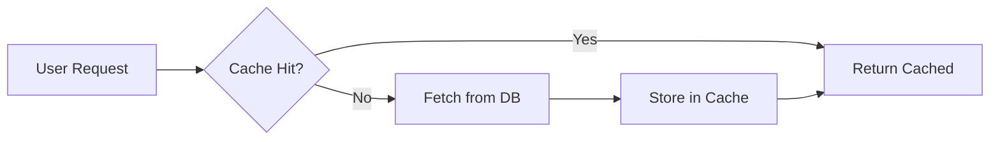

# Feature Brainstorm

A collection of feature ideas for future development.

## User Experience Improvements

### Dark Mode Toggle
Allow users to switch between light and dark themes with persistent preference storage.

### Keyboard Shortcuts
Add power-user keyboard shortcuts for common actions:
- `Ctrl+K` - Quick command palette
- `Ctrl+/` - Toggle help
- `Esc` - Close modals

## Technical Improvements

### Caching Strategy

### API Rate Limiting

Implement tiered rate limiting based on user subscription:

| Tier | Requests/min | Burst |
|------|-------------|-------|
| Free | 60 | 10 |
| Pro | 300 | 50 |
| Enterprise | 1000 | 200 |

## Integration Ideas

- Slack notifications for important events
- Webhook support for external integrations
- SSO with popular identity providers
