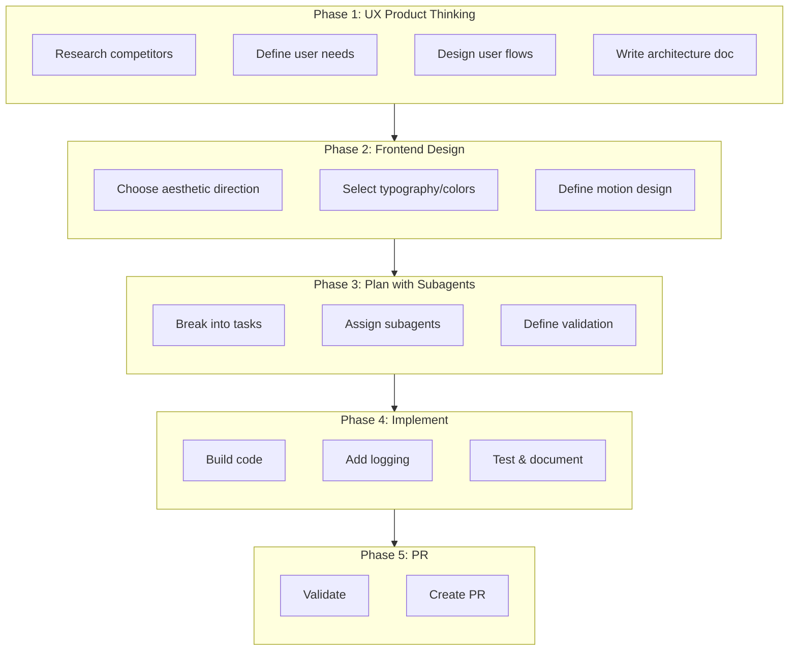
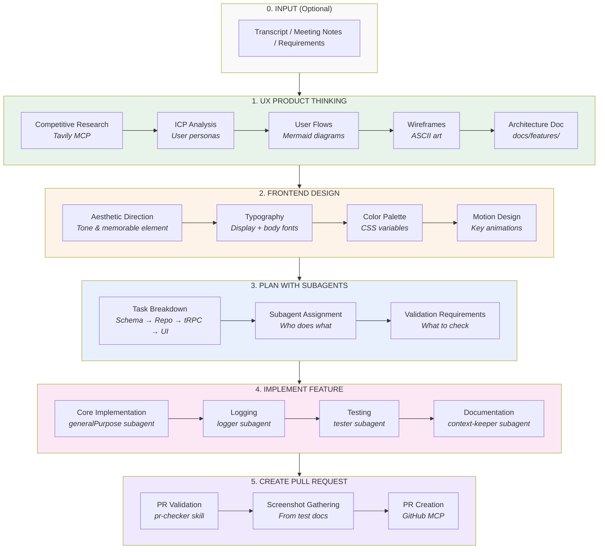
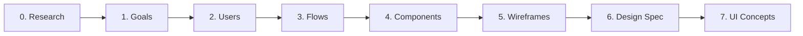
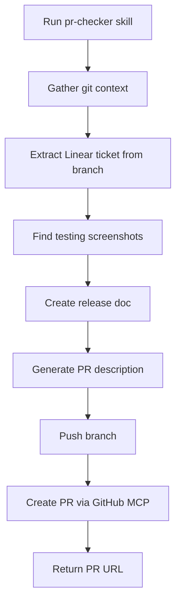

# 100% AI-Driven Development Workflow

A comprehensive guide to building production features from concept to pull request using AI agents and skills — with the thinking behind each step.

---

## Table of Contents

1. [Introduction: Why This Workflow?](#introduction-why-this-workflow)
2. [Core Concepts](#core-concepts)
3. [The Workflow Overview](#the-workflow-overview)
4. [Phase 0: Input](#phase-0-input-optional)
5. [Phase 1: UX Product Thinking](#phase-1-ux-product-thinking)
6. [Phase 2: Frontend Design](#phase-2-frontend-design)
7. [Phase 3: Plan with Subagents](#phase-3-plan-with-subagents)
8. [Phase 4: Implement Feature](#phase-4-implement-feature)
9. [Phase 5: Create Pull Request](#phase-5-create-pull-request)
10. [Complete Walkthrough](#complete-walkthrough-building-meal-plan-templates)
11. [Common Mistakes & How to Avoid Them](#common-mistakes--how-to-avoid-them)
12. [FAQ](#frequently-asked-questions)
13. [Glossary](#glossary)

---

## Introduction: Why This Workflow?

### The Problem with Ad-Hoc AI Usage

Most developers use AI coding assistants reactively: "write me a function," "fix this bug," "explain this code." This works for small tasks but breaks down for complex features because:

1. **Context is lost between prompts** — Each request starts fresh
2. **No systematic approach** — Important steps get skipped
3. **Inconsistent quality** — Results vary wildly based on how you ask
4. **Knowledge silos** — What the AI learns doesn't persist

### The Solution: Structured Skills & Agents

This workflow solves these problems by:

| Problem | Solution |
|---------|----------|
| Context loss | **Skills** encode domain knowledge that persists |
| Skipped steps | **Phases** ensure nothing is missed |
| Inconsistent quality | **Subagents** are specialized for each task type |
| Knowledge silos | **Documentation** captures decisions for future reference |

### What You'll Learn

By the end of this guide, you'll understand:

- How to break complex features into AI-manageable phases
- When to use which skill or subagent
- How to provide context that produces better results
- Why documentation is generated automatically (not as an afterthought)
- How to troubleshoot when things go wrong

---

## Core Concepts

Before diving into the workflow, let's establish the mental models that make it work.

### Skills vs. Subagents

These are the two building blocks of the workflow:

```
┌─────────────────────────────────────────────────────────────────┐
│                           SKILLS                                 │
│  Instructions that tell the AI HOW to do something              │
│  • Encoded in .cursor/skills/*.md files                         │
│  • Contain templates, patterns, checklists                      │
│  • Read by the AI when you say "use the X skill"                │
│  • Think of them as SOPs (Standard Operating Procedures)        │
└─────────────────────────────────────────────────────────────────┘
                              ↓
                       Skills invoke
                              ↓
┌─────────────────────────────────────────────────────────────────┐
│                          SUBAGENTS                               │
│  Specialized AI workers that EXECUTE specific task types        │
│  • Invoked via the Task tool                                    │
│  • Each has access to specific tools (explore, test, etc.)      │
│  • Run independently, return results                            │
│  • Think of them as team members with specific roles            │
└─────────────────────────────────────────────────────────────────┘
```

**Analogy:** Skills are like cookbooks (instructions), subagents are like sous chefs (execution).

### Why Phases Matter

The workflow has 5 phases in a specific order. Here's why:



**The key insight:** Each phase produces artifacts that the next phase consumes.

| Phase | Produces | Consumed By |
|-------|----------|-------------|
| UX Product Thinking | Architecture doc with flows & wireframes | Frontend Design, Implementation |
| Frontend Design | Design spec (typography, colors, motion) | Implementation |
| Plan with Subagents | Task list with subagent assignments | Implementation |
| Implement Feature | Working code + tests + docs | PR Creation |
| Create PR | Pull request with screenshots | Code review |

**If you skip a phase, downstream phases have missing context.** This is why the workflow is sequential.

### The Documentation-First Principle

This workflow generates documentation *during* development, not after. Why?

1. **Documentation is context** — The AI reads docs to understand what to build
2. **Decisions are captured** — Future you (or teammates) know why choices were made
3. **Testing is informed** — Test plans come from architecture docs
4. **PRs write themselves** — All the context is already documented

```
Traditional:     Code → Test → Document (often skipped)
This Workflow:   Document → Code → Test → Document updates automatically
```

### Retrieval-Led vs. Pre-Training-Led Reasoning

A crucial concept throughout this workflow:

```
PRE-TRAINING-LED REASONING (avoid this)
────────────────────────────────────────
AI relies on what it learned during training
• May be outdated
• Doesn't know YOUR project's patterns
• Generic solutions

RETRIEVAL-LED REASONING (prefer this)
────────────────────────────────────────
AI reads YOUR project's files first
• Rules in .cursor/rules/
• Context in .cursor/context.md
• Architecture docs in docs/features/
• Produces project-specific solutions
```

**That's why skills start with:** "Read `.cursor/context.md` for the compressed Rules Index."

---

## The Workflow Overview

Here's the complete flow visualized:



---

## Phase 0: Input (Optional)

### Purpose

Provide the AI with raw requirements so it has context for what to build.

### What Makes Good Input

The AI can work with messy, unstructured input. Your job is to provide **context**, not perfect requirements.

| Input Type | Example | Why It Works |
|------------|---------|--------------|
| Meeting transcript | "John said users are frustrated with..." | Contains real user language and pain points |
| PRD bullet points | "- Users can save meal plans as templates" | Clear features to implement |
| User feedback | "I wish I could reuse last week's plan" | Direct user voice |
| Rough sketch | "Something like Notion's template gallery" | Visual reference |

### How to Provide Input

**Method 1: Paste directly**
```
Here's the transcript from our product meeting:

[paste full transcript]

Use the ux-product-thinking skill to analyze this and design the feature.
```

**Method 2: Summarize key points**
```
We need a feature for meal plan templates with these requirements:
- Users save their weekly meal plans as reusable templates
- Templates have names and descriptions
- Can apply a template to any week
- Share templates publicly (optional)

Use the ux-product-thinking skill to design this.
```

**Method 3: Reference existing docs**
```
The requirements are in the Linear ticket LAN-456.
Use the ux-product-thinking skill to design this feature.
```

### Why This Phase is Optional

If you have a clear idea of what to build, you can skip straight to Phase 1 with a brief description. The AI will ask clarifying questions if needed.

---

## Phase 1: UX Product Thinking

**Skill:** `.cursor/skills/ux-product-thinking/SKILL.md`

### Purpose

Transform vague requirements into a comprehensive, documented design that everyone (humans and AI) can reference.

### Why This Phase Exists

Without this phase, you get:
- Features that don't match user needs
- UI that feels disconnected from product goals
- Implementation that starts over when requirements change
- No record of design decisions

With this phase, you get:
- Researched, validated design direction
- User flows that anticipate edge cases
- Component architecture before code
- A living document that guides all future work

### The Seven Sub-Phases



Let's understand each:

#### Phase 0: Competitive Research

**What:** Use Tavily MCP to search for competitors and similar products.

**Why:** You don't design in a vacuum. Understanding what exists helps you:
- Avoid reinventing solved patterns
- Find differentiation opportunities
- Learn from competitors' mistakes

**How the AI does it:**
```
tavily_search → Find competitors
tavily_extract → Pull their landing pages
get_url_screenshot → Capture visual reference
```

**Output:** Competitive analysis table in the architecture doc.

#### Phase 1: Product Goals

**What:** Define success metrics and constraints.

**Why:** Without clear goals, you can't evaluate design decisions. "Should we add this feature?" becomes "Does this help us achieve [goal]?"

**Key questions:**
- What's the primary business goal?
- How will we measure success?
- What are our constraints (technical, business, time)?

#### Phase 2: User Analysis (ICPs)

**What:** Define Ideal Customer Profiles with fit scores.

**Why:** Different users have different needs. A "meal planner" persona needs different UI than a "recipe archivist" persona.

**Output:**
```markdown
| ICP | Fit Score | Primary Pain | Key Feature Need |
|-----|-----------|--------------|------------------|
| Busy Parent | 85/100 | "No time to plan" | Quick templates |
| Meal Prep Pro | 72/100 | "Repeating same meals" | Template library |
```

#### Phase 3: User Flows

**What:** Mermaid diagrams showing how users move through the feature.

**Why:** Flows reveal:
- Happy paths (ideal journey)
- Error paths (what can go wrong)
- Edge cases (unusual but valid scenarios)

**Example output:**
```mermaid
flowchart TD
    A[User on meal planner] --> B{Has existing plan?}
    B -->|Yes| C[Show "Save as Template" button]
    B -->|No| D[Show "Apply Template" button]
    C --> E[Open save modal]
    E --> F[Enter name & description]
    F --> G[Save template]
    G --> H[Show success toast]
```

#### Phase 4: Component Architecture

**What:** Break the UI into logical, reusable parts.

**Why:** 
- Prevents monolithic components
- Identifies shared UI patterns
- Maps data flow between components

#### Phase 5: Wireframes

**What:** ASCII art showing layout structure.

**Why:** Text-based wireframes are:
- Fast to create
- Easy to modify
- Parseable by AI during implementation
- Version-controlled

**Example:**
```
┌─────────────────────────────────────┐
│ Header: Templates                   │
├─────────────────────────────────────┤
│ [+ Create Template]                 │
│                                     │
│ ┌─────────┐ ┌─────────┐ ┌─────────┐│
│ │Template │ │Template │ │Template ││
│ │ Card 1  │ │ Card 2  │ │ Card 3  ││
│ └─────────┘ └─────────┘ └─────────┘│
└─────────────────────────────────────┘
```

#### Phase 6: Design Specification

**What:** Typography, colors, motion, spatial composition.

**Why:** This is where we prevent "generic AI aesthetics." The spec ensures:
- Consistent visual language
- Intentional design choices
- CSS variables (not hardcoded colors)

#### Phase 7: UI Concepts (Optional)

**What:** Generated images showing the design direction.

**Why:** Visual mockups help validate direction before coding.

### Prompt Pattern

```
Use the ux-product-thinking skill to design [feature name].

Context:
- [Who is this for?]
- [What problem does it solve?]
- [Any constraints?]

Create the architecture document at docs/features/[feature]-architecture.md
```

### Output

A comprehensive markdown file at `docs/features/[feature]-architecture.md` containing:
- Competitive research summary
- Product goals and metrics
- ICP analysis
- User flow diagrams
- Component hierarchy
- ASCII wireframes
- Design specification

---

## Phase 2: Frontend Design

**Skill:** `.cursor/skills/frontend-design/SKILL.md`

### Purpose

Ensure the UI is distinctive and memorable, not generic "AI slop."

### Why This Phase Exists

AI-generated UIs often look the same:
- Inter or Roboto font
- Purple gradients
- Rounded corners everywhere
- Safe, predictable layouts

This phase forces intentional design decisions that create **distinctive** interfaces.

### The Design Thinking Framework

Before any UI code, commit to:

```
┌─────────────────────────────────────────────────────────────────┐
│ 1. PURPOSE                                                       │
│    What problem does this interface solve?                      │
│    Who uses it? In what context?                                │
├─────────────────────────────────────────────────────────────────┤
│ 2. TONE                                                          │
│    Pick an EXTREME, not a safe middle:                          │
│    • Brutally minimal                                           │
│    • Maximalist chaos                                           │
│    • Retro-futuristic                                           │
│    • Editorial/magazine                                         │
│    • Organic/natural                                            │
│    • Luxury/refined                                             │
├─────────────────────────────────────────────────────────────────┤
│ 3. CONSTRAINTS                                                   │
│    • Technical: Must work on mobile? Accessibility needs?       │
│    • Performance: Heavy animations OK? Bundle size limits?      │
├─────────────────────────────────────────────────────────────────┤
│ 4. DIFFERENTIATION                                               │
│    What's the ONE thing users will remember?                    │
│    (If you can't name it, you haven't found it yet)             │
└─────────────────────────────────────────────────────────────────┘
```

### What Makes Design "Generic"

| Generic Pattern | Why It's Generic | Better Alternative |
|-----------------|------------------|-------------------|
| Inter font | Every AI uses it by default | Playfair Display, Space Grotesk, Bitter |
| Purple gradient on white | The "default AI aesthetic" | Committed palette with one sharp accent |
| Evenly-spaced grid | Safe, predictable | Asymmetry, overlap, negative space |
| Same border-radius everywhere | No hierarchy | Vary radii intentionally |
| Gray-on-white text | Low contrast, generic | High contrast with color accents |

### Design Spec Template

The architecture doc should include:

```markdown
## Frontend Design Specification

### Aesthetic Direction
**Tone**: Editorial cookbook aesthetic—warm, artisanal, inviting
**Memorable Element**: Grain texture overlay with warm shadows

### Typography
| Usage | Font | Weight | Why |
|-------|------|--------|-----|
| Display | Playfair Display | 700 | Classic, cookbook feel |
| Body | Source Sans 3 | 400 | Highly readable, pairs well |

### Color Palette
| Token | Value | Usage |
|-------|-------|-------|
| --background | hsl(var(--cream)) | Page backgrounds |
| --primary | hsl(var(--terracotta-500)) | Primary actions, headings |
| --accent | hsl(var(--sage-500)) | Secondary actions, tags |

### Motion Design
| Moment | Animation | Duration |
|--------|-----------|----------|
| Page load | Staggered fade-in | 150ms delay between items |
| Card hover | Subtle lift + shadow | 200ms ease-out |
| Modal open | Scale from 95% + fade | 300ms spring |

### Spatial Composition
- Card grid with uneven gutters (larger on right)
- Generous padding (2rem minimum)
- Overlapping elements for depth (tags over images)
```

### Integration Point

This phase is applied during **Phase 6 of UX Product Thinking**. The design spec lives inside the architecture document, not separately.

---

## Phase 3: Plan with Subagents

**Skill:** `.cursor/skills/plan-with-subagents/SKILL.md`

### Purpose

Break the feature into tasks and assign each to the right specialist.

### Why Planning Matters

Without a plan:
- You implement in the wrong order (UI before API exists)
- You forget steps (no logging, no tests, no docs)
- You don't know when you're done

With a plan:
- Dependencies are explicit
- Each task has a clear owner (subagent)
- Validation requirements are defined upfront

### The Data Flow Pattern

Tasks should follow how data flows through the system:

```
┌─────────────────────────────────────────────────────────────────┐
│  1. SCHEMA                                                       │
│     Database tables and fields                                  │
│     ↓                                                            │
│  2. REPOSITORY                                                   │
│     Data access functions (CRUD)                                │
│     ↓                                                            │
│  3. tRPC ROUTES                                                  │
│     API endpoints with validation                               │
│     ↓                                                            │
│  4. UI COMPONENTS                                                │
│     Reusable pieces (cards, modals, forms)                      │
│     ↓                                                            │
│  5. ROUTE PAGES                                                  │
│     Full pages that compose components                          │
│     ↓                                                            │
│  6. LOGGING                                                      │
│     Debug traces through the stack                              │
│     ↓                                                            │
│  7. TESTING                                                      │
│     E2E tests + screenshots                                     │
│     ↓                                                            │
│  8. DOCUMENTATION                                                │
│     Context updates, architecture updates                       │
│     ↓                                                            │
│  9. ANALYTICS (if applicable)                                    │
│     Dashboards for new data                                     │
└─────────────────────────────────────────────────────────────────┘
```

**Why this order?** Each layer depends on the one above it. You can't build UI for an API that doesn't exist.

### Understanding Subagents

Subagents are specialized AI workers. Each has:
- **Specific tools** — `explore` can search code, `tester` can use Playwright
- **Domain knowledge** — `logger` knows logging patterns, `data-analytics` knows chart types
- **Focused scope** — They do one thing well

| Subagent | What It Does | Tools It Has |
|----------|--------------|--------------|
| `explore` | Find code, understand patterns | Search, read files |
| `generalPurpose` | Write any code | All standard tools |
| `logger` | Add structured logging | Code editing |
| `tester` | Verify & write tests | Playwright MCP, screenshots |
| `context-keeper` | Update context.md | File editing |
| `architecture-tracker` | Update architecture docs | File editing |
| `data-analytics` | Create dashboards | Code editing, charting |
| `figma-to-tailwind-converter` | Convert Figma output | Code transformation |
| `figma-design-validator` | Verify UI matches design | Playwright MCP, Figma MCP |

### Task Assignment Logic

```
Is this about understanding existing code?
└─ Yes → explore

Is this about writing new code (schema, repo, tRPC, UI)?
└─ Yes → generalPurpose

Is this about adding debug logging?
└─ Yes → logger

Is this about testing and verification?
└─ Yes → tester

Is this about updating context.md?
└─ Yes → context-keeper

Is this about updating architecture docs?
└─ Yes → architecture-tracker

Is this about creating analytics dashboards?
└─ Yes → data-analytics

Is this about converting Figma code?
└─ Yes → figma-to-tailwind-converter
```

### Plan Output Format

```markdown
## Implementation Plan: [Feature Name]

### Overview
[1-2 sentence description]

### Tasks

#### Task 1: Add Database Schema
**Subagent:** `generalPurpose`
**Files:** `app/db/schema.ts`, `drizzle/*.sql`
**Description:** Add templates table with name, description, userId, mealPlanData fields
**Validation:** Migration uses snake_case naming convention

#### Task 2: Create Repository
**Subagent:** `generalPurpose`
**Files:** `app/repositories/meal-plan-template.ts`
**Description:** CRUD operations with proper error handling
**Validation:** Repository pattern compliance (Database type alias, try-catch)

[... more tasks ...]

### Validation Requirements
- [ ] All files follow their respective rules
- [ ] Tests exist and pass
- [ ] Documentation updated
```

---

## Phase 4: Implement Feature

**Skill:** `.cursor/skills/implement-feature/SKILL.md`

### Purpose

Execute the plan by delegating to subagents in the right order.

### Why Delegation Works

Instead of one AI trying to do everything, specialized subagents handle their domain:

```
┌─────────────────────────────────────────────────────────────────┐
│                     MAIN AGENT (you're talking to)              │
│                                                                  │
│   "Use the implement-feature skill to build templates"          │
│                              │                                   │
│                              ▼                                   │
│   ┌─────────────────────────────────────────────────────────┐   │
│   │ Reads implementation plan                               │   │
│   │ Reads design spec from architecture doc                 │   │
│   │ Determines which subagents to invoke                    │   │
│   └─────────────────────────────────────────────────────────┘   │
│                              │                                   │
│              ┌───────────────┼───────────────┐                   │
│              ▼               ▼               ▼                   │
│   ┌──────────────┐ ┌──────────────┐ ┌──────────────┐           │
│   │generalPurpose│ │   logger     │ │   tester     │           │
│   │              │ │              │ │              │           │
│   │ Schema       │ │ Add debug    │ │ Playwright   │           │
│   │ Repository   │ │ logs to      │ │ verification │           │
│   │ tRPC         │ │ all layers   │ │ E2E tests    │           │
│   │ Components   │ │              │ │ Screenshots  │           │
│   └──────────────┘ └──────────────┘ └──────────────┘           │
│              │               │               │                   │
│              └───────────────┼───────────────┘                   │
│                              ▼                                   │
│   ┌─────────────────────────────────────────────────────────┐   │
│   │ Results combined, docs updated, ready for PR            │   │
│   └─────────────────────────────────────────────────────────┘   │
└─────────────────────────────────────────────────────────────────┘
```

### The Execution Order

```
┌─────────────────────────────────────────────────────────────────┐
│                    IMPLEMENTATION PHASE                          │
├─────────────────────────────────────────────────────────────────┤
│  1. Core Implementation (generalPurpose)                        │
│     • Reads design spec FIRST                                   │
│     • Schema → Repository → tRPC → Components → Routes          │
│     • Applies typography, colors, motion from spec              │
├─────────────────────────────────────────────────────────────────┤
│  2. Figma Integration (if applicable)                           │
│     • figma-to-tailwind-converter: Convert hardcoded colors     │
│     • figma-design-validator: Verify match                      │
├─────────────────────────────────────────────────────────────────┤
│  3. Logging (logger)                                            │
│     • Add structured debug logs to all layers                   │
│     • Entry/exit points, state changes, errors                  │
├─────────────────────────────────────────────────────────────────┤
│                    VALIDATION PHASE                              │
├─────────────────────────────────────────────────────────────────┤
│  4. Testing (tester)                                            │
│     • Browser verification with Playwright MCP                  │
│     • Screenshot capture (MANDATORY)                            │
│     • E2E test writing                                          │
├─────────────────────────────────────────────────────────────────┤
│  5. Analytics (data-analytics) — if applicable                  │
│     • Create dashboards for new trackable data                  │
├─────────────────────────────────────────────────────────────────┤
│                    DOCUMENTATION PHASE                           │
├─────────────────────────────────────────────────────────────────┤
│  6. Context Update (context-keeper)                             │
│     • Update .cursor/context.md with new feature                │
├─────────────────────────────────────────────────────────────────┤
│  7. Architecture Update (architecture-tracker)                  │
│     • Update route map, add feature flow, changelog entry       │
└─────────────────────────────────────────────────────────────────┘
```

### The Decision Tree

When should you use which subagent?

```
Feature has UI?
├─ YES
│   └─ Architecture doc exists with design spec?
│       ├─ NO → Run ux-product-thinking FIRST
│       └─ YES → generalPurpose (reads spec) → logger → tester → context-keeper
│
└─ NO (backend only)
    └─ Has database changes?
        ├─ YES → generalPurpose → logger → tester → data-analytics → context-keeper
        └─ NO → generalPurpose → tester → context-keeper
```

### What Gets Created

| Subagent | Creates |
|----------|---------|
| `generalPurpose` | `app/db/schema.ts` changes, `app/repositories/*.ts`, `app/trpc/routes/*.ts`, `app/components/*.tsx`, `app/routes/*.tsx` |
| `logger` | Structured log statements in all layers |
| `tester` | `e2e/*.spec.ts`, `docs/testing/*/screenshots/*`, test documentation |
| `context-keeper` | Updated `.cursor/context.md` |
| `architecture-tracker` | Updated `.cursor/context/high-level-architecture.md` |
| `data-analytics` | `app/routes/admin/analytics/*.tsx`, dashboard components |

---

## Phase 5: Create Pull Request

**Skill:** `.cursor/skills/create-pull-request/SKILL.md`

### Purpose

Package all the work into a properly formatted PR that's easy to review.

### Why PR Quality Matters

A good PR:
- Gets reviewed faster (reviewers understand it immediately)
- Has fewer back-and-forth comments
- Serves as documentation for future reference
- Makes rollbacks easier if needed

### The PR Workflow



### What Gets Validated

The `pr-checker` skill ensures:

| Check | Why It Matters |
|-------|----------------|
| Repository pattern compliance | Consistent data access layer |
| tRPC Zod validation | Type-safe API contracts |
| Route auth checks | Security |
| Migration naming | Database consistency |
| Testing plan exists | Quality assurance |
| context.md updated | Knowledge preservation |
| Screenshots captured | Visual verification |

### PR Description Structure

```markdown
## Pull Request Type
feat | fix | docs | refactor | test | chore

## Purpose
[1-3 sentences: WHAT changed and WHY]

## Linear Tickets
- LAN-XXX

## Breaking Changes
None (or list them with migration steps)

## Screenshots
[Images from docs/testing/*/screenshots/]

## Test Cases
- [ ] Step 1: Do X, verify Y
- [ ] Step 2: Do A, verify B

## Notes
- Implementation decisions
- Known limitations
- Follow-up work needed

## Self Checklist
- [ ] Tests passing
- [ ] Build succeeds
- [ ] Docs updated
```

---

## Complete Walkthrough: Building "Meal Plan Templates"

Let's walk through the entire workflow with a real example.

### Starting Point

You have notes from a product meeting about letting users save meal plans as templates.

### Step 1: Provide Input

```
USER: Here's what we discussed in the product meeting:

- Users want to reuse their weekly meal plans
- They should be able to name and describe templates
- Templates can be applied to any week
- Optional: share templates publicly

Use the ux-product-thinking skill to design this feature.
```

### Step 2: UX Product Thinking (AI Response)

The AI will:

1. **Research competitors** using Tavily
   - Search: "meal planning app templates feature"
   - Find how Mealime, Plan to Eat, Paprika handle templates

2. **Define ICPs**
   ```markdown
   | ICP | Fit Score | Pain Point |
   |-----|-----------|------------|
   | Busy Parent | 85/100 | "No time to plan from scratch" |
   | Meal Prep Pro | 72/100 | "I make the same meals weekly" |
   ```

3. **Create user flows**
   ```mermaid
   flowchart TD
       A[View meal plan] --> B[Click "Save as Template"]
       B --> C[Enter name & description]
       C --> D[Save]
       D --> E[Template appears in library]
   ```

4. **Design components**
   - `TemplateCard` — displays template preview
   - `SaveTemplateModal` — name and description input
   - `TemplateLibrary` — grid of saved templates

5. **Write design spec**
   - Editorial cookbook aesthetic
   - Warm shadows on cards
   - Staggered animation on library load

6. **Output**: `docs/features/meal-plan-templates-architecture.md`

### Step 3: Plan with Subagents

```
USER: Use the plan-with-subagents skill to create the implementation plan.
```

The AI creates `docs/plans/meal-plan-templates-implementation.md`:

```markdown
## Implementation Plan: Meal Plan Templates

### Tasks

#### Task 1: Database Schema
**Subagent:** `generalPurpose`
**Files:** `app/db/schema.ts`, `drizzle/0008_add_meal_plan_templates.sql`

#### Task 2: Repository Layer
**Subagent:** `generalPurpose`
**Files:** `app/repositories/meal-plan-template.ts`

#### Task 3: tRPC Routes
**Subagent:** `generalPurpose`
**Files:** `app/trpc/routes/meal-plan-template.ts`

#### Task 4: UI Components
**Subagent:** `generalPurpose`
**Files:** `app/components/meal-plan-template/*.tsx`

#### Task 5: Route Pages
**Subagent:** `generalPurpose`
**Files:** `app/routes/recipes/templates.tsx`

#### Task 6: Add Logging
**Subagent:** `logger`

#### Task 7: Testing
**Subagent:** `tester`

#### Task 8: Update Documentation
**Subagent:** `context-keeper`

#### Task 9: Update Architecture
**Subagent:** `architecture-tracker`
```

### Step 4: Implement Feature

```
USER: Use the implement-feature skill to build this.
```

The AI executes the plan:

1. **generalPurpose** creates the schema:
   ```typescript
   export const mealPlanTemplates = pgTable("meal_plan_templates", {
     id: text("id").primaryKey(),
     userId: text("user_id").notNull(),
     name: text("name").notNull(),
     description: text("description"),
     mealPlanData: jsonb("meal_plan_data").notNull(),
     isPublic: boolean("is_public").default(false),
     createdAt: timestamp("created_at").defaultNow(),
   });
   ```

2. **generalPurpose** creates the repository with error handling

3. **generalPurpose** creates tRPC routes with Zod validation

4. **generalPurpose** builds UI components following the design spec

5. **logger** adds structured logging

6. **tester** runs Playwright, captures screenshots, writes E2E tests

7. **context-keeper** updates context.md

8. **architecture-tracker** updates the architecture doc

### Step 5: Create Pull Request

```
USER: Use the create-pull-request skill to create the PR.
```

The AI:
1. Runs pr-checker validation
2. Gathers screenshots from `docs/testing/meal-plan-templates/screenshots/`
3. Creates release doc at `docs/releases/2026-02-03-meal-plan-templates.md`
4. Generates PR description with all context
5. Pushes branch and creates PR via GitHub MCP

**Result:** A complete, documented, tested feature ready for review.

---

## Common Mistakes & How to Avoid Them

### Mistake 1: Skipping UX Product Thinking

**What happens:** You jump straight to implementation without design.

**Result:** 
- UI doesn't match user needs
- Rework when requirements change
- No documentation of design decisions

**Fix:** Always run ux-product-thinking for features with UI. It takes 10 minutes but saves hours of rework.

---

### Mistake 2: Generic-Looking UI

**What happens:** The AI produces Inter font, purple gradients, safe layouts.

**Result:** Your app looks like every other AI-generated app.

**Fix:**
1. Ensure the architecture doc has a **Frontend Design Specification** section
2. Read the frontend-design skill before implementing UI
3. Explicitly state: "Use the typography and colors from the design spec"

---

### Mistake 3: Missing Screenshots

**What happens:** The tester subagent runs but screenshots aren't saved.

**Result:** PR has no visual proof, test documentation is incomplete.

**Fix:** The testing prompt must include:
```
MANDATORY: Save screenshots to docs/testing/[feature]/screenshots/
MANDATORY: Copy screenshots to public/docs/testing/[feature]/screenshots/
MANDATORY: Embed screenshots in test documentation
```

---

### Mistake 4: Implementing in the Wrong Order

**What happens:** You build UI before the API exists.

**Result:** Components have placeholder data, need rewriting when API is done.

**Fix:** Follow the data flow pattern:
```
Schema → Repository → tRPC → Components → Routes
```
Each layer depends on the one above.

---

### Mistake 5: Forgetting Documentation Updates

**What happens:** Feature ships but context.md and architecture docs are stale.

**Result:** Future AI conversations lack context, same questions get re-asked.

**Fix:** The implementation plan must include:
- Task for `context-keeper` subagent
- Task for `architecture-tracker` subagent

These are not optional.

---

### Mistake 6: Hardcoded Colors in UI

**What happens:** Figma output uses `bg-blue-600` or `bg-[#003362]`.

**Result:** Inconsistent theming, dark mode doesn't work.

**Fix:** Always run `figma-to-tailwind-converter` subagent on Figma output. It converts:
```
bg-[#003362] → bg-primary
text-gray-900 → text-foreground
```

---

## Frequently Asked Questions

### Q: Do I have to follow every phase?

**A:** The phases are designed to build on each other. You *can* skip phases, but:
- Skipping UX Product Thinking → No architecture doc → Implementation lacks direction
- Skipping Planning → Tasks done in wrong order or missed
- Skipping Testing → No verification, PR lacks evidence

For simple bug fixes, you might only need: implement → test → PR.

---

### Q: How long does the full workflow take?

**A:** For a medium-sized feature:

| Phase | Time |
|-------|------|
| UX Product Thinking | 10-20 minutes |
| Frontend Design | Included in above |
| Plan with Subagents | 5 minutes |
| Implement Feature | 30-60 minutes |
| Create PR | 5 minutes |

**Total:** 1-2 hours for a production-ready, documented feature.

---

### Q: What if the AI makes a mistake?

**A:** Common recovery patterns:

| Issue | Recovery |
|-------|----------|
| Wrong architecture | Update the architecture doc, re-implement |
| Buggy code | Ask the AI to fix it, run tester again |
| Missing tests | Run tester subagent again with specific scenarios |
| Bad design | Update design spec, regenerate components |

The documentation-first approach means mistakes are caught earlier.

---

### Q: Can I use this workflow for bug fixes?

**A:** Yes, but simplified:

```
Bug Fix Workflow:
1. Describe the bug
2. Ask AI to find the cause (explore subagent)
3. Implement fix (generalPurpose)
4. Test (tester)
5. Create PR (create-pull-request skill)
```

No need for UX Product Thinking or Planning for simple fixes.

---

### Q: How do skills get updated?

**A:** Skills are markdown files in `.cursor/skills/`. To improve a skill:

1. Identify what's missing or wrong
2. Edit the skill file directly
3. Test with a new feature
4. The AI will use the updated instructions

---

## Glossary

| Term | Definition |
|------|------------|
| **Skill** | A markdown file containing instructions for how the AI should perform a specific task. Located in `.cursor/skills/`. |
| **Subagent** | A specialized AI worker invoked via the Task tool. Has specific tools and domain knowledge. |
| **Architecture Doc** | A comprehensive markdown file documenting a feature's design, flows, and specifications. Located in `docs/features/`. |
| **Design Spec** | Section of the architecture doc defining typography, colors, motion, and spatial composition. |
| **ICP** | Ideal Customer Profile. A representation of your target user with their pain points and needs. |
| **MCP** | Model Context Protocol. External tools the AI can use (Tavily for search, Playwright for testing, GitHub for PRs). |
| **tRPC** | Type-safe API layer used in this project. Routes defined in `app/trpc/routes/`. |
| **Repository** | Data access layer. Pure functions for database operations in `app/repositories/`. |
| **Context.md** | Compressed overview of the project that the AI reads for context. Located at `.cursor/context.md`. |
| **Retrieval-led reasoning** | AI reasoning based on reading project files rather than relying on training data. |

---

## Quick Reference

### File Locations

| Document Type | Location |
|---------------|----------|
| Skills | `.cursor/skills/*/SKILL.md` |
| Rules | `.cursor/rules/*.mdc` |
| Context | `.cursor/context.md` |
| Architecture Docs | `docs/features/*-architecture.md` |
| Implementation Plans | `docs/plans/*-implementation.md` |
| Testing Docs | `docs/testing/*/` |
| Screenshots | `docs/testing/*/screenshots/` |
| Release Docs | `docs/releases/YYYY-MM-DD-*.md` |

### Prompt Patterns

```
# UX Product Thinking
Use the ux-product-thinking skill to design [feature].

# Planning
Use the plan-with-subagents skill to create an implementation plan for [feature].

# Implementation
Use the implement-feature skill to build [feature].

# PR Creation
Use the create-pull-request skill to create a PR for this feature.
```

### Subagent Quick Reference

| Subagent | Use For |
|----------|---------|
| `explore` | Finding code, understanding patterns |
| `generalPurpose` | Writing any code |
| `logger` | Adding debug logs |
| `tester` | Verification and E2E tests |
| `context-keeper` | Updating context.md |
| `architecture-tracker` | Updating architecture docs |
| `data-analytics` | Creating dashboards |
| `figma-to-tailwind-converter` | Converting Figma output |

---

*Last updated: February 2026*
