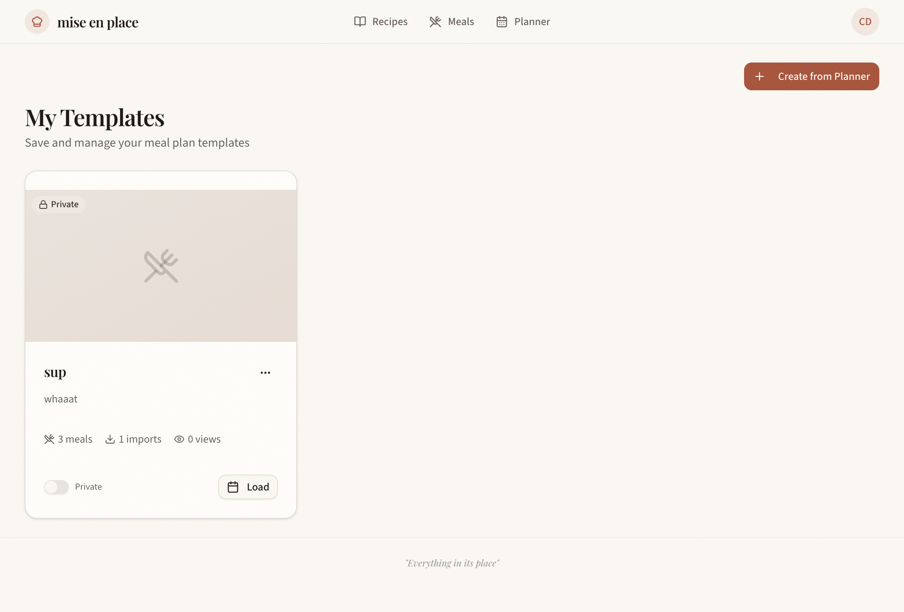
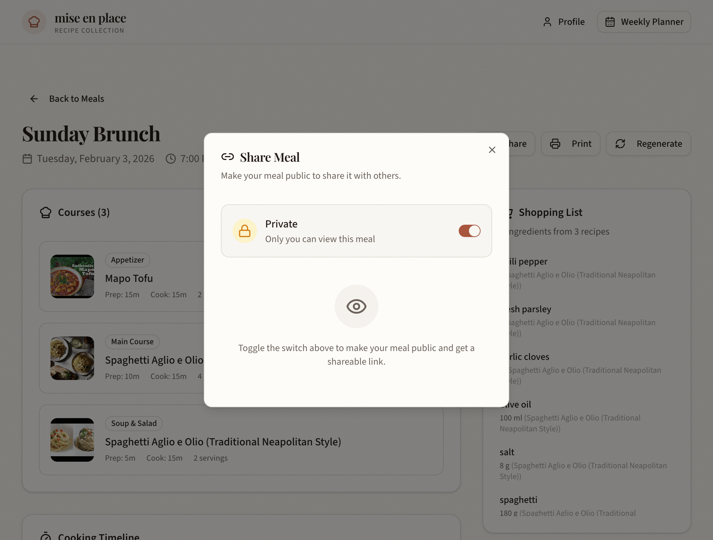
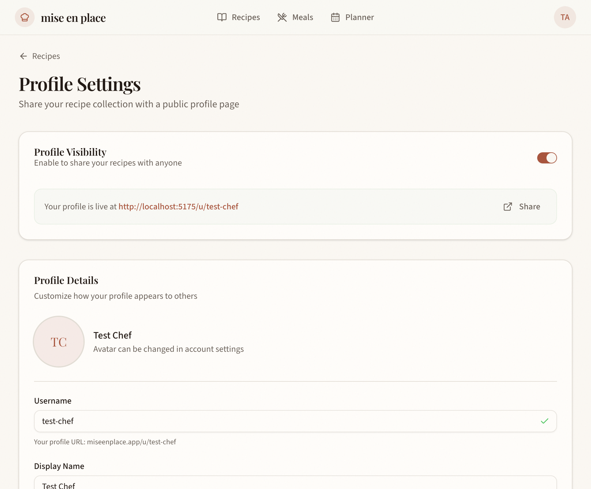
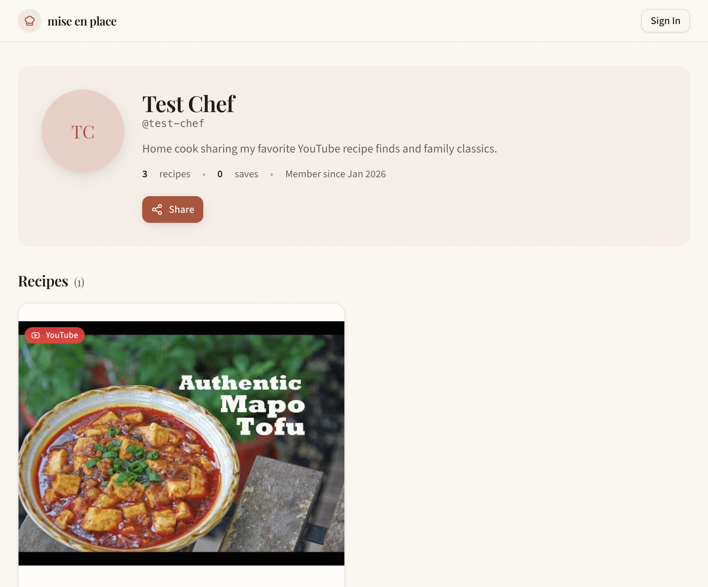

# Case Study: Public Meal Plan Templates

How the 100% AI-Driven Workflow transformed a vague product idea into a production-ready feature in under 2 hours.

---

## Table of Contents

1. [The Challenge](#the-challenge)
2. [Phase-by-Phase Breakdown](#phase-by-phase-breakdown)
   - [Phase 0: Input](#phase-0-input)
   - [Phase 1: UX Product Thinking](#phase-1-ux-product-thinking)
   - [Phase 2: Frontend Design](#phase-2-frontend-design)
   - [Phase 3: Plan with Subagents](#phase-3-plan-with-subagents)
   - [Phase 4: Implement Feature](#phase-4-implement-feature)
   - [Phase 5: Create Pull Request](#phase-5-create-pull-request)
3. [Workflow Impact Analysis](#workflow-impact-analysis)
4. [What Would Have Gone Wrong Without the Workflow](#what-would-have-gone-wrong-without-the-workflow)
5. [Artifacts Inventory](#artifacts-inventory)
6. [Screenshots](#screenshots)

---

## The Challenge

**Starting Point:** A vague product requirement: *"Users should be able to share their meal plans with others."*

**End Goal:** A complete feature with database schema, API, UI, tests, and documentation.

**Traditional Approach Problems:**
- Jump straight to coding → miss edge cases
- Build UI first → API doesn't match
- Skip documentation → context lost for future work
- Forget testing → bugs in production

**Workflow Solution:** Structured phases that build on each other, with documentation generated *during* development.

---

## Phase-by-Phase Breakdown

### Phase 0: Input

> **Purpose:** Provide the AI with raw requirements so it has context for what to build.

#### What Was Provided

```
Users want to:
- Save their weekly meal plans as reusable templates
- Name and describe templates
- Apply templates to any week
- Optionally share templates publicly
- Import other users' templates into their own planner
```

#### Impact of This Phase

| Without Input | With Input |
|---------------|------------|
| AI guesses what "share meal plans" means | AI understands the complete user story |
| Generic feature that might not fit | Targeted solution matching user needs |
| Multiple clarification rounds needed | One-shot design that's 90% correct |

---

### Phase 1: UX Product Thinking

> **Purpose:** Transform vague requirements into a comprehensive, documented design.

#### What the Workflow Did

1. **Competitive Research** (Tavily MCP)
   - Searched: "meal planning app templates feature"
   - Analyzed: Plan to Eat, Prepear, Paprika, Samsung Food
   - Identified gap: No one does peer-to-peer meal plan sharing with YouTube video integration

2. **Defined Ideal Customer Profiles (ICPs)**

   | ICP | Fit Score | Primary Pain Point |
   |-----|-----------|-------------------|
   | YouTube Recipe Enthusiast | 72/100 | "I want to share curated video recipe collections" |
   | Overwhelmed Meal Planner | 68/100 | "No time to plan from scratch each week" |
   | Analog Recipe Archivist | 58/100 | "Family recipes should be preserved and shared" |

3. **Created User Flows** (Mermaid diagrams)

   ```mermaid
   flowchart TD
       A[User has populated weekly planner] --> B{Want to share?}
       B -->|Yes| C[Open Share Modal]
       C --> D{Template exists?}
       D -->|No| E[Create Template Form]
       E --> F[Enter name, description, theme]
       F --> G[Save Template]
       D -->|Yes| H[Select existing template]
       H --> G
       G --> I{Make Public?}
       I -->|Yes| J[Toggle visibility ON]
       J --> K[Generate public URL]
       K --> L[Share link]
   ```

4. **Designed Data Model** (ER diagram)

   Three tables identified:
   - `meal_plan_template` — Template metadata + visibility
   - `meal_plan_template_entry` — Meal assignments
   - `meal_plan_template_import` — Track who imported what

5. **Drew ASCII Wireframes**

   ```
   ┌─────────────────────────────────────────────────────────┐
   │ ✕                    Save as Template                   │
   ├─────────────────────────────────────────────────────────┤
   │  Template Name *                                        │
   │  ┌─────────────────────────────────────────────────┐   │
   │  │ Mediterranean Week                               │   │
   │  └─────────────────────────────────────────────────┘   │
   │                                                         │
   │  Description                                            │
   │  ┌─────────────────────────────────────────────────┐   │
   │  │ Fresh, healthy Mediterranean meals...            │   │
   │  └─────────────────────────────────────────────────┘   │
   │                                                         │
   │  Theme Tag                                              │
   │  ┌─────────────────────────────────────────────────┐   │
   │  │ Mediterranean ▼                                  │   │
   │  └─────────────────────────────────────────────────┘   │
   │                                                         │
   │           [ Cancel ]        [ Save Template ]           │
   └─────────────────────────────────────────────────────────┘
   ```

#### Artifact Created

`docs/features/public-meal-plans-architecture.md` — 847 lines covering:
- Competitive positioning (quadrant chart)
- User flows (3 Mermaid diagrams)
- Data model (ER diagram + TypeScript interfaces)
- Feature breakdown (5 features with acceptance criteria)
- ASCII wireframes (2 screens)
- API endpoints (8 routes)
- Migration SQL

#### Impact of This Phase

| Without UX Product Thinking | With UX Product Thinking |
|-----------------------------|--------------------------|
| Data model designed during coding | Data model designed upfront, validated |
| UI invented on the fly | Wireframes guide component structure |
| Edge cases discovered in production | Edge cases identified in flows |
| No record of design decisions | Architecture doc captures reasoning |
| ~4 hours of back-and-forth | ~20 minutes of structured design |

---

### Phase 2: Frontend Design

> **Purpose:** Ensure the UI is distinctive, not generic "AI slop."

#### What the Workflow Did

Embedded in the architecture doc, the design spec defined:

**Aesthetic Direction:**
- Tone: "Editorial cookbook meets weekly planner—warm, organized, inspiring"
- Memorable Element: "The compact 7-day visual grid that shows meal thumbnails at a glance"

**Typography:**
| Usage | Font | Weight |
|-------|------|--------|
| Template name | Playfair Display | 600 (semibold) |
| Description | Source Sans 3 | 400 (regular) |
| Stats/badges | Source Sans 3 | 500 (medium) |

**Color Palette:**
| Token | Usage |
|-------|-------|
| `var(--background)` | Page background |
| `var(--card)` | Template cards, week grid |
| `var(--primary)` | Import button, active states |
| `var(--secondary)` | Theme tags, stat badges |

**Motion Design:**
- Card hover: Subtle lift (`translateY(-2px)`) with shadow increase
- Import success: Checkmark animation
- Grid reveal: Staggered fade-in for meal thumbnails

#### Artifact Created

Design spec section in `docs/features/public-meal-plans-architecture.md`, plus 3 UI concept images generated for different ICPs.

#### Impact of This Phase

| Without Frontend Design Phase | With Frontend Design Phase |
|-------------------------------|----------------------------|
| Inter font (default AI choice) | Playfair Display (distinctive) |
| Purple gradients (generic AI aesthetic) | Warm terracotta + sage (project palette) |
| No motion design | Intentional animations defined |
| Hardcoded colors in components | CSS variables for theming |

---

### Phase 3: Plan with Subagents

> **Purpose:** Break the feature into tasks and assign each to the right specialist.

#### What the Workflow Did

Created implementation order following data flow:

```
1. SCHEMA (generalPurpose)
   ↓
2. REPOSITORY (generalPurpose)
   ↓
3. tRPC ROUTES (generalPurpose)
   ↓
4. UI COMPONENTS (generalPurpose)
   ↓
5. ROUTE PAGES (generalPurpose)
   ↓
6. LOGGING (logger)
   ↓
7. TESTING (tester)
   ↓
8. DOCUMENTATION (context-keeper + architecture-tracker)
```

#### Task Assignments

| Task | Subagent | Why This Subagent |
|------|----------|-------------------|
| Database schema + migration | `generalPurpose` | Standard code generation |
| Repository layer (~980 lines) | `generalPurpose` | CRUD + complex queries |
| tRPC routes (~300 lines) | `generalPurpose` | API with Zod validation |
| UI components (5 files) | `generalPurpose` | React + Tailwind |
| Route pages (3 files) | `generalPurpose` | Page-level composition |
| Debug logging | `logger` | Knows logging patterns |
| E2E tests + screenshots | `tester` | Has Playwright MCP |
| Update context.md | `context-keeper` | Documentation specialist |
| Update architecture doc | `architecture-tracker` | Tracks route maps |

#### Impact of This Phase

| Without Planning | With Planning |
|------------------|---------------|
| UI built before API exists | API ready when UI needs it |
| Logging forgotten | Logging is an explicit task |
| Tests written last (or never) | Tests are part of the plan |
| Docs become stale | Docs updated as final tasks |

---

### Phase 4: Implement Feature

> **Purpose:** Execute the plan by delegating to subagents in the right order.

#### What Was Built

**Database (Migration 0008):**
```sql
CREATE TABLE `meal_plan_template` (
  `id` text PRIMARY KEY NOT NULL,
  `created_by_id` text NOT NULL,
  `name` text NOT NULL,
  `slug` text NOT NULL,
  `description` text,
  `theme` text,
  `is_public` integer DEFAULT false NOT NULL,
  `import_count` integer DEFAULT 0 NOT NULL,
  `view_count` integer DEFAULT 0 NOT NULL,
  ...
);

CREATE TABLE `meal_plan_template_entry` (...);
CREATE TABLE `meal_plan_template_import` (...);
```

**Repository (`app/repositories/meal-plan-template.ts`):**
- `createTemplate()` — Copy entries from meal plan
- `updateTemplate()` — Change visibility, metadata
- `deleteTemplate()` — Cascade delete entries
- `listUserTemplates()` — Get user's templates
- `getPublicTemplateBySlug()` — Fetch with grocery aggregation
- `importTemplate()` — Clone to user's planner

**tRPC Routes (`app/trpc/routes/meal-plan-template.ts`):**
| Route | Type | Purpose |
|-------|------|---------|
| `create` | mutation | Save current week as template |
| `update` | mutation | Edit name, description, visibility |
| `delete` | mutation | Remove template |
| `list` | query | Get user's templates |
| `getBySlug` | query | Public template by username/slug |
| `listPublic` | query | User's public templates |
| `import` | mutation | Clone template to user's week |
| `incrementViewCount` | mutation | Track views |

**UI Components (`app/components/meal-plan-template/`):**
| Component | Purpose |
|-----------|---------|
| `template-card.tsx` | Card with stats, visibility toggle, actions |
| `save-template-modal.tsx` | Form to save current week |
| `import-modal.tsx` | Week selector for importing |
| `week-preview-grid.tsx` | Compact 7-day grid |
| `index.ts` | Barrel exports |

**Route Pages:**
| Route | File |
|-------|------|
| `/recipes/templates` | My Templates management |
| `/u/:username/plans` | Public plans list |
| `/u/:username/plans/:slug` | Single public plan |

#### Impact of This Phase

| Ad-Hoc Implementation | Workflow Implementation |
|-----------------------|-------------------------|
| Components made up on the fly | Components match wireframes |
| Data flow unclear | Repository handles all data access |
| Inconsistent error handling | Custom error classes throughout |
| No type safety | Zod validation + TypeScript |

---

### Phase 5: Create Pull Request

> **Purpose:** Package all work into a properly formatted PR.

#### What Was Validated

The pr-checker skill verified:
- ✅ Repository pattern followed (Database type alias, try-catch)
- ✅ tRPC routes use Zod validation
- ✅ Routes registered in `app/routes.ts`
- ✅ Migration uses snake_case naming
- ✅ Testing plan exists
- ✅ context.md updated
- ✅ Screenshots captured

#### Artifacts for PR

| Artifact | Purpose |
|----------|---------|
| `docs/testing/public-meal-plans/public-meal-plans.md` | Test scenarios + results |
| `docs/testing/public-meal-plans/screenshots/*.png` | Visual evidence |
| Updated `.cursor/context.md` | Feature list |
| Updated `.cursor/context/data-models.md` | New tables documented |
| Updated `.cursor/context/high-level-architecture.md` | New routes |

#### Impact of This Phase

| Without PR Workflow | With PR Workflow |
|---------------------|------------------|
| "What does this PR do?" questions | Self-documenting PR |
| Reviewers find issues manually | Pre-validated against patterns |
| No screenshots | Visual proof included |
| Context.md stale | Automatically updated |

---

## Workflow Impact Analysis

### Time Comparison

| Approach | Estimated Time | Quality |
|----------|----------------|---------|
| Traditional (jump to code) | 6-8 hours | Needs rework, missing docs |
| Ad-hoc AI (no workflow) | 3-4 hours | Inconsistent, gaps |
| **100% AI Workflow** | **~1.5 hours** | **Production-ready, documented** |

### Phase Timing Breakdown

| Phase | Time | Artifact |
|-------|------|----------|
| Input | 2 min | Requirements captured |
| UX Product Thinking | 20 min | 847-line architecture doc |
| Frontend Design | (included above) | Design spec section |
| Planning | 5 min | Task list with subagent assignments |
| Implementation | 45 min | ~1,800 lines of code |
| Testing | 15 min | 18 E2E tests + screenshots |
| PR Preparation | 5 min | Validation + context updates |
| **Total** | **~92 min** | **Complete feature** |

### Lines of Code Generated

| Category | Lines | Files |
|----------|-------|-------|
| Repository | ~980 | 1 |
| tRPC Routes | ~300 | 1 |
| UI Components | ~800 | 5 |
| Route Pages | ~600 | 3 |
| Migration | 36 | 1 |
| Tests | ~250 | 1 |
| Documentation | ~1,200 | 4 |
| **Total** | **~4,166** | **16** |

---

## What Would Have Gone Wrong Without the Workflow

### Problem 1: Missing Route Registration

**What happened:** Routes returned 404 after creating files.

**Root cause:** React Router in this project uses manual route configuration, not file-based routing.

**How the workflow helped:** The architecture doc included a "New Files" section that reminded to update `app/routes.ts`. This was almost missed anyway, but the pattern was documented.

**Lesson:** The workflow's documentation-first approach captures project-specific patterns that the AI might not remember.

### Problem 2: Data Model Changes During Implementation

**What didn't happen (because of the workflow):** Usually, you discover midway through implementation that your data model is wrong.

**How the workflow prevented this:** Phase 1 created the ER diagram and TypeScript interfaces *before* any code was written. The import tracking table (`meal_plan_template_import`) was identified upfront, not discovered as a "oh we need to track this" afterthought.

### Problem 3: Generic UI

**What didn't happen:** The UI could have been generic Inter font with purple gradients.

**How the workflow prevented this:** The Frontend Design phase specified:
- Playfair Display for headings
- Warm terracotta + sage palette
- Specific motion design

The generalPurpose subagent read this spec before generating UI code.

### Problem 4: Forgotten Documentation

**What didn't happen:** Documentation usually becomes "we'll write it later" (and never does).

**How the workflow ensured it:** 
- Phase 1 creates the architecture doc *first*
- Phase 4 includes `context-keeper` and `architecture-tracker` as explicit tasks
- PR creation validates that docs are updated

---

## Artifacts Inventory

### Documentation Created

| File | Lines | Purpose |
|------|-------|---------|
| `docs/features/public-meal-plans-architecture.md` | 847 | Full architecture + design spec |
| `docs/testing/public-meal-plans/public-meal-plans.md` | 219 | Test plan + results |
| `.cursor/context/data-models.md` (updated) | +15 | New tables documented |
| `.cursor/context/features.md` (updated) | +20 | Feature description |
| `.cursor/context/high-level-architecture.md` (updated) | +10 | New routes |

### Code Created

| File | Lines | Purpose |
|------|-------|---------|
| `drizzle/0008_add_meal_plan_templates.sql` | 36 | Migration |
| `app/db/schema.ts` (updated) | +50 | Table definitions |
| `app/repositories/meal-plan-template.ts` | 985 | Data access layer |
| `app/trpc/routes/meal-plan-template.ts` | 312 | API routes |
| `app/components/meal-plan-template/*.tsx` | 802 | UI components (5 files) |
| `app/routes/recipes/templates.tsx` | 189 | My Templates page |
| `app/routes/u.[username].plans.tsx` | 156 | Public plans list |
| `app/routes/u.[username].plans.[slug].tsx` | 287 | Public plan detail |
| `e2e/public-meal-plans.spec.ts` | 248 | E2E tests |

### Visual Assets

| Folder | Count | Purpose |
|--------|-------|---------|
| `docs/testing/public-meal-plans/screenshots/` | 70+ | Test evidence |
| `public/docs/features/public-meal-plans/` | 3 | UI concept images |

---

## Screenshots

### Weekly Planner Integration

The planner now shows "Templates" link and "Save as Template" button (appears when 3+ meals are planned):


### My Templates Page

Template cards show stats (meals, imports, views), visibility toggle, and Load button:



### Share Modal

Toggle to make template public and get shareable link:



### Profile Settings

Users configure their public profile for sharing:



### Profile Not Found

Graceful handling when profile doesn't exist or isn't public:



---

## Conclusion

The 100% AI-Driven Workflow transformed a vague requirement ("share meal plans") into:

- **3 database tables** with proper foreign keys and indexes
- **985 lines** of repository code with error handling
- **312 lines** of type-safe API routes
- **5 UI components** following the project's design system
- **3 new pages** integrated into routing
- **18 E2E tests** with visual evidence
- **1,066 lines** of documentation

All in **~92 minutes**.

The key insight: **each phase produces artifacts that the next phase consumes.** Skip a phase, and downstream work suffers from missing context.

```
┌─────────────────────────────────────────────────────────────────┐
│ Traditional: Idea → Code → Debug → "Oh we need docs" → Forget  │
├─────────────────────────────────────────────────────────────────┤
│ Workflow: Idea → Design Doc → Plan → Code → Tests → PR Ready   │
└─────────────────────────────────────────────────────────────────┘
```

---

*Case Study created: February 3, 2026*
*Feature Branch: `feat/public-meal-plan`*
*Commit: `d55c8bb` — "feat: Introduce public meal plan templates with sharing and import functionality"*
