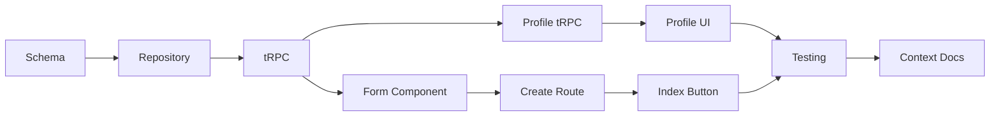

# Custom Recipes: Implementation Plan

Add support for users to create their own custom recipes manually (without URL extraction) and display them in a separate "Original Recipes" section on public profiles, distinct from "Collected Recipes" (URL-extracted).

**Architecture Document**: [`docs/features/custom-recipes-architecture.md`](../features/custom-recipes-architecture.md)

---

## Tasks with Subagent Assignments

### Task 1: Database Schema Changes
**Subagent:** `generalPurpose`
**Files:** `app/db/schema.ts`, `drizzle/0004_add_custom_recipes.sql`
**Description:** 
- Add `isCustom` boolean field to recipe table
- Make `sourceUrl` and `normalizedUrl` nullable for custom recipes
- Update `sourceType` enum to include "custom"
- Generate migration using db-migration skill
**PR Checks:** Migration naming convention, boolean as integer with mode

### Task 2: Repository Layer
**Subagent:** `generalPurpose`
**Files:** `app/repositories/recipe.ts`
**Description:**
- Add `createCustomRecipe()` function following repository pattern
- Update recipe queries to include `isCustom` flag
- Add `getRecipesByType()` for filtering by custom/extracted
**PR Checks:** Repository pattern compliance, Database type alias, try-catch

### Task 3: tRPC Routes
**Subagent:** `generalPurpose`
**Files:** `app/trpc/routes/recipes.ts`, `app/trpc/router.ts`
**Description:**
- Add `createCustom` mutation with comprehensive Zod validation
- Required fields: title, description, servings, 2+ ingredients, 2+ steps
- Optional fields: times, macros, thumbnailUrl
**PR Checks:** Zod inputs, protectedProcedure usage

### Task 4: CustomRecipeForm Component
**Subagent:** `generalPurpose`
**Files:** `app/components/recipes/custom-recipe-form.tsx`
**Description:**
- Build form using React Hook Form + Zod schema
- Include IngredientBuilder with add/remove/reorder
- Include StepBuilder with auto-numbering
- Collapsible optional sections (nutrition, photo)
- Follow editorial cookbook aesthetic from design spec
**PR Checks:** Form pattern compliance, cn() utility usage

### Task 5: Create Route Page
**Subagent:** `generalPurpose`
**Files:** `app/routes/recipes/create.tsx`
**Description:**
- New page at `/recipes/create`
- Auth check in loader
- CustomRecipeForm with preview mode
- Success redirect to recipe detail page
**PR Checks:** Route auth check, context.trpc usage

### Task 6: Profile tRPC Updates
**Subagent:** `generalPurpose`
**Files:** `app/trpc/routes/profile.ts`
**Description:**
- Update `getPublicRecipes` to accept `type` filter ("original" | "collected" | "all")
- Add counts for each type in profile stats
- Return `isCustom` flag with recipe data
**PR Checks:** Zod validation, backward compatibility

### Task 7: Public Profile UI
**Subagent:** `generalPurpose`
**Files:** `app/routes/u.$username.tsx`
**Description:**
- Add tab navigation (Original Recipes / Collected Recipes)
- URL state for active tab: `?tab=original`
- Show counts in tab labels
- Empty states per tab
- "Original" badge on custom recipe cards
**PR Checks:** Route conventions, design system compliance

### Task 8: Recipe Index Integration
**Subagent:** `generalPurpose`
**Files:** `app/routes/recipes/_index.tsx`
**Description:**
- Add "Create Your Own" button alongside existing "Extract" CTA
- Add "My Creations" filter tab
- Style new button with editorial cookbook aesthetic
**PR Checks:** Consistent styling

### Task 9: Testing
**Subagent:** `tester`
**Description:**
1. Create testing plan at `docs/testing/custom-recipes/custom-recipes.md`
2. Verify with Playwright MCP browser tools:
   - Form validation (required fields, minimums)
   - Ingredient/step add/remove/reorder
   - Save and navigate to detail
   - Profile tab switching
3. Save screenshots to `docs/testing/custom-recipes/screenshots/`
4. Copy screenshots to `public/docs/testing/custom-recipes/screenshots/`
5. Write e2e tests in `e2e/custom-recipes.spec.ts`
6. Add data-testid attributes to key elements

**CRITICAL OUTPUTS:**
- Testing plan with embedded screenshots
- Screenshots in both locations
- E2E test file
- Data-testid attributes

### Task 10: Update Context Documentation
**Subagent:** `context-keeper`
**Description:** Add custom recipes feature summary to context.md:
- Feature overview and purpose
- Link to architecture document
- Simplified user flow diagram
- Component list
- Key UX decisions

---

## Implementation Order

---

## Validation Checklist (from pr-checker)

- [ ] Repository pattern compliance (Task 2)
- [ ] tRPC Zod validation (Task 3, Task 6)
- [ ] Route auth checks (Task 5)
- [ ] Migration naming convention (Task 1)
- [ ] Feature architecture doc exists (completed)
- [ ] context.md updated (Task 10)
- [ ] Testing plan exists with screenshots (Task 9)
- [ ] E2E tests written (Task 9)

---

## Key Design Decisions

1. **`isCustom` boolean vs new sourceType**: Using both - `isCustom` for quick filtering, `sourceType: "custom"` for consistency with existing pattern

2. **Profile tabs**: "Original Recipes" / "Collected Recipes" naming based on user research preference

3. **Required fields**: Comprehensive validation (title, description, servings, 2+ ingredients, 2+ steps) to ensure quality recipes

4. **Entry point**: Separate `/recipes/create` page rather than tabbed interface on `/recipes/new` for clearer user mental model

---

*Plan created: January 31, 2026*
