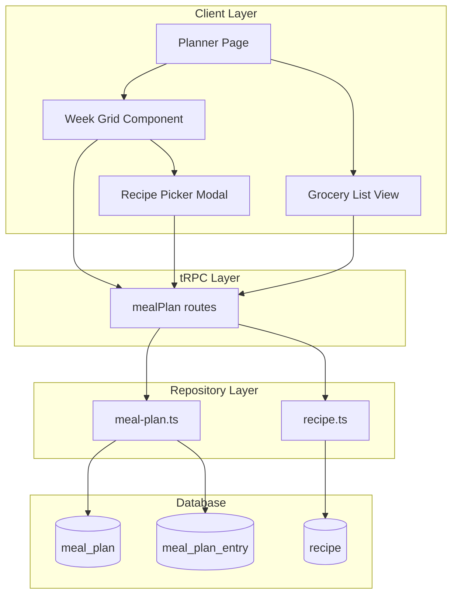
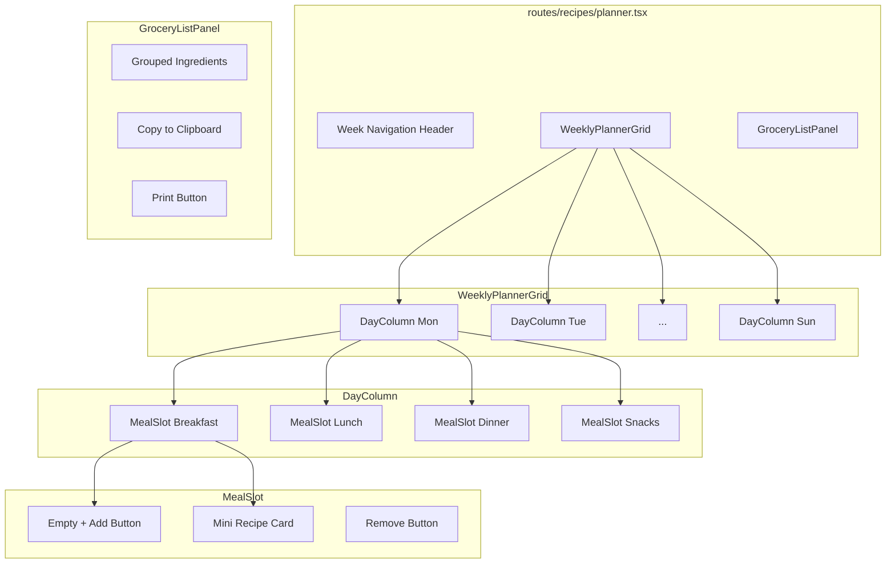
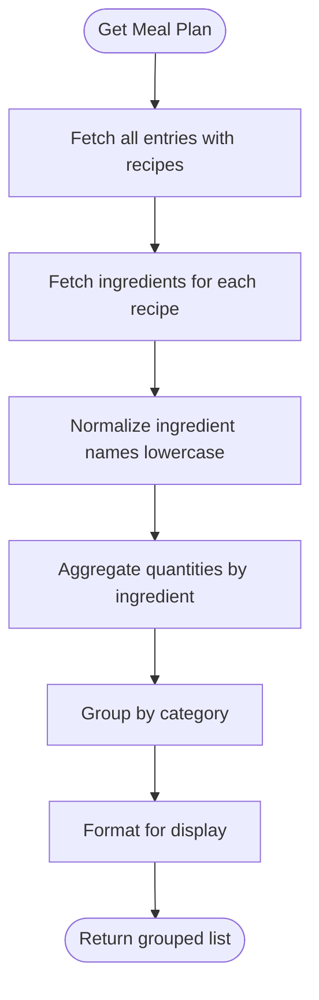

# Week Meal Planner Implementation Plan

**Status:** Completed  
**Date:** January 29, 2026

## Overview

A meal planning feature that allows users to:

- Plan meals for a week by assigning recipes to breakfast, lunch, dinner, and snacks
- View plans in a calendar grid layout
- Generate and export aggregated grocery lists (clipboard + printable)
- Save plans to database for history

## Implementation Tasks

| # | Task | Status |
|---|------|--------|
| 1 | Explore existing recipe components and patterns | Completed |
| 2 | Add mealPlan and mealPlanEntry tables to schema.ts | Completed |
| 3 | Generate migration with db-migration skill | Completed |
| 4 | Create meal-plan.ts repository with CRUD + aggregation | Completed |
| 5 | Add meal-plan.ts tRPC routes with Zod validation | Completed |
| 6 | Build planner components (WeeklyPlannerGrid, DayColumn, MealSlot, RecipePicker, GroceryListPanel) | Completed |
| 7 | Create planner.tsx route page with loader | Completed |
| 8 | Implement grocery list export (clipboard + print) | Completed |
| 9 | Test implementation with browser verification + e2e tests | Completed |
| 10 | Update context.md documentation | Completed |
| 11 | Run pr-checker skill validation | Completed |

## Architecture

### Data Flow



### Database Schema

New tables in `app/db/schema.ts`:

```typescript
// Meal plan for a specific week
export const mealPlan = sqliteTable("meal_plan", {
  id: text("id").primaryKey(),
  userId: text("user_id")
    .notNull()
    .references(() => user.id, { onDelete: "cascade" }),
  weekStartDate: text("week_start_date").notNull(), // ISO date string (Monday)
  name: text("name"), // Optional custom name
  createdAt: integer("created_at", { mode: "timestamp_ms" }).default(...).notNull(),
  updatedAt: integer("updated_at", { mode: "timestamp_ms" }).default(...).$onUpdate(...).notNull(),
});

// Individual meal entries
export const mealPlanEntry = sqliteTable("meal_plan_entry", {
  id: text("id").primaryKey(),
  mealPlanId: text("meal_plan_id")
    .notNull()
    .references(() => mealPlan.id, { onDelete: "cascade" }),
  recipeId: text("recipe_id")
    .notNull()
    .references(() => recipe.id, { onDelete: "cascade" }),
  dayOfWeek: integer("day_of_week").notNull(), // 0=Monday, 6=Sunday
  mealType: text("meal_type", { enum: ["breakfast", "lunch", "dinner", "snacks"] }).notNull(),
});
```

### Component Hierarchy



## UI Wireframe

```
┌─────────────────────────────────────────────────────────────────────┐
│ Weekly Meal Planner                               [< Prev] [Next >] │
│ Week of January 27, 2026                          [Generate List]   │
├─────────────────────────────────────────────────────────────────────┤
│ Mon 27    │ Tue 28    │ Wed 29    │ Thu 30    │ Fri 31    │ Sat/Sun │
├───────────┼───────────┼───────────┼───────────┼───────────┼─────────┤
│ BREAKFAST │           │           │           │           │         │
│ ┌───────┐ │ ┌───────┐ │           │           │           │         │
│ │Recipe │ │ │+ Add  │ │   + Add   │   + Add   │   + Add   │ + Add   │
│ │ Card  │ │ └───────┘ │           │           │           │         │
│ └───────┘ │           │           │           │           │         │
├───────────┼───────────┼───────────┼───────────┼───────────┼─────────┤
│ LUNCH     │           │           │           │           │         │
│   + Add   │   + Add   │   + Add   │   + Add   │   + Add   │ + Add   │
├───────────┼───────────┼───────────┼───────────┼───────────┼─────────┤
│ DINNER    │           │           │           │           │         │
│   + Add   │   + Add   │   + Add   │   + Add   │   + Add   │ + Add   │
├───────────┼───────────┼───────────┼───────────┼───────────┼─────────┤
│ SNACKS    │           │           │           │           │         │
│   + Add   │   + Add   │   + Add   │   + Add   │   + Add   │ + Add   │
└───────────┴───────────┴───────────┴───────────┴───────────┴─────────┘

┌─ Grocery List Panel (collapsible) ──────────────────────────────────┐
│ [Copy to Clipboard] [Print]                        12 ingredients   │
├─────────────────────────────────────────────────────────────────────┤
│ Proteins                    │ Produce                               │
│ □ 2 lbs chicken breast      │ □ 3 onions                            │
│ □ 1 lb ground beef          │ □ 2 heads garlic                      │
│                             │ □ 1 bunch cilantro                    │
│ Dairy                       │                                       │
│ □ 2 cups heavy cream        │ Pantry                                │
│ □ 1 cup parmesan            │ □ 2 cups rice                         │
└─────────────────────────────┴───────────────────────────────────────┘
```

## Key Files

| Layer | File | Purpose |
|-------|------|---------|
| Schema | `app/db/schema.ts` | Add mealPlan, mealPlanEntry tables |
| Migration | `drizzle/0002_add_meal_plan_tables.sql` | Database migration |
| Repository | `app/repositories/meal-plan.ts` | CRUD operations |
| tRPC | `app/trpc/routes/meal-plan.ts` | API endpoints |
| Components | `app/components/planner/` | UI components |
| Route | `app/routes/recipes/planner.tsx` | Main planner page |

## tRPC Endpoints

```typescript
// app/trpc/routes/meal-plan.ts
mealPlan: {
  getOrCreateForWeek: protectedProcedure  // Get/create plan for a week
    .input(z.object({ weekStartDate: z.string() }))
  
  addEntry: protectedProcedure            // Add recipe to slot
    .input(z.object({ 
      mealPlanId: z.string(),
      recipeId: z.string(),
      dayOfWeek: z.number().min(0).max(6),
      mealType: z.enum(["breakfast", "lunch", "dinner", "snacks"])
    }))
  
  removeEntry: protectedProcedure         // Remove recipe from slot
    .input(z.object({ entryId: z.string() }))
  
  getGroceryList: protectedProcedure      // Aggregate ingredients
    .input(z.object({ mealPlanId: z.string() }))
}
```

## Grocery List Aggregation Logic



Aggregation handles:

- Combining duplicate ingredients (e.g., "2 cups flour" + "1 cup flour" = "3 cups flour")
- Grouping by category (Produce, Proteins, Dairy, Pantry, etc.)
- Preserving notes/variants

## Frontend Design Direction

Following the editorial cookbook aesthetic already established:

- **Layout**: Grid-based calendar with warm cream backgrounds
- **Typography**: Playfair Display for headers, Source Sans 3 for body
- **Colors**: Terracotta accents for meal type headers, sage for actions
- **Effects**: Warm shadows, grain texture on printable view
- **Interactions**: Subtle hover states, smooth transitions for adding/removing

## Export Formats

**Clipboard (Plain Text)**:

```
Grocery List - Week of Jan 27, 2026

PROTEINS
- 2 lbs chicken breast
- 1 lb ground beef

PRODUCE
- 3 onions
- 2 heads garlic
```

**Printable (Styled HTML)**:

- Opens print dialog with styled grocery list
- Editorial typography and layout
- Checkbox squares for marking off items
- Week header with date range

## Related Documentation

- **Research**: `docs/research/meal-planning-app-ux-research.md`
- **Architecture**: `docs/features/meal-planner-architecture.md`
- **Testing**: `docs/testing/meal-planner/meal-planner.md`
- **E2E Tests**: `e2e/meal-planner.spec.ts`
