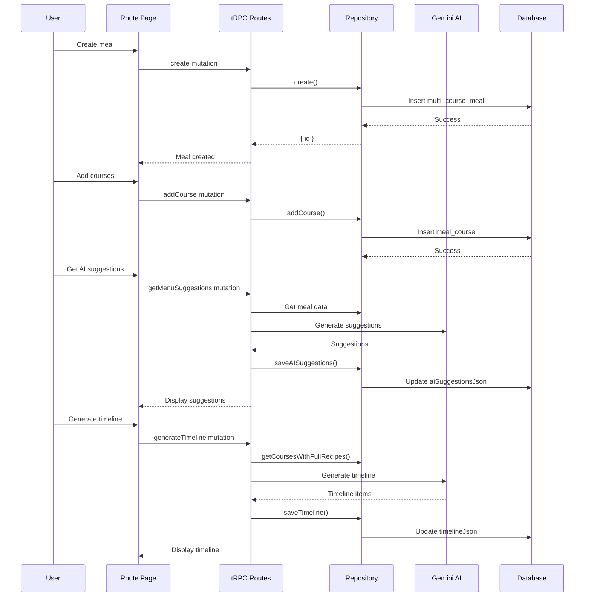

# Multi-Course Meal Planner Implementation Plan

## Overview

This feature allows users to plan elegant multi-course dining experiences with AI assistance. Users can create meals with customizable settings, add courses from their recipe library, get AI-generated menu suggestions, and receive cooking timelines that work backward from serving time.

## Status: Completed

All tasks have been implemented.

## Implementation Tasks

### Backend

- [x] **Database Schema and Migration**
  - Added `multi_course_meal` table (name, guestCount, servingTime, serviceStyle, aiSuggestionsJson, timelineJson)
  - Added `meal_course` table (mealId, recipeId, courseType, courseOrder, servingsOverride)
  - Migration: `drizzle/0006_add_multi_course_meal.sql`

- [x] **Repository Layer** (`app/repositories/multi-course-meal.ts`)
  - CRUD operations: create, getById, update, deleteMeal, list
  - Course management: addCourse, removeCourse, reorderCourses
  - Shopping list: getShoppingList (aggregated, scaled ingredients)
  - AI data: saveAISuggestions, saveTimeline
  - Full recipe fetch: getCoursesWithFullRecipes (for timeline generation)

- [x] **tRPC Routes** (`app/trpc/routes/multi-course-meal.ts`)
  - All repository operations exposed as protected procedures
  - AI mutations: getMenuSuggestions, generateTimeline
  - Recipe picker reuse from meal-plan router

- [x] **AI Service Functions** (`app/lib/gemini.ts`)
  - `generateMenuSuggestions` - Analyzes current menu, suggests improvements
  - `generateCookingTimeline` - Creates time-based task schedule

### Frontend

- [x] **MealSetupForm Component** (`app/components/multi-course-meal/meal-setup-form.tsx`)
  - Name input, guest count stepper, date/time pickers
  - Service style radio selection (plated, family, buffet)
  - Optional notes textarea

- [x] **CourseList + CourseCard Components**
  - Course cards with recipe thumbnail, title, scaling info
  - Course type badges with colors
  - Edit and remove actions

- [x] **CoursePickerModal Component**
  - Two-step flow: select course type, then select recipe
  - Recipe search with debounce
  - Highlights already-added course types

- [x] **AISuggestionsPanel Component**
  - Displays AI-generated menu suggestions
  - "Add to Menu" action for suggested recipes
  - Loading skeleton state

- [x] **CookingTimeline Component**
  - Time-grouped task display
  - Category badges (PREP, COOK, REST, SERVE)
  - Regenerate and print actions

- [x] **MealShoppingList Component**
  - Category-grouped ingredients
  - Checkbox for checking off items
  - Scaled quantities with nice fraction formatting
  - Copy and print actions

- [x] **Route Page** (`app/routes/recipes/meal.tsx`)
  - Three-step wizard: setup → courses → timeline
  - Tabs for timeline and shopping list views
  - Full integration of all components

### Quality

- [x] **Debug Logging** - Added to repository functions
- [x] **Testing Plan** (`docs/testing/multi-course-meal/`)
- [x] **E2E Tests** (`e2e/multi-course-meal.spec.ts`)
- [x] **Context Documentation** - Updated `.cursor/context.md`

## Key Files Created/Modified

### New Files
- `app/repositories/multi-course-meal.ts`
- `app/trpc/routes/multi-course-meal.ts`
- `app/routes/recipes/meal.tsx`
- `app/components/multi-course-meal/` (all components)
- `drizzle/0006_add_multi_course_meal.sql`
- `e2e/multi-course-meal.spec.ts`
- `docs/features/multi-course-meal-architecture.md`
- `docs/testing/multi-course-meal/multi-course-meal.md`

### Modified Files
- `app/db/schema.ts` - Added multiCourseMeal, mealCourse tables
- `app/lib/gemini.ts` - Added generateMenuSuggestions, generateCookingTimeline
- `app/trpc/router.ts` - Registered multiCourseMealRouter
- `app/routes.ts` - Added /recipes/meal route
- `.cursor/context.md` - Added feature documentation

## Architecture References

- Architecture document: `docs/features/multi-course-meal-architecture.md`
- UI concepts: `public/docs/features/multi-course-meal/`

## Data Flow

