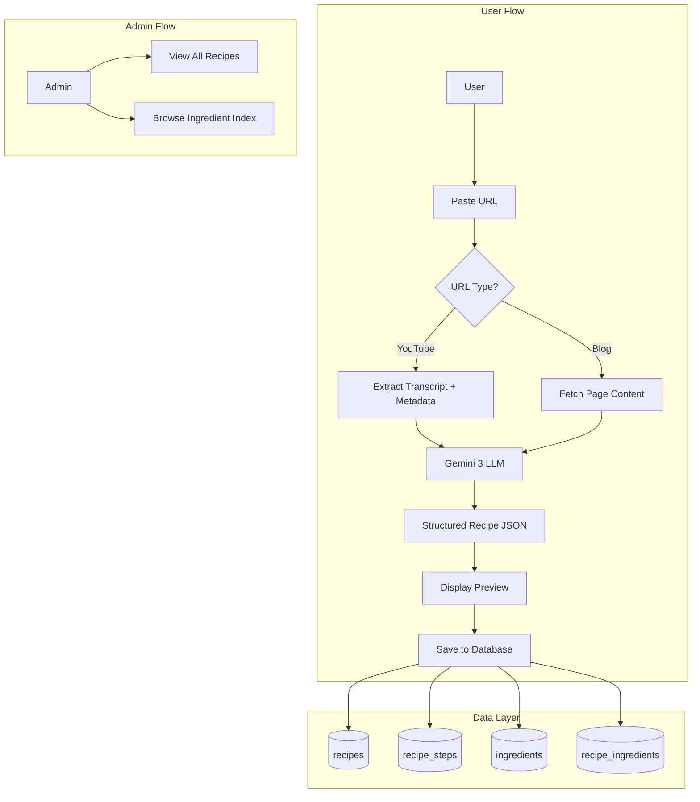

# Implementation Plan: Recipe Extraction App (Phase 1)

## Overview

Build a recipe extraction app that takes YouTube or blog URLs, uses Gemini 3 to extract step-by-step recipes with timestamps and AI-estimated macros, stores ingredients for future meal planning, and provides an admin view of all recipes.

**UX Documentation**: See [docs/features/recipe-extraction.md](../features/recipe-extraction.md) for detailed wireframes, user flows, and component specs.

---

## Architecture Diagram



---

## Tasks

### Task 1: Explore Existing Codebase
**Subagent:** `explore`  
**Thoroughness:** quick  
**Description:** Understand existing schema structure, tRPC patterns, and route organization before implementation.

---

### Task 2: Add Database Schema
**Subagent:** `generalPurpose`  
**Files:** `app/db/schema.ts`, `drizzle/*.sql`  
**Description:** Add four new tables:
- `recipe` - stores extracted recipes with macros
- `recipe_step` - individual steps with timestamps
- `ingredient` - canonical ingredient list
- `recipe_ingredient` - junction table with quantity/unit

**Schema Details:**
```typescript
// recipe table
id, title, description, sourceUrl, sourceType (youtube|blog),
youtubeVideoId, thumbnailUrl, servings, prepTimeMinutes, cookTimeMinutes,
calories, protein, carbs, fat, fiber, // per serving
createdById, createdAt, updatedAt

// recipe_step table
id, recipeId, stepNumber, instruction, timestampSeconds, durationSeconds

// ingredient table (normalized)
id, name, category, createdAt

// recipe_ingredient junction
id, recipeId, ingredientId, quantity, unit, notes
```

**PR Checks:** Migration naming convention (snake_case, descriptive)

---

### Task 3: Create Gemini Integration Library
**Subagent:** `generalPurpose`  
**Files:** `app/lib/gemini.ts`  
**Description:** Create Gemini API client with recipe extraction prompt:
- Initialize GoogleGenerativeAI client with env var
- Create `extractRecipe(content: string, sourceType: 'youtube' | 'blog')` function
- Structured output prompt that returns JSON with title, description, servings, times, ingredients, steps, macros
- Handle rate limiting and errors gracefully

**Environment:** Add `GEMINI_API_KEY` to `.env`

---

### Task 4: Create YouTube Transcript Library
**Subagent:** `generalPurpose`  
**Files:** `app/lib/youtube.ts`  
**Description:** YouTube URL parsing and transcript extraction:
- `parseYouTubeUrl(url: string)` - extract video ID from various URL formats
- `getTranscript(videoId: string)` - fetch transcript with timestamps using youtube-transcript package
- `getVideoMetadata(videoId: string)` - fetch title, thumbnail, description via oEmbed
- Combine transcript segments into coherent text for Gemini

**Dependencies:** `bun add youtube-transcript`

---

### Task 5: Create Blog Content Extractor
**Subagent:** `generalPurpose`  
**Files:** `app/lib/content-extractor.ts`  
**Description:** Blog/recipe site content extraction:
- `extractContent(url: string)` - fetch page and extract main content
- Try JSON-LD Recipe schema first (many food blogs use this)
- Fallback to Readability algorithm for main content
- Return clean text for Gemini processing

**Dependencies:** `bun add cheerio @mozilla/readability linkedom`

---

### Task 6: Create Recipe Repository
**Subagent:** `generalPurpose`  
**Files:** `app/repositories/recipe.ts`  
**Description:** CRUD operations for recipes:
- `createRecipe(db, input)` - create with steps and ingredient links
- `getRecipeById(db, id)` - with steps and ingredients joined
- `getRecipesByUser(db, userId, pagination)` - paginated list
- `deleteRecipe(db, id, userId)` - with ownership check
- Proper error handling with NotFoundError, UpdateError

**PR Checks:** Repository pattern compliance, try-catch blocks

---

### Task 7: Create Ingredient Repository
**Subagent:** `generalPurpose`  
**Files:** `app/repositories/ingredient.ts`  
**Description:** Ingredient management:
- `findOrCreateIngredient(db, name)` - normalize and dedupe
- `getAllIngredients(db, pagination)` - for admin view
- `mergeIngredients(db, sourceId, targetId)` - combine duplicates
- `getIngredientUsageCount(db, id)` - count recipes using ingredient

**PR Checks:** Repository pattern compliance

---

### Task 8: Create Recipe tRPC Routes
**Subagent:** `generalPurpose`  
**Files:** `app/trpc/routes/recipes.ts`, `app/trpc/router.ts`  
**Description:** Recipe API endpoints:
- `recipes.extract` - mutation: URL → preview (calls Gemini, returns unsaved)
- `recipes.save` - mutation: save preview to database
- `recipes.list` - query: user's recipes, paginated
- `recipes.get` - query: single recipe with all relations
- `recipes.delete` - mutation: delete owned recipe

**PR Checks:** Zod validation, protectedProcedure usage

---

### Task 9: Create Ingredient Admin tRPC Routes
**Subagent:** `generalPurpose`  
**Files:** `app/trpc/routes/ingredients.ts`  
**Description:** Admin ingredient management:
- `ingredients.list` - query: all ingredients with counts (admin)
- `ingredients.merge` - mutation: merge duplicates (admin)

**PR Checks:** adminProcedure usage, Zod validation

---

### Task 10: Build Recipe List Page
**Subagent:** `generalPurpose`  
**Files:** `app/routes/recipes/_layout.tsx`, `app/routes/recipes/_index.tsx`  
**Description:** User's recipe collection:
- Layout with header navigation
- Grid of recipe cards with thumbnail, title, macros
- Filter tabs (All, YouTube, Blogs)
- Search input
- Empty state with CTA to extract first recipe
- "Extract Recipe" button

**PR Checks:** Loader auth check, context.trpc usage

---

### Task 11: Build Recipe Extraction Page
**Subagent:** `generalPurpose`  
**Files:** `app/routes/recipes/new.tsx`, `app/components/recipes/recipe-extractor.tsx`  
**Description:** New recipe extraction flow:
- URL input with paste detection
- Extract button triggers mutation
- Loading state during extraction
- Preview card with all extracted data
- Edit capability for title, ingredients, steps
- Save button to persist
- Error states for invalid URL, extraction failure

**Components to create:**
- `RecipeExtractor` - main extraction flow
- `RecipePreview` - displays extracted recipe
- `MacrosCard` - nutrition display

**PR Checks:** Form validation, loading states, error handling

---

### Task 12: Build Recipe Detail Page
**Subagent:** `generalPurpose`  
**Files:** `app/routes/recipes/[id].tsx`, `app/components/recipes/youtube-player.tsx`, `app/components/recipes/recipe-steps.tsx`  
**Description:** Single recipe view:
- YouTube embed (if source is YouTube) with timestamp seeking
- Recipe header with title, source, save date
- Macros card
- Ingredients list (checkable for cooking mode)
- Steps list with clickable timestamps
- Click timestamp → seek video to that point
- Delete option in menu

**Components to create:**
- `YouTubePlayer` - embed with external seek control
- `RecipeSteps` - steps with timestamp links
- `IngredientsList` - checkable ingredients

**PR Checks:** Loader with ownership check, param validation

---

### Task 13: Build Admin Recipes Page
**Subagent:** `generalPurpose`  
**Files:** `app/routes/admin/recipes.tsx`  
**Description:** Admin view of all recipes:
- DataTable with columns: title, source, user, created, macros
- Filter by source type
- Link to view recipe detail
- Delete capability

**PR Checks:** adminProcedure, DataTable pattern from existing admin pages

---

### Task 14: Build Admin Ingredients Page
**Subagent:** `generalPurpose`  
**Files:** `app/routes/admin/ingredients.tsx`  
**Description:** Ingredient index browser:
- DataTable with columns: name, category, usage count
- Search/filter by name
- Merge duplicate ingredients modal
- Category management

**PR Checks:** adminProcedure usage

---

### Task 15: Add Debug Logging
**Subagent:** `logger`  
**Files:** `app/lib/gemini.ts`, `app/lib/youtube.ts`, `app/lib/content-extractor.ts`  
**Description:** Add structured debug logs to extraction pipeline:
- Log extraction start/end with timing
- Log Gemini API calls and responses
- Log transcript fetch results
- Log content extraction results
- Error logging with context

---

### Task 16: Test Implementation
**Subagent:** `tester`  
**Description:** 
1. Verify feature with Playwright MCP browser tools:
   - Test YouTube URL extraction
   - Test blog URL extraction
   - Test recipe saving and viewing
   - Test video timestamp seeking
   - Test admin views
2. Write e2e tests in `e2e/recipes.spec.ts`
3. Add data-testid attributes to key elements
4. Create test documentation in `docs/features/recipe-extraction-testing.md`

**Outputs:**
- E2E test file: `e2e/recipes.spec.ts`
- Test documentation: `docs/features/recipe-extraction-testing.md`
- Data-testid attributes on all interactive elements

---

### Task 17: Update Documentation
**Subagent:** `context-keeper`  
**Description:** Update context.md with:
- Recipe extraction feature overview
- New database tables
- New routes and tRPC endpoints
- Component architecture
- Gemini integration details

---

### Task 18: PR Validation
**Subagent:** None (use pr-checker skill)  
**Description:** Run validation checklist before creating PR

---

## Validation Requirements Summary

Based on files touched, verify:

- [ ] **Repository pattern** (Tasks 6, 7): Database type alias, try-catch, custom errors
- [ ] **tRPC validation** (Tasks 8, 9): Zod inputs, correct procedures
- [ ] **Route conventions** (Tasks 10-14): Loader auth, context.trpc
- [ ] **Migration naming** (Task 2): Descriptive snake_case name
- [ ] **context.md updated** (Task 17)
- [ ] **Testing exists** (Task 16): E2E tests and documentation
- [ ] **Logging added** (Task 15): Debug logs in extraction pipeline

---

## Dependencies to Install

```bash
bun add youtube-transcript cheerio @mozilla/readability linkedom @google/generative-ai react-youtube
```

---

## Environment Variables

```bash
# Add to .env
GEMINI_API_KEY=your_gemini_api_key
```

---

## File Structure After Implementation

```
app/
├── lib/
│   ├── gemini.ts              # Gemini client + extraction
│   ├── youtube.ts             # YouTube transcript + metadata
│   └── content-extractor.ts   # Blog content extraction
├── repositories/
│   ├── recipe.ts              # Recipe CRUD
│   └── ingredient.ts          # Ingredient management
├── trpc/routes/
│   ├── recipes.ts             # Recipe tRPC routes
│   └── ingredients.ts         # Ingredient admin routes
├── routes/
│   ├── recipes/
│   │   ├── _layout.tsx        # Recipes layout with nav
│   │   ├── _index.tsx         # Recipe list (grid)
│   │   ├── new.tsx            # Extract new recipe
│   │   └── [id].tsx           # Recipe detail with video
│   └── admin/
│       ├── recipes.tsx        # Admin recipe list
│       └── ingredients.tsx    # Ingredient index
└── components/
    └── recipes/
        ├── recipe-card.tsx      # Grid card component
        ├── recipe-extractor.tsx # URL input + extraction
        ├── recipe-preview.tsx   # Extracted recipe preview
        ├── recipe-steps.tsx     # Steps with timestamps
        ├── youtube-player.tsx   # Embedded player
        ├── macros-card.tsx      # Nutrition display
        └── ingredients-list.tsx # Checkable ingredients
```
