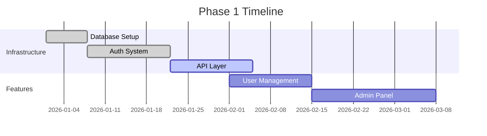
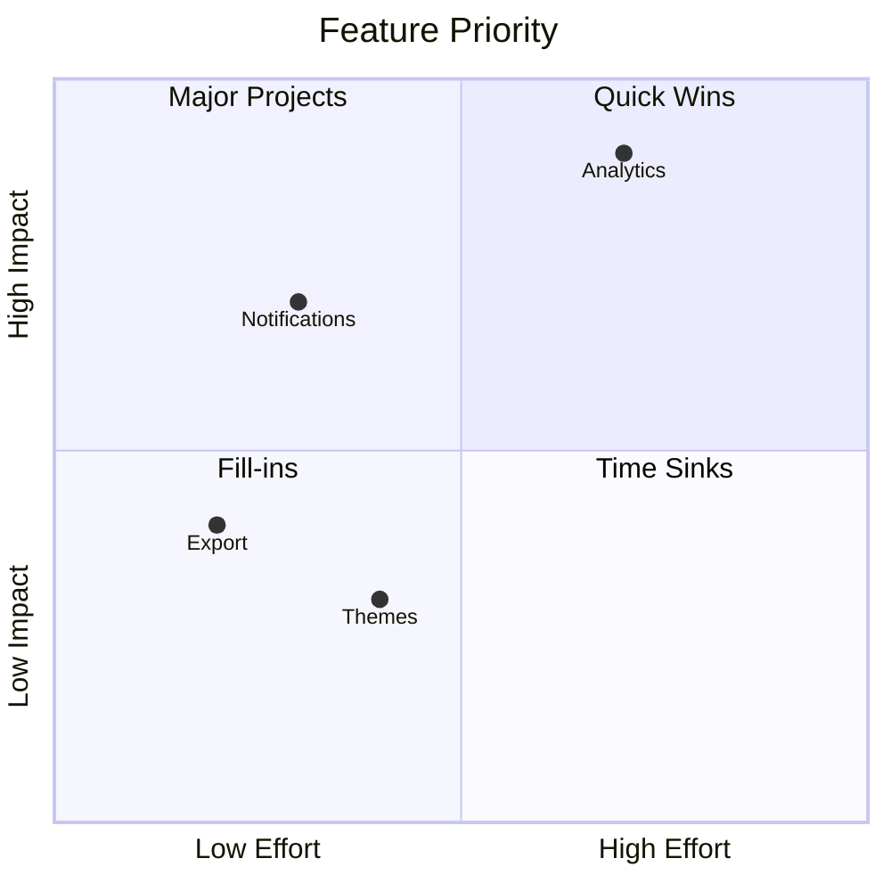

# Product Roadmap

## Phase 1: Foundation

Core platform features and infrastructure.

## Phase 2: Growth Features

Features to drive user acquisition and engagement.

### Priority Matrix

## Phase 3: Scale

Enterprise features and performance optimization.

- Multi-tenant architecture
- Advanced analytics
- Custom branding
- SLA guarantees
