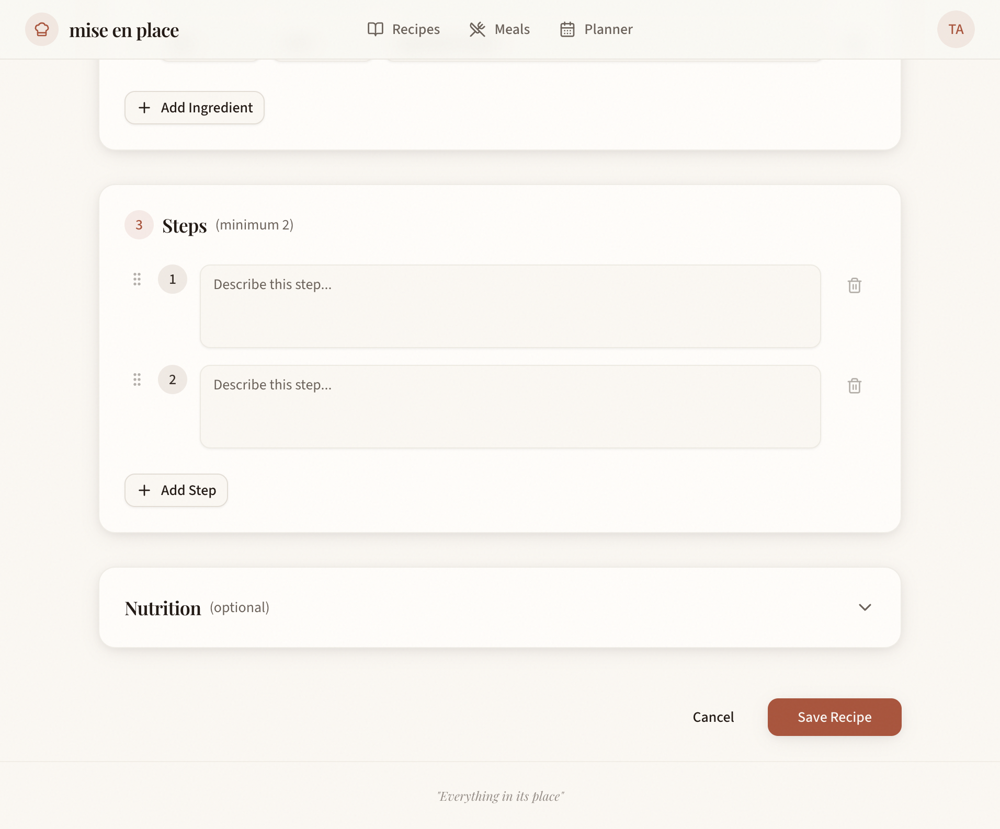
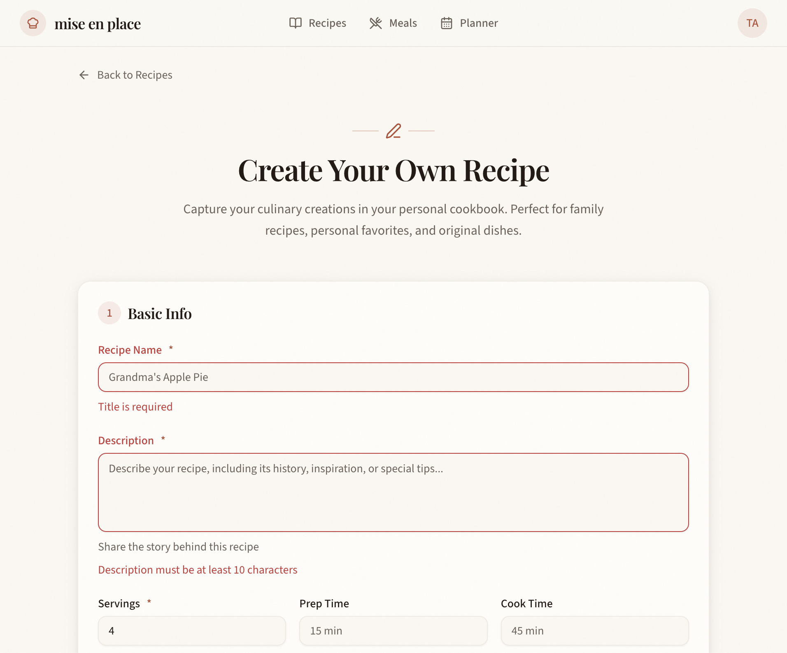
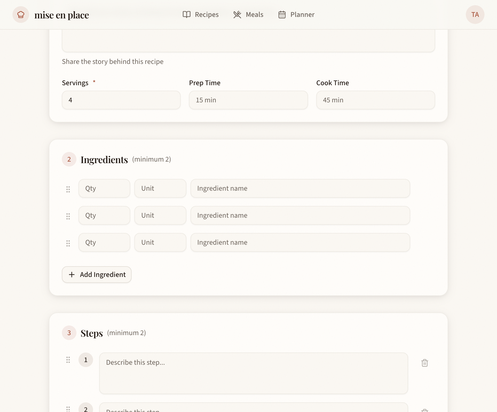
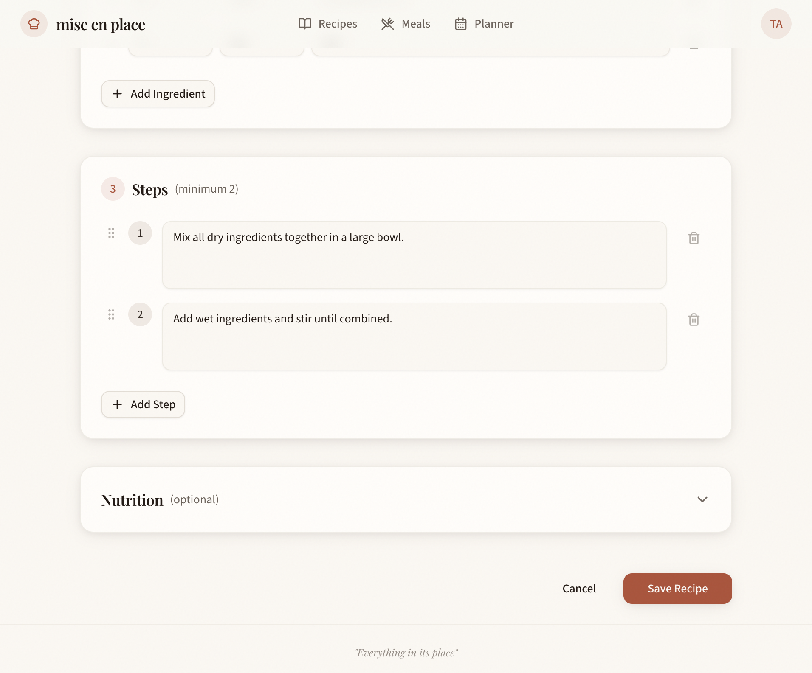
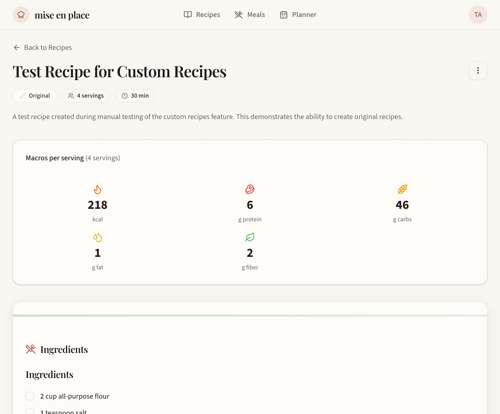
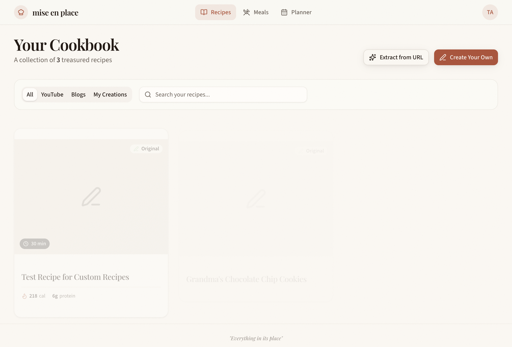
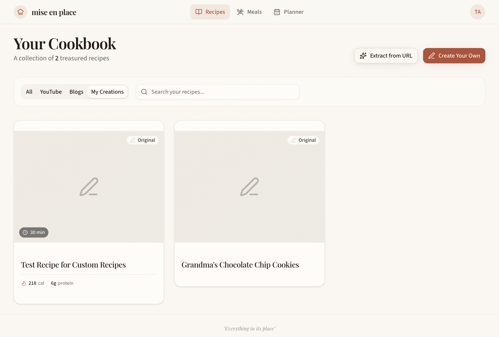
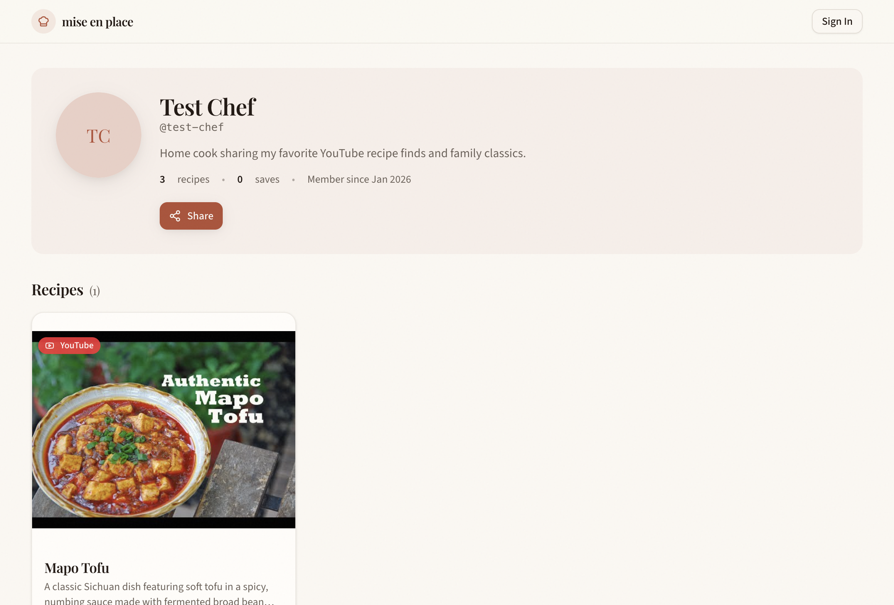

# Testing Plan: Custom Recipes

## Overview
Testing the Custom Recipes feature which allows users to manually create their own recipes with ingredients, steps, and optional nutrition information.

## Prerequisites
- [x] Development server running at http://localhost:5173
- [x] Test user credentials: admin@test.local / TestAdmin123!
- [x] Database with test data

## Test Scenarios

### Scenario 1: Recipe Creation Form Display
**Description:** Verify the recipe creation form at `/recipes/create` displays correctly with all sections.
**Steps:**
1. Login with test credentials
2. Navigate to `/recipes/create`
3. Verify form sections: Basic Info, Ingredients, Steps, Nutrition (collapsible)
**Expected Result:** Form displays with all sections, nutrition section is collapsible.

**Screenshot:** 

### Scenario 2: Form Validation - Required Fields
**Description:** Verify validation errors appear when required fields are missing.
**Steps:**
1. Navigate to `/recipes/create`
2. Try to submit form without filling required fields
3. Verify validation messages appear
**Expected Result:** Validation errors for title, description, cook time, servings, and minimum ingredients/steps.

**Screenshot:** 

### Scenario 3: Add/Remove Ingredients
**Description:** Test adding and removing ingredients (minimum 2 required).
**Steps:**
1. Add ingredient using the form
2. Add second ingredient
3. Try to remove ingredient when only 2 remain
4. Add third ingredient
5. Remove one ingredient
**Expected Result:** Can add unlimited ingredients, cannot go below 2.

**Screenshot:** 

### Scenario 4: Add/Remove Steps
**Description:** Test adding and removing steps (minimum 2 required).
**Steps:**
1. Add step using the form
2. Add second step
3. Try to remove step when only 2 remain
4. Add third step
5. Remove one step
**Expected Result:** Can add unlimited steps, cannot go below 2.

**Screenshot:** 

### Scenario 5: Complete Recipe Creation
**Description:** Create a complete recipe and verify redirect.
**Steps:**
1. Fill all required fields
2. Add at least 2 ingredients
3. Add at least 2 steps
4. Optionally add nutrition info
5. Click Save button
**Expected Result:** Recipe created, redirects to recipe detail page.

**Screenshot (Form Filled):** 
**Screenshot (Detail Page):** 

### Scenario 6: Recipes Index - Buttons
**Description:** Verify new buttons in recipes index header.
**Steps:**
1. Navigate to `/recipes`
2. Verify "Create Your Own" button exists
3. Verify "Extract from URL" button exists
**Expected Result:** Both buttons visible in header.

**Screenshot:** 

### Scenario 7: Recipes Index - My Creations Tab
**Description:** Verify "My Creations" filter tab works.
**Steps:**
1. Navigate to `/recipes`
2. Click "My Creations" tab
3. Verify only custom recipes are shown
**Expected Result:** Tab filters to show only user-created recipes.

**Screenshot:** 

### Scenario 8: Profile Page Tabs
**Description:** Verify profile page shows Original and Collected recipe tabs.
**Steps:**
1. Navigate to user profile page
2. Verify "Original Recipes" and "Collected Recipes" tabs
3. Switch between tabs
4. Verify "Original" badge on custom recipes
**Expected Result:** Tabs work, badges display correctly.

**Screenshot:** 

## UI Elements to Verify
- [x] Recipe creation form renders correctly
- [x] Collapsible nutrition section
- [x] Add/remove ingredient buttons
- [x] Add/remove step buttons
- [x] Loading state during save
- [x] Success redirect after save
- [x] "Create Your Own" button on index
- [x] "My Creations" tab on index
- [x] Profile page tabs

## API/Data Verification
- [x] `recipes.createCustom` mutation creates recipe
- [x] Recipe linked to user correctly
- [x] isCustom flag set to true
- [x] Filter by isCustom works

## Accessibility Checks
- [x] Form fields have labels
- [x] Error states are announced
- [x] Keyboard navigation works
- [x] Focus states visible

## Test IDs Reference

| Element | Test ID |
|---------|---------|
| Title input | `recipe-title` |
| Description textarea | `recipe-description` |
| Cook time input | `recipe-cook-time` |
| Servings input | `recipe-servings` |
| Add ingredient button | `add-ingredient` |
| Remove ingredient button | `remove-ingredient-{index}` |
| Add step button | `add-step` |
| Remove step button | `remove-step-{index}` |
| Save button | `save-recipe` |
| Create Your Own button | `create-recipe-button` |
| My Creations tab | `my-creations-tab` |

## E2E Test Coverage

Test file: `e2e/custom-recipes.spec.ts`

### Running Tests

```bash
# Run all tests
bun run test:e2e

# Run specific feature tests
bunx playwright test e2e/custom-recipes.spec.ts
```

## Test Results

### Execution Date
Testing started: $(date)

### Results Summary
| Scenario | Status | Notes |
|----------|--------|-------|
| Recipe Creation Form | ⏳ Pending | |
| Form Validation | ⏳ Pending | |
| Add/Remove Ingredients | ⏳ Pending | |
| Add/Remove Steps | ⏳ Pending | |
| Complete Recipe Creation | ⏳ Pending | |
| Recipes Index Buttons | ⏳ Pending | |
| My Creations Tab | ⏳ Pending | |
| Profile Page Tabs | ⏳ Pending | |
