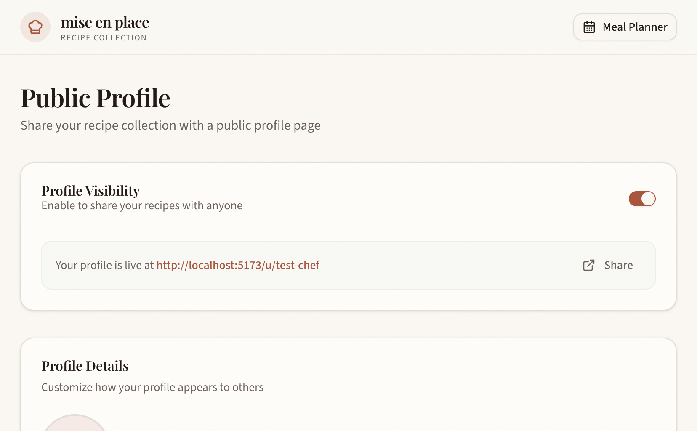
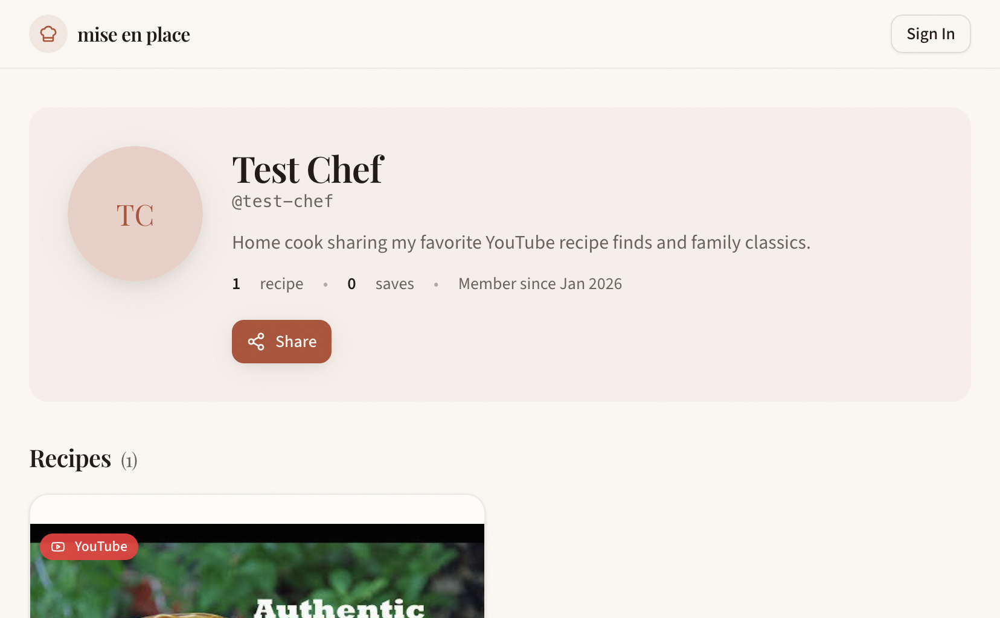

# Profile Sharing Feature - Testing Documentation

## Overview

The Profile Sharing feature allows users to create public profile pages to share their recipe collections with others.

## Feature Summary

- **Profile Settings Page** (`/recipes/profile`): Users can set up their public profile with username, display name, bio, and control recipe visibility
- **Public Profile Page** (`/u/[username]`): Anyone can view a user's public profile and their public recipes
- **Share Modal**: Easy sharing via copy link, social media buttons, and QR code
- **Recipe Import**: Visitors can save public recipes to their own collection

## Test Scenarios

### Profile Settings Page

| Test Case | Steps | Expected Result |
|-----------|-------|-----------------|
| Page loads | Navigate to `/recipes/profile` | Page displays with "Public Profile" header |
| Username validation (too short) | Enter username < 3 chars | Error: "Username must be at least 3 characters" |
| Username validation (invalid chars) | Enter username with special chars | Error about allowed characters |
| Username validation (valid) | Enter valid username (3-30 chars, lowercase, numbers, hyphens) | Green checkmark, no error |
| Profile creation | Fill all fields, click Save | Profile created, success toast |
| Toggle visibility | Click visibility switch | Profile becomes public/private |
| Bio character limit | Type more than 500 chars | Text truncated at 500 |
| Recipe visibility toggle | Toggle switch on recipe item | Recipe visibility changes |

### Public Profile Page

| Test Case | Steps | Expected Result |
|-----------|-------|-----------------|
| 404 for non-existent user | Navigate to `/u/nonexistent-user` | "Profile Not Found" page |
| 404 for private profile | Navigate to profile that is not public | "Profile Not Found" page |
| Profile header displays | Navigate to public profile | Avatar, name, username, bio visible |
| Stats display | View profile | Recipe count and saves displayed |
| Recipe grid | View profile with public recipes | Recipe cards displayed in grid |
| Save recipe (authenticated) | Click "Save to My Recipes" | Recipe cloned to user's collection |
| Save recipe (unauthenticated) | Click "Save to My Recipes" | Prompted to sign in |
| Share button | Click Share | Share modal opens |

### Share Modal

| Test Case | Steps | Expected Result |
|-----------|-------|-----------------|
| Modal opens | Click Share button | Modal with URL and social buttons |
| Copy link | Click copy button | URL copied to clipboard, toast shown |
| Social links | Click social button | Opens share URL in new tab |
| QR code | View modal | QR code displayed |
| Close modal | Click X or outside | Modal closes |

## E2E Tests

E2E tests are located in `e2e/profile-sharing.spec.ts`.

### Running Tests

```bash
# Run all profile sharing tests
bun run test:e2e e2e/profile-sharing.spec.ts

# Run with headed browser for debugging
bun run test:e2e e2e/profile-sharing.spec.ts --headed

# Run specific test
bun run test:e2e e2e/profile-sharing.spec.ts -g "should display profile settings page header"
```

### Test Coverage

- Profile settings page loads and displays correctly
- Form validation (username format, character limits)
- Navigation from recipes page to profile page
- Public profile 404 handling
- Share modal functionality

## Manual Testing Checklist

### Before Testing
- [ ] Development server running (`bun run dev`)
- [ ] Database migrated (`bun run db:migrate:local`)
- [ ] Logged in as test user (`admin@test.local` / `TestAdmin123!`)

### Profile Settings
- [ ] Navigate to `/recipes/profile`
- [ ] Enter username: `test-user`
- [ ] Enter display name: `Test User`
- [ ] Enter bio: `Home cook sharing my favorite recipes`
- [ ] Click "Create Profile" / "Save Changes"
- [ ] Toggle "Profile Visibility" to ON
- [ ] Verify URL is shown in alert
- [ ] Click "Share" button
- [ ] Verify share modal opens

### Recipe Visibility
- [ ] In profile settings, see "Recipe Visibility" section
- [ ] Toggle a recipe to Public
- [ ] Navigate to public profile
- [ ] Verify recipe appears in grid

### Public Profile
- [ ] Open incognito/private window
- [ ] Navigate to `/u/test-user`
- [ ] Verify profile header displays
- [ ] Verify recipe grid shows public recipes
- [ ] Click "Save to My Recipes"
- [ ] Verify sign-in prompt appears
- [ ] Click Share button
- [ ] Copy link and verify it works

## Screenshots

Screenshots are saved to `docs/testing/profile-sharing/screenshots/`:

| Screenshot | Description |
|------------|-------------|
| `profile-settings-empty.png` | Profile settings page before profile created |
| `profile-settings-filled.png` | Profile settings form with username validation |
| `profile-settings-created.png` | Profile settings after profile created |
| `profile-public-enabled.png` | Profile settings with public visibility enabled |
| `profile-recipe-visibility.png` | Recipe visibility controls section |
| `share-modal.png` | Share modal with social buttons and QR code |
| `public-profile.png` | Public profile page showing header and recipes |

### Profile Settings (Empty State)


### Profile Settings (Filled Form with Username Validation)


### Profile Settings (With Public Visibility)


### Recipe Visibility Controls


### Share Modal


### Public Profile Page


## Known Issues

- QR code is a placeholder (would use qrcode library in production)
- Avatar upload is not yet implemented (planned for future)
- Collections feature mentioned in architecture is not yet implemented

## Related Files

- `app/routes/recipes/profile.tsx` - Profile settings page
- `app/routes/u.[username].tsx` - Public profile page
- `app/components/profile/` - Profile components
- `app/repositories/profile.ts` - Profile data access
- `app/trpc/routes/profile.ts` - Profile API routes
- `app/db/schema.ts` - Database schema (user_profile, recipe_import tables)
