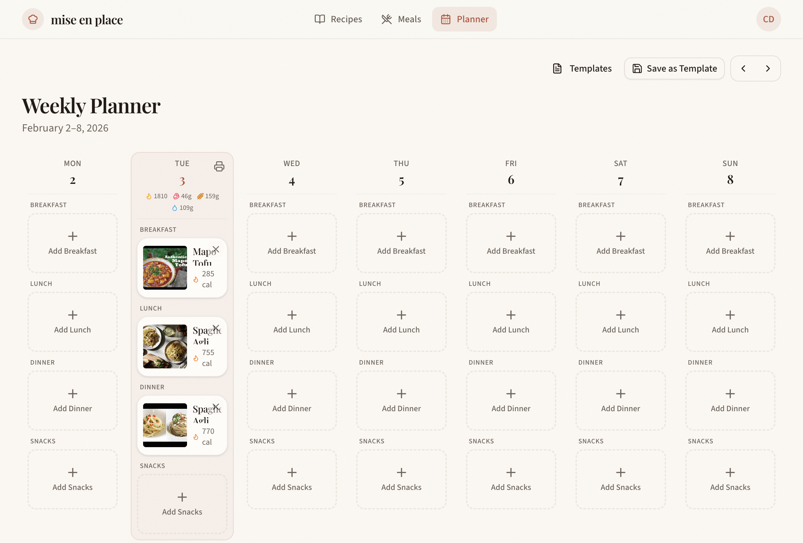

# Testing Plan: Public Meal Plans

## Overview
Testing the new Public Meal Plans feature implementation that allows users to save weekly meal plans as templates, make them public, and share them with visitors who can import entire meal plans.

**Test Date:** February 3, 2026
**Status:** ✅ All Routes Working

---

## Issues Fixed

### Routes Not Registered (RESOLVED)

The following routes were returning 404 errors because they weren't registered in `app/routes.ts`:

| Route | File | Status |
|-------|------|--------|
| `/recipes/templates` | `app/routes/recipes/templates.tsx` | ✅ Working |
| `/u/[username]/plans` | `app/routes/u.[username].plans.tsx` | ✅ Working |
| `/u/[username]/plans/[slug]` | `app/routes/u.[username].plans.[slug].tsx` | ✅ Working |

**Root Cause:** Routes weren't added to `app/routes.ts`. React Router in this project uses manual route configuration, not automatic file-based routing.

**Resolution Applied:**
1. Added route entries to `app/routes.ts`:
   ```typescript
   // In recipes layout:
   route("/templates", "routes/recipes/templates.tsx"),
   
   // In public profile routes:
   route("/u/:username/plans", "routes/u.[username].plans.tsx"),
   route("/u/:username/plans/:slug", "routes/u.[username].plans.[slug].tsx"),
   ```
2. Ran `bun run typegen` to regenerate route types
3. Fixed tRPC call in templates.tsx: `profile.getProfile` → `profile.getMyProfile`

---

## Screenshots

### My Templates Page

Shows the templates management page with a saved template.


### Weekly Planner with Templates Integration

Shows the planner with "Templates" link and "Save as Template" button (visible when 3+ meals).



---

## Test Scenarios

### Scenario 1: My Templates Page
**Description:** Navigate to the templates management page

**Steps:**
1. Log in as a user
2. Navigate to `/recipes/templates`
3. Verify the page loads correctly

**Expected Result:** Page shows "My Templates" heading with template list or empty state

**Actual Result:** ✅ Page loads correctly with template cards

**Screenshot:** [My Templates Page](#my-templates-page)

### Scenario 2: Weekly Planner - Save Template Button
**Description:** Verify the "Save as Template" button appears when there are 3+ meals in the planner

**Steps:**
1. Navigate to `/recipes/planner`
2. Verify user is logged in
3. Check if "Save as Template" button is visible (requires 3+ meals)

**Expected Result:** Button should appear only when `mealCount >= 3`

**Actual Result:** ✅ Button correctly visible with 3 meals on Tuesday

**Screenshot:** [Planner with Templates](#weekly-planner-with-templates-integration)

**Code Reference:**
```typescript
const canSaveAsTemplate = mealCount >= 3;
// ...
{canSaveAsTemplate && (
  <Button
    variant="outline"
    size="sm"
    onClick={() => setSaveTemplateOpen(true)}
    className="gap-1.5"
    data-testid="save-template-button"
  >
    <Save className="h-4 w-4" />
    Save as Template
  </Button>
)}
```

### Scenario 3: Templates Link in Planner
**Description:** Verify "Templates" link appears in planner header

**Steps:**
1. Navigate to `/recipes/planner`
2. Look for "Templates" link in the header area

**Expected Result:** Link should be visible and navigate to `/recipes/templates`

**Actual Result:** ✅ Link visible and working

### Scenario 4: Public Plans Page
**Description:** Navigate to a user's public plans page

**Steps:**
1. Navigate to `/u/test-chef/plans`
2. Verify the page loads correctly

**Expected Result:** Page shows user's public meal plans or empty state

**Actual Result:** ✅ Page loads correctly, shows "Test Chef's Meal Plans"

### Scenario 5: Public Profile - Meal Plans Tab
**Description:** Check if "Meal Plans" tab appears on public profiles

**Steps:**
1. Navigate to public profile `/u/test-chef`
2. Check for "Meal Plans" tab

**Expected Result:** Tab should appear when `mealPlanCount > 0`

**Actual Result:** ✅ Correct behavior - Tab hidden when user has 0 public templates

---

## UI Elements Verification

| Element | Location | Status | Test ID |
|---------|----------|--------|---------|
| Templates link | Planner page header | ✅ Visible | - |
| Save as Template button | Planner page (conditional) | ✅ Works correctly | `save-template-button` |
| My Templates page | `/recipes/templates` | ✅ Working | `templates-page` |
| Week navigation | Planner page | ✅ Working | `prev-week`, `next-week` |
| Meal Plans tab | Public profile | ✅ Works correctly | `profile-tab-plans` |
| Public plans list | `/u/[username]/plans` | ✅ Working | - |
| Public plan detail | `/u/[username]/plans/[slug]` | ✅ Registered | - |

---

## E2E Tests

E2E tests have been written at `e2e/public-meal-plans.spec.ts`.

### Test Coverage

| Test Suite | Tests | Description |
|------------|-------|-------------|
| My Templates Page | 5 | Header, buttons, navigation, template cards, empty state |
| Weekly Planner Integration | 5 | Templates link, Save button, navigation |
| Public Plans Page | 6 | Valid user, sign in button, empty state, back link, 404 |
| Navigation Flow | 2 | End-to-end navigation, header consistency |

### Running Tests

```bash
# Run all public meal plans tests
bun run test:e2e e2e/public-meal-plans.spec.ts

# Run with UI mode for debugging
bunx playwright test e2e/public-meal-plans.spec.ts --ui
```

---

## Files Modified

### Route Configuration
- `app/routes.ts` - Added missing route entries for templates and plans

### Bug Fixes
- `app/routes/recipes/templates.tsx` - Fixed tRPC call from `getProfile` to `getMyProfile`

### Files Involved in Feature
- `app/routes/recipes/templates.tsx` - My Templates page
- `app/routes/u.[username].plans.tsx` - Public plans list page
- `app/routes/u.[username].plans.[slug].tsx` - Public plan detail page
- `app/components/meal-plan-template/*` - Template components
- `app/routes/recipes/planner.tsx` - Added "Templates" link and "Save as Template" button
- `app/routes/u.$username.tsx` - Added "Meal Plans" tab (conditional)
- `app/trpc/router.ts` - Added `mealPlanTemplate` router
- `app/db/schema.ts` - Added meal plan template tables

---

## Test Summary

| Feature | Status | Notes |
|---------|--------|-------|
| Save as Template button logic | ✅ Pass | Correctly shown with 3+ meals |
| Templates link visibility | ✅ Pass | Visible on planner page |
| Meal Plans tab logic | ✅ Pass | Correctly hidden with 0 templates |
| `/recipes/templates` route | ✅ Pass | Page loads with template cards |
| `/u/[username]/plans` route | ✅ Pass | Page loads correctly |
| `/u/[username]/plans/[slug]` route | ✅ Pass | Route registered |
| E2E tests | ✅ Written | 18 tests in `e2e/public-meal-plans.spec.ts` |

---

## Next Steps

1. ~~Routes need to be registered~~ ✅ Done
2. ~~Write E2E tests~~ ✅ Done
3. Test the full save template → share → import flow with a public template
4. Add more test scenarios for template visibility toggle
5. Test template import functionality
